# Spring AI Demo2

> demo2 是 demo 的并行副本，默认端口 **8081**，用于后续 Spring AI 2 升级实验。可与 demo（8080）同时运行。

基于 **Spring Boot 4.1 + Spring AI 2.0** 的综合 AI 能力演示项目，覆盖聊天对话、结构化输出、RAG 知识检索、Agent 工具调用、AskUserQuestion 人机澄清、TodoWrite 任务规划、Agent Skills、**Subagent 子代理编排**、**A2A 跨系统对话**、多 Agent 协作、MCP 协议集成、**Micrometer + OpenTelemetry 可观测性**等核心场景，配套完整前端演示界面。

---

## 目录

- [项目概览](#项目概览)
- [技术栈](#技术栈)
- [功能模块](#功能模块)
- [快速开始](#快速开始)
- [前端说明](#前端说明)
- [配置说明](#配置说明)
- [可观测性](#可观测性)
- [API 接口文档](#api-接口文档)
- [架构设计](#架构设计)
- [功能设计图](#功能设计图)
- [目录结构](#目录结构)
- [常见问题](#常见问题)

---

## 项目概览

本项目是一个 Spring AI 功能演示应用，通过不同 Controller/Service 模块独立演示各类 AI 能力，适合学习 Spring AI 各组件的用法。

**`controller` 包共 15 个 Controller**（另含 `mcp.client.controller.McpChatController`），与下表一一对应；功能模块章节按相同顺序归档。

### Controller 一览

| Controller | 包路径 | 基础路径 | 说明 |
|------------|--------|----------|------|
| `ChatController` | `controller` | `/ai` | 同步/流式聊天 |
| `EmbeddingController` | `controller` | `/ai` | 向量化与相似度 |
| `StructuredOutputController` | `controller` | `/ai/structured` | 结构化输出（`entity()`） |
| `RagController` | `controller` | `/rag` | RAG 基础版 |
| `RagOptimizedController` | `controller` | `/rag/optimized` | RAG 优化版（Milvus） |
| `CustomerServiceController` | `controller` | `/ecommerce/service` | 电商客服 RAG |
| `AgentController` | `controller` | `/agent/trip` | 行程规划（无记忆/内存记忆） |
| `MysqlAgentController` | `controller` | `/agent/mysql/trip` | MySQL 持久化记忆行程 |
| `AgentToolController` | `controller` | `/agent/tool` | `@Tool` 天气/景点工具调用 |
| `MultiAgentController` | `controller` | `/agent/multi` | Supervisor-Worker 多 Agent |
| `SkillsAgentController` | `controller` | `/agent/skills` | SkillsTool 语义匹配 |
| `AskUserAgentController` | `controller` | `/agent/ask-user` | AskUserQuestion SSE Demo |
| `TodoAgentController` | `controller` | `/agent/todo` | TodoWrite SSE Demo |
| `SubagentAgentController` | `controller` | `/agent/subagent` | Subagent Orchestration（TaskTool） |
| `A2aOrchestratorController` | `controller` | `/agent/a2a` | A2A 协调器（TaskTool + 远程 Agent） |
| `McpChatController` | `mcp.client.controller` | `/mcp/client` | MCP Client 工具聊天 |

| 模块 | 能力 | 依赖外部服务 |
|------|------|-------------|
| AI 聊天 | 同步/流式聊天 | DeepSeek API |
| Embedding | 文本向量化 + 相似度计算 | 智谱 AI API |
| 结构化输出 | `entity()` 自动映射 Java 对象 | DeepSeek API |
| RAG 基础版 | 内存向量检索增强问答 | 智谱 AI API |
| RAG 优化版 | Milvus 持久化向量检索 | 智谱 AI + Milvus |
| 电商客服 | 知识库问答（精准/增强两种策略） | 智谱 AI + Milvus |
| Agent 行程规划 | 无记忆/内存记忆/DB记忆 三种版本 | DeepSeek API + MySQL |
| Agent 自主记忆 | AutoMemoryTools 长期 Markdown + MySQL 短期 | DeepSeek API + MySQL + 本地文件 |
| Agent 工具调用 | 天气查询 + 景点推荐工具 | DeepSeek API |
| AskUserQuestion | Agent 主动澄清 + SSE 推送问题 | DeepSeek API |
| TodoWrite | 多步骤任务拆解 + SSE Todo 看板 | DeepSeek API |
| Agent Skills | SkillsTool 语义匹配加载 SKILL.md | DeepSeek API |
| Subagent 编排 | TaskTool · architect / builder 子代理 | DeepSeek API |
| A2A 跨系统 | TaskTool + A2A 协议调用天气专家 Agent | DeepSeek API |
| 多 Agent 协作 | Supervisor-Worker（行程/天气/预算并行） | DeepSeek API |
| MCP | MCP Server/Client 工具注册与调用 | DeepSeek API |
| 可观测性 | Micrometer 指标 + OpenTelemetry 链路 | 可选 OTLP Collector |

---

## 技术栈

| 分类 | 技术 | 版本 |
|------|------|------|
| 运行环境 | Java | 21 |
| 核心框架 | Spring Boot | 4.1.0 |
| AI 框架 | Spring AI | 2.0.0 |
| Agent 工具库 | spring-ai-agent-utils | 0.10.0（AskUser / TodoWrite / Skills / **TaskTool**） |
| A2A 子代理客户端 | spring-ai-agent-utils-a2a | 0.10.0 |
| A2A Server | spring-ai-a2a-server-autoconfigure | 0.3.0 |
| 聊天模型 | DeepSeek | deepseek-v4-pro |
| Embedding 模型 | 智谱 AI | embedding-2（1024 维） |
| 向量数据库 | Milvus | 2.6.18 |
| 持久化记忆 | MySQL | 8.x |
| 协议 | MCP（Model Context Protocol） | SSE |
| 文档解析 | Apache Tika + PDFBox | — |
| API 文档 | SpringDoc OpenAPI + Scalar | 3.0.3 |
| 可观测性 | Micrometer + OpenTelemetry（Boot 4 内置） | — |
| 指标导出 | Prometheus（Actuator） | — |
| 工具库 | Lombok | — |
| 前端 | 原生 HTML/CSS/JS（单页 15 Tab，按模块拆分静态资源，零构建） | — |

---

## 功能模块

### 1. AI 聊天（`/ai`）

最基础的 LLM 对话能力，支持同步和流式（SSE）两种响应方式。

- `POST /ai/chat` — 同步返回完整回答
- `POST /ai/chatStream` — Server-Sent Events 流式输出（Body：`{"message":"..."}`）

### 2. Embedding（`/ai`）

将文本转换为向量，并演示三种相似度算法（余弦、欧氏距离、曼哈顿距离）。

- `GET /ai/embedding?message=xxx` — 返回文本的 1024 维向量
- `GET /ai/similarity?query=xxx&algorithm=COSINE` — 与内置知识库做相似度匹配（`algorithm` 可选：`COSINE` / `EUCLIDEAN` / `MANHATTAN`）

### 3. 结构化输出（`/ai/structured`）

演示 Spring AI 2.0 的 `ChatClient.entity()`：模型返回 JSON 后**自动映射**为 Java 对象，无需手写解析逻辑。实现类：`StructuredOutputController`。

| 端点 | 说明 |
|------|------|
| `GET /ai/structured/analyze?productName=xxx` | 产品分析，返回 `ProductAnalysis`（优缺点、评分、购买建议） |
| `GET /ai/structured/tech-stacks?scenario=xxx` | 技术栈推荐，返回 `List<TechStack>`（名称、场景、成熟度） |

**响应示例**（`ProductAnalysis` record）：

```json
{
  "productName": "MacBook Air M4",
  "pros": ["轻薄", "续航长"],
  "cons": ["接口较少"],
  "score": 8,
  "recommendation": "适合移动办公用户"
}
```

```bash
curl "http://localhost:8081/ai/structured/analyze?productName=MacBook%20Air%20M4"
curl "http://localhost:8081/ai/structured/tech-stacks?scenario=高并发电商秒杀系统"
```

> **前端说明**：`index.html` 暂未提供独立 Tab，请通过 Swagger（`/scalar`）或 curl 调用。

### 4. RAG 基础版（`/rag`）

将 `outdoor-travel-safety-guide.txt` 切片后存入内存向量库，回答户外旅行安全问题。

- `GET /rag/ask?question=xxx` — 检索增强问答（Top-K=2）

### 5. RAG 优化版（`/rag/optimized`）

升级版 RAG，使用 Milvus 持久化存储，支持相似度阈值过滤和相邻片段扩展。

- `GET /rag/optimized/ask?question=xxx`
- 配置项：Top-K=5，相似度阈值=0.05，冷启动重建索引开关

### 6. 电商客服（`/ecommerce/service`）

基于 `ecommerce-knowledge-base.txt` 的电商场景问答，覆盖退换货、物流、促销等知识。

- `GET /ecommerce/service/chat/precise` — 精准检索（QuestionAnswerAdvisor）
- `GET /ecommerce/service/chat/enhanced` — 增强检索（RetrievalAugmentationAdvisor）

### 7. Agent 行程规划（`/agent/trip`）

行程规划 Agent，演示无记忆与内存记忆两种方案（`AgentController`）。

- `GET /agent/trip/plan?demand=xxx` — 无记忆，每次独立规划
- `GET /agent/trip/plan-with-memory?userId=xxx&demand=xxx` — 内存多轮记忆（`userId` 隔离，窗口 20 条）
- `DELETE /agent/trip/clear-memory?userId=xxx` — 清除指定用户记忆

### 8. MySQL 持久化记忆 Agent（`/agent/mysql/trip`）

将对话记忆持久化到 MySQL，服务重启后记忆不丢失（`MysqlAgentController`）。

- `GET /agent/mysql/trip/plan?userId=xxx&demand=xxx&memoryType=message` — 有记忆的行程规划（`memoryType` 可选 `message` / `prompt`）
- `GET /agent/mysql/trip/clear-memory?userId=xxx` — 清除 MySQL 记忆
- `GET /agent/mysql/trip/list-conversations` — 列出 JDBC 记忆表中的 `conversationId`

### 8.1 Agent 自主记忆（`/agent/auto-memory`）

MySQL 短期会话记忆 + `AutoMemoryToolsAdvisor` 长期 Markdown 记忆（`AutoMemoryAgentController`）。长期记忆按 `userId` 落盘至 `{agent.memories.dir}/{userId}/`（默认 `~/.agent/memories`）。

- `POST /agent/auto-memory/chat` — Body: `{ "userId", "message" }`，多轮对话
- `GET /agent/auto-memory/memories?userId=xxx` — 列出该用户的 `.md` 记忆文件
- `DELETE /agent/auto-memory/clear-memory?userId=xxx` — 清除 MySQL 短期记忆 + 删除长期记忆目录

前端 Tab：**Agent 自主记忆**。推荐三步验证：首次存偏好 → 同 userId 复用 → 换 userId 隔离；重启服务后第二步仍可验证 Markdown 持久化。

Spec: `docs/superpowers/specs/2026-06-30-automemory-tools-design.md`

### 9. Agent 工具调用（`/agent/tool`）

为 Agent 挂载两个 `@Tool` 工具，让 LLM 主动调用外部函数获取信息（`AgentToolController`）。

- `GET /agent/tool/plan?demand=xxx` — 自动调用天气 + 景点工具后规划行程
- 内置工具：`WeatherTool`（模拟天气）、`AttractionTool`（北京/上海/成都/西安/杭州/广州景点库）

### 10. MCP（`/mcp/client`）

演示 MCP（Model Context Protocol）的 Server 注册和 Client 调用。

- `GET /mcp/client/chat?message=xxx` — 通过 MCP 工具调用聊天
- `GET /mcp/client/tools` — 列出已注册的 MCP 工具
- MCP Server 暴露地址：`http://localhost:8081`（SSE 模式）

### 11. AskUserQuestion 技术选型（`/agent/ask-user`）

演示 [spring-ai-agent-utils](https://github.com/spring-ai-community/spring-ai-agent-utils) 的 `AskUserQuestionTool`：当用户需求模糊时，Agent **主动提出澄清问题**（单选 / 多选 / 自定义文本），收集答案后继续执行并给出技术选型建议。

**通信模式**：SSE 下行推送 + HTTP POST 上行提交答案（与 `ChatController` 的 `SseEmitter` 模式一致）。

| 端点 | 说明 |
|------|------|
| `POST /agent/ask-user/chat` | 发起对话，Body：`{"message":"帮我选一个数据库"}`，返回 `sessionId` |
| `GET /agent/ask-user/sse/{sessionId}` | SSE 事件流，推送 `RUNNING` / `QUESTIONS` / `COMPLETED` / `FAILED` |
| `POST /agent/ask-user/answer` | 提交澄清答案，Body：`{"sessionId":"...","answers":{"问题文本":"答案"}}` |

**典型流程**：

1. 前端 `POST /chat` 获取 `sessionId`，并 `EventSource` 连接 `/sse/{sessionId}`
2. Agent 调用 `AskUserQuestionTool` → `WebQuestionHandler` 推送 `QUESTIONS` 并阻塞等待
3. 用户在前端选择选项或输入自定义答案 → `POST /answer`
4. Agent 继续执行 → SSE 推送 `COMPLETED` 含最终选型建议

**SSE 事件示例**（`data` 字段为 JSON）：

```json
{"type":"RUNNING"}
{"type":"QUESTIONS","questions":[{"header":"数据库类型","question":"你更倾向哪种数据库？","options":[{"label":"PostgreSQL","description":"开源关系型"}],"multiSelect":false}]}
{"type":"COMPLETED","response":"推荐使用 PostgreSQL，因为..."}
{"type":"FAILED","error":"Agent 执行失败: ..."}
```

**核心类**：

| 类 | 职责 |
|----|------|
| `AskUserAgentController` | REST + SSE 三端点 |
| `AskUserAgentService` | 继承 `AbstractSseAgentService`，Agent 编排 |
| `WebQuestionHandler` | 实现 `QuestionHandler`，推送问题并 `CompletableFuture` 阻塞等待 |
| `AgentSseSessionStore` | 通用内存 Session、SSE 事件缓冲与 flush（AskUser / TodoWrite 共用） |

**前端入口**：`http://localhost:8081` → Tab「❓ AskUserQuestion 技术选型」

**设计文档**：`docs/superpowers/specs/2026-06-27-ask-user-question-tool-design.md`

### 12. TodoWrite 学习计划（`/agent/todo`）

演示 [spring-ai-agent-utils](https://github.com/spring-ai-community/spring-ai-agent-utils) 的 **TodoWriteTool**：Agent 面对多步骤任务时主动拆解 Todo 列表，前端通过 SSE 实时展示任务看板。

**通信模式**：SSE 下行推送 + HTTP POST 发起对话（与 AskUser 共用 `sse` 包基础设施）。

| 端点 | 说明 |
|------|------|
| `POST /agent/todo/chat` | 发起对话，Body：`{"message":"帮我制定 7 天 Spring AI 2.0 学习计划"}`，返回 `sessionId` |
| `GET /agent/todo/sse/{sessionId}` | SSE 事件流，推送 `RUNNING` / `TODOS` / `COMPLETED` / `FAILED` |

**SSE 事件示例**：

```json
{"type":"RUNNING"}
{"type":"TODOS","todos":[{"content":"调研核心概念","status":"in_progress","activeForm":"调研核心概念"}],"progress":{"completed":0,"total":3,"percent":0}}
{"type":"COMPLETED","response":"7 天学习计划..."}
```

**核心类**：

| 类 | 职责 |
|----|------|
| `TodoAgentController` | REST + SSE 双端点 |
| `TodoAgentService` | 继承 `AbstractSseAgentService`，学习计划 Agent |
| `TodoAgentConfig` | `TodoWriteTool` Bean + `todoEventHandler` 桥接 SSE |
| `AbstractSseAgentService` | 通用 `startChat` / `connectSse` / `runWithSession` |
| `AgentSseSessionStore` | 通用 Session 存储（与 AskUser 共用） |

**前端入口**：`http://localhost:8081` → Tab「📋 TodoWrite 学习计划」

**设计文档**：`docs/superpowers/specs/2026-06-29-todo-write-tool-design.md`

### 13. Agent Skills（`/agent/skills`）

演示 [spring-ai-agent-utils](https://github.com/spring-ai-community/spring-ai-agent-utils) 的 **SkillsTool**（源自官方 `skills-demo`）：Agent 根据用户请求**语义匹配**相关 `SKILL.md`，再借助文件/搜索/Shell 工具按 skill 指令执行任务。

**实现类**：`SkillsAgentController` → `SkillsAgentService` → `ChatClient` + 工具链（配置见 `SkillsAgentConfig`）。

**注册工具**（`SkillsAgentService` → `ChatClient.defaultTools`）：

| 工具 | 作用 |
|------|------|
| `SkillsTool` | 扫描 skills 目录，语义匹配并加载 `SKILL.md` |
| `FileSystemTools` | 读写本地文件 |
| `GlobTool` | 按 glob 模式查找文件 |
| `GrepTool` | 在文件中搜索内容 |
| `ShellTools` | 执行 Shell 命令（如 Python 脚本） |

| 端点 | 说明 |
|------|------|
| `GET /agent/skills/chat?message=xxx` | 自由对话，Agent 自动匹配并调用 skill |
| `GET /agent/skills/demo` | 官方示例：强化学习 + `ai-tutor` skill + YouTube 字幕脚本 |
| `GET /agent/skills/demo-pdf` | 官方示例：PDF 合并 + `pdf` skill |

**响应格式**（三个端点统一）：

```json
{
  "message": "用户输入或示例说明",
  "response": "Agent 最终回复",
  "agentType": "Agent Skills（SkillsTool + Glob/Grep/FileSystem/Shell）"
}
```

**典型流程**：

1. 请求进入 `SkillsAgentController`（`/chat`、`/demo`、`/demo-pdf`）
2. `SkillsTool` 对 `agent.skills.dirs` 下的 `SKILL.md` 做语义匹配
3. 命中 skill 后，Agent 调用 `Glob` / `Grep` / `FileSystem` / `Shell` 读取脚本与参考文档
4. 结合 DeepSeek 生成最终回答

**Skills 扫描路径**（`application.properties`）：

```properties
agent.skills.dirs=file:C:/Users/<you>/.cursor/skills,classpath:/.claude/skills
logging.level.org.springaicommunity.agent.tools.SkillsTool=DEBUG
```

**内置示例 skills**（`src/main/resources/.claude/skills/`）：

| Skill | 说明 |
|-------|------|
| `ai-tutor` | 技术概念讲解；含 `scripts/get_youtube_transcript.py` 抓取 YouTube 字幕 |
| `pdf` | PDF 处理（合并、表单等）；含 `reference.md`、`forms.md` 与 Python 脚本 |

**核心类**：

| 类 | 职责 |
|----|------|
| `SkillsAgentController` | 暴露 `/chat`、`/demo`、`/demo-pdf` 三个 GET 端点 |
| `SkillsAgentService` | 组装 `ChatClient` + 五类工具，封装 chat 与教程 prompt |
| `SkillsAgentConfig` | 注册 `SkillsTool` Bean 及 `Shell/FileSystem/Glob/Grep` 工具 Bean |

**调用示例**：

```bash
curl "http://localhost:8081/agent/skills/chat?message=帮我按代码规范检查%20ChatController.java"
curl http://localhost:8081/agent/skills/demo
curl http://localhost:8081/agent/skills/demo-pdf
```

**调试入口**：Swagger `http://localhost:8081/scalar` → 标签 **Agent Skills**

> **前端说明**：`index.html` 暂未提供 Skills Tab，请通过 Swagger 或 curl 调用上述三个端点。

> `demo` / `demo-pdf` 会触发多轮工具调用（读文件、执行脚本），请确保 `agent.skills.dirs` 路径正确，且本机 Python/uv 可用。

### 13. 多 Agent 协作（`/agent/multi`）

Supervisor-Worker 模式（`MultiAgentController` → `MultiAgentService`），共 **5 次** DeepSeek 调用：

1. `SupervisorAgent.decompose()` — 分解需求，提炼关键要素
2. **并行**（`CompletableFuture`）：
   - `ItineraryAgent` — 逐日行程规划
   - `WeatherAgent` — 天气与穿搭（携带 `TimeMethodTool` 查询时区/季节）
   - `BudgetAgent` — 预算分配
3. `SupervisorAgent.synthesize()` — 综合三路输出为完整行程

| 端点 | 说明 |
|------|------|
| `GET /agent/multi/plan?demand=xxx` | 多 Agent 协作行程规划 |

**响应字段**：`userDemand`、`taskBrief`、`weatherAnalysis`、`itineraryPlan`、`budgetPlan`、`finalPlan`、`totalCostMs`、`agentType`

```bash
curl "http://localhost:8081/agent/multi/plan?demand=五一假期4天云南大理丽江游，2人，预算8000"
```

### 14. Subagent Orchestration（`/agent/subagent`）

演示 [spring-ai-agent-utils](https://github.com/spring-ai-community/spring-ai-agent-utils) 的 **TaskTool** 子代理编排（Spring AI 2.0 系列教程第五篇）：主协调器通过 Task 工具将任务委派给 **architect**（深度分析 → 结构化 Blueprint）与 **builder**（根据 Blueprint 生成最终文稿），各子代理在**独立上下文窗口**中运行，仅将关键结果返回主代理。

与 `MultiAgentService`（Java 写死调度）的区别：由主代理 LLM **自主判断**何时委派、委派给谁。

| 端点 | 说明 |
|------|------|
| `GET /agent/subagent/chat?message=xxx` | Subagent 编排对话（同步，约 30～90 秒） |

**响应格式**：

```json
{
  "message": "分析 Spring AI RAG 架构并写一份入门指南",
  "response": "（主协调器整合后的 Markdown 报告）",
  "agentType": "Subagent Orchestration · Architect-Builder · TaskTool"
}
```

**子代理定义**（`src/main/resources/agents/`）：

| 文件 | 角色 |
|------|------|
| `architect.md` | 战略推理：产出 Blueprint，不写最终润色稿 |
| `builder.md` | 执行生成：仅根据 Blueprint 写中文报告 |

**核心类**：

| 类 | 职责 |
|----|------|
| `SubagentAgentConfig` | `TaskTool` + `ClaudeSubagentType` + `subagentOrchestratorClient` |
| `SubagentAgentService` | 同步调用协调器 ChatClient |
| `SubagentAgentController` | `GET /chat` |

**配置**（`application.properties`）：

```properties
agent.tasks.paths=classpath:/agents/architect.md,classpath:/agents/builder.md
```

**调用示例**：

```bash
curl "http://localhost:8081/agent/subagent/chat?message=分析%20Spring%20AI%20RAG%20架构并写一份入门指南"
```

**前端入口**：`http://localhost:8081` → Tab「🔗 Subagent 编排」

**设计文档**：`docs/superpowers/specs/2026-06-29-subagent-a2a-design.md` · 实现计划：`docs/superpowers/plans/2026-06-29-subagent-a2a.md`

### 15. A2A 跨系统对话（`/agent/a2a`）

演示 **Agent2Agent（A2A）协议**（系列教程第六篇）：协调器通过 `TaskTool` + `spring-ai-agent-utils-a2a` 调用远程天气专家 Agent。远程 Agent 以 **A2A Server** 形式**内嵌于同一应用**（`spring-ai-a2a-server-autoconfigure`），无需额外进程即可体验跨协议委派。

| 组件 | 说明 |
|------|------|
| `A2aWeatherAgentConfig` | 暴露 `AgentCard` + `DefaultAgentExecutor`（`WeatherTool`） |
| `A2aOrchestratorConfig` | `A2ASubagentResolver` / `A2ASubagentExecutor` + 协调器 ChatClient |
| `/.well-known/agent-card.json` | A2A Agent 发现端点 |

| 端点 | 说明 |
|------|------|
| `GET /agent/a2a/chat?message=xxx` | A2A 协调器对话（同步） |
| `GET /.well-known/agent-card.json` | 天气专家 Agent 元数据（供 A2A 客户端发现） |

**响应格式**：

```json
{
  "message": "查北京和上海的天气，并给出周末出行建议",
  "response": "（协调器整合远程天气 Agent 结果）",
  "agentType": "A2A Orchestration · TaskTool + Weather Agent (embedded)"
}
```

**配置**：

```properties
spring.ai.a2a.server.enabled=true
agent.a2a.remote.url=http://localhost:${server.port:8081}
```

**调用示例**：

```bash
# 验证 AgentCard
curl http://localhost:8081/.well-known/agent-card.json

# A2A 协调对话
curl "http://localhost:8081/agent/a2a/chat?message=查北京和上海的天气，并给出周末出行建议"
```

**前端入口**：`http://localhost:8081` → Tab「🌐 A2A 跨系统对话」

> **说明**：逻辑上为「跨系统」A2A 调用；物理上与主应用同进程、同端口（8081），便于本地 Demo。生产环境可将天气 Agent 部署为独立服务并修改 `agent.a2a.remote.url`。

### 16. 可观测性（Micrometer + OpenTelemetry）

Spring Boot 4 内置 **Micrometer** 指标与 **OpenTelemetry** 分布式链路；Spring AI 2.0 自动采集 `gen_ai.*` 指标（模型调用耗时、Token 用量等）。默认通过 Actuator 本地查看，可选 OTLP 导出至 Grafana。

详见独立章节：[可观测性](#可观测性)。

---

## 快速开始

### 前置条件

| 依赖 | 说明 |
|------|------|
| JDK 21+ | 必须 |
| Maven 3.9+ | 必须（或使用项目内的 `mvnw`） |
| MySQL 8.x | Agent 持久化记忆功能必须 |
| Milvus 2.x | RAG 优化版 + 电商客服必须 |
| DeepSeek API Key | 聊天功能必须 |
| 智谱 AI API Key | Embedding + RAG 功能必须 |

### 1. 启动 Milvus（Docker）

```bash
cd docker/milvus
docker compose up -d
```

Milvus 相关端口：`19530`（gRPC）、`9000`/`9001`（MinIO）

### 2. 初始化 MySQL 数据库

```sql
CREATE DATABASE spring_ai_agent2 CHARACTER SET utf8mb4;
```

> Spring AI JDBC ChatMemory 会在首次启动时自动建表（`initialize-schema=never` 时需手动执行 DDL），如遇建表失败可改为 `always`。

### 3. 配置 API Key

编辑 `src/main/resources/application.properties`，填写你的 API Key：

```properties
spring.ai.deepseek.api-key=<你的 DeepSeek API Key>
spring.ai.openai.api-key=<你的 智谱 AI API Key>
```

> Spring AI 2.0 已移除 `zhipuai` 模块，智谱 Embedding 通过 OpenAI 兼容接口接入（`spring.ai.openai.base-url` 指向智谱 API）。

### 4. 启动应用

#### 方法一：使用 Maven Wrapper 启动（推荐）
```bash
./mvnw spring-boot:run          # Mac/Linux
mvnw.cmd spring-boot:run        # Windows
```

#### 方法二：打包后用 Java 启动
```bash
./mvnw clean package
java -jar target/demo2-*.jar
```

#### 方法三：直接用本地 Maven 启动
```bash
mvn spring-boot:run
```

应用启动后访问：

| 地址 | 说明 |
|------|------|
| `http://localhost:8081` | 前端演示界面（多 Tab） |
| `http://localhost:8081/scalar` | Scalar API 文档 |
| `http://localhost:8081/v3/api-docs` | OpenAPI JSON |
| `http://localhost:8081/actuator/health` | 健康检查 |
| `http://localhost:8081/actuator/metrics` | Micrometer 指标 |
| `http://localhost:8081/actuator/prometheus` | Prometheus 格式指标 |
| `http://localhost:8081/.well-known/agent-card.json` | A2A 天气专家 AgentCard（Subagent/A2A Demo） |

**前端 Tab 一览**（`http://localhost:8081`）：

| Tab | 对应能力 |
|-----|----------|
| 💬 AI 聊天 | 同步/流式 DeepSeek 对话 |
| 🤝 多 Agent 协作 | Supervisor-Worker 行程规划 |
| ❓ AskUserQuestion | SSE 人机澄清选型 |
| 📋 TodoWrite | SSE 学习计划 + Todo 看板 |
| 🔗 Subagent 编排 | TaskTool · architect / builder |
| 🌐 A2A 跨系统对话 | TaskTool + A2A 天气专家 |
| 其他 Tab | Embedding、RAG、Agent 记忆、MCP 等 |

> Subagent / A2A 仅需 **DeepSeek API Key**；单次请求约 30～90 秒，请耐心等待。

---

## 前端说明

演示界面位于 `src/main/resources/static/`，由 Spring Boot 静态资源托管，`IndexController` 将 `GET /` 转发至 `index.html`。采用**零构建**方案：不引入 npm/Vite，改完代码后 `mvn spring-boot:run` 即可验证。

### 目录布局

```
static/
├── index.html              # 骨架：Tab 导航 + 15 个功能面板 HTML（~900 行）
├── css/
│   ├── components.css      # 全局布局、Tab 导航、card/btn/form 等公共组件
│   └── tabs/               # 各 Tab 专属样式（部分 Tab 共用同一文件）
│       ├── chat.css
│       ├── embedding.css
│       ├── rag.css         # RAG 基础版 + RAG 优化版
│       ├── ecommerce.css
│       ├── agent.css
│       ├── agent-memory.css
│       ├── agent-mysql-memory.css
│       ├── agent-tools.css # Agent Tools / AskUser / TodoWrite / Subagent / A2A
│       ├── mcp.css
│       └── multi-agent.css
└── js/
    ├── core/
    │   ├── tabs.js         # switchTab()
    │   └── utils.js        # escapeHtml()
    └── tabs/               # 各 Tab 业务逻辑（全局 function，兼容 onclick）
        ├── chat.js
        ├── embedding.js
        ├── rag.js          # 含 rag + rag-opt
        ├── ecommerce.js
        ├── agent.js
        ├── agent-memory.js # 含内存记忆 + MySQL 记忆
        ├── agent-tools.js
        ├── mcp.js
        ├── multi-agent.js
        ├── ask-user.js
        ├── todo-write.js
        ├── subagent.js
        └── a2a.js
```

### 约定

| 项 | 说明 |
|----|------|
| HTML | 面板结构保留在 `index.html`，不拆 HTML 片段 |
| JS 作用域 | 顶层 `function` + `onclick`，不用 ES Module |
| 脚本顺序 | `utils.js` → `tabs.js` → 各 `tabs/*.js` |
| 新增 Tab | 同步增加 `css/tabs/*.css`、`js/tabs/*.js`，并在 `index.html` 中注册 `<link>` / `<script>` |

### 冒烟测试

应用启动后，可在项目根目录执行（PowerShell）：

```powershell
.\demo2\scripts\smoke-test-frontend.ps1
```

脚本会检查首页、全部 CSS/JS 静态资源是否返回 200，并校验 `onclick` 引用的函数是否在 JS 中定义。

设计文档：`docs/superpowers/specs/2026-06-30-index-html-refactor-design.md`

---

## 配置说明

### 核心配置项（application.properties）

```properties
# ===== AI 模型（Spring AI 2.0 扁平化配置，不再使用 .options. 前缀）=====
spring.ai.model.chat=deepseek
spring.ai.model.embedding.text=openai
spring.ai.deepseek.api-key=xxx            # DeepSeek API Key
spring.ai.deepseek.chat.model=deepseek-v4-pro
spring.ai.openai.api-key=xxx              # 智谱 AI API Key（Embedding）
spring.ai.openai.base-url=https://open.bigmodel.cn/api/paas/v4
spring.ai.openai.embedding.model=embedding-2

# ===== MySQL =====
spring.datasource.url=jdbc:mysql://127.0.0.1:3306/spring_ai_agent2
spring.datasource.username=root
spring.datasource.password=123456

# ===== Milvus =====
spring.ai.vectorstore.milvus.client.host=localhost
spring.ai.vectorstore.milvus.client.port=19530
spring.ai.vectorstore.milvus.collection-name=travel_safety_embedding2

# ===== RAG 参数 =====
rag.top-k=2                               # 基础版检索 Top-K
rag.optimized.top-k=5                     # 优化版检索 Top-K
rag.optimized.similarity-threshold=0.05  # 相似度过滤阈值
rag.optimized.reindex-on-startup=false   # 启动时是否重建索引

# ===== 电商客服 =====
ecommerce.reindex-on-startup=false        # 启动时是否重建知识库索引

# ===== MCP =====
spring.ai.mcp.server.name=demo2-mcp-server
spring.ai.mcp.client.sse.connections.local-server.url=http://localhost:8081

# ===== Agent Skills =====
agent.skills.dirs=file:C:/Users/<you>/.cursor/skills,classpath:/.claude/skills
logging.level.org.springaicommunity.agent.tools.SkillsTool=DEBUG

# ===== Subagent / A2A =====
agent.tasks.paths=classpath:/agents/architect.md,classpath:/agents/builder.md
spring.ai.a2a.server.enabled=true
agent.a2a.remote.url=http://localhost:${server.port:8081}
```

### 注意事项

- **生产环境**：API Key 和数据库密码应通过环境变量注入，不要硬编码提交到代码仓库
- **Milvus 懒加载**：项目已排除 `MilvusVectorStoreAutoConfiguration` 自动配置，改为 `@Lazy` 手动初始化，Milvus 不可用时不影响其他模块启动
- **首次启动**：若 `reindex-on-startup=true`，会将知识库文件切分后批量写入 Milvus，耗时较长

---

## 可观测性

Spring Boot 4 **内置 Micrometer + OpenTelemetry**，无需额外引入 tracing 框架。本项目已接入：

| 能力 | 技术 | 说明 |
|------|------|------|
| 指标 | Micrometer + Actuator | 暴露 `health` / `metrics` / `prometheus` 端点 |
| 链路追踪 | OpenTelemetry（Micrometer Tracing 桥接） | HTTP 请求、Spring AI 调用自动产生 Span |
| AI 指标 | Spring AI `gen_ai.*` | LLM 调用 token、耗时等（Micrometer 自动采集） |
| 日志关联 | MDC `traceId` / `spanId` | 日志格式已配置，便于与 Grafana Tempo 对照 |
| 响应头 | `X-Trace-Id` | `TraceIdFilter` 写入，便于按请求检索链路 |

### 依赖（pom.xml）

```xml
spring-boot-starter-actuator
spring-boot-starter-opentelemetry
micrometer-registry-prometheus
```

### 本地查看指标（默认模式，无需 Collector）

日常开发默认 **关闭 OTLP 导出**，仅通过 Actuator 本地查看：

```bash
# 指标名称列表
curl http://localhost:8081/actuator/metrics

# Spring AI 相关指标示例
curl http://localhost:8081/actuator/metrics/gen_ai.client.operation.duration
curl "http://localhost:8081/actuator/metrics/gen_ai.client.token.usage?tag=gen_ai.token.type:output"

# Prometheus 抓取格式
curl http://localhost:8081/actuator/prometheus
```

发起任意 API 请求后，响应头可携带 `X-Trace-Id`（`app.trace.response-header.enabled=true`），日志中同步打印 `traceId`：

```
INFO [demo2,661c9b2d8f4e1a2b3c4d5e6f7a8b9c0,9d8e7f6a5b4c3d2e] ...
```

### 全链路可观测（OTLP → Grafana）

需要 Grafana 可视化时，启动本地 LGTM Collector 并开启 OTLP 导出：

**1. 启动 Collector（Grafana LGTM 一体镜像）**

```bash
cd demo2/docker/observability
docker compose up -d
```

| 地址 | 说明 |
|------|------|
| `http://localhost:3000` | Grafana UI（默认 `admin` / `admin`） |
| `localhost:4318` | OTLP HTTP（metrics + traces） |
| `localhost:4317` | OTLP gRPC |

**2. 开启 OTLP 导出（二选一）**

方式 A — 使用 `otel` Profile（推荐）：

```bash
mvnw.cmd spring-boot:run -Dspring-boot.run.profiles=otel
```

方式 B — 修改 `application.properties`：

```properties
management.otlp.metrics.export.enabled=true
management.otlp.metrics.export.url=http://localhost:4318/v1/metrics
management.tracing.export.otlp.enabled=true
management.opentelemetry.tracing.export.otlp.endpoint=http://localhost:4318/v1/traces
```

**3. 在 Grafana 中查看**

- **Metrics**：Explore → 选择 Prometheus 数据源，查询 `gen_ai_client_operation_duration_*` 等
- **Traces**：Explore → 选择 Tempo 数据源，按 `X-Trace-Id` 或 Service Name `demo2` 检索

### 关键配置项

```properties
# Actuator 端点
management.endpoints.web.exposure.include=health,metrics,prometheus

# OTLP 导出（默认关闭，见 application-otel.properties）
management.otlp.metrics.export.enabled=false
management.tracing.export.otlp.enabled=false

# 采样率：开发 1.0，生产建议 0.1
management.tracing.sampling.probability=1.0

# 日志关联 traceId
logging.pattern.level=%5p [${spring.application.name:},%X{traceId:-},%X{spanId:-}]

# 响应头返回 traceId
app.trace.response-header.enabled=true
```

### 架构示意

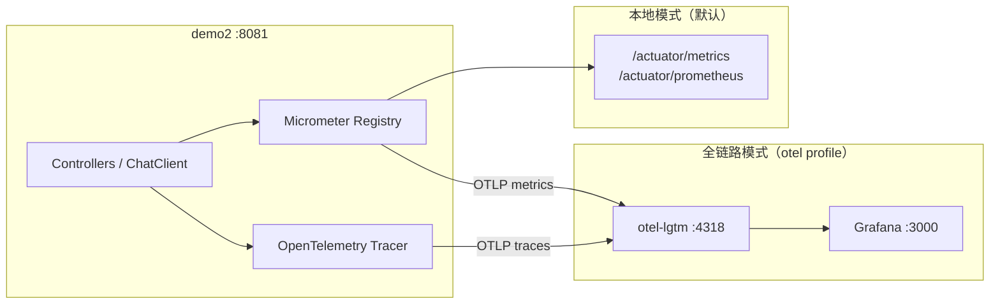

> **注意**：未启动 Collector 却开启 OTLP 导出时，控制台会周期性报 `ConnectException: localhost:4318`。日常开发保持 `enabled=false` 或使用 `otel` Profile 时先启动 Collector。

---

## API 接口文档

详细接口请访问 `http://localhost:8081/scalar`，以下为接口速查表：

### 聊天、Embedding 与结构化输出

| Method | Path | 说明 |
|--------|------|------|
| POST | `/ai/chat` | 同步聊天，Body：`{"message":"..."}` |
| POST | `/ai/chatStream` | SSE 流式聊天，Body：`{"message":"..."}` |
| GET | `/ai/embedding` | 文本向量化，参数：`message` |
| GET | `/ai/similarity` | 相似度查询，参数：`query`、可选 `algorithm`（COSINE/EUCLIDEAN/MANHATTAN） |
| GET | `/ai/structured/analyze` | 产品分析，参数：`productName`，返回 `ProductAnalysis` |
| GET | `/ai/structured/tech-stacks` | 技术栈推荐，参数：`scenario`，返回 `List<TechStack>` |

### RAG

| Method | Path | 说明 |
|--------|------|------|
| GET | `/rag/ask` | 基础版 RAG（内存向量），参数：`question` |
| GET | `/rag/optimized/ask` | 优化版 RAG（Milvus），参数：`question` |
| GET | `/ecommerce/service/chat/precise` | 电商客服-精准检索，参数：`question` |
| GET | `/ecommerce/service/chat/enhanced` | 电商客服-增强检索，参数：`question` |

### Agent

| Method | Path | 说明 |
|--------|------|------|
| GET | `/agent/trip/plan` | 无记忆行程规划，参数：`demand` |
| GET | `/agent/trip/plan-with-memory` | 内存记忆规划，参数：`userId`, `demand` |
| DELETE | `/agent/trip/clear-memory` | 清除内存记忆，参数：`userId` |
| GET | `/agent/mysql/trip/plan` | DB 记忆规划，参数：`userId`, `demand`，可选 `memoryType`（message/prompt） |
| GET | `/agent/mysql/trip/clear-memory` | 清除 DB 记忆，参数：`userId` |
| GET | `/agent/mysql/trip/list-conversations` | 列出所有会话 |
| GET | `/agent/tool/plan` | 工具调用规划，参数：`demand` |
| POST | `/agent/ask-user/chat` | AskUserQuestion 发起对话，Body：`{"message":"..."}` |
| GET | `/agent/ask-user/sse/{sessionId}` | AskUserQuestion SSE 事件流 |
| POST | `/agent/ask-user/answer` | 提交澄清答案，Body：`{"sessionId":"...","answers":{...}}` |
| POST | `/agent/todo/chat` | TodoWrite 发起对话，Body：`{"message":"..."}` |
| GET | `/agent/todo/sse/{sessionId}` | TodoWrite SSE 事件流 |
| GET | `/agent/skills/chat` | Skills Agent 聊天，参数：`message`；返回 `{message, response, agentType}` |
| GET | `/agent/skills/demo` | Skills 官方示例（强化学习 + ai-tutor + YouTube 字幕） |
| GET | `/agent/skills/demo-pdf` | Skills 官方示例（PDF 合并 + pdf skill） |
| GET | `/agent/subagent/chat` | Subagent 编排，参数：`message` |
| GET | `/agent/a2a/chat` | A2A 协调器对话，参数：`message` |
| GET | `/.well-known/agent-card.json` | A2A 天气专家 AgentCard（发现端点） |
| GET | `/agent/multi/plan` | 多 Agent 协作规划，参数：`demand` |

### MCP

| Method | Path | 说明 |
|--------|------|------|
| GET | `/mcp/client/chat` | MCP 工具调用聊天，参数：`message` |
| GET | `/mcp/client/tools` | 列出已注册 MCP 工具 |

### Actuator（可观测性）

| Method | Path | 说明 |
|--------|------|------|
| GET | `/actuator/health` | 健康检查 |
| GET | `/actuator/metrics` | Micrometer 指标列表 |
| GET | `/actuator/metrics/{name}` | 指定指标（如 `gen_ai.client.operation.duration`） |
| GET | `/actuator/prometheus` | Prometheus 格式指标导出 |

---

## 架构设计

### 整体架构

```mermaid
graph TB
    subgraph 前端
        UI[index.html\n多 Tab 演示页]
    end

    subgraph Spring Boot 应用
        subgraph Controllers
            C1[ChatController]
            C2[EmbeddingController]
            C2b[StructuredOutputController]
            C3[RagController]
            C4[RagOptimizedController]
            C5[CustomerServiceController]
            C6[AgentController]
            C7[MysqlAgentController]
            C8[AgentToolController]
            C9[McpChatController]
            C10[AskUserAgentController]
            C11[SkillsAgentController]
            C12[MultiAgentController]
            C12b[TodoAgentController]
            C13[SubagentAgentController]
            C14[A2aOrchestratorController]
        end

        subgraph AgentUtilsTools
            AU1[AskUserQuestionTool]
            AU2[SkillsTool]
            AU3[TaskTool]
            WH[WebQuestionHandler]
        end

        subgraph A2AServer
            AC[AgentCard\nWeather Agent]
            AE[DefaultAgentExecutor]
        end

        subgraph Spring AI Advisors
            A1[MessageChatMemoryAdvisor]
            A2[QuestionAnswerAdvisor]
            A3[RetrievalAugmentationAdvisor]
            A4[SimpleLoggerAdvisor]
        end

        subgraph Tools
            T1[WeatherTool]
            T2[AttractionTool]
        end

        subgraph MCP
            MS[McpServerConfig\nMCP Server]
            MC[McpClientInitializer\nMCP Client]
        end
    end

    subgraph 外部 AI 服务
        DS[DeepSeek API\ndeepseek-v4-pro]
        ZP[智谱 AI API\nembedding-2]
    end

    subgraph 存储层
        MEM[InMemory\nChatMemory]
        DB[(MySQL\nspring_ai_agent2)]
        MV[(Milvus\n:19530)]
    end

    UI -->|HTTP| Controllers
    C1 & C2b & C6 & C7 & C8 & C9 & C10 & C11 & C12 & C13 & C14 -->|ChatClient| DS
    C2 & C3 & C4 & C5 -->|EmbeddingModel| ZP
    C6 --> A1 --> MEM
    C7 --> A1 --> DB
    C4 & C5 --> A2 & A3 --> MV
    C8 --> T1 & T2
    C10 --> AU1 --> WH
    C11 --> AU2
    C13 --> AU3
    C14 --> AU3
    C14 -->|A2A JSON-RPC| AE --> T1
    AE --> AC
    MS -->|注册工具| T1 & T2
    MC -->|SSE :8081| MS
    C9 -->|ToolCallback| MC
```

### 关键设计决策

- **Milvus 懒加载**：`@SpringBootApplication(exclude = MilvusVectorStoreAutoConfiguration.class)` 排除自动配置，由 `MilvusLazyConfiguration` 用 `@Lazy` 手动注册，避免 Milvus 未启动时整个应用崩溃
- **MCP 初始化顺序**：`McpClientInitializer`（`@Order(1)`）监听 `ApplicationReadyEvent` 延迟初始化，`McpChatController`（`@Order(2)`）在其后构建带工具回调的 `ChatClient`，规避启动时序问题
- **RAG 知识库**：`reindex-on-startup` 控制冷启动是否重建向量索引，生产环境建议设为 `false`
- **AskUserQuestion 会话**：`AskUserSessionStore` 内存管理 Session；SSE 未连接时事件先入缓冲队列，`GET /sse/{sessionId}` 后 flush；`WebQuestionHandler` 在虚拟线程中阻塞直至 `POST /answer` 完成 Future
- **Agent Skills 扫描**：`SkillsTool` 通过 `agent.skills.dirs` 加载多个目录（用户 Cursor skills + classpath 内置示例）；skill 命中后由 Glob/Grep/FileSystem/Shell 协同执行，需注意 Shell 工具的安全边界
- **Subagent 编排**：`SubagentAgentConfig` 为协调器单独注册 `TaskTool` + `architect`/`builder` 子代理（`agent.tasks.paths`）；子代理在独立上下文中运行，主会话仅挂 Task 工具
- **A2A 内嵌 Server**：`A2aWeatherAgentConfig` 暴露 `AgentCard` 与 `DefaultAgentExecutor`；`A2aOrchestratorConfig` 通过 `A2ASubagentExecutor` 跨协议调用同进程天气 Agent；发现端点 `/.well-known/agent-card.json`
- **可观测性默认关闭 OTLP**：日常开发仅暴露 Actuator 本地端点；全链路可视化需先启动 `docker/observability` 再使用 `otel` Profile，避免未启动 Collector 时 `ConnectException: localhost:4318`

---

## 功能设计图

### 1. AI 聊天

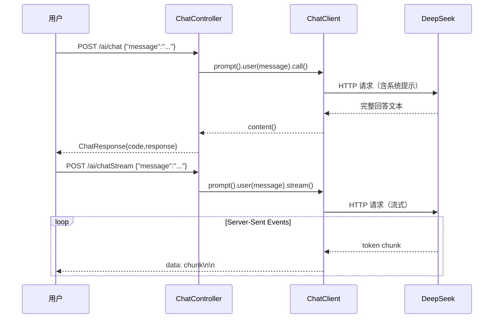

### 2. Embedding 与相似度计算

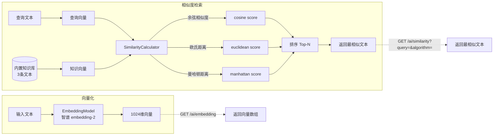

### 3. 结构化输出（`entity()`）

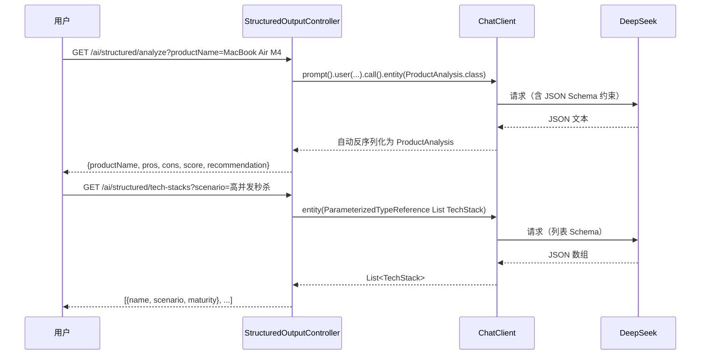

### 4. RAG 基础版

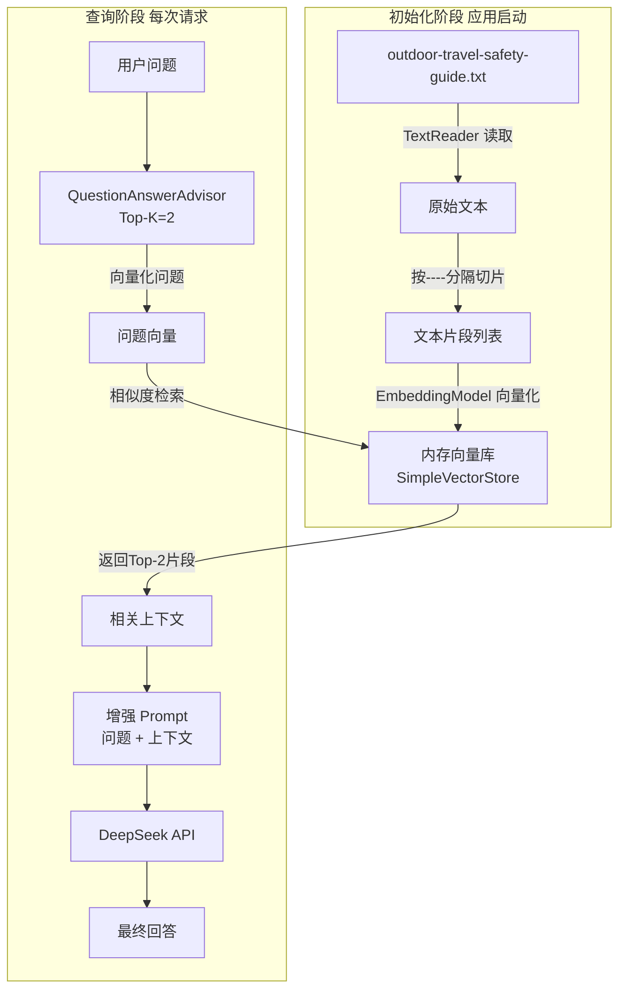


### 5. RAG 优化版（Milvus）

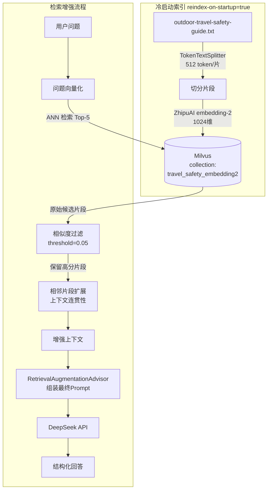

### 6. 电商客服 RAG

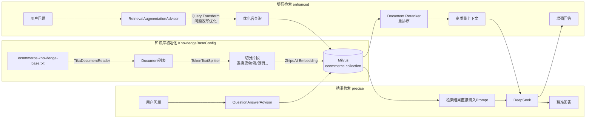

### 7. Agent 行程规划（三种记忆方案对比）

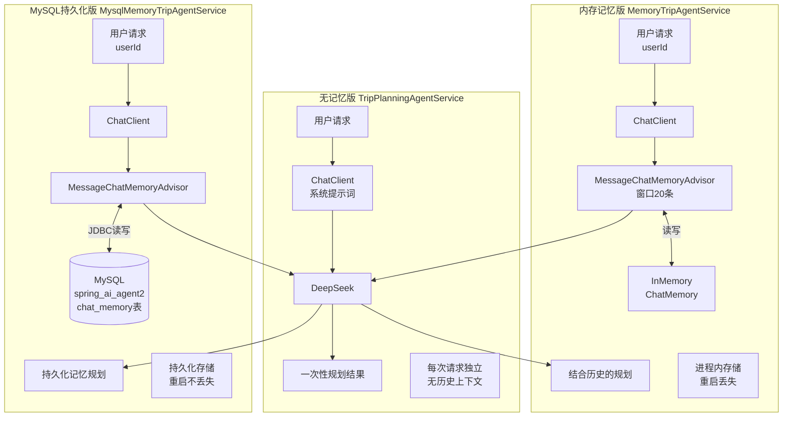

### 8. Agent 工具调用（ReAct 模式）

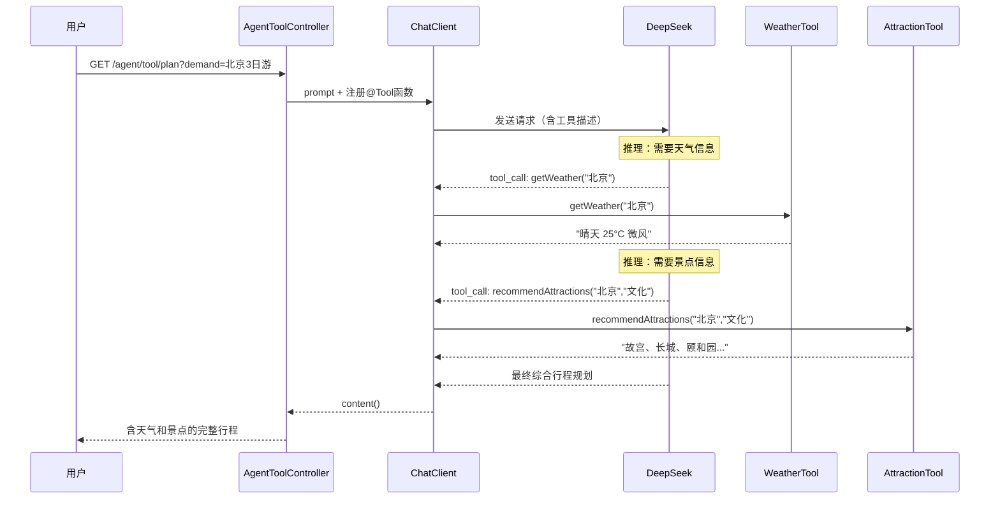

### 9. MCP Server/Client 架构

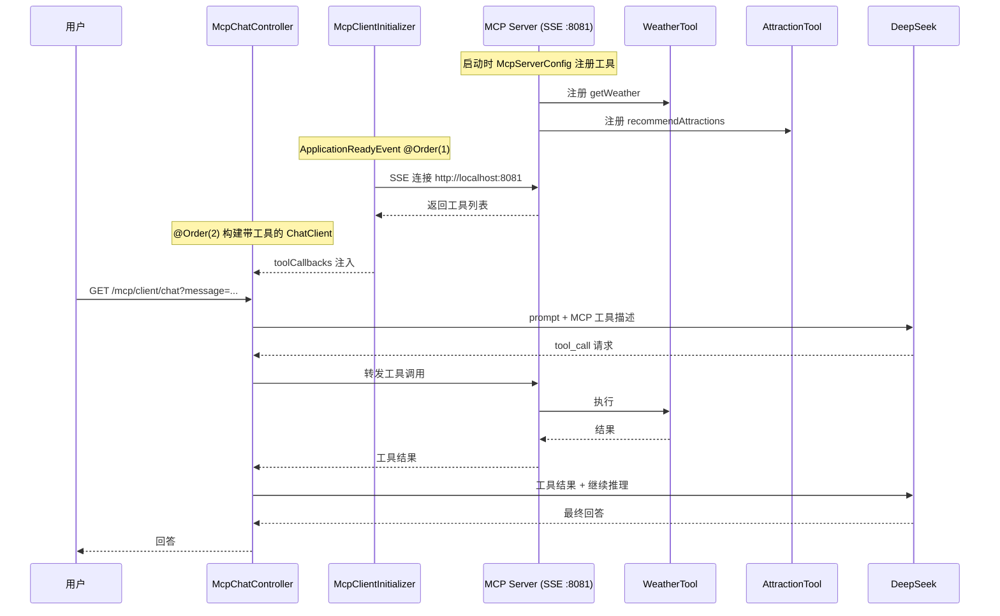

### 10. AskUserQuestion 人机澄清流程

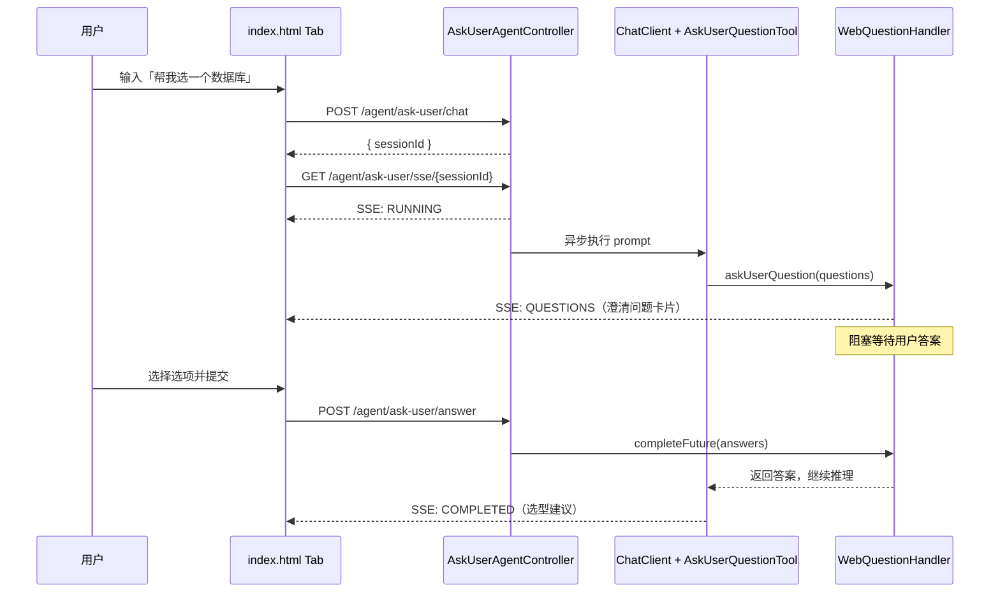

### 11. Agent Skills 语义匹配与执行

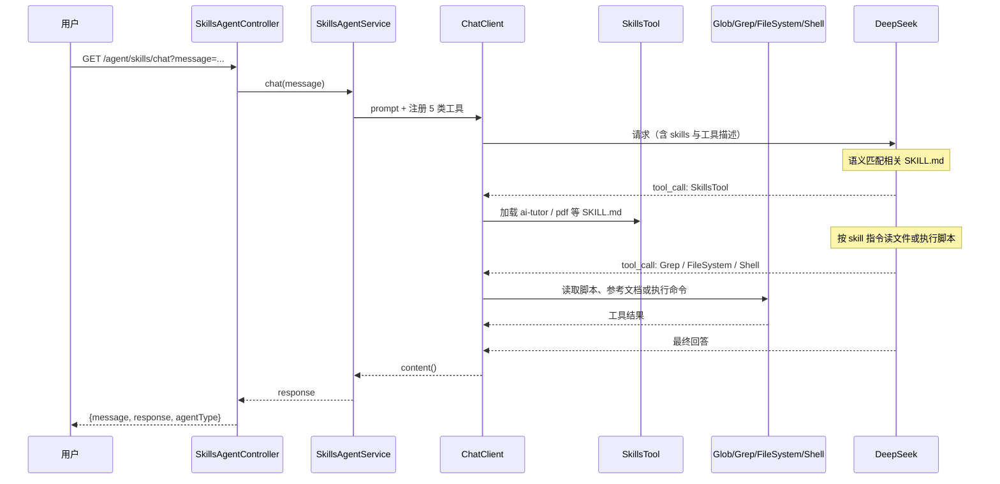

### 12. 多 Agent 协作（Supervisor-Worker）

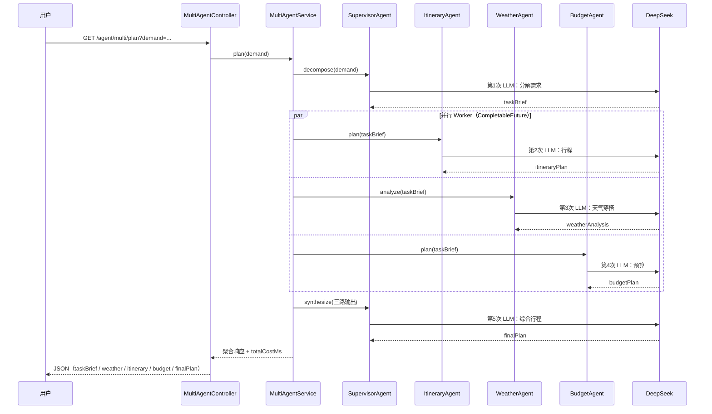

### 13. Subagent Orchestration（TaskTool）

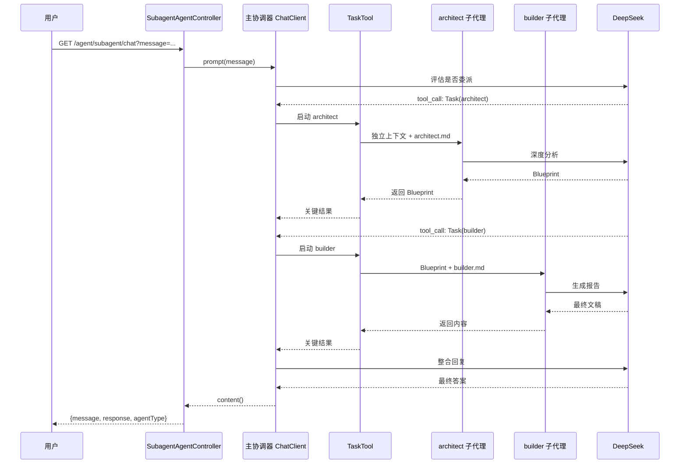

### 14. A2A 跨系统对话

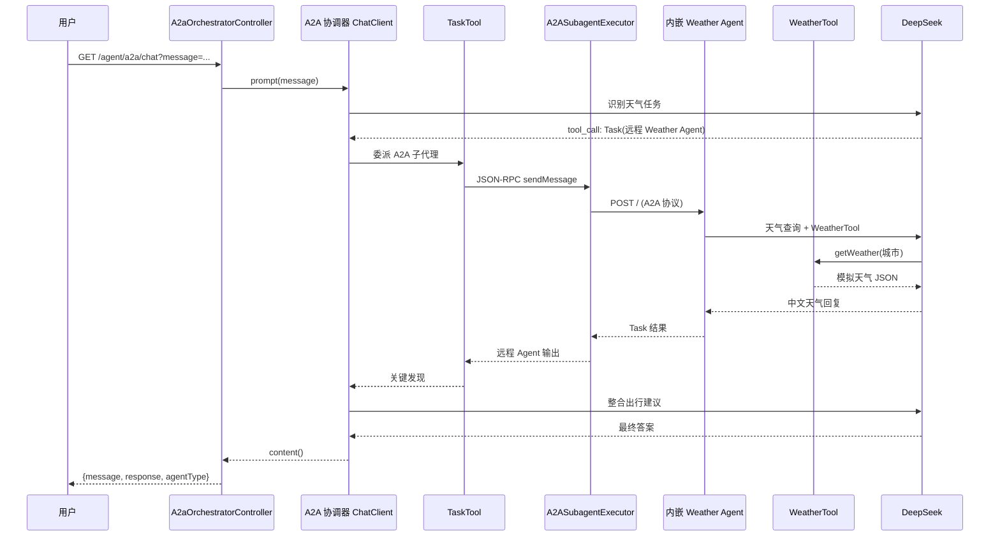

### 15. 应用启动流程

```mermaid
flowchart TD
    START([应用启动]) --> EXCL[排除 MilvusVectorStoreAutoConfiguration]
    EXCL --> BEANS[Bean 初始化]

    BEANS --> B1[LoggingConfig\nSimpleLoggerAdvisor]
    BEANS --> B2[MemoryConfig\nInMemoryChatMemory]
    BEANS --> B3[MysqlMemoryConfig\nJDBC ChatMemory]
    BEANS --> B4[MilvusLazyConfig\n@Lazy MilvusVectorStore]
    BEANS --> B5[RAGConfig\nAdvisors + ChatClient]
    BEANS --> B6[McpServerConfig\n注册工具到MCP Server]

    B4 -->|懒加载\n首次访问时连接| MILVUS3[(Milvus)]

    B6 --> READY([ApplicationReady])
    READY --> MC2[McpClientInitializer @Order1\n初始化MCP Client]
    MC2 --> MCC[McpChatController @Order2\n构建ChatClient with Tools]

    subgraph 知识库初始化 异步
        B5 -->|reindex=true| KBI[KnowledgeBaseConfig\n电商知识库入库]
        KBI --> MILVUS3
    end
```

---

## 目录结构

```
demo2/
├── src/main/java/com/jason/demo/demo2/
│   ├── Demo2Application.java          # 启动类（排除 Milvus 自动配置）
│   ├── config/                       # 配置类
│   │   ├── KnowledgeBaseConfig.java  # 电商知识库初始化（Tika 解析 → Milvus 入库）
│   │   ├── LoggingConfig.java        # LLM 请求响应日志（SimpleLoggerAdvisor）
│   │   ├── MemoryConfig.java         # 内存聊天记忆（InMemoryChatMemoryRepository）
│   │   ├── MilvusLazyConfiguration.java # Milvus 懒加载
│   │   ├── MysqlMemoryConfig.java    # MySQL JDBC 持久化记忆
│   │   ├── OpenApiConfig.java        # Swagger/OpenAPI 配置
│   │   ├── RAGConfig.java            # RAG Advisor + 电商 ChatClient
│   │   ├── SkillsAgentConfig.java    # SkillsTool + 文件/Shell 工具 Bean
│   │   ├── AskUserAgentConfig.java   # AskUserQuestionTool Bean
│   │   ├── TodoAgentConfig.java      # TodoWriteTool + SSE 桥接
│   │   ├── SubagentAgentConfig.java  # TaskTool + architect/builder 子代理
│   │   ├── A2aWeatherAgentConfig.java   # 内嵌 A2A Server（Weather Agent）
│   │   ├── A2aOrchestratorConfig.java   # A2A 协调器 TaskTool
│   │   └── TraceIdFilter.java        # 响应头 X-Trace-Id（链路检索）
│   ├── agent/                        # 多 Agent 专项 Worker
│   │   ├── SupervisorAgent.java      # 分解 + 综合（2 次 LLM）
│   │   ├── ItineraryAgent.java       # 行程规划
│   │   ├── WeatherAgent.java         # 天气穿搭（含 TimeMethodTool）
│   │   └── BudgetAgent.java          # 预算分配
│   ├── controller/                   # HTTP 控制器
│   │   ├── ChatController.java
│   │   ├── EmbeddingController.java
│   │   ├── StructuredOutputController.java  # 结构化输出 entity()
│   │   ├── RagController.java
│   │   ├── RagOptimizedController.java
│   │   ├── CustomerServiceController.java
│   │   ├── AgentController.java
│   │   ├── AgentToolController.java
│   │   ├── MysqlAgentController.java
│   │   ├── SkillsAgentController.java   # Agent Skills：/chat、/demo、/demo-pdf
│   │   ├── AskUserAgentController.java
│   │   ├── TodoAgentController.java     # TodoWrite SSE
│   │   ├── SubagentAgentController.java # Subagent 编排
│   │   ├── A2aOrchestratorController.java # A2A 协调器
│   │   ├── MultiAgentController.java
│   │   └── IndexController.java        # GET / → forward:/index.html
│   ├── mcp/
│   │   ├── client/
│   │   │   ├── config/McpClientInitializer.java  # MCP Client 延迟初始化
│   │   │   └── controller/McpChatController.java # MCP 聊天接口
│   │   └── server/
│   │       └── config/McpServerConfig.java       # MCP Server 工具注册
│   ├── model/
│   │   ├── ChatRequest.java / ChatResponse.java
│   │   ├── ProductAnalysis.java      # 结构化输出：产品分析 record
│   │   ├── TechStack.java            # 结构化输出：技术栈 record
│   │   └── AskUser*.java                 # AskUserQuestion 请求/响应/SSE 事件 DTO
│   ├── service/
│   │   ├── TripPlanningAgentService.java
│   │   ├── MemoryTripAgentService.java
│   │   ├── MysqlMemoryTripAgentService.java
│   │   ├── ToolTripAgentService.java
│   │   ├── MultiAgentService.java        # Supervisor-Worker 编排（5 次 LLM）
│   │   ├── EmbeddingService.java
│   │   ├── SimilarityCalculator.java
│   │   ├── RagService.java
│   │   ├── RagOptimizedService.java
│   │   ├── SkillsAgentService.java       # SkillsTool + 文件/Shell 工具编排
│   │   ├── AskUserAgentService.java      # AskUserQuestion Agent 编排
│   │   ├── TodoAgentService.java         # TodoWrite 学习计划 Agent
│   │   ├── SubagentAgentService.java     # Subagent 协调器
│   │   ├── A2aOrchestratorService.java   # A2A 协调器
│   │   ├── WebQuestionHandler.java       # AskUserQuestionTool QuestionHandler
│   │   └── sse/                          # 通用 SSE（AskUser / TodoWrite）
│   │       ├── AgentSseSessionStore.java
│   │       └── AbstractSseAgentService.java
│   ├── tool/
│   │   ├── TimeMethodTool.java       # @Tool 时区/季节（WeatherAgent 使用）
│   │   └── CityRequest.java          # 城市请求 DTO
│   └── tools/
│       ├── WeatherTool.java          # @Tool 天气查询（模拟数据）
│       └── AttractionTool.java       # @Tool 景点推荐（内置6城市数据）
├── src/main/resources/
│   ├── application.properties        # 主配置（含 Subagent/A2A、Micrometer/OTel）
│   ├── application-otel.properties   # OTLP 导出 Profile（--spring.profiles.active=otel）
│   ├── agents/                       # Subagent 子代理定义（architect.md、builder.md）
│   ├── .claude/skills/             # 内置 Agent Skills 示例（ai-tutor、pdf）
│   ├── outdoor-travel-safety-guide.txt
│   ├── ecommerce-knowledge-base.txt
│   └── static/                       # 前端演示（见「前端说明」）
│       ├── index.html
│       ├── css/components.css
│       ├── css/tabs/                 # 10 个 Tab 样式文件
│       └── js/
│           ├── core/tabs.js, utils.js
│           └── tabs/                 # 13 个 Tab 逻辑文件
├── scripts/
│   └── smoke-test-frontend.ps1     # 静态资源冒烟测试
├── docker/
│   ├── milvus/docker-compose.yml
│   └── observability/docker-compose.yml  # Grafana LGTM（OTLP + Grafana UI）
├── docs/superpowers/
│   ├── specs/
│   │   ├── 2026-06-23-spring-ai-2-upgrade-design.md
│   │   ├── 2026-06-27-ask-user-question-tool-design.md
│   │   ├── 2026-06-29-todo-write-tool-design.md
│   │   ├── 2026-06-29-subagent-a2a-design.md
│   │   └── 2026-06-30-index-html-refactor-design.md
│   └── plans/
│       ├── 2026-06-27-ask-user-question-tool.md
│       ├── 2026-06-29-todo-write-tool.md
│       ├── 2026-06-29-subagent-a2a.md
│       └── 2026-06-30-index-html-refactor.md
└── pom.xml
```

---

## 常见问题

**Q：启动时报 Milvus 连接失败怎么办？**

Milvus 采用懒加载，仅访问 RAG 优化版和电商客服接口时才会连接。检查 Docker 中 Milvus 是否正常运行：`docker ps | grep milvus`。其他模块不受影响。

**Q：MySQL 建表失败怎么办？**

将 `application.properties` 中 `spring.ai.chat.memory.repository.jdbc.initialize-schema` 改为 `always` 让框架自动建表，或手动执行 Spring AI JDBC 的 DDL 脚本。

**Q：MySQL 记忆报 `bad SQL grammar ... ORDER BY sequence_id`？**

Spring AI 2.0 的 `SPRING_AI_CHAT_MEMORY` 表新增了 `sequence_id` 列。若从 1.x 升级且表已存在，需手动迁移：

```sql
ALTER TABLE SPRING_AI_CHAT_MEMORY
  ADD COLUMN sequence_id BIGINT NOT NULL AFTER timestamp;

-- 若已有历史数据，按时间顺序回填序号（每个 conversation_id 内从 0 递增）
SET @seq := -1;
SET @cid := '';
UPDATE SPRING_AI_CHAT_MEMORY
SET sequence_id = (
  @seq := IF(@cid = conversation_id, @seq + 1, 0),
  @cid := conversation_id,
  @seq
)
ORDER BY conversation_id, timestamp;
```

新库可直接设 `initialize-schema=always` 由框架建表。

**Q：DeepSeek / 智谱 AI 返回 401？**

检查 `application.properties` 中对应的 `api-key` 是否正确填写，注意不要有多余空格。

**Q：MCP Client 无法调用工具？**

MCP Client 连接本机 MCP Server（`http://localhost:8081`），需确保应用已完全启动再发起请求。初始化顺序由 `@Order` 控制，若出现 NPE 可在请求前稍等片刻。

**Q：AskUserQuestion Demo 没有收到澄清问题？**

确认已配置 `DEEPSEEK_API_KEY`，且前端在 `POST /chat` 后及时建立 `EventSource` 连接。Agent 仅在需求模糊时才会调用 `AskUserQuestionTool`；可尝试输入「帮我选一个数据库」等开放式问题。SSE 连接超时为 5 分钟。

**Q：Agent Skills 没有匹配到 skill 或读文件失败？**

检查 `application.properties` 中 `agent.skills.dirs` 路径是否存在；Windows 下 Cursor skills 通常为 `file:C:/Users/<用户名>/.cursor/skills`。内置示例在 `classpath:/.claude/skills`。可开启 `logging.level.org.springaicommunity.agent.tools.SkillsTool=DEBUG` 查看匹配过程。`demo` / `demo-pdf` 若需执行 Python 脚本，请确保本机已安装 Python 或 `uv`。

**Q：Subagent 编排一直 loading 或超时？**

单次请求可能触发多次 LLM 调用（主代理 + architect + builder），通常需 **30～90 秒**。请确认 `DEEPSEEK_API_KEY` 已配置，并查看日志中是否有 `Task` 工具调用。复杂写作类 prompt 更容易触发子代理链。

**Q：A2A Demo 调用失败或 AgentCard 404？**

确认 `spring.ai.a2a.server.enabled=true` 且 `agent.a2a.remote.url` 端口与 `server.port` 一致（默认 **8081**）。启动后执行 `curl http://localhost:8081/.well-known/agent-card.json` 应返回 Weather Agent 元数据。若协调器无天气结果，检查日志中 A2A JSON-RPC 是否成功。

**Q：控制台周期性报 `ConnectException: localhost:4318`？**

说明已开启 OTLP 导出但 Collector 未运行。解决方式二选一：① 保持 `management.otlp.metrics.export.enabled=false` 与 `management.tracing.export.otlp.enabled=false`（默认）；② 先执行 `docker compose -f demo2/docker/observability/docker-compose.yml up -d`，再以 `otel` Profile 启动应用。

**Q：RAG 知识库更新后不生效？**

将 `rag.optimized.reindex-on-startup=true`（或 `ecommerce.reindex-on-startup=true`）重启一次应用，重建向量索引后再改回 `false`。

---

## 升级说明（Spring AI 2.0）

本项目已升级至 **Java 21 + Spring Boot 4.1 + Spring AI 2.0.0**。

主要变更：

- `PromptChatMemoryAdvisor` 已移除，MySQL 记忆统一使用 `MessageChatMemoryAdvisor`
- `SPRING_AI_CHAT_MEMORY` 表新增 `sequence_id` 列（从 1.x 升级需手动 ALTER，见 FAQ）
- Jackson 3（Boot 4 默认）
- MCP Java SDK 2.0.0
- 智谱 Embedding 通过 OpenAI 兼容 API 接入（`spring-ai-starter-model-openai` + 智谱 base-url）
- `AskUserQuestionTool` 来自 `spring-ai-agent-utils`，用于 Agent 执行中主动向用户澄清需求
- `TodoWriteTool` 同属 `spring-ai-agent-utils`，用于多步骤任务拆解与进度跟踪
- `SkillsTool` 同属 `spring-ai-agent-utils`，通过语义匹配加载 `SKILL.md` 并配合文件/Shell 工具执行
- `TaskTool` + `spring-ai-agent-utils-a2a`：Subagent 本地编排与 A2A 远程子代理委派（`architect`/`builder`、内嵌 Weather Agent）
- **Micrometer + OpenTelemetry**：Boot 4 内置，通过 `spring-boot-starter-opentelemetry` 接入；Spring AI 自动暴露 `gen_ai.*` 指标

详细设计见 `docs/superpowers/specs/` 目录。

---

## 相关资源

- [Spring Boot 可观测性文档](https://docs.spring.io/spring-boot/reference/actuator/observability.html)
- [Micrometer OpenTelemetry 桥接](https://micrometer.io/docs/tracing#_open_telemetry)
- [Spring AI Agent Utils（AskUserQuestionTool / TaskTool）](https://github.com/spring-ai-community/spring-ai-agent-utils)
- [subagent-demo 官方示例](https://github.com/spring-ai-community/spring-ai-agent-utils/tree/main/examples/subagent-demo)
- [subagent-a2a-demo 官方示例](https://github.com/spring-ai-community/spring-ai-agent-utils/tree/main/examples/subagent-a2a-demo)
- [spring-ai-a2a（A2A Server）](https://github.com/spring-ai-community/spring-ai-a2a)
- [A2A Protocol](https://a2a-protocol.org/)
- [Spring AI 官方文档](https://docs.spring.io/spring-ai/reference/)
- [DeepSeek API 文档](https://api-docs.deepseek.com/)
- [智谱 AI 开放平台](https://open.bigmodel.cn/)
- [Milvus 官方文档](https://milvus.io/docs)
- [Model Context Protocol 规范](https://modelcontextprotocol.io/)
