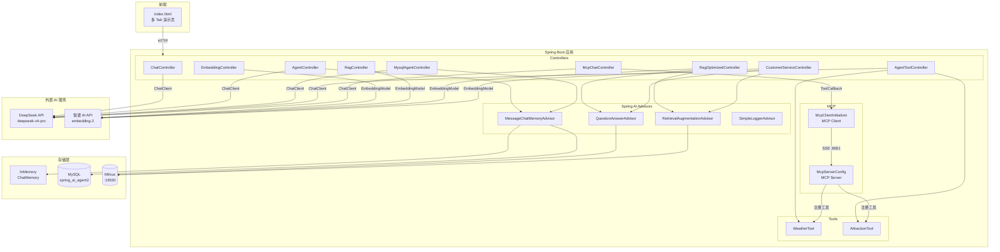
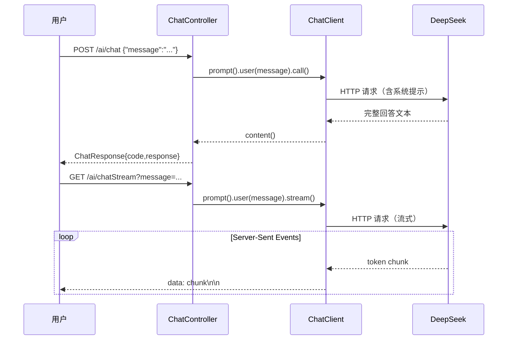
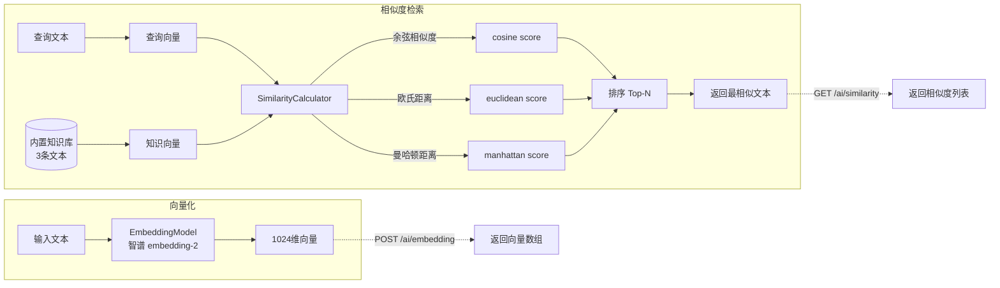
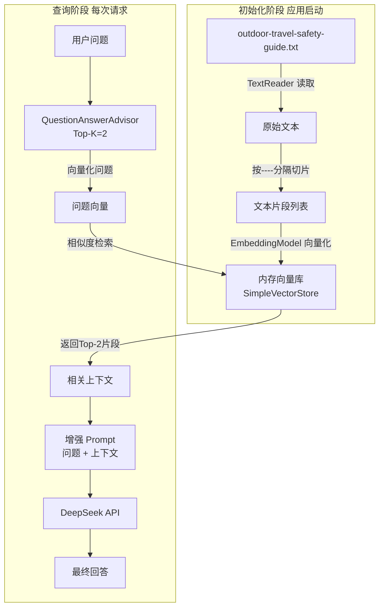
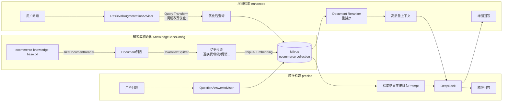
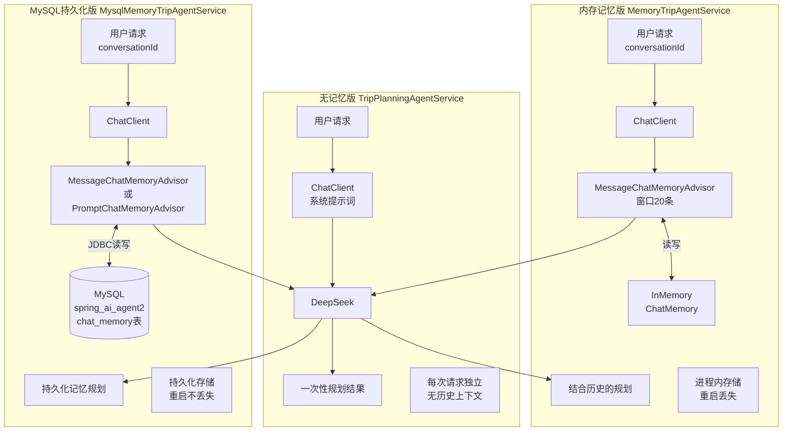
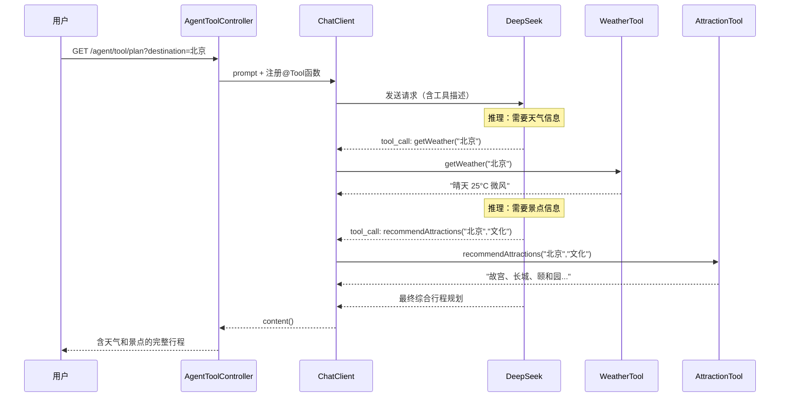

# Spring AI Demo2

> demo2 是 demo 的并行副本，默认端口 **8081**，用于后续 Spring AI 2 升级实验。可与 demo（8080）同时运行。

基于 **Spring Boot 3.5 + Spring AI 1.1** 的综合 AI 能力演示项目，覆盖聊天对话、RAG 知识检索、Agent 工具调用、MCP 协议集成等核心场景，配套完整前端演示界面。

---

## 目录

- [项目概览](#项目概览)
- [技术栈](#技术栈)
- [功能模块](#功能模块)
- [快速开始](#快速开始)
- [配置说明](#配置说明)
- [API 接口文档](#api-接口文档)
- [架构设计](#架构设计)
- [功能设计图](#功能设计图)
- [目录结构](#目录结构)
- [常见问题](#常见问题)

---

## 项目概览

本项目是一个 Spring AI 功能演示应用，通过不同 Controller/Service 模块独立演示各类 AI 能力，适合学习 Spring AI 各组件的用法。

| 模块 | 能力 | 依赖外部服务 |
|------|------|-------------|
| AI 聊天 | 同步/流式聊天 | DeepSeek API |
| Embedding | 文本向量化 + 相似度计算 | 智谱 AI API |
| RAG 基础版 | 内存向量检索增强问答 | 智谱 AI API |
| RAG 优化版 | Milvus 持久化向量检索 | 智谱 AI + Milvus |
| 电商客服 | 知识库问答（精准/增强两种策略） | 智谱 AI + Milvus |
| Agent 行程规划 | 无记忆/内存记忆/DB记忆 三种版本 | DeepSeek API + MySQL |
| Agent 工具调用 | 天气查询 + 景点推荐工具 | DeepSeek API |
| MCP | MCP Server/Client 工具注册与调用 | DeepSeek API |

---

## 技术栈

| 分类 | 技术 | 版本 |
|------|------|------|
| 运行环境 | Java | 17 |
| 核心框架 | Spring Boot | 3.5.14 |
| AI 框架 | Spring AI | 1.1.7 |
| 聊天模型 | DeepSeek | deepseek-v4-pro |
| Embedding 模型 | 智谱 AI | embedding-2（1024 维） |
| 向量数据库 | Milvus | 2.6.18 |
| 持久化记忆 | MySQL | 8.x |
| 协议 | MCP（Model Context Protocol） | SSE |
| 文档解析 | Apache Tika + PDFBox | — |
| API 文档 | SpringDoc OpenAPI | 2.8.9 |
| 工具库 | Lombok | — |
| 前端 | 原生 HTML/CSS/JS（单页多 Tab） | — |

---

## 功能模块

### 1. AI 聊天（`/ai`）

最基础的 LLM 对话能力，支持同步和流式（SSE）两种响应方式。

- `POST /ai/chat` — 同步返回完整回答
- `GET /ai/chatStream` — Server-Sent Events 流式输出

### 2. Embedding（`/ai`）

将文本转换为向量，并演示三种相似度算法（余弦、欧氏距离、曼哈顿距离）。

- `POST /ai/embedding` — 返回文本的 1024 维向量
- `GET /ai/similarity` — 与内置知识库做相似度匹配

### 3. RAG 基础版（`/rag`）

将 `outdoor-travel-safety-guide.txt` 切片后存入内存向量库，回答户外旅行安全问题。

- `GET /rag/ask?question=xxx` — 检索增强问答（Top-K=2）

### 4. RAG 优化版（`/rag/optimized`）

升级版 RAG，使用 Milvus 持久化存储，支持相似度阈值过滤和相邻片段扩展。

- `GET /rag/optimized/ask?question=xxx`
- 配置项：Top-K=5，相似度阈值=0.05，冷启动重建索引开关

### 5. 电商客服（`/ecommerce/service`）

基于 `ecommerce-knowledge-base.txt` 的电商场景问答，覆盖退换货、物流、促销等知识。

- `GET /ecommerce/service/chat/precise` — 精准检索（QuestionAnswerAdvisor）
- `GET /ecommerce/service/chat/enhanced` — 增强检索（RetrievalAugmentationAdvisor）

### 6. Agent 行程规划（`/agent/trip`）

行程规划 Agent，演示三种记忆方案的渐进演进。

- `GET /agent/trip/plan` — 无记忆，每次独立规划
- `GET /agent/trip/plan-with-memory?conversationId=xxx` — 内存多轮记忆（窗口 20 条）
- `DELETE /agent/trip/clear-memory?conversationId=xxx` — 清除指定会话记忆

### 7. MySQL 持久化记忆 Agent（`/agent/mysql/trip`）

将对话记忆持久化到 MySQL，服务重启后记忆不丢失。

- `GET /agent/mysql/trip/plan?conversationId=xxx&message=xxx` — 有记忆的行程规划
- `DELETE /agent/mysql/trip/clear-memory?conversationId=xxx` — 清除记忆
- `GET /agent/mysql/trip/list-conversations` — 列出所有会话

### 8. Agent 工具调用（`/agent/tool`）

为 Agent 挂载两个 `@Tool` 工具，让 LLM 主动调用外部函数获取信息。

- `GET /agent/tool/plan?destination=xxx` — 自动调用天气 + 景点工具后规划行程
- 内置工具：`WeatherTool`（模拟天气）、`AttractionTool`（北京/上海/成都/西安/杭州/广州景点库）

### 9. MCP（`/mcp/client`）

演示 MCP（Model Context Protocol）的 Server 注册和 Client 调用。

- `GET /mcp/client/chat?message=xxx` — 通过 MCP 工具调用聊天
- `GET /mcp/client/tools` — 列出已注册的 MCP 工具
- MCP Server 暴露地址：`http://localhost:8081`（SSE 模式）

---

## 快速开始

### 前置条件

| 依赖 | 说明 |
|------|------|
| JDK 17+ | 必须 |
| Maven 3.9+ | 必须（或使用项目内的 `mvnw`） |
| MySQL 8.x | Agent 持久化记忆功能必须 |
| Milvus 2.x | RAG 优化版 + 电商客服必须 |
| DeepSeek API Key | 聊天功能必须 |
| 智谱 AI API Key | Embedding + RAG 功能必须 |

### 1. 启动 Milvus（Docker）

```bash
cd docker/milvus
docker compose up -d
```

Milvus 相关端口：`19530`（gRPC）、`9000`/`9001`（MinIO）

### 2. 初始化 MySQL 数据库

```sql
CREATE DATABASE spring_ai_agent2 CHARACTER SET utf8mb4;
```

> Spring AI JDBC ChatMemory 会在首次启动时自动建表（`initialize-schema=never` 时需手动执行 DDL），如遇建表失败可改为 `always`。

### 3. 配置 API Key

编辑 `src/main/resources/application.properties`，填写你的 API Key：

```properties
spring.ai.deepseek.api-key=<你的 DeepSeek API Key>
spring.ai.zhipuai.api-key=<你的 智谱 AI API Key>
```

### 4. 启动应用

#### 方法一：使用 Maven Wrapper 启动（推荐）
```bash
./mvnw spring-boot:run          # Mac/Linux
mvnw.cmd spring-boot:run        # Windows
```

#### 方法二：打包后用 Java 启动
```bash
./mvnw clean package
java -jar target/demo2-*.jar
```

#### 方法三：直接用本地 Maven 启动
```bash
mvn spring-boot:run
```

应用启动后访问：

| 地址 | 说明 |
|------|------|
| `http://localhost:8081` | 前端演示界面（多 Tab） |
| `http://localhost:8081/swagger-ui.html` | Swagger API 文档 |
| `http://localhost:8081/v3/api-docs` | OpenAPI JSON |

---

## 配置说明

### 核心配置项（application.properties）

```properties
# ===== AI 模型 =====
spring.ai.deepseek.api-key=xxx            # DeepSeek API Key
spring.ai.deepseek.chat.options.model=deepseek-v4-pro
spring.ai.zhipuai.api-key=xxx             # 智谱 AI API Key
spring.ai.zhipuai.embedding.options.model=embedding-2

# ===== MySQL =====
spring.datasource.url=jdbc:mysql://127.0.0.1:3306/spring_ai_agent2
spring.datasource.username=root
spring.datasource.password=123456

# ===== Milvus =====
spring.ai.vectorstore.milvus.client.host=localhost
spring.ai.vectorstore.milvus.client.port=19530
spring.ai.vectorstore.milvus.collection-name=travel_safety_embedding2

# ===== RAG 参数 =====
rag.top-k=2                               # 基础版检索 Top-K
rag.optimized.top-k=5                     # 优化版检索 Top-K
rag.optimized.similarity-threshold=0.05  # 相似度过滤阈值
rag.optimized.reindex-on-startup=false   # 启动时是否重建索引

# ===== 电商客服 =====
ecommerce.reindex-on-startup=false        # 启动时是否重建知识库索引

# ===== MCP =====
spring.ai.mcp.server.name=demo2-mcp-server
spring.ai.mcp.client.sse.connections.local-server.url=http://localhost:8081
```

### 注意事项

- **生产环境**：API Key 和数据库密码应通过环境变量注入，不要硬编码提交到代码仓库
- **Milvus 懒加载**：项目已排除 `MilvusVectorStoreAutoConfiguration` 自动配置，改为 `@Lazy` 手动初始化，Milvus 不可用时不影响其他模块启动
- **首次启动**：若 `reindex-on-startup=true`，会将知识库文件切分后批量写入 Milvus，耗时较长

---

## API 接口文档

详细接口请访问 `http://localhost:8081/swagger-ui.html`，以下为接口速查表：

### 聊天与 Embedding

| Method | Path | 说明 |
|--------|------|------|
| POST | `/ai/chat` | 同步聊天，Body：`{"message":"..."}` |
| GET | `/ai/chatStream` | SSE 流式聊天，参数：`message` |
| POST | `/ai/embedding` | 文本向量化，Body：`{"message":"..."}` |
| GET | `/ai/similarity` | 相似度查询，参数：`text` |

### RAG

| Method | Path | 说明 |
|--------|------|------|
| GET | `/rag/ask` | 基础版 RAG（内存向量），参数：`question` |
| GET | `/rag/optimized/ask` | 优化版 RAG（Milvus），参数：`question` |
| GET | `/ecommerce/service/chat/precise` | 电商客服-精准检索，参数：`question` |
| GET | `/ecommerce/service/chat/enhanced` | 电商客服-增强检索，参数：`question` |

### Agent

| Method | Path | 说明 |
|--------|------|------|
| GET | `/agent/trip/plan` | 无记忆行程规划，参数：`demand` |
| GET | `/agent/trip/plan-with-memory` | 内存记忆规划，参数：`conversationId`, `demand` |
| DELETE | `/agent/trip/clear-memory` | 清除内存记忆，参数：`conversationId` |
| GET | `/agent/mysql/trip/plan` | DB 记忆规划，参数：`conversationId`, `message` |
| DELETE | `/agent/mysql/trip/clear-memory` | 清除 DB 记忆，参数：`conversationId` |
| GET | `/agent/mysql/trip/list-conversations` | 列出所有会话 |
| GET | `/agent/tool/plan` | 工具调用规划，参数：`destination` |

### MCP

| Method | Path | 说明 |
|--------|------|------|
| GET | `/mcp/client/chat` | MCP 工具调用聊天，参数：`message` |
| GET | `/mcp/client/tools` | 列出已注册 MCP 工具 |

---

## 架构设计

### 整体架构



### 关键设计决策

- **Milvus 懒加载**：`@SpringBootApplication(exclude = MilvusVectorStoreAutoConfiguration.class)` 排除自动配置，由 `MilvusLazyConfiguration` 用 `@Lazy` 手动注册，避免 Milvus 未启动时整个应用崩溃
- **MCP 初始化顺序**：`McpClientInitializer`（`@Order(1)`）监听 `ApplicationReadyEvent` 延迟初始化，`McpChatController`（`@Order(2)`）在其后构建带工具回调的 `ChatClient`，规避启动时序问题
- **RAG 知识库**：`reindex-on-startup` 控制冷启动是否重建向量索引，生产环境建议设为 `false`

---

## 功能设计图

### 1. AI 聊天



### 2. Embedding 与相似度计算



### 3. RAG 基础版



### 4. RAG 优化版（Milvus）

```mermaid
flowchart TD
    subgraph 冷启动索引 reindex-on-startup=true
        F2[outdoor-travel-safety-guide.txt] -->|TokenTextSplitter\n512 token/片| CHUNKS2[切分片段]
        CHUNKS2 -->|ZhipuAI embedding-2\n1024维| MILVUS[(Milvus\ncollection:\ntravel_safety_embedding2)]
    end

    subgraph 检索增强流程
        Q2[用户问题] --> QV2[问题向量化]
        QV2 -->|ANN 检索 Top-5| MILVUS
        MILVUS -->|原始候选片段| FILTER[相似度过滤\nthreshold=0.05]
        FILTER -->|保留高分片段| EXPAND[相邻片段扩展\n上下文连贯性]
        EXPAND --> CTX2[增强上下文]
        CTX2 --> PROMPT2[RetrievalAugmentationAdvisor\n组装最终Prompt]
        PROMPT2 --> DS2[DeepSeek API]
        DS2 --> ANS2[结构化回答]
    end
```

### 5. 电商客服 RAG



### 6. Agent 行程规划（三种记忆方案对比）



### 7. Agent 工具调用（ReAct 模式）



### 8. MCP Server/Client 架构

```mermaid
sequenceDiagram
    participant 用户
    participant McpChatController
    participant McpClientInitializer
    participant McpServer SSE :8081
    participant WeatherTool
    participant AttractionTool
    participant DeepSeek

    Note over McpServer SSE :8081: 启动时 McpServerConfig 注册工具
    McpServer SSE :8081->>WeatherTool: 注册 getWeather
    McpServer SSE :8081->>AttractionTool: 注册 recommendAttractions

    Note over McpClientInitializer: ApplicationReadyEvent @Order(1)
    McpClientInitializer->>McpServer SSE :8081: SSE 连接 http://localhost:8081
    McpServer SSE :8081-->>McpClientInitializer: 返回工具列表

    Note over McpChatController: @Order(2) 构建带工具的ChatClient
    McpClientInitializer-->>McpChatController: toolCallbacks 注入

    用户->>McpChatController: GET /mcp/client/chat?message=...
    McpChatController->>DeepSeek: prompt + MCP工具描述
    DeepSeek-->>McpChatController: tool_call 请求
    McpChatController->>McpServer SSE :8081: 转发工具调用
    McpServer SSE :8081->>WeatherTool: 执行
    WeatherTool-->>McpServer SSE :8081: 结果
    McpServer SSE :8081-->>McpChatController: 工具结果
    McpChatController->>DeepSeek: 工具结果 + 继续推理
    DeepSeek-->>McpChatController: 最终回答
    McpChatController-->>用户: 回答
```

### 9. 应用启动流程

```mermaid
flowchart TD
    START([应用启动]) --> EXCL[排除 MilvusVectorStoreAutoConfiguration]
    EXCL --> BEANS[Bean 初始化]

    BEANS --> B1[LoggingConfig\nSimpleLoggerAdvisor]
    BEANS --> B2[MemoryConfig\nInMemoryChatMemory]
    BEANS --> B3[MysqlMemoryConfig\nJDBC ChatMemory]
    BEANS --> B4[MilvusLazyConfig\n@Lazy MilvusVectorStore]
    BEANS --> B5[RAGConfig\nAdvisors + ChatClient]
    BEANS --> B6[McpServerConfig\n注册工具到MCP Server]

    B4 -->|懒加载\n首次访问时连接| MILVUS3[(Milvus)]

    B6 --> READY([ApplicationReady])
    READY --> MC2[McpClientInitializer @Order1\n初始化MCP Client]
    MC2 --> MCC[McpChatController @Order2\n构建ChatClient with Tools]

    subgraph 知识库初始化 异步
        B5 -->|reindex=true| KBI[KnowledgeBaseConfig\n电商知识库入库]
        KBI --> MILVUS3
    end
```

---

## 目录结构

```
demo2/
├── src/main/java/com/jason/demo/demo2/
│   ├── Demo2Application.java          # 启动类（排除 Milvus 自动配置）
│   ├── config/                       # 配置类
│   │   ├── KnowledgeBaseConfig.java  # 电商知识库初始化（Tika 解析 → Milvus 入库）
│   │   ├── LoggingConfig.java        # LLM 请求响应日志（SimpleLoggerAdvisor）
│   │   ├── MemoryConfig.java         # 内存聊天记忆（InMemoryChatMemoryRepository）
│   │   ├── MilvusLazyConfiguration.java # Milvus 懒加载
│   │   ├── MysqlMemoryConfig.java    # MySQL JDBC 持久化记忆
│   │   ├── OpenApiConfig.java        # Swagger/OpenAPI 配置
│   │   └── RAGConfig.java            # RAG Advisor + 电商 ChatClient
│   ├── controller/                   # HTTP 控制器（9 个）
│   │   ├── ChatController.java
│   │   ├── EmbeddingController.java
│   │   ├── RagController.java
│   │   ├── RagOptimizedController.java
│   │   ├── CustomerServiceController.java
│   │   ├── AgentController.java
│   │   ├── AgentToolController.java
│   │   └── MysqlAgentController.java
│   ├── mcp/
│   │   ├── client/
│   │   │   ├── config/McpClientInitializer.java  # MCP Client 延迟初始化
│   │   │   └── controller/McpChatController.java # MCP 聊天接口
│   │   └── server/
│   │       └── config/McpServerConfig.java       # MCP Server 工具注册
│   ├── model/
│   │   ├── ChatRequest.java
│   │   └── ChatResponse.java
│   ├── service/                      # 业务服务（9 个）
│   │   ├── TripPlanningAgentService.java
│   │   ├── MemoryTripAgentService.java
│   │   ├── MysqlMemoryTripAgentService.java
│   │   ├── ToolTripAgentService.java
│   │   ├── EmbeddingService.java
│   │   ├── SimilarityCalculator.java
│   │   ├── RagService.java
│   │   └── RagOptimizedService.java
│   └── tools/
│       ├── WeatherTool.java          # @Tool 天气查询（模拟数据）
│       └── AttractionTool.java       # @Tool 景点推荐（内置6城市数据）
├── src/main/resources/
│   ├── application.properties        # 所有配置项
│   ├── outdoor-travel-safety-guide.txt  # RAG 基础版知识库（户外安全）
│   ├── ecommerce-knowledge-base.txt     # 电商客服知识库
│   └── static/index.html             # 前端演示界面（多 Tab，2269 行）
├── docker/milvus/
│   └── docker-compose.yml            # Milvus standalone + etcd + minio
└── pom.xml
```

---

## 常见问题

**Q：启动时报 Milvus 连接失败怎么办？**

Milvus 采用懒加载，仅访问 RAG 优化版和电商客服接口时才会连接。检查 Docker 中 Milvus 是否正常运行：`docker ps | grep milvus`。其他模块不受影响。

**Q：MySQL 建表失败怎么办？**

将 `application.properties` 中 `spring.ai.chat.memory.repository.jdbc.initialize-schema` 改为 `always` 让框架自动建表，或手动执行 Spring AI JDBC 的 DDL 脚本。

**Q：DeepSeek / 智谱 AI 返回 401？**

检查 `application.properties` 中对应的 `api-key` 是否正确填写，注意不要有多余空格。

**Q：MCP Client 无法调用工具？**

MCP Client 连接本机 MCP Server（`http://localhost:8081`），需确保应用已完全启动再发起请求。初始化顺序由 `@Order` 控制，若出现 NPE 可在请求前稍等片刻。

**Q：RAG 知识库更新后不生效？**

将 `rag.optimized.reindex-on-startup=true`（或 `ecommerce.reindex-on-startup=true`）重启一次应用，重建向量索引后再改回 `false`。

---

## 相关资源

- [Spring AI 官方文档](https://docs.spring.io/spring-ai/reference/)
- [DeepSeek API 文档](https://api-docs.deepseek.com/)
- [智谱 AI 开放平台](https://open.bigmodel.cn/)
- [Milvus 官方文档](https://milvus.io/docs)
- [Model Context Protocol 规范](https://modelcontextprotocol.io/)
