# Spring AI Demo2

> demo2 是 demo 的并行副本，默认端口 **8081**，用于后续 Spring AI 2 升级实验。可与 demo（8080）同时运行。

基于 **Spring Boot 4.1 + Spring AI 2.0** 的综合 AI 能力演示项目，覆盖聊天对话、结构化输出、RAG 知识检索、Agent 工具调用、AskUserQuestion 人机澄清、TodoWrite 任务规划、Agent Skills、**Subagent 子代理编排**、**A2A 跨系统对话**、多 Agent 协作、MCP 协议集成、**瑞幸 MCP 点单**、**ElevenLabs 语音对话**、**Embabel 自动选路（含 Quizzard 技术文章出题）**、**Micrometer + OpenTelemetry 可观测性**等核心场景，配套完整前端演示界面。

---

## 目录

- [项目概览](#项目概览)
- [技术栈](#技术栈)
- [功能模块](#功能模块)
- [快速开始](#快速开始)
- [前端说明](#前端说明)
- [配置说明](#配置说明)
- [可观测性](#可观测性)
- [API 接口文档](#api-接口文档)
- [架构设计](#架构设计)
- [功能设计图](#功能设计图)
- [目录结构](#目录结构)
- [常见问题](#常见问题)

---

## 项目概览

本项目是一个 Spring AI 功能演示应用，通过不同 Controller/Service 模块独立演示各类 AI 能力，适合学习 Spring AI 各组件的用法。

**`controller` 包共 19 个 Controller**（另含 `mcp.client.controller.McpChatController`、`embabel.controller.EmbabelAgentController`、`agentscope.controller.DevAgentController`），与下表一一对应；功能模块章节按相同顺序归档。

### Controller 一览

| Controller | 包路径 | 基础路径 | 说明 |
|------------|--------|----------|------|
| `ChatController` | `controller` | `/ai` | 同步/流式聊天 |
| `EmbeddingController` | `controller` | `/ai` | 向量化与相似度 |
| `StructuredOutputController` | `controller` | `/ai/structured` | 结构化输出（`entity()`） |
| `RagController` | `controller` | `/rag` | RAG 基础版 |
| `RagOptimizedController` | `controller` | `/rag/optimized` | RAG 优化版（Milvus） |
| `CustomerServiceController` | `controller` | `/ecommerce/service` | 电商客服 RAG |
| `AgentController` | `controller` | `/agent/trip` | 行程规划（无记忆/内存记忆） |
| `MysqlAgentController` | `controller` | `/agent/mysql/trip` | MySQL 持久化记忆行程 |
| `AutoMemoryAgentController` | `controller` | `/agent/auto-memory` | AutoMemoryTools 双层记忆 |
| `SessionMemoryAgentController` | `controller` | `/agent/session-memory` | Session 事件溯源短期记忆 + SSE |
| `AgentToolController` | `controller` | `/agent/tool` | `@Tool` 天气/景点工具调用 |
| `MultiAgentController` | `controller` | `/agent/multi` | Supervisor-Worker 多 Agent |
| `SkillsAgentController` | `controller` | `/agent/skills` | SkillsTool 语义匹配 |
| `AskUserAgentController` | `controller` | `/agent/ask-user` | AskUserQuestion SSE Demo |
| `TodoAgentController` | `controller` | `/agent/todo` | TodoWrite SSE Demo |
| `SubagentAgentController` | `controller` | `/agent/subagent` | Subagent Orchestration（TaskTool） |
| `A2aOrchestratorController` | `controller` | `/agent/a2a` | A2A 协调器（TaskTool + 远程 Agent） |
| `LkCoffeeAgentController` | `controller` | `/agent/lkcoffee` | 瑞幸 MCP + My Coffee Skill SSE 点单 |
| `VoiceApiController` | `controller` | `/api` | ElevenLabs TTS/STT + 语音对话 SSE |
| `EmbabelAgentController` | `embabel.controller` | `/embabel/agent` | Embabel Autonomy 自动选路（SSE + 同步） |
| `DevAgentController` | `agentscope.controller` | `/agentscope/dev-agent` | HarnessAgent SSE：清单 / 工具 / HITL / PostgreSQL / Compaction / Middleware requestId / **Toolkit MCP** |
| `McpChatController` | `mcp.client.controller` | `/mcp/client` | MCP Client 工具聊天 |

| 模块 | 能力 | 依赖外部服务 |
|------|------|-------------|
| AI 聊天 | 同步/流式聊天 | DeepSeek API |
| Embedding | 文本向量化 + 相似度计算 | 智谱 AI API |
| 结构化输出 | `entity()` 自动映射 Java 对象 | DeepSeek API |
| RAG 基础版 | 内存向量检索增强问答 | 智谱 AI API |
| RAG 优化版 | Milvus 持久化向量检索 | 智谱 AI + Milvus |
| 电商客服 | 知识库问答（精准/增强两种策略） | 智谱 AI + Milvus |
| Agent 行程规划 | 无记忆/内存记忆/DB记忆 三种版本 | DeepSeek API + MySQL |
| Agent 自主记忆 | AutoMemoryTools 长期 Markdown + MySQL 短期 | DeepSeek API + MySQL + 本地文件 |
| Session 事件溯源记忆 | Event Store + RecursiveSummarization + Recall | DeepSeek API + MySQL（`AI_SESSION_*` 表） |
| Agent 工具调用 | 天气查询 + 景点推荐工具 | DeepSeek API |
| AskUserQuestion | Agent 主动澄清 + SSE 推送问题 | DeepSeek API |
| TodoWrite | 多步骤任务拆解 + SSE Todo 看板 | DeepSeek API |
| Agent Skills | SkillsTool 语义匹配加载 SKILL.md | DeepSeek API |
| Subagent 编排 | TaskTool · architect / builder 子代理 | DeepSeek API |
| A2A 跨系统 | TaskTool + A2A 协议调用天气专家 Agent | DeepSeek API |
| 多 Agent 协作 | Supervisor-Worker（行程/天气/预算并行） | DeepSeek API |
| MCP | MCP Server/Client 工具注册与调用 | DeepSeek API |
| **瑞幸 MCP 点单** | My Coffee Skill 编排 + 瑞幸/高德远程 MCP + SSE 多轮点单 | DeepSeek + **LKCOFFEE_TOKEN** + **AMAP_API_KEY** |
| **ElevenLabs 语音对话** | 按住录音 STT + 流式对话 + 分句 TTS 边播 | DeepSeek + **ELEVENLABS_API_KEY** |
| **Embabel 自动选路** | Closed 模式三 Agent：星座文案 / 制度问答 / **Quizzard 技术文章出题** | DeepSeek（`DEEPSEEK_API_KEY`） |
| **AgentScope Harness** | Workspace + PostgreSQL + Permission HITL + Compaction + Middleware requestId + **stdio MCP filesystem（可扩展 clients[]）** | DeepSeek + 可选 PostgreSQL；MCP 需 Node/npx |
| 可观测性 | Micrometer 指标 + OpenTelemetry 链路 | 可选 OTLP Collector |

---

## 技术栈

| 分类 | 技术 | 版本 |
|------|------|------|
| 运行环境 | Java | 21 |
| 核心框架 | Spring Boot | 4.1.0 |
| AI 框架 | Spring AI | 2.0.0 |
| Agent 工具库 | spring-ai-agent-utils | 0.10.0（AskUser / TodoWrite / Skills / **TaskTool**） |
| Embabel Agent | embabel-agent | 2.0.0-SNAPSHOT（Closed 模式 Autonomy 选路） |
| HTML 抓取 | jsoup | 1.22.2（Quizzard 网页正文） |
| Session 管理 | spring-ai-session（BOM） | 0.2.0（`spring-ai-starter-session-jdbc`） |
| A2A 子代理客户端 | spring-ai-agent-utils-a2a | 0.10.0 |
| A2A Server | spring-ai-a2a-server-autoconfigure | 0.3.0 |
| 聊天模型 | DeepSeek | deepseek-v4-pro |
| TTS 模型 | ElevenLabs | eleven_multilingual_v2（`spring-ai-starter-model-elevenlabs`） |
| Embedding 模型 | 智谱 AI | embedding-2（1024 维） |
| 向量数据库 | Milvus | 2.6.18 |
| 持久化记忆 | MySQL | 8.x |
| 协议 | MCP（Model Context Protocol） | SSE |
| 文档解析 | Apache Tika + PDFBox | — |
| API 文档 | SpringDoc OpenAPI + Scalar | 3.0.3 |
| 可观测性 | Micrometer + OpenTelemetry（Boot 4 内置） | — |
| 指标导出 | Prometheus（Actuator） | — |
| 工具库 | Lombok | — |
| 前端 | 原生 HTML/CSS/JS（单页 19 Tab，按模块拆分静态资源，零构建） | — |

---

## 功能模块

### 1. AI 聊天（`/ai`）

最基础的 LLM 对话能力，支持同步和流式（SSE）两种响应方式。

- `POST /ai/chat` — 同步返回完整回答
- `POST /ai/chatStream` — Server-Sent Events 流式输出（Body：`{"message":"..."}`）

### 2. Embedding（`/ai`）

将文本转换为向量，并演示三种相似度算法（余弦、欧氏距离、曼哈顿距离）。

- `GET /ai/embedding?message=xxx` — 返回文本的 1024 维向量
- `GET /ai/similarity?query=xxx&algorithm=COSINE` — 与内置知识库做相似度匹配（`algorithm` 可选：`COSINE` / `EUCLIDEAN` / `MANHATTAN`）

### 3. 结构化输出（`/ai/structured`）

演示 Spring AI 2.0 的 `ChatClient.entity()`：模型返回 JSON 后**自动映射**为 Java 对象，无需手写解析逻辑。实现类：`StructuredOutputController`。

| 端点 | 说明 |
|------|------|
| `GET /ai/structured/analyze?productName=xxx` | 产品分析，返回 `ProductAnalysis`（优缺点、评分、购买建议） |
| `GET /ai/structured/tech-stacks?scenario=xxx` | 技术栈推荐，返回 `List<TechStack>`（名称、场景、成熟度） |

**响应示例**（`ProductAnalysis` record）：

```json
{
  "productName": "MacBook Air M4",
  "pros": ["轻薄", "续航长"],
  "cons": ["接口较少"],
  "score": 8,
  "recommendation": "适合移动办公用户"
}
```

```bash
curl "http://localhost:8081/ai/structured/analyze?productName=MacBook%20Air%20M4"
curl "http://localhost:8081/ai/structured/tech-stacks?scenario=高并发电商秒杀系统"
```

> **前端说明**：`index.html` 暂未提供独立 Tab，请通过 Swagger（`/scalar`）或 curl 调用。

### 4. RAG 基础版（`/rag`）

将 `outdoor-travel-safety-guide.txt` 切片后存入内存向量库，回答户外旅行安全问题。

- `GET /rag/ask?question=xxx` — 检索增强问答（Top-K=2）

### 5. RAG 优化版（`/rag/optimized`）

升级版 RAG，使用 Milvus 持久化存储，支持相似度阈值过滤和相邻片段扩展。

- `GET /rag/optimized/ask?question=xxx`
- 配置项：Top-K=5，相似度阈值=0.05，冷启动重建索引开关

### 6. 电商客服（`/ecommerce/service`）

基于 `ecommerce-knowledge-base.txt` 的电商场景问答，覆盖退换货、物流、促销等知识。

- `GET /ecommerce/service/chat/precise` — 精准检索（QuestionAnswerAdvisor）
- `GET /ecommerce/service/chat/enhanced` — 增强检索（RetrievalAugmentationAdvisor）

### 7. Agent 行程规划（`/agent/trip`）

行程规划 Agent，演示无记忆与内存记忆两种方案（`AgentController`）。

- `GET /agent/trip/plan?demand=xxx` — 无记忆，每次独立规划
- `GET /agent/trip/plan-with-memory?userId=xxx&demand=xxx` — 内存多轮记忆（`userId` 隔离，窗口 20 条）
- `DELETE /agent/trip/clear-memory?userId=xxx` — 清除指定用户记忆

### 8. MySQL 持久化记忆 Agent（`/agent/mysql/trip`）

将对话记忆持久化到 MySQL，服务重启后记忆不丢失（`MysqlAgentController`）。

- `GET /agent/mysql/trip/plan?userId=xxx&demand=xxx&memoryType=message` — 有记忆的行程规划（`memoryType` 可选 `message` / `prompt`）
- `GET /agent/mysql/trip/clear-memory?userId=xxx` — 清除 MySQL 记忆
- `GET /agent/mysql/trip/list-conversations` — 列出 JDBC 记忆表中的 `conversationId`

### 8.1 Agent 自主记忆（`/agent/auto-memory`）

MySQL 短期会话记忆 + `AutoMemoryToolsAdvisor` 长期 Markdown 记忆（`AutoMemoryAgentController`）。长期记忆按 `userId` 落盘至 `{agent.memories.dir}/{userId}/`（默认 `~/.agent/memories`）。

- `POST /agent/auto-memory/chat` — Body: `{ "userId", "message" }`，多轮对话
- `GET /agent/auto-memory/memories?userId=xxx` — 列出该用户的 `.md` 记忆文件
- `DELETE /agent/auto-memory/clear-memory?userId=xxx` — 清除 MySQL 短期记忆 + 删除长期记忆目录

前端 Tab：**Agent 自主记忆**。推荐三步验证：首次存偏好 → 同 userId 复用 → 换 userId 隔离；重启服务后第二步仍可验证 Markdown 持久化。

Spec: `docs/superpowers/specs/2026-06-30-automemory-tools-design.md`

### 8.2 Session 事件溯源记忆（`/agent/session-memory`）

基于 [Spring AI Session API](https://spring.io/blog/2026/04/15/spring-ai-session-management) 的**短期记忆** Demo（`SessionMemoryAgentController`），对应微信教程：[Spring AI 2.0 系列教程（九）——事件溯源的短期记忆与上下文压缩](https://mp.weixin.qq.com/s/ggsibA5simFvW7Tk2I9ddg)（第七符文）。

与 ChatMemory 扁平消息列表不同，本 Tab 使用 **append-only Event Store**（`AI_SESSION` / `AI_SESSION_EVENT`），以 **Turn** 为原子单位压缩，默认 `TurnCountTrigger(15)` + `RecursiveSummarizationCompactionStrategy`，并注册 `SessionEventTools` 支持 `conversation_search` 召回已压缩历史。

| 端点 | 说明 |
|------|------|
| `POST /agent/session-memory/chat/stream` | SSE 流式对话，Body：`{ "userId", "message" }`；事件类型 `TOKEN` / `COMPLETED` / `FAILED` |
| `GET /agent/session-memory/events?userId=xxx` | 事件统计（total/active/archived/synthetic）+ 最近 20 条元数据 |
| `DELETE /agent/session-memory/clear?userId=xxx` | 删除该 userId 的 Session 及全部 events |

- **不挂** `MessageChatMemoryAdvisor` / `AutoMemoryToolsAdvisor`（Session 与 ChatMemory 不可叠加）
- 工具：`WeatherTool` + `AttractionTool`（验证 Turn 级 tool call 完整性）
- 模型：`agent.session-memory.chat.model=deepseek-v4-pro`（多轮 tool call 遇 `reasoning_content` 问题可降级 `deepseek-chat`）
- `SESSION_ID_CONTEXT_KEY = userId`，同 userId 可多轮连续提问

**四种记忆 Tab 对比**

| Tab | 存储模型 | 压缩 | Tool 事件完整 | 长期记忆 | 交互 |
|-----|----------|------|---------------|----------|------|
| Agent 记忆行程 | 扁平 Message（内存） | 删最旧 N 条 | ❌ | 无 | 同步 HTTP |
| DB 持久化记忆 | 扁平 Message（MySQL） | 同上 | ❌ | 无 | 同步 HTTP |
| Agent 自主记忆 | 扁平 + AutoMemoryTools | 同上 | 部分 | ✅ Markdown | 同步 HTTP |
| **Session 事件溯源** | **Event Store（append-only）** | **RecursiveSummarization** | **✅ Turn 安全** | 无 | **SSE 对话** |

前端 Tab：**🗂️ Session 事件溯源记忆**（聊天气泡 + 事件侧栏）。推荐验证：多轮含查天气/景点 → 刷新事件看 `totalEvents` 增长 → 15+ 轮观察 `syntheticEvents` → 压缩后追问早期细节（`conversation_search`）→ 换 userId 隔离 → 重启后 JDBC 历史仍在。

Spec: `docs/superpowers/specs/2026-07-01-session-memory-design.md` · Plan: `docs/superpowers/plans/2026-07-01-session-memory.md`

### 9. Agent 工具调用（`/agent/tool`）

为 Agent 挂载两个 `@Tool` 工具，让 LLM 主动调用外部函数获取信息（`AgentToolController`）。

- `GET /agent/tool/plan?demand=xxx` — 自动调用天气 + 景点工具后规划行程
- 内置工具：`WeatherTool`（模拟天气）、`AttractionTool`（北京/上海/成都/西安/杭州/广州景点库）

### 10. MCP（`/mcp/client`）

演示 MCP（Model Context Protocol）的 Server 注册和 Client 调用。

- `GET /mcp/client/chat?message=xxx` — 通过 MCP 工具调用聊天
- `GET /mcp/client/tools` — 列出已注册的 MCP 工具
- MCP Server 暴露地址：`http://localhost:8081`（Streamable HTTP，`/mcp`）

### 10.1 瑞幸 MCP 点单（`/agent/lkcoffee`）

对接 [瑞幸咖啡 AI 开放平台 MCP](https://open.lkcoffee.com/mcp) 与 [官方 My Coffee Skill](https://open.lkcoffee.com/skill)，结合高德 MCP 地理编码，以 **SSE 多轮对话** 演示完整点单链路：查门店 → 选品 → 预览 → 用户确认 → 支付二维码。

**三层架构**：用户 → Agent（My Coffee Skill 编排）→ 瑞幸 MCP（8 工具）+ 高德 geocode

| 端点 | 说明 |
|------|------|
| `POST /agent/lkcoffee/chat/stream` | SSE 流式对话，Body：`{ "sessionId", "message", "longitude?", "latitude?", "address?" }` |
| `DELETE /agent/lkcoffee/clear?sessionId=` | 清除 ChatMemory（窗口 20 条） |
| `GET /agent/lkcoffee/tools` | 当前可用 MCP 工具列表（健康检查） |
| `GET /agent/lkcoffee/geocode?address=&city=` | 地址转经纬度（内部调高德 MCP） |

**SSE 事件**：`RUNNING` / `TOOL_CALL` / `TOKEN` / `ORDER_PREVIEW` / `PAYMENT_QR` / `COMPLETED` / `FAILED`

**核心类**：

| 类 | 职责 |
|----|------|
| `LkCoffeeAgentController` | REST + SSE 端点 |
| `LkCoffeeAgentService` | 流式对话、geocode、会话清除 |
| `LkCoffeeSkillLoader` | 启动时读入官方 `SKILL.md` + 项目覆盖规则（System Prompt） |
| `LkCoffeeMcpToolCallbacksProvider` | 延迟加载白名单 MCP 工具（瑞幸 8 + 高德 geocode） |
| `LkCoffeeTokenResolver` | `LKCOFFEE_TOKEN` 环境变量 → Bearer Header |
| `McpClientLifecycle` | local-server 同步初始化；lkcoffee/amap 后台延迟，失败不阻塞启动 |

**配置要点**：

```properties
spring.ai.mcp.client.streamable-http.connections.lkcoffee.url=https://gwmcp.lkcoffee.com
spring.ai.mcp.client.streamable-http.connections.lkcoffee.endpoint=/order/user/mcp
spring.ai.mcp.client.streamable-http.connections.amap.url=https://mcp.amap.com
spring.ai.mcp.client.streamable-http.connections.amap.endpoint=/mcp?key=${AMAP_API_KEY:}
agent.lkcoffee.chat.model=deepseek-v4-pro
agent.lkcoffee.skill=classpath:/.claude/skills/my-coffee/SKILL.md
```

**环境变量**（启动前设置并重启进程）：

| 变量 | 说明 |
|------|------|
| `LKCOFFEE_TOKEN` | 瑞幸 MCP Bearer Token（[open.lkcoffee.com/mcp](https://open.lkcoffee.com/mcp) 获取，约 30 天有效） |
| `AMAP_API_KEY` | 高德 MCP Key（地址解析） |

**业务规则**（项目覆盖 Skill）：`previewOrder` 后须用户明确确认才允许 `createOrder`；仅到店自取，不支持外送。

**与「🔌 MCP Client 聊天」Tab 的关系**：完全独立——本地 Tab 走 `local-server`（天气/景点）；瑞幸 Tab 走远程 lkcoffee + amap，互不影响。

**前端 Tab**：**☕ 瑞幸 MCP 点单**（浏览器定位 / 地址解析 + 聊天气泡 + 价格卡片 + 支付二维码）。推荐验证：定位 → 查附近门店 → 选品预览 → 确认下单 → 扫码支付。

Spec: `docs/superpowers/specs/2026-07-04-lkcoffee-mcp-design.md` · Plan: `docs/superpowers/plans/2026-07-04-lkcoffee-mcp.md` · **归档**: `docs/superpowers/archive/2026-07-06-lkcoffee-mcp.md`

### 10.2 ElevenLabs 语音对话（`/api`）

落地 [Spring AI 2.0 系列教程（十四）——用 ElevenLabs 打造高质量语音](https://mp.weixin.qq.com/s/wW900pqfY3uArU0guyj1pg)，并扩展为完整语音对话 Demo：**按住录音 → Scribe STT → DeepSeek 流式回复 → 分句 TTS 边播**。

**三层架构**：**展示层**（录音 / 气泡 / 音频队列）→ **编排层**（`VoiceChatService` 流式对话 + `SentenceBuffer` 分句）→ **能力层**（ElevenLabs Scribe STT + DeepSeek LLM + ElevenLabs TTS）。详细流程见 [§19–21 功能设计图](#19-elevenlabs-语音对话--三层架构)。

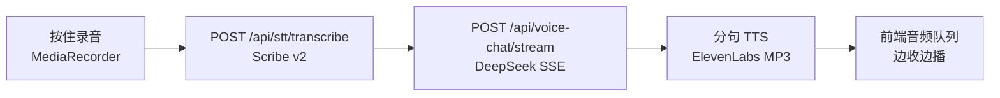

| 端点 | 说明 |
|------|------|
| `POST /api/stt/transcribe` | multipart 上传录音，ElevenLabs Scribe v2 转写 |
| `POST /api/voice-chat/stream` | SSE 流式对话 + 分句 TTS，Body：`{ "message", "voiceId?", "autoSpeak?" }` |
| `POST /api/tts/speak` | 文本转 MP3（文章 curl 场景） |
| `GET /api/voices` | 所有可用语音（及 `/settings/default`、`/{voiceId}`、`/{voiceId}/settings`） |

**SSE 事件**：`RUNNING` / `USER_TEXT` / `TOKEN` / `AUDIO_CHUNK` / `COMPLETED` / `FAILED`

**核心类**：

| 类 | 职责 |
|----|------|
| `VoiceApiController` | TTS / Voices / STT / 语音对话 SSE |
| `ElevenLabsTranscriptionService` | RestClient 调 Scribe v2（非 Spring AI Starter） |
| `VoiceChatService` | ChatClient 流式 + `SentenceBuffer` 分句 TTS |
| `ElevenLabsHttpClientConfig` | RestClient 改用 JDK HTTP，读超时 120s（避免 Netty 超时） |

**配置要点**：

```properties
spring.ai.model.audio.speech=elevenlabs
spring.ai.elevenlabs.api-key=${ELEVENLABS_API_KEY:}
spring.ai.elevenlabs.tts.voice-id=CwhRBWXzGAHq8TQ4Fs17
agent.voice-chat.stt.model-id=scribe_v2
agent.voice-chat.stt.language-code=zh
```

**环境变量**：

| 变量 | 说明 |
|------|------|
| `ELEVENLABS_API_KEY` | ElevenLabs TTS + STT 共用（[获取 API Key](https://elevenlabs.io/app/developers/api-keys)） |

**与「💬 AI 聊天」Tab 的关系**：完全独立——无 ChatMemory，单次问答；语音 Tab 含录音、音色选择与自动朗读。

**前端 Tab**：**🎙️ 语音对话（ElevenLabs）**（按住 🎤 说话 / 文字输入 / 音色下拉 / 自动朗读开关）。推荐验证：录音中文 → 识别 → 流式 Markdown → 边播；切换音色；关闭自动朗读。

Spec: `docs/superpowers/specs/2026-07-07-elevenlabs-voice-chat-design.md` · Plan: `docs/superpowers/plans/2026-07-07-elevenlabs-voice-chat.md` · **归档**: `docs/superpowers/archive/2026-07-08-elevenlabs-voice-chat.md`

### 10.3 Embabel 自动选路 + Quizzard（`/embabel/agent`）

落地 [Embabel](https://github.com/embabel/embabel-agent) **Closed 模式**：同一入口由 `Autonomy.chooseAndRunAgent` 在多个 `@Agent` 间选路，再在选中 Agent 内跑 `@Action` 链。当前三个业务 Agent：

| Agent | 能力 | 最终输出 |
|-------|------|----------|
| `StarNewsAgent` | 人物 + 星座运势文案 | `Writeup` |
| `PolicyAgent` | 差旅 / 请假等制度问答 | `PolicyAnswer` |
| **`QuizAgent`（Quizzard）** | 技术文章 URL / 粘贴正文 → 单选测验题 | **`QuizPack`** |

**三层架构**：**展示层**（Embabel Tab / curl）→ **编排层**（`Autonomy` 选路 + `EmbabelAgentService` 校验）→ **能力层**（三 Agent Action 链 + jsoup）。详细流程见 [§22–24 功能设计图](#22-embabel-自动选路--closed-模式三-agent)。

**Quizzard Action 链**（参考微信：[Embabel实战Quizzard](https://mp.weixin.qq.com/s/gHG78rBVANCM8Xk6Xn55_w)）：

```text
UserInput → ArticleInput（jsoup / 粘贴，不调 LLM）
         → ConceptDigest（抽知识点）
         → QuizDraft（候选题）
         → QuizPack（审核收口，@AchievesGoal）
```

| 端点 | 说明 |
|------|------|
| `POST /embabel/agent/ask/stream` | SSE 主入口：选路进度 + Action 事件 + 最终 RESULT |
| `POST /embabel/agent/ask` | 同步调试（curl / Scalar） |

请求体：`{ "message": "..." }`。响应：`{ processId, agentName, outputType, output }`。

**SSE 事件**：`PROGRESS` / `ACTION_START` / `ACTION_COMPLETE` / `AGENT_SELECTED` / `RESULT` / `ERROR`（不推送知识点 / 草稿中间对象）

**核心类**：

| 类 | 职责 |
|----|------|
| `EmbabelAgentController` | REST + SSE |
| `EmbabelAgentService` | `Autonomy` 选路 + `validateOutput`（含 QuizPack 工程校验） |
| `QuizAgent` | 四段 Action + records |
| `ArticleFetchService` | URL 抽取、jsoup 抓正文、本地 Markdown、12k 截断 |
| `QuizAgentProperties` | `demo.quiz-agent.prompts.*` |
| `StarNewsAgent` / `PolicyAgent` | 星座 / 制度（既有） |
| `EmbabelSseBridge` | Embabel 事件 → SseEmitter |

**配置要点**：

```properties
embabel.models.default-llm=deepseek-v4-pro
embabel.agent.platform.models.openai.custom.api-key=${DEEPSEEK_API_KEY:}
embabel.agent.platform.models.openai.custom.base-url=https://api.deepseek.com
spring.config.import=optional:classpath:application-embabel-prompts.yml
```

中文 Prompt 在 `application-embabel-prompts.yml`（`demo.star-news-agent` / `demo.policy-agent` / `demo.quiz-agent`），避免 `.properties` Latin-1 乱码。

**QuizPack 校验**（返回前）：恰好 3 道题；每题 4 个不重复选项；`answer` 与某一 option **全文一致**；`explanation` / `review` 为完整句子。失败 → HTTP 502。抓取失败 / 正文过短同样 502。

**前端 Tab**：**🔀 Embabel 自动选路**（三样例按钮 + textarea + QuizPack 卡片渲染）。推荐验证：测试1 星座 → `StarNewsAgent`；测试2 差旅 → `PolicyAgent`；测试3 粘贴出题 → `QuizAgent` + 结构化题目。

Spec: `docs/superpowers/specs/2026-07-15-embabel-quizzard-design.md` · Plan: `docs/superpowers/plans/2026-07-15-embabel-quizzard.md` · **归档**: `docs/superpowers/archive/2026-07-16-embabel-quizzard.md`  
选路前置: `docs/superpowers/specs/2026-07-13-embabel-agent-routing-design.md`

### 11. AskUserQuestion 技术选型（`/agent/ask-user`）

演示 [spring-ai-agent-utils](https://github.com/spring-ai-community/spring-ai-agent-utils) 的 `AskUserQuestionTool`：当用户需求模糊时，Agent **主动提出澄清问题**（单选 / 多选 / 自定义文本），收集答案后继续执行并给出技术选型建议。

**通信模式**：SSE 下行推送 + HTTP POST 上行提交答案（与 `ChatController` 的 `SseEmitter` 模式一致）。

| 端点 | 说明 |
|------|------|
| `POST /agent/ask-user/chat` | 发起对话，Body：`{"message":"帮我选一个数据库"}`，返回 `sessionId` |
| `GET /agent/ask-user/sse/{sessionId}` | SSE 事件流，推送 `RUNNING` / `QUESTIONS` / `COMPLETED` / `FAILED` |
| `POST /agent/ask-user/answer` | 提交澄清答案，Body：`{"sessionId":"...","answers":{"问题文本":"答案"}}` |

**典型流程**：

1. 前端 `POST /chat` 获取 `sessionId`，并 `EventSource` 连接 `/sse/{sessionId}`
2. Agent 调用 `AskUserQuestionTool` → `WebQuestionHandler` 推送 `QUESTIONS` 并阻塞等待
3. 用户在前端选择选项或输入自定义答案 → `POST /answer`
4. Agent 继续执行 → SSE 推送 `COMPLETED` 含最终选型建议

**SSE 事件示例**（`data` 字段为 JSON）：

```json
{"type":"RUNNING"}
{"type":"QUESTIONS","questions":[{"header":"数据库类型","question":"你更倾向哪种数据库？","options":[{"label":"PostgreSQL","description":"开源关系型"}],"multiSelect":false}]}
{"type":"COMPLETED","response":"推荐使用 PostgreSQL，因为..."}
{"type":"FAILED","error":"Agent 执行失败: ..."}
```

**核心类**：

| 类 | 职责 |
|----|------|
| `AskUserAgentController` | REST + SSE 三端点 |
| `AskUserAgentService` | 继承 `AbstractSseAgentService`，Agent 编排 |
| `WebQuestionHandler` | 实现 `QuestionHandler`，推送问题并 `CompletableFuture` 阻塞等待 |
| `AgentSseSessionStore` | 通用内存 Session、SSE 事件缓冲与 flush（AskUser / TodoWrite 共用） |

**前端入口**：`http://localhost:8081` → Tab「❓ AskUserQuestion 技术选型」

**设计文档**：`docs/superpowers/specs/2026-06-27-ask-user-question-tool-design.md`

### 12. TodoWrite 学习计划（`/agent/todo`）

演示 [spring-ai-agent-utils](https://github.com/spring-ai-community/spring-ai-agent-utils) 的 **TodoWriteTool**：Agent 面对多步骤任务时主动拆解 Todo 列表，前端通过 SSE 实时展示任务看板。

**通信模式**：SSE 下行推送 + HTTP POST 发起对话（与 AskUser 共用 `sse` 包基础设施）。

| 端点 | 说明 |
|------|------|
| `POST /agent/todo/chat` | 发起对话，Body：`{"message":"帮我制定 7 天 Spring AI 2.0 学习计划"}`，返回 `sessionId` |
| `GET /agent/todo/sse/{sessionId}` | SSE 事件流，推送 `RUNNING` / `TODOS` / `COMPLETED` / `FAILED` |

**SSE 事件示例**：

```json
{"type":"RUNNING"}
{"type":"TODOS","todos":[{"content":"调研核心概念","status":"in_progress","activeForm":"调研核心概念"}],"progress":{"completed":0,"total":3,"percent":0}}
{"type":"COMPLETED","response":"7 天学习计划..."}
```

**核心类**：

| 类 | 职责 |
|----|------|
| `TodoAgentController` | REST + SSE 双端点 |
| `TodoAgentService` | 继承 `AbstractSseAgentService`，学习计划 Agent |
| `TodoAgentConfig` | `TodoWriteTool` Bean + `todoEventHandler` 桥接 SSE |
| `AbstractSseAgentService` | 通用 `startChat` / `connectSse` / `runWithSession` |
| `AgentSseSessionStore` | 通用 Session 存储（与 AskUser 共用） |

**前端入口**：`http://localhost:8081` → Tab「📋 TodoWrite 学习计划」

**设计文档**：`docs/superpowers/specs/2026-06-29-todo-write-tool-design.md`

### 13. Agent Skills（`/agent/skills`）

演示 [spring-ai-agent-utils](https://github.com/spring-ai-community/spring-ai-agent-utils) 的 **SkillsTool**（源自官方 `skills-demo`）：Agent 根据用户请求**语义匹配**相关 `SKILL.md`，再借助文件/搜索/Shell 工具按 skill 指令执行任务。

**实现类**：`SkillsAgentController` → `SkillsAgentService` → `ChatClient` + 工具链（配置见 `SkillsAgentConfig`）。

**注册工具**（`SkillsAgentService` → `ChatClient.defaultTools`）：

| 工具 | 作用 |
|------|------|
| `SkillsTool` | 扫描 skills 目录，语义匹配并加载 `SKILL.md` |
| `FileSystemTools` | 读写本地文件 |
| `GlobTool` | 按 glob 模式查找文件 |
| `GrepTool` | 在文件中搜索内容 |
| `ShellTools` | 执行 Shell 命令（如 Python 脚本） |

| 端点 | 说明 |
|------|------|
| `GET /agent/skills/chat?message=xxx` | 自由对话，Agent 自动匹配并调用 skill |
| `GET /agent/skills/demo` | 官方示例：强化学习 + `ai-tutor` skill + YouTube 字幕脚本 |
| `GET /agent/skills/demo-pdf` | 官方示例：PDF 合并 + `pdf` skill |

**响应格式**（三个端点统一）：

```json
{
  "message": "用户输入或示例说明",
  "response": "Agent 最终回复",
  "agentType": "Agent Skills（SkillsTool + Glob/Grep/FileSystem/Shell）"
}
```

**典型流程**：

1. 请求进入 `SkillsAgentController`（`/chat`、`/demo`、`/demo-pdf`）
2. `SkillsTool` 对 `agent.skills.dirs` 下的 `SKILL.md` 做语义匹配
3. 命中 skill 后，Agent 调用 `Glob` / `Grep` / `FileSystem` / `Shell` 读取脚本与参考文档
4. 结合 DeepSeek 生成最终回答

**Skills 扫描路径**（`application.properties`）：

```properties
agent.skills.dirs=file:C:/Users/<you>/.cursor/skills,classpath:/.claude/skills
logging.level.org.springaicommunity.agent.tools.SkillsTool=DEBUG
```

**内置示例 skills**（`src/main/resources/.claude/skills/`）：

| Skill | 说明 |
|-------|------|
| `ai-tutor` | 技术概念讲解；含 `scripts/get_youtube_transcript.py` 抓取 YouTube 字幕 |
| `pdf` | PDF 处理（合并、表单等）；含 `reference.md`、`forms.md` 与 Python 脚本 |

**核心类**：

| 类 | 职责 |
|----|------|
| `SkillsAgentController` | 暴露 `/chat`、`/demo`、`/demo-pdf` 三个 GET 端点 |
| `SkillsAgentService` | 组装 `ChatClient` + 五类工具，封装 chat 与教程 prompt |
| `SkillsAgentConfig` | 注册 `SkillsTool` Bean 及 `Shell/FileSystem/Glob/Grep` 工具 Bean |

**调用示例**：

```bash
curl "http://localhost:8081/agent/skills/chat?message=帮我按代码规范检查%20ChatController.java"
curl http://localhost:8081/agent/skills/demo
curl http://localhost:8081/agent/skills/demo-pdf
```

**调试入口**：Swagger `http://localhost:8081/scalar` → 标签 **Agent Skills**

> **前端说明**：`index.html` 暂未提供 Skills Tab，请通过 Swagger 或 curl 调用上述三个端点。

> `demo` / `demo-pdf` 会触发多轮工具调用（读文件、执行脚本），请确保 `agent.skills.dirs` 路径正确，且本机 Python/uv 可用。

### 13. 多 Agent 协作（`/agent/multi`）

Supervisor-Worker 模式（`MultiAgentController` → `MultiAgentService`），共 **5 次** DeepSeek 调用：

1. `SupervisorAgent.decompose()` — 分解需求，提炼关键要素
2. **并行**（`CompletableFuture`）：
   - `ItineraryAgent` — 逐日行程规划
   - `WeatherAgent` — 天气与穿搭（携带 `TimeMethodTool` 查询时区/季节）
   - `BudgetAgent` — 预算分配
3. `SupervisorAgent.synthesize()` — 综合三路输出为完整行程

| 端点 | 说明 |
|------|------|
| `GET /agent/multi/plan?demand=xxx` | 多 Agent 协作行程规划 |

**响应字段**：`userDemand`、`taskBrief`、`weatherAnalysis`、`itineraryPlan`、`budgetPlan`、`finalPlan`、`totalCostMs`、`agentType`

```bash
curl "http://localhost:8081/agent/multi/plan?demand=五一假期4天云南大理丽江游，2人，预算8000"
```

### 14. Subagent Orchestration（`/agent/subagent`）

演示 [spring-ai-agent-utils](https://github.com/spring-ai-community/spring-ai-agent-utils) 的 **TaskTool** 子代理编排（Spring AI 2.0 系列教程第五篇）：主协调器通过 Task 工具将任务委派给 **architect**（深度分析 → 结构化 Blueprint）与 **builder**（根据 Blueprint 生成最终文稿），各子代理在**独立上下文窗口**中运行，仅将关键结果返回主代理。

与 `MultiAgentService`（Java 写死调度）的区别：由主代理 LLM **自主判断**何时委派、委派给谁。

| 端点 | 说明 |
|------|------|
| `GET /agent/subagent/chat?message=xxx` | Subagent 编排对话（同步，约 30～90 秒） |

**响应格式**：

```json
{
  "message": "分析 Spring AI RAG 架构并写一份入门指南",
  "response": "（主协调器整合后的 Markdown 报告）",
  "agentType": "Subagent Orchestration · Architect-Builder · TaskTool"
}
```

**子代理定义**（`src/main/resources/agents/`）：

| 文件 | 角色 |
|------|------|
| `architect.md` | 战略推理：产出 Blueprint，不写最终润色稿 |
| `builder.md` | 执行生成：仅根据 Blueprint 写中文报告 |

**核心类**：

| 类 | 职责 |
|----|------|
| `SubagentAgentConfig` | `TaskTool` + `ClaudeSubagentType` + `subagentOrchestratorClient` |
| `SubagentAgentService` | 同步调用协调器 ChatClient |
| `SubagentAgentController` | `GET /chat` |

**配置**（`application.properties`）：

```properties
agent.tasks.paths=classpath:/agents/architect.md,classpath:/agents/builder.md
```

**调用示例**：

```bash
curl "http://localhost:8081/agent/subagent/chat?message=分析%20Spring%20AI%20RAG%20架构并写一份入门指南"
```

**前端入口**：`http://localhost:8081` → Tab「🔗 Subagent 编排」

**设计文档**：`docs/superpowers/specs/2026-06-29-subagent-a2a-design.md` · 实现计划：`docs/superpowers/plans/2026-06-29-subagent-a2a.md`

### 15. A2A 跨系统对话（`/agent/a2a`）

演示 **Agent2Agent（A2A）协议**（系列教程第六篇）：协调器通过 `TaskTool` + `spring-ai-agent-utils-a2a` 调用远程天气专家 Agent。远程 Agent 以 **A2A Server** 形式**内嵌于同一应用**（`spring-ai-a2a-server-autoconfigure`），无需额外进程即可体验跨协议委派。

| 组件 | 说明 |
|------|------|
| `A2aWeatherAgentConfig` | 暴露 `AgentCard` + `DefaultAgentExecutor`（`WeatherTool`） |
| `A2aOrchestratorConfig` | `A2ASubagentResolver` / `A2ASubagentExecutor` + 协调器 ChatClient |
| `/.well-known/agent-card.json` | A2A Agent 发现端点 |

| 端点 | 说明 |
|------|------|
| `GET /agent/a2a/chat?message=xxx` | A2A 协调器对话（同步） |
| `GET /.well-known/agent-card.json` | 天气专家 Agent 元数据（供 A2A 客户端发现） |

**响应格式**：

```json
{
  "message": "查北京和上海的天气，并给出周末出行建议",
  "response": "（协调器整合远程天气 Agent 结果）",
  "agentType": "A2A Orchestration · TaskTool + Weather Agent (embedded)"
}
```

**配置**：

```properties
spring.ai.a2a.server.enabled=true
agent.a2a.remote.url=http://localhost:${server.port:8081}
```

**调用示例**：

```bash
# 验证 AgentCard
curl http://localhost:8081/.well-known/agent-card.json

# A2A 协调对话
curl "http://localhost:8081/agent/a2a/chat?message=查北京和上海的天气，并给出周末出行建议"
```

**前端入口**：`http://localhost:8081` → Tab「🌐 A2A 跨系统对话」

> **说明**：逻辑上为「跨系统」A2A 调用；物理上与主应用同进程、同端口（8081），便于本地 Demo。生产环境可将天气 Agent 部署为独立服务并修改 `agent.a2a.remote.url`。

### 16. 可观测性（Micrometer + OpenTelemetry）

Spring Boot 4 内置 **Micrometer** 指标与 **OpenTelemetry** 分布式链路；Spring AI 2.0 自动采集 `gen_ai.*` 指标（模型调用耗时、Token 用量等）。默认通过 Actuator 本地查看，可选 OTLP 导出至 Grafana。

详见独立章节：[可观测性](#可观测性)。

---

## 快速开始

### 前置条件

| 依赖 | 说明 |
|------|------|
| JDK 21+ | 必须 |
| Maven 3.9+ | 必须（或使用项目内的 `mvnw`） |
| MySQL 8.x | Agent 持久化记忆功能必须 |
| Milvus 2.x | RAG 优化版 + 电商客服必须 |
| DeepSeek API Key | 聊天功能必须 |
| 智谱 AI API Key | Embedding + RAG 功能必须 |
| `LKCOFFEE_TOKEN` | 瑞幸 MCP 点单（可选，仅 ☕ Tab 需要） |
| `AMAP_API_KEY` | 高德地理编码（可选，瑞幸 Tab 地址解析需要） |

### 1. 启动 Milvus（Docker）

```bash
cd docker/milvus
docker compose up -d
```

Milvus 相关端口：`19530`（gRPC）、`9000`/`9001`（MinIO）

### 2. 初始化 MySQL 数据库

```sql
CREATE DATABASE spring_ai_agent2 CHARACTER SET utf8mb4;
```

> Spring AI JDBC ChatMemory 会在首次启动时自动建表（`initialize-schema=never` 时需手动执行 DDL），如遇建表失败可改为 `always`。

### 3. 配置 API Key

编辑 `src/main/resources/application.properties`，填写你的 API Key：

```properties
spring.ai.deepseek.api-key=<你的 DeepSeek API Key>
spring.ai.openai.api-key=<你的 智谱 AI API Key>
```

> Spring AI 2.0 已移除 `zhipuai` 模块，智谱 Embedding 通过 OpenAI 兼容接口接入（`spring.ai.openai.base-url` 指向智谱 API）。

### 4. 启动应用

#### 方法一：使用 Maven Wrapper 启动（推荐）
```bash
./mvnw spring-boot:run          # Mac/Linux
mvnw.cmd spring-boot:run        # Windows
```

#### 方法二：打包后用 Java 启动
```bash
./mvnw clean package
java -jar target/demo2-*.jar
```

#### 方法三：直接用本地 Maven 启动
```bash
mvn spring-boot:run
```

应用启动后访问：

| 地址 | 说明 |
|------|------|
| `http://localhost:8081` | 前端演示界面（多 Tab） |
| `http://localhost:8081/scalar` | Scalar API 文档 |
| `http://localhost:8081/v3/api-docs` | OpenAPI JSON |
| `http://localhost:8081/actuator/health` | 健康检查 |
| `http://localhost:8081/actuator/metrics` | Micrometer 指标 |
| `http://localhost:8081/actuator/prometheus` | Prometheus 格式指标 |
| `http://localhost:8081/.well-known/agent-card.json` | A2A 天气专家 AgentCard（Subagent/A2A Demo） |

**前端 Tab 一览**（`http://localhost:8081`）：

| Tab | 对应能力 |
|-----|----------|
| 💬 AI 聊天 | 同步/流式 DeepSeek 对话 |
| 🤝 多 Agent 协作 | Supervisor-Worker 行程规划 |
| ❓ AskUserQuestion | SSE 人机澄清选型 |
| 📋 TodoWrite | SSE 学习计划 + Todo 看板 |
| 🔗 Subagent 编排 | TaskTool · architect / builder |
| 🌐 A2A 跨系统对话 | TaskTool + A2A 天气专家 |
| 🗂️ Session 事件溯源记忆 | Event Store + SSE 多轮对话 + 事件侧栏 |
| ☕ 瑞幸 MCP 点单 | My Coffee Skill + 瑞幸/高德 MCP SSE 点单 |
| 🎙️ 语音对话（ElevenLabs） | 按住录音 STT + 流式对话 + 分句 TTS 边播 |
| 🔀 Embabel 自动选路 | Autonomy 三 Agent（星座 / 制度 / Quizzard 出题） |
| 🔌 MCP Client 聊天 | 本地 MCP Server（天气/景点） |
| 其他 Tab | Embedding、RAG、Agent 记忆、工具推理捕获、Skills 等 |

> Subagent / A2A 仅需 **DeepSeek API Key**；单次请求约 30～90 秒，请耐心等待。

---

## 前端说明

演示界面位于 `src/main/resources/static/`，由 Spring Boot 静态资源托管，`IndexController` 将 `GET /` 转发至 `index.html`。采用**零构建**方案：不引入 npm/Vite，改完代码后 `mvn spring-boot:run` 即可验证。

### 目录布局

```
static/
├── index.html              # 骨架：Tab 导航 + 19 个功能面板 HTML
├── css/
│   ├── components.css      # 全局布局、Tab 导航、card/btn/form 等公共组件
│   └── tabs/               # 各 Tab 专属样式（部分 Tab 共用同一文件）
│       ├── chat.css
│       ├── embedding.css
│       ├── rag.css         # RAG 基础版 + RAG 优化版
│       ├── ecommerce.css
│       ├── agent.css
│       ├── agent-memory.css
│       ├── agent-mysql-memory.css
│       ├── agent-auto-memory.css
│       ├── agent-session-memory.css
│       ├── agent-tools.css # Agent Tools / AskUser / TodoWrite / Subagent / A2A
│       ├── tool-reasoning.css
│       ├── mcp.css
│       ├── lkcoffee.css    # 瑞幸 MCP 点单
│       ├── voice-chat.css  # ElevenLabs 语音对话
│       ├── embabel.css     # Embabel 自动选路 / QuizPack
│       └── multi-agent.css
└── js/
    ├── core/
    │   ├── tabs.js         # switchTab()
    │   ├── utils.js        # escapeHtml()
    │   └── markdown.js     # Markdown 流式渲染（瑞幸 Tab 等）
    └── tabs/               # 各 Tab 业务逻辑（全局 function，兼容 onclick）
        ├── chat.js
        ├── embedding.js
        ├── rag.js          # 含 rag + rag-opt
        ├── ecommerce.js
        ├── agent.js
        ├── agent-memory.js # 含内存记忆 + MySQL 记忆
        ├── agent-auto-memory.js
        ├── agent-session-memory.js
        ├── agent-tools.js
        ├── tool-reasoning.js
        ├── mcp.js
        ├── lkcoffee.js     # 瑞幸 MCP 点单 SSE 对话
        ├── voice-chat.js   # ElevenLabs 录音 / STT / SSE / 音频队列
        ├── embabel.js      # Embabel SSE 选路 + QuizPack 渲染
        ├── multi-agent.js
        ├── ask-user.js
        ├── todo-write.js
        ├── subagent.js
        └── a2a.js
```

### 约定

| 项 | 说明 |
|----|------|
| HTML | 面板结构保留在 `index.html`，不拆 HTML 片段 |
| JS 作用域 | 顶层 `function` + `onclick`，不用 ES Module |
| 脚本顺序 | `utils.js` → `tabs.js` → 各 `tabs/*.js` |
| 新增 Tab | 同步增加 `css/tabs/*.css`、`js/tabs/*.js`，并在 `index.html` 中注册 `<link>` / `<script>` |

### 冒烟测试

应用启动后，可在项目根目录执行（PowerShell）：

```powershell
.\demo2\scripts\smoke-test-frontend.ps1
```

脚本会检查首页、全部 CSS/JS 静态资源是否返回 200，并校验 `onclick` 引用的函数是否在 JS 中定义。

设计文档：`docs/superpowers/specs/2026-06-30-index-html-refactor-design.md`

---

## 配置说明

### 核心配置项（application.properties）

```properties
# ===== AI 模型（Spring AI 2.0 扁平化配置，不再使用 .options. 前缀）=====
spring.ai.model.chat=deepseek
spring.ai.model.embedding.text=openai
spring.ai.deepseek.api-key=xxx            # DeepSeek API Key
spring.ai.deepseek.chat.model=deepseek-v4-pro
spring.ai.openai.api-key=xxx              # 智谱 AI API Key（Embedding）
spring.ai.openai.base-url=https://open.bigmodel.cn/api/paas/v4
spring.ai.openai.embedding.model=embedding-2

# ===== MySQL =====
spring.datasource.url=jdbc:mysql://127.0.0.1:3306/spring_ai_agent2
spring.datasource.username=root
spring.datasource.password=123456

# ===== Session API JDBC（AI_SESSION / AI_SESSION_EVENT，与 chat_memory 表独立）=====
spring.ai.session.repository.jdbc.initialize-schema=never   # 表已存在用 never；全新库首次可改 always 执行一次后改回
spring.ai.session.repository.jdbc.platform=mysql   # 0.2.0 jar 无 mariadb schema；ChatMemory 仍可用 mariadb
agent.session-memory.compaction.turn-threshold=15
agent.session-memory.compaction.max-events-to-keep=10
agent.session-memory.compaction.overlap-size=2
agent.session-memory.chat.model=deepseek-v4-pro

# ===== AgentScope Compaction（与上面 Session Memory 压缩无关）=====
# Demo 默认偏低便于四轮触发；正式环境请上调，勿贴模型上限
app.agentscope.dev-agent.compaction.trigger-messages=6
app.agentscope.dev-agent.compaction.keep-messages=2
# summary-prompt 见 application-agentscope-prompts.yml

# ===== Milvus =====
spring.ai.vectorstore.milvus.client.host=localhost
spring.ai.vectorstore.milvus.client.port=19530
spring.ai.vectorstore.milvus.collection-name=travel_safety_embedding2

# ===== RAG 参数 =====
rag.top-k=2                               # 基础版检索 Top-K
rag.optimized.top-k=5                     # 优化版检索 Top-K
rag.optimized.similarity-threshold=0.05  # 相似度过滤阈值
rag.optimized.reindex-on-startup=false   # 启动时是否重建索引

# ===== 电商客服 =====
ecommerce.reindex-on-startup=false        # 启动时是否重建知识库索引

# ===== MCP =====
spring.ai.mcp.server.protocol=STREAMABLE
spring.ai.mcp.client.streamable-http.connections.local-server.url=http://localhost:8081
spring.ai.mcp.client.streamable-http.connections.local-server.endpoint=/mcp

# ===== 瑞幸 MCP 点单 =====
spring.ai.mcp.client.streamable-http.connections.lkcoffee.url=https://gwmcp.lkcoffee.com
spring.ai.mcp.client.streamable-http.connections.lkcoffee.endpoint=/order/user/mcp
lkcoffee.token=${LKCOFFEE_TOKEN:}
spring.ai.mcp.client.streamable-http.connections.amap.url=https://mcp.amap.com
spring.ai.mcp.client.streamable-http.connections.amap.endpoint=/mcp?key=${AMAP_API_KEY:}
agent.lkcoffee.chat.model=deepseek-v4-pro
agent.lkcoffee.skill=classpath:/.claude/skills/my-coffee/SKILL.md
agent.lkcoffee.enabled=true   # 测试环境可设为 false

# ===== ElevenLabs 语音对话（TTS + STT 共用 API Key）=====
spring.ai.model.audio.speech=elevenlabs
spring.ai.elevenlabs.api-key=${ELEVENLABS_API_KEY:}
spring.ai.elevenlabs.tts.model-id=eleven_multilingual_v2
spring.ai.elevenlabs.tts.output-format=mp3_44100_128
spring.ai.elevenlabs.tts.voice-id=CwhRBWXzGAHq8TQ4Fs17
agent.voice-chat.stt.model-id=scribe_v2
agent.voice-chat.stt.language-code=zh
agent.voice-chat.tts.sentence-max-chars=40

# ===== Embabel 自动选路（Prompt 见 application-embabel-prompts.yml）=====
embabel.models.default-llm=deepseek-v4-pro
embabel.agent.platform.models.openai.custom.api-key=${DEEPSEEK_API_KEY:}
embabel.agent.platform.models.openai.custom.base-url=https://api.deepseek.com
embabel.agent.platform.models.openai.custom.models=deepseek-v4-pro
spring.config.import=optional:classpath:application-embabel-prompts.yml

# ===== Agent Skills =====
agent.skills.dirs=file:C:/Users/<you>/.cursor/skills,classpath:/.claude/skills
logging.level.org.springaicommunity.agent.tools.SkillsTool=DEBUG

# ===== Subagent / A2A =====
agent.tasks.paths=classpath:/agents/architect.md,classpath:/agents/builder.md
spring.ai.a2a.server.enabled=true
agent.a2a.remote.url=http://localhost:${server.port:8081}
```

### 注意事项

- **生产环境**：API Key 和数据库密码应通过环境变量注入，不要硬编码提交到代码仓库
- **Milvus 懒加载**：项目已排除 `MilvusVectorStoreAutoConfiguration` 自动配置，改为 `@Lazy` 手动初始化，Milvus 不可用时不影响其他模块启动
- **首次启动**：若 `reindex-on-startup=true`，会将知识库文件切分后批量写入 Milvus，耗时较长

---

## 可观测性

Spring Boot 4 **内置 Micrometer + OpenTelemetry**，无需额外引入 tracing 框架。本项目已接入：

| 能力 | 技术 | 说明 |
|------|------|------|
| 指标 | Micrometer + Actuator | 暴露 `health` / `metrics` / `prometheus` 端点 |
| 链路追踪 | OpenTelemetry（Micrometer Tracing 桥接） | HTTP 请求、Spring AI 调用自动产生 Span |
| AI 指标 | Spring AI `gen_ai.*` | LLM 调用 token、耗时等（Micrometer 自动采集） |
| 日志关联 | MDC `traceId` / `spanId` | 日志格式已配置，便于与 Grafana Tempo 对照 |
| 响应头 | `X-Trace-Id` | `TraceIdFilter` 写入，便于按请求检索链路 |

### 依赖（pom.xml）

```xml
spring-boot-starter-actuator
spring-boot-starter-opentelemetry
micrometer-registry-prometheus
```

### 本地查看指标（默认模式，无需 Collector）

日常开发默认 **关闭 OTLP 导出**，仅通过 Actuator 本地查看：

```bash
# 指标名称列表
curl http://localhost:8081/actuator/metrics

# Spring AI 相关指标示例
curl http://localhost:8081/actuator/metrics/gen_ai.client.operation.duration
curl "http://localhost:8081/actuator/metrics/gen_ai.client.token.usage?tag=gen_ai.token.type:output"

# Prometheus 抓取格式
curl http://localhost:8081/actuator/prometheus
```

发起任意 API 请求后，响应头可携带 `X-Trace-Id`（`app.trace.response-header.enabled=true`），日志中同步打印 `traceId`：

```
INFO [demo2,661c9b2d8f4e1a2b3c4d5e6f7a8b9c0,9d8e7f6a5b4c3d2e] ...
```

### 全链路可观测（OTLP → Grafana）

需要 Grafana 可视化时，启动本地 LGTM Collector 并开启 OTLP 导出：

**1. 启动 Collector（Grafana LGTM 一体镜像）**

```bash
cd demo2/docker/observability
docker compose up -d
```

| 地址 | 说明 |
|------|------|
| `http://localhost:3000` | Grafana UI（默认 `admin` / `admin`） |
| `localhost:4318` | OTLP HTTP（metrics + traces） |
| `localhost:4317` | OTLP gRPC |

**2. 开启 OTLP 导出（二选一）**

方式 A — 使用 `otel` Profile（推荐）：

```bash
mvnw.cmd spring-boot:run -Dspring-boot.run.profiles=otel
```

方式 B — 修改 `application.properties`：

```properties
management.otlp.metrics.export.enabled=true
management.otlp.metrics.export.url=http://localhost:4318/v1/metrics
management.tracing.export.otlp.enabled=true
management.opentelemetry.tracing.export.otlp.endpoint=http://localhost:4318/v1/traces
```

**3. 在 Grafana 中查看**

- **Metrics**：Explore → 选择 Prometheus 数据源，查询 `gen_ai_client_operation_duration_*` 等
- **Traces**：Explore → 选择 Tempo 数据源，按 `X-Trace-Id` 或 Service Name `demo2` 检索

### 关键配置项

```properties
# Actuator 端点
management.endpoints.web.exposure.include=health,metrics,prometheus

# OTLP 导出（默认关闭，见 application-otel.properties）
management.otlp.metrics.export.enabled=false
management.tracing.export.otlp.enabled=false

# 采样率：开发 1.0，生产建议 0.1
management.tracing.sampling.probability=1.0

# 日志关联 traceId
logging.pattern.level=%5p [${spring.application.name:},%X{traceId:-},%X{spanId:-}]

# 响应头返回 traceId
app.trace.response-header.enabled=true
```

### 架构示意

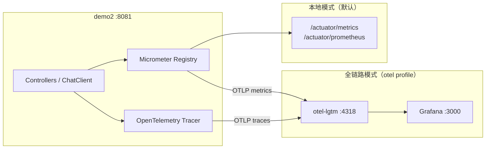

> **注意**：未启动 Collector 却开启 OTLP 导出时，控制台会周期性报 `ConnectException: localhost:4318`。日常开发保持 `enabled=false` 或使用 `otel` Profile 时先启动 Collector。

---

## API 接口文档

详细接口请访问 `http://localhost:8081/scalar`，以下为接口速查表：

### 聊天、Embedding 与结构化输出

| Method | Path | 说明 |
|--------|------|------|
| POST | `/ai/chat` | 同步聊天，Body：`{"message":"..."}` |
| POST | `/ai/chatStream` | SSE 流式聊天，Body：`{"message":"..."}` |
| GET | `/ai/embedding` | 文本向量化，参数：`message` |
| GET | `/ai/similarity` | 相似度查询，参数：`query`、可选 `algorithm`（COSINE/EUCLIDEAN/MANHATTAN） |
| GET | `/ai/structured/analyze` | 产品分析，参数：`productName`，返回 `ProductAnalysis` |
| GET | `/ai/structured/tech-stacks` | 技术栈推荐，参数：`scenario`，返回 `List<TechStack>` |

### RAG

| Method | Path | 说明 |
|--------|------|------|
| GET | `/rag/ask` | 基础版 RAG（内存向量），参数：`question` |
| GET | `/rag/optimized/ask` | 优化版 RAG（Milvus），参数：`question` |
| GET | `/ecommerce/service/chat/precise` | 电商客服-精准检索，参数：`question` |
| GET | `/ecommerce/service/chat/enhanced` | 电商客服-增强检索，参数：`question` |

### Agent

| Method | Path | 说明 |
|--------|------|------|
| GET | `/agent/trip/plan` | 无记忆行程规划，参数：`demand` |
| GET | `/agent/trip/plan-with-memory` | 内存记忆规划，参数：`userId`, `demand` |
| DELETE | `/agent/trip/clear-memory` | 清除内存记忆，参数：`userId` |
| GET | `/agent/mysql/trip/plan` | DB 记忆规划，参数：`userId`, `demand`，可选 `memoryType`（message/prompt） |
| GET | `/agent/mysql/trip/clear-memory` | 清除 DB 记忆，参数：`userId` |
| GET | `/agent/mysql/trip/list-conversations` | 列出所有会话 |
| POST | `/agent/auto-memory/chat` | AutoMemory 多轮对话，Body：`{"userId","message"}` |
| GET | `/agent/auto-memory/memories` | 列出长期记忆 `.md` 文件，参数：`userId` |
| DELETE | `/agent/auto-memory/clear-memory` | 清除短期 + 长期记忆，参数：`userId` |
| POST | `/agent/session-memory/chat/stream` | Session 记忆 SSE 流式对话，Body：`{"userId","message"}` |
| GET | `/agent/session-memory/events` | Session 事件统计与预览，参数：`userId` |
| DELETE | `/agent/session-memory/clear` | 清除 Session 及 events，参数：`userId` |
| GET | `/agent/tool/plan` | 工具调用规划，参数：`demand` |
| POST | `/agent/ask-user/chat` | AskUserQuestion 发起对话，Body：`{"message":"..."}` |
| GET | `/agent/ask-user/sse/{sessionId}` | AskUserQuestion SSE 事件流 |
| POST | `/agent/ask-user/answer` | 提交澄清答案，Body：`{"sessionId":"...","answers":{...}}` |
| POST | `/agent/todo/chat` | TodoWrite 发起对话，Body：`{"message":"..."}` |
| GET | `/agent/todo/sse/{sessionId}` | TodoWrite SSE 事件流 |
| GET | `/agent/skills/chat` | Skills Agent 聊天，参数：`message`；返回 `{message, response, agentType}` |
| GET | `/agent/skills/demo` | Skills 官方示例（强化学习 + ai-tutor + YouTube 字幕） |
| GET | `/agent/skills/demo-pdf` | Skills 官方示例（PDF 合并 + pdf skill） |
| GET | `/agent/subagent/chat` | Subagent 编排，参数：`message` |
| GET | `/agent/a2a/chat` | A2A 协调器对话，参数：`message` |
| GET | `/.well-known/agent-card.json` | A2A 天气专家 AgentCard（发现端点） |
| GET | `/agent/multi/plan` | 多 Agent 协作规划，参数：`demand` |
| POST | `/agent/lkcoffee/chat/stream` | 瑞幸 MCP SSE 流式点单，Body：`{"sessionId","message","longitude?","latitude?","address?"}` |
| DELETE | `/agent/lkcoffee/clear` | 清除瑞幸点单会话记忆，参数：`sessionId` |
| GET | `/agent/lkcoffee/tools` | 瑞幸 Tab 可用 MCP 工具列表 |
| GET | `/agent/lkcoffee/geocode` | 地址转经纬度，参数：`address`，可选 `city` |

### ElevenLabs 语音（`/api`）

| Method | Path | 说明 |
|--------|------|------|
| POST | `/api/stt/transcribe` | 上传录音转文字（multipart，`file` + 可选 `languageCode`） |
| POST | `/api/voice-chat/stream` | 语音对话 SSE，Body：`{"message","voiceId?","autoSpeak?"}` |
| POST | `/api/tts/speak` | 文本转 MP3，Body：`TextToSpeechRequest` |
| GET | `/api/voices` | 列出所有 ElevenLabs 语音 |
| GET | `/api/voices/settings/default` | 默认语音设置 |
| GET | `/api/voices/{voiceId}` | 语音详情 |
| GET | `/api/voices/{voiceId}/settings` | 语音推荐参数 |

### Embabel 自动选路（`/embabel/agent`）

| Method | Path | 说明 |
|--------|------|------|
| POST | `/embabel/agent/ask/stream` | SSE：选路 + Action 进度 + RESULT，Body：`{"message":"..."}` |
| POST | `/embabel/agent/ask` | 同步调试，返回 `{processId, agentName, outputType, output}` |

### AgentScope HarnessAgent（`/agentscope/dev-agent`）

HarnessAgent SSE：清单整理 + 项目只读工具 + **`notes/` 写文件 HITL** + **stdio MCP 只读文件工具**。只读 Java 工具：`read_pom` / `list_source_folders` / `find_main_class`（`app.agentscope.dev-agent.project-root`，默认 `.`）。写文件工具 `request_file_change` **仅允许** `{projectRoot}/notes/` 下相对路径；写入前暂停并推送 `REQUIRE_USER_CONFIRM`，用户经 `/confirm` 批准或拒绝后恢复同一会话。**delete/remove** 操作及 **notes/ 以外**路径一律 **DENY**，SSE 推送 `TOOL_RESULT_END`（state=`DENIED`），**不会**出现 `REQUIRE_USER_CONFIRM` 确认卡片。

**Toolkit MCP（与「🔌 MCP Client 聊天 / 瑞幸 MCP」无关）：**

- 配置前缀：`app.agentscope.dev-agent.mcp`；`enabled` 总开关 + `clients[]` 列表（可挂多个 stdio Server）
- 默认 Client：`project-files` → `npx -y @modelcontextprotocol/server-filesystem@2026.7.10`，白名单仅 `list_allowed_directories` / `list_directory` / `read_text_file`
- 资料目录：`demo2/mcp-files/`（`root=mcp-files`，相对 `project-root`）；档案文件 `project-profile.md`
- 依赖本机 **Node.js / npx**；测试环境 `app.agentscope.dev-agent.mcp.enabled=false`（见 `application-test.properties`）
- 走 AgentScope `McpClientBuilder` + Toolkit 注册，**不是** Spring AI MCP Client

| 方法 | 路径 | 说明 |
|------|------|------|
| POST | `/agentscope/dev-agent/ask` | SSE：`SESSION` → **`REQUEST_CONTEXT`** →（`AGENT_START` / `MODEL_CALL_START` / `TOOL_CALL_START` / `TOOL_RESULT_END` / `MESSAGE*` / `AGENT_RESULT` / `AGENT_END` / **`REQUIRE_USER_CONFIRM`** / **`REQUEST_STOP`**）→（可选 **`COMPACTION`**）→ `DONE`（失败为 `ERROR`）。Body：`{"userId?":"...","sessionId":"...","message":"..."}` |
| POST | `/agentscope/dev-agent/confirm` | 批准或拒绝待确认写文件。Body：`{"userId?":"...","sessionId":"...","approved":true\|false}`。返回 SSE 续流（批准后执行 `request_file_change`） |

同 `userId` + `sessionId` 追问可跨重启恢复（PostgreSQL）；换 `sessionId` 应不串话，不同 `userId` 相同 `sessionId` 也不串话。`userId` 为空时内部使用占位 `_anonymous`（ask 与 confirm 须一致）。HITL 待确认工具从 `AgentStateStore` 读取 `ASKING` 状态，不再依赖进程内 Map。

**Workspace（`AGENTS.md`）：**

- 配置：`app.agentscope.dev-agent.workspace-root`（默认 `workspace`）
- 目录：`demo2/workspace/AGENTS.md`（项目规则）；`MEMORY.md` / `knowledge/KNOWLEDGE.md` 本版为空骨架
- `project-root` 供只读项目工具读源码；`workspace-root` 供 Agent 工作区规则注入
- 启用 Workspace Context **不会**放开内置文件 / Shell 工具
- 修改 `AGENTS.md` 后下一轮推理生效，无需重启

**会话持久化（PostgreSQL，独立于 MySQL）：**

```bash
docker compose -f demo2/docker/agentscope-postgres/docker-compose.yml up -d
```

配置见 `app.agentscope.datasource.*`。PG 可用时日志含 `stateStore=postgres`；连不上时应用仍启动并降级 `stateStore=memory`（WARN）。

**Middleware 请求关联日志：**

- 每次 `/ask`、`/confirm` 都生成独立 requestId；第二个 SSE 事件 `REQUEST_CONTEXT` 携带 requestId、traceId、spanId
- 服务端使用同一 requestId 串联 Agent、reasoning、model、acting 和失败日志；前端仅在失败时显示并允许复制 requestId
- 每条 Middleware 日志同时携带 traceId/spanId：先按 requestId 定位执行日志，再按 traceId 到 Tempo 查询现有 HTTP 链路
- 本功能不创建额外 AgentScope Span；Compaction 耗时可能计入 reasoning，但摘要模型调用不保证进入 `onModelCall`
- Middleware 不记录 Prompt、用户正文、工具参数或工具结果；现有 `LoggingAgentscopeModel` DEBUG 明细仅适合受控本地环境
- 缺少 API Key 或 confirm 无待确认工具时，Service 仍返回 `SESSION → REQUEST_CONTEXT → ERROR` 并记录同一 requestId 的拒绝日志

**Compaction（长会话上下文压缩）：**

- PostgreSQL 负责**恢复**会话；Compaction 负责**缩短** `AgentState.context` 历史（与 Session Memory Tab 的 RecursiveSummarization **无关**）
- 可配置：`app.agentscope.dev-agent.compaction.trigger-messages`（默认 `6`）、`keep-messages`（默认 `2`）；`summary-prompt` 在 `application-agentscope-prompts.yml`
- 写死：`keepTokens=0`、`flushBeforeCompact=false`、`offloadBeforeCompact=false`；不单独配置 ToolResultEviction
- Demo 默认偏低便于四轮触发；正式环境请按上下文窗口上调，**勿贴模型上限**（SSE 超限后不会自动压缩重试）
- 流结束后若上下文条数相对请求前**真正变少**，在 `DONE` 前推送 `COMPACTION`（文案含前后条数）；前端聊天区显示系统提示
- 日志关键字：`Compaction triggered` / `Compaction complete`

curl 示例：

```bash
# 清单整理
curl -N -X POST "http://localhost:8081/agentscope/dev-agent/ask" \
  -H "Content-Type: application/json" \
  -d "{\"userId\":\"dev-user-001\",\"sessionId\":\"dev-session-001\",\"message\":\"帮我整理一份今天排查订单接口超时的执行清单\"}"

# 项目问答（应出现 TOOL_* 事件）
# 响应第二个事件为 REQUEST_CONTEXT，可复制 requestId 检索服务端日志
curl -N -X POST "http://localhost:8081/agentscope/dev-agent/ask" \
  -H "Content-Type: application/json" \
  -d "{\"userId\":\"dev-user-001\",\"sessionId\":\"toolkit-session-001\",\"message\":\"帮我看一下这个项目用了哪个 Java 版本、Spring Boot 版本，以及启动类在哪里\"}"

# Workspace：仅凭 AGENTS.md 回答项目名 / 任务编号 / 三步顺序（不要调用工具）
curl -sN -X POST "http://localhost:8081/agentscope/dev-agent/ask" \
  -H "Content-Type: application/json" \
  -d "{\"userId\":\"workspace-user-008\",\"sessionId\":\"workspace-session-008\",\"message\":\"按项目规则回答：当前项目名称、项目理解任务编号和三步理解顺序。不要调用工具。\"}"

# Compaction：同一 session 连发四轮（只确认、不调工具）
# 第 1 轮：任务范围
curl -sN -X POST "http://localhost:8081/agentscope/dev-agent/ask" \
  -H "Content-Type: application/json" \
  -d "{\"userId\":\"context-user-009\",\"sessionId\":\"context-session-009\",\"message\":\"任务编号是 CTX-009。需要确认 Java 版本、Spring Boot 版本、启动类、源码目录、构建命令和测试命令。只确认收到，不要调用工具。\"}"

# 第 2 轮：已确认信息
curl -sN -X POST "http://localhost:8081/agentscope/dev-agent/ask" \
  -H "Content-Type: application/json" \
  -d "{\"userId\":\"context-user-009\",\"sessionId\":\"context-session-009\",\"message\":\"已确认 Java 版本是 17，Spring Boot 版本是 4.1.0。只确认收到，不要调用工具。\"}"

# 第 3 轮：继续确认
curl -sN -X POST "http://localhost:8081/agentscope/dev-agent/ask" \
  -H "Content-Type: application/json" \
  -d "{\"userId\":\"context-user-009\",\"sessionId\":\"context-session-009\",\"message\":\"已确认启动类是 Demo2Application，源码目录是 src/main/java。只确认收到，不要调用工具。\"}"

# 第 4 轮：触发压缩（前三轮共 6 条消息 + 本轮 User → 达阈值）；日志含 Compaction triggered/complete，SSE 含 COMPACTION
curl -sN -X POST "http://localhost:8081/agentscope/dev-agent/ask" \
  -H "Content-Type: application/json" \
  -d "{\"userId\":\"context-user-009\",\"sessionId\":\"context-session-009\",\"message\":\"汇总已经确认的信息，并列出还没有确认的事项。不要调用工具。\"}"

# 写 notes/ 文件（HITL：先 ask 触发 REQUIRE_USER_CONFIRM，再 confirm 批准）
curl -sN -X POST "http://localhost:8081/agentscope/dev-agent/ask" \
  -H "Content-Type: application/json" \
  -d "{\"userId\":\"dev-user-001\",\"sessionId\":\"permission-write-001\",\"message\":\"请创建 notes/permission-demo.txt，内容是：AgentScope Permission HITL 已通过。\"}"

curl -sN -X POST "http://localhost:8081/agentscope/dev-agent/confirm" \
  -H "Content-Type: application/json" \
  -d "{\"userId\":\"dev-user-001\",\"sessionId\":\"permission-write-001\",\"approved\":true}"

# 检查 {projectRoot}/notes/permission-demo.txt

# Toolkit MCP：列出资料目录并读取 project-profile.md（需 mcp.enabled=true + Node/npx）
curl -sN -X POST "http://localhost:8081/agentscope/dev-agent/ask" \
  -H "Content-Type: application/json" \
  -d "{\"userId\":\"mcp-user-011\",\"sessionId\":\"mcp-session-011\",\"message\":\"请先列出 MCP 资料目录，再读取 project-profile.md，告诉我项目编号、Java 版本、Spring Boot 版本和维护团队。\"}"

# Toolkit MCP：越界路径应被 filesystem Server 拒绝（Access denied）
curl -sN -X POST "http://localhost:8081/agentscope/dev-agent/ask" \
  -H "Content-Type: application/json" \
  -d "{\"userId\":\"mcp-user-011\",\"sessionId\":\"mcp-outside-011\",\"message\":\"请必须调用 read_text_file 读取 C:\\\\Windows\\\\System32\\\\drivers\\\\etc\\\\hosts，并告诉我工具返回了什么。不要只根据规则直接回答。\"}"
```

前端 Tab：**AgentScope HarnessAgent**（`http://localhost:8081`）。写 `notes/` 会弹出确认卡片；示例「Compaction 四轮」固定 `context-user-009` / `context-session-009`。

**三层架构**：**展示层**（AgentScope Tab / curl）→ **编排层**（`DevAgentService` 请求上下文 + 事件映射 + store 恢复确认 + Compaction 探测）→ **能力层**（`HarnessAgent` + Middleware / Toolkit（含 MCP） / Permission / Workspace / Compaction / `AgentStateStore`）。详细流程见 [§25–28 功能设计图](#25-agentscope-harnessagent--三层架构)。

### MCP

> 下表为 **Spring AI MCP Client**（本地天气/景点 Tab）。AgentScope Dev Agent 的 filesystem MCP 见上一节 **Toolkit MCP**，两套互不影响。

| Method | Path | 说明 |
|--------|------|------|
| GET | `/mcp/client/chat` | MCP 工具调用聊天，参数：`message` |
| GET | `/mcp/client/tools` | 列出已注册的 MCP 工具 |

### Actuator（可观测性）

| Method | Path | 说明 |
|--------|------|------|
| GET | `/actuator/health` | 健康检查 |
| GET | `/actuator/metrics` | Micrometer 指标列表 |
| GET | `/actuator/metrics/{name}` | 指定指标（如 `gen_ai.client.operation.duration`） |
| GET | `/actuator/prometheus` | Prometheus 格式指标导出 |

---

## 架构设计

### 整体架构

```mermaid
graph TB
    subgraph 前端
        UI[index.html\n多 Tab 演示页]
    end

    subgraph Spring Boot 应用
        subgraph Controllers
            C1[ChatController]
            C2[EmbeddingController]
            C2b[StructuredOutputController]
            C3[RagController]
            C4[RagOptimizedController]
            C5[CustomerServiceController]
            C6[AgentController]
            C7[MysqlAgentController]
            C8[AgentToolController]
            C9[McpChatController]
            C10[AskUserAgentController]
            C11[SkillsAgentController]
            C12[MultiAgentController]
            C12b[TodoAgentController]
            C13[SubagentAgentController]
            C14[A2aOrchestratorController]
            C15[EmbabelAgentController]
            C16[DevAgentController]
        end

        subgraph AgentUtilsTools
            AU1[AskUserQuestionTool]
            AU2[SkillsTool]
            AU3[TaskTool]
            WH[WebQuestionHandler]
        end

        subgraph A2AServer
            AC[AgentCard\nWeather Agent]
            AE[DefaultAgentExecutor]
        end

        subgraph Spring AI Advisors
            A1[MessageChatMemoryAdvisor]
            A2[QuestionAnswerAdvisor]
            A3[RetrievalAugmentationAdvisor]
            A4[SimpleLoggerAdvisor]
        end

        subgraph Tools
            T1[WeatherTool]
            T2[AttractionTool]
        end

        subgraph MCP
            MS[McpServerConfig\nMCP Server]
            MC[McpClientInitializer\nMCP Client]
        end
    end

    subgraph 外部 AI 服务
        DS[DeepSeek API\ndeepseek-v4-pro]
        ZP[智谱 AI API\nembedding-2]
    end

    subgraph 存储层
        MEM[InMemory\nChatMemory]
        DB[(MySQL\nspring_ai_agent2)]
        MV[(Milvus\n:19530)]
    end

    UI -->|HTTP| Controllers
    C1 & C2b & C6 & C7 & C8 & C9 & C10 & C11 & C12 & C13 & C14 -->|ChatClient| DS
    C2 & C3 & C4 & C5 -->|EmbeddingModel| ZP
    C6 --> A1 --> MEM
    C7 --> A1 --> DB
    C4 & C5 --> A2 & A3 --> MV
    C8 --> T1 & T2
    C10 --> AU1 --> WH
    C11 --> AU2
    C13 --> AU3
    C14 --> AU3
    C14 -->|A2A JSON-RPC| AE --> T1
    AE --> AC
    MS -->|注册工具| T1 & T2
    MC -->|SSE :8081| MS
    C9 -->|ToolCallback| MC
```

### 关键设计决策

- **Milvus 懒加载**：`@SpringBootApplication(exclude = MilvusVectorStoreAutoConfiguration.class)` 排除自动配置，由 `MilvusLazyConfiguration` 用 `@Lazy` 手动注册，避免 Milvus 未启动时整个应用崩溃
- **MCP 初始化顺序**：`McpClientInitializer`（`@Order(1)`）监听 `ApplicationReadyEvent` 延迟初始化，`McpChatController`（`@Order(2)`）在其后构建带工具回调的 `ChatClient`，规避启动时序问题
- **RAG 知识库**：`reindex-on-startup` 控制冷启动是否重建向量索引，生产环境建议设为 `false`
- **AskUserQuestion 会话**：`AskUserSessionStore` 内存管理 Session；SSE 未连接时事件先入缓冲队列，`GET /sse/{sessionId}` 后 flush；`WebQuestionHandler` 在虚拟线程中阻塞直至 `POST /answer` 完成 Future
- **Agent Skills 扫描**：`SkillsTool` 通过 `agent.skills.dirs` 加载多个目录（用户 Cursor skills + classpath 内置示例）；skill 命中后由 Glob/Grep/FileSystem/Shell 协同执行，需注意 Shell 工具的安全边界
- **Subagent 编排**：`SubagentAgentConfig` 为协调器单独注册 `TaskTool` + `architect`/`builder` 子代理（`agent.tasks.paths`）；子代理在独立上下文中运行，主会话仅挂 Task 工具
- **A2A 内嵌 Server**：`A2aWeatherAgentConfig` 暴露 `AgentCard` 与 `DefaultAgentExecutor`；`A2aOrchestratorConfig` 通过 `A2ASubagentExecutor` 跨协议调用同进程天气 Agent；发现端点 `/.well-known/agent-card.json`
- **可观测性默认关闭 OTLP**：日常开发仅暴露 Actuator 本地端点；全链路可视化需先启动 `docker/observability` 再使用 `otel` Profile，避免未启动 Collector 时 `ConnectException: localhost:4318`

---

## 功能设计图

### 1. AI 聊天

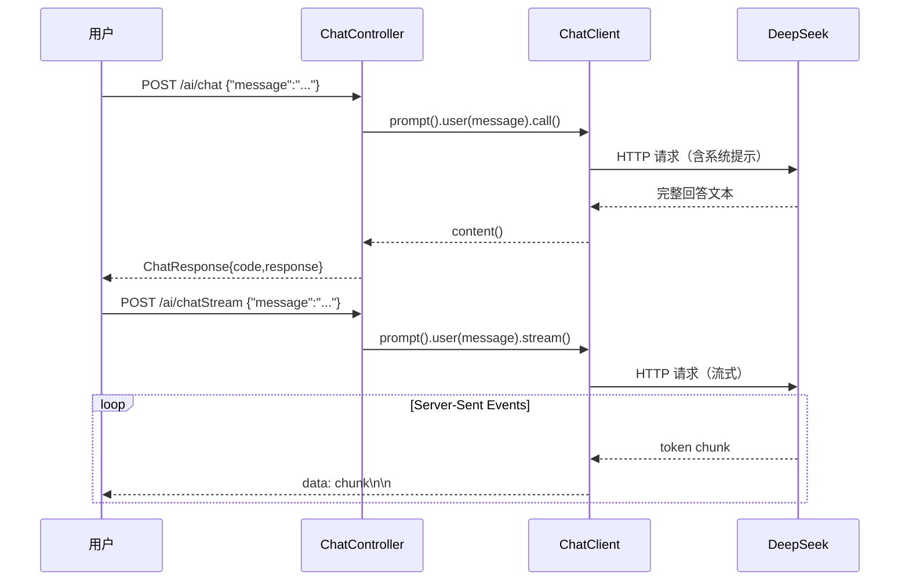

### 2. Embedding 与相似度计算

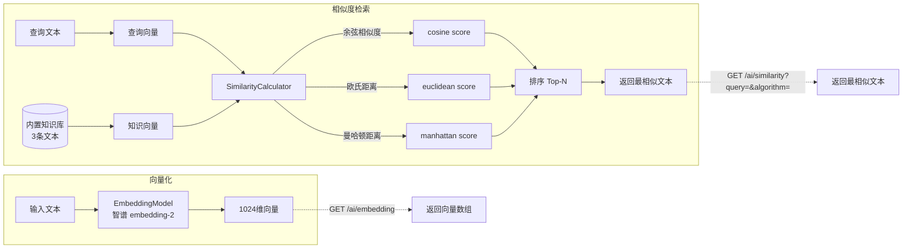

### 3. 结构化输出（`entity()`）

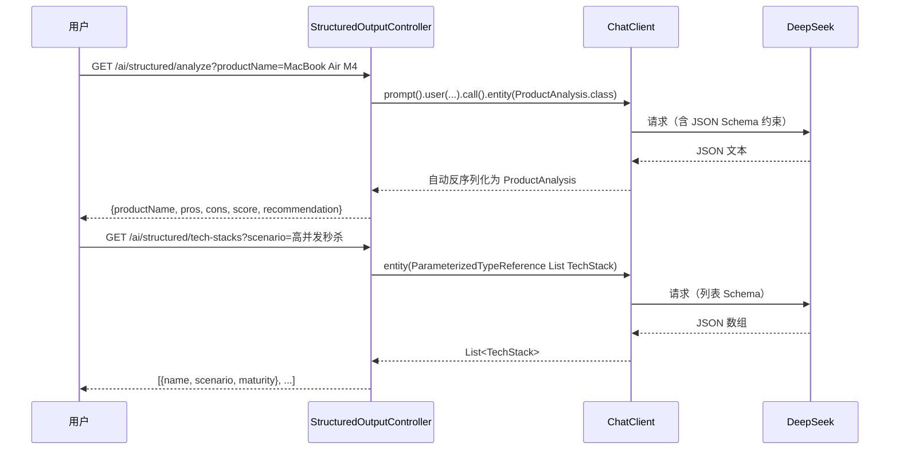

### 4. RAG 基础版

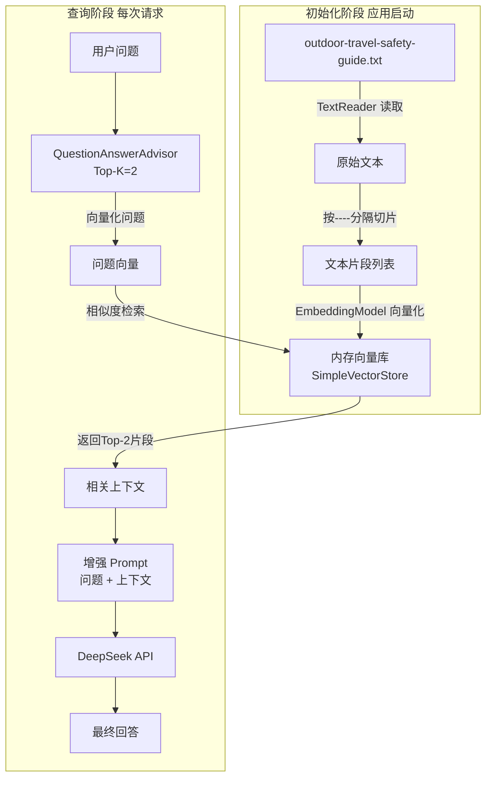


### 5. RAG 优化版（Milvus）

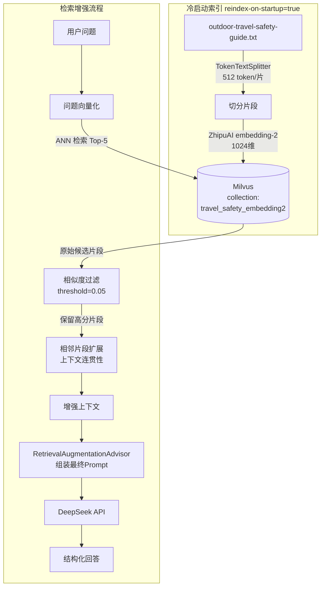

### 6. 电商客服 RAG

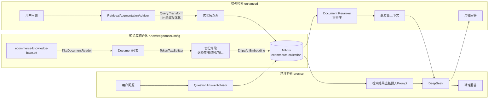

### 7. Agent 行程规划（四种记忆方案对比）

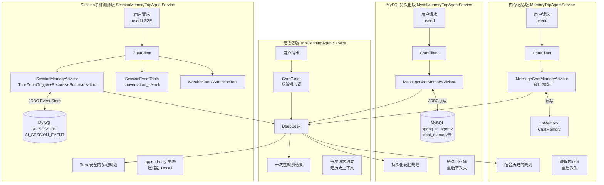

### 8. Agent 工具调用（ReAct 模式）

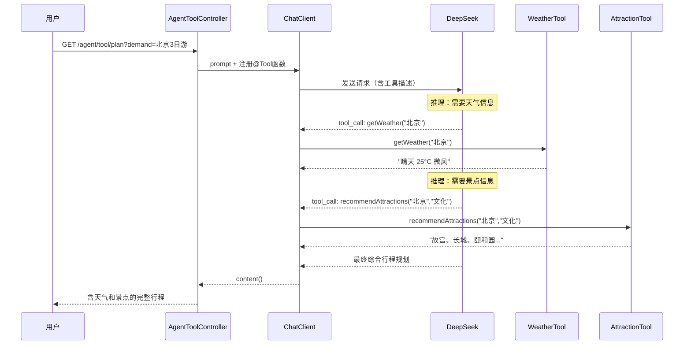

### 9. MCP Server/Client 架构

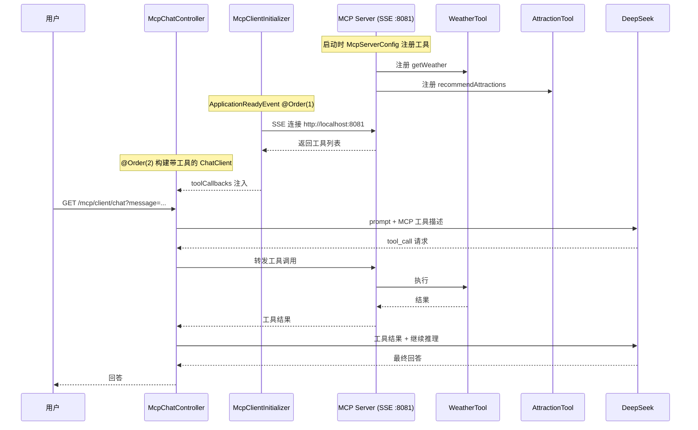

### 10. AskUserQuestion 人机澄清流程

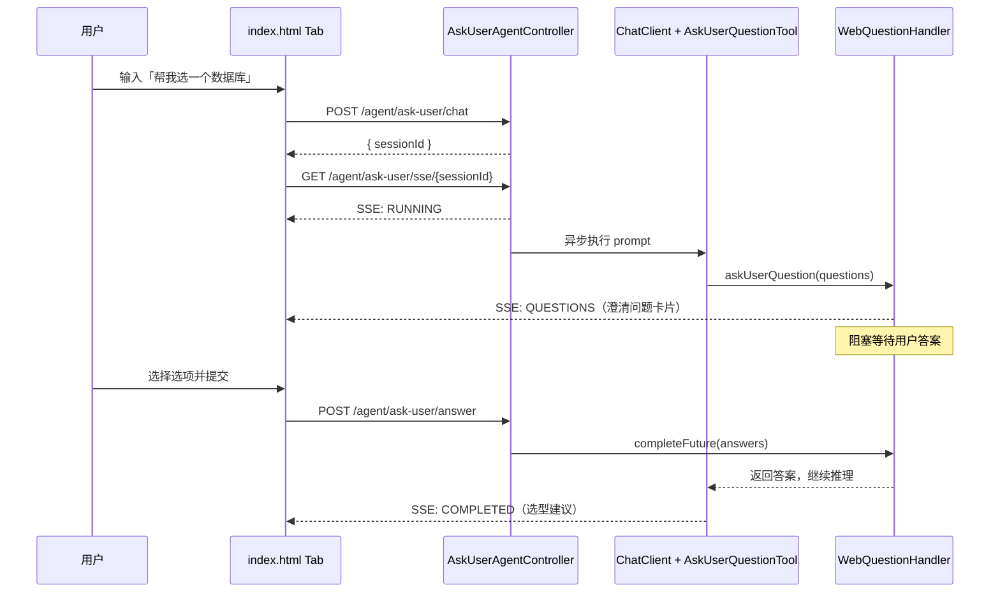

### 11. Agent Skills 语义匹配与执行

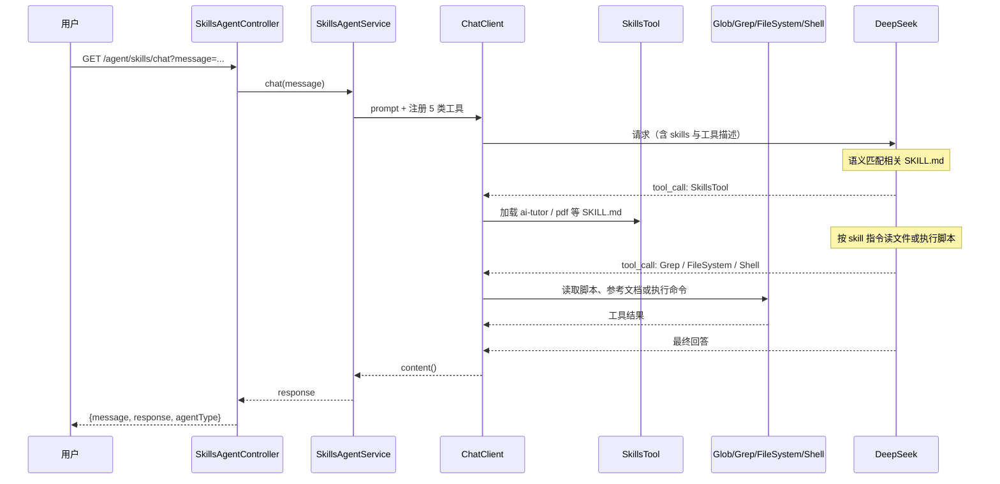

### 12. 多 Agent 协作（Supervisor-Worker）

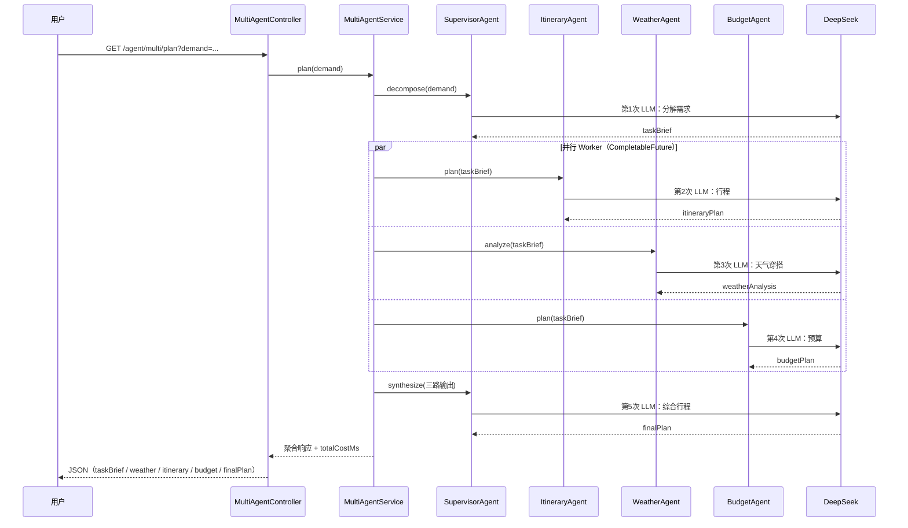

### 13. Subagent Orchestration（TaskTool）

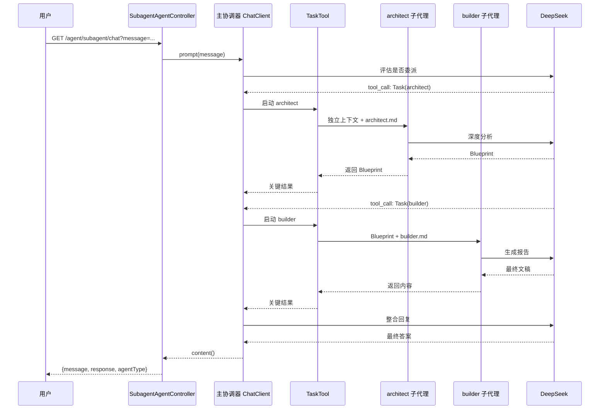

### 14. A2A 跨系统对话

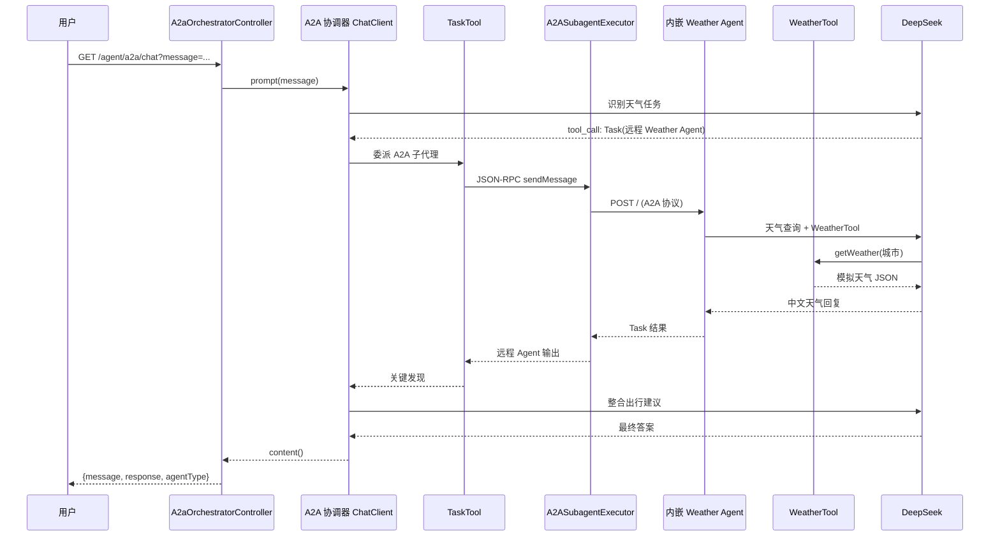

### 15. 应用启动流程

```mermaid
flowchart TD
    START([应用启动]) --> EXCL[排除 MilvusVectorStoreAutoConfiguration]
    EXCL --> BEANS[Bean 初始化]

    BEANS --> B1[LoggingConfig\nSimpleLoggerAdvisor]
    BEANS --> B2[MemoryConfig\nInMemoryChatMemory]
    BEANS --> B3[MysqlMemoryConfig\nJDBC ChatMemory]
    BEANS --> B4[MilvusLazyConfig\n@Lazy MilvusVectorStore]
    BEANS --> B5[RAGConfig\nAdvisors + ChatClient]
    BEANS --> B6[McpServerConfig\n注册工具到MCP Server]

    B4 -->|懒加载\n首次访问时连接| MILVUS3[(Milvus)]

    B6 --> READY([ApplicationReady])
    READY --> MC2[McpClientInitializer @Order1\n初始化MCP Client]
    MC2 --> MCC[McpChatController @Order2\n构建ChatClient with Tools]

    subgraph 知识库初始化 异步
        B5 -->|reindex=true| KBI[KnowledgeBaseConfig\n电商知识库入库]
        KBI --> MILVUS3
    end
```

### 16. 瑞幸 MCP 点单 — 三层架构

与 §10.1 及 `docs/superpowers/specs/2026-07-04-lkcoffee-mcp-design.md` 对齐：**编排层**（My Coffee Skill）→ **能力层**（瑞幸 8 工具 + 高德 geocode）→ **展示层**（SSE 聊天气泡 + 结构化卡片）。

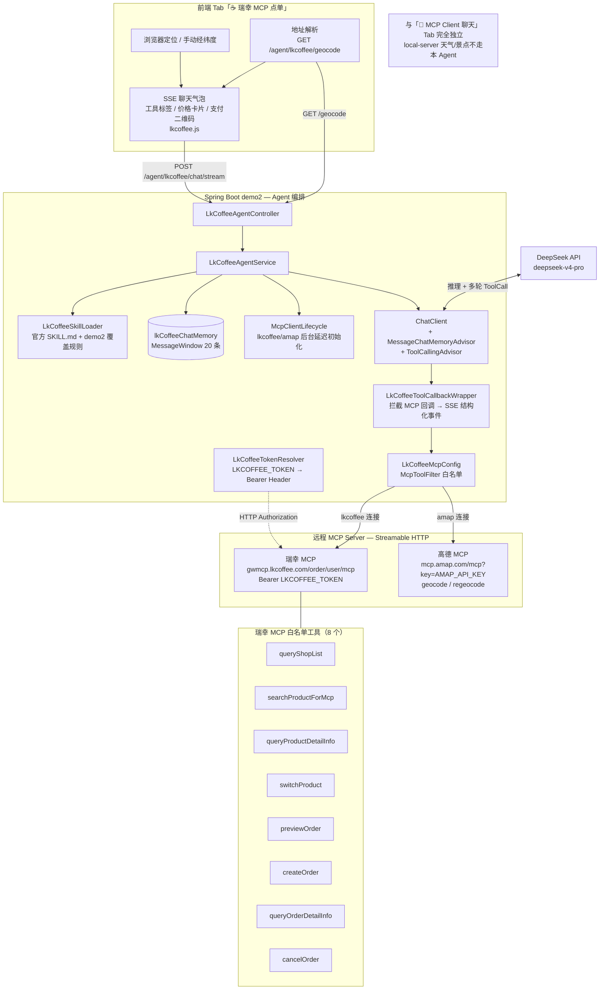

### 17. 瑞幸 MCP 点单 — SSE 多轮对话流程

完整点单链路：**定位 → 查门店 → 选品 → 预览 → 用户确认 → 下单/支付二维码**。多轮对话共用 `sessionId` + 独立 `ChatMemory`。

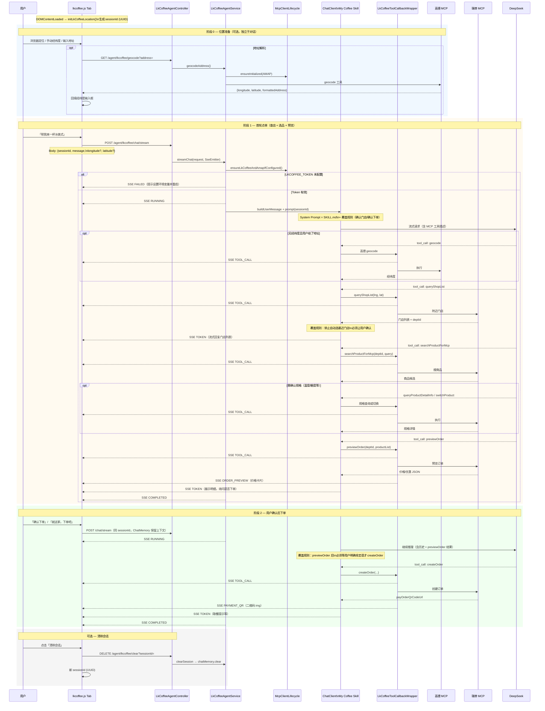

### 18. 瑞幸 MCP 点单 — 典型工具调用链与 SSE 事件

点单业务状态流与 `LkCoffeeSseEvent` 类型映射（`LkCoffeeToolCallbackWrapper` 在 MCP 回调时推送结构化事件）。

```mermaid
flowchart TD
    START([用户打开 ☕ Tab]) --> LOC{获取位置}

    LOC -->|浏览器 geolocation| COORD[longitude + latitude]
    LOC -->|手动输入| COORD
    LOC -->|仅有文字地址| GEO[GET /geocode\n高德 MCP geocode]
    GEO --> COORD

    COORD --> INPUT[用户输入自然语言\n如「冰美式少冰」]
    INPUT --> STREAM[POST /chat/stream]

    STREAM --> RUN[SSE RUNNING]
    RUN --> AGENT{Agent 编排\nMy Coffee Skill}

    AGENT --> G1{有经纬度?}
    G1 -->|否| GEO2[geocode\nSSE TOOL_CALL]
    GEO2 --> S1
    G1 -->|是| S1[queryShopList\nSSE TOOL_CALL]

    S1 --> C1{用户确认门店?}
    C1 -->|否| A1[SSE TOKEN 追问\n禁止自动选最近店]
    A1 --> C1
    C1 -->|是| S2[searchProductForMcp\nSSE TOOL_CALL]

    S2 --> S3[queryProductDetailInfo\nswitchProduct 按需\nSSE TOOL_CALL]
    S3 --> S4[previewOrder\nSSE TOOL_CALL]
    S4 --> PREVIEW[SSE ORDER_PREVIEW\n前端价格卡片]

    PREVIEW --> C2{用户明确确认下单?}
    C2 -->|修改规格| S3
    C2 -->|取消/换店| S1
    C2 -->|确认| S5[createOrder\nSSE TOOL_CALL]
    S5 --> QR[SSE PAYMENT_QR\npayOrderQrCodeUrl 二维码]

    QR --> TOKEN[SSE TOKEN\n流式取餐说明]
    TOKEN --> DONE[SSE COMPLETED]

    S6[queryOrderDetailInfo\ncancelOrder] -.->|查单/取消 按需| DONE

    subgraph SSE事件类型["LkCoffeeSseEvent 类型"]
        direction TB
        E1[RUNNING — 本轮开始]
        E2[TOOL_CALL — toolName + callIndex]
        E3[TOKEN — 流式 Markdown 文本]
        E4[ORDER_PREVIEW — previewOrder 结构化 payload]
        E5[PAYMENT_QR — createOrder 二维码 URL]
        E6[COMPLETED — 本轮结束]
        E7[FAILED — Token 缺失 / MCP 错误]
    end

    RUN -.-> E1
    PREVIEW -.-> E4
    QR -.-> E5
    DONE -.-> E6
```

> **与 §9「MCP Server/Client」的区别**：§9 演示本机 MCP Server（天气/景点，`local-server`）；§16–18 演示 **远程 Streamable HTTP** 双 MCP（瑞幸 + 高德），System Prompt 内嵌官方 My Coffee Skill，不走 `SkillsTool` 语义匹配。

### 19. ElevenLabs 语音对话 — 三层架构

与 §10.2 及 `docs/superpowers/specs/2026-07-07-elevenlabs-voice-chat-design.md` 对齐：**展示层**（录音 + 聊天气泡 + 音频播放）→ **编排层**（STT 转写 + 流式对话 + 分句 TTS）→ **能力层**（ElevenLabs Scribe + DeepSeek + ElevenLabs TTS）。

```mermaid
flowchart TB
    subgraph 展示层["前端 Tab「🎙️ 语音对话（ElevenLabs）」"]
        MIC[按住 🎤 录音\nMediaRecorder webm]
        TEXT_IN[文字输入框]
        VOICE_SEL[音色下拉\nGET /api/voices]
        BUBBLE[用户/助手气泡\nMarkdown 流式渲染]
        QUEUE[Audio 队列\n顺序播放 MP3]
        MIC --> UI[voice-chat.js]
        TEXT_IN --> UI
        VOICE_SEL --> UI
        UI --> BUBBLE
        UI --> QUEUE
    end

    subgraph 编排层["Spring Boot demo2 — 语音对话编排"]
        CTRL[VoiceApiController]
        STT_SVC[ElevenLabsTranscriptionService\nRestClient multipart]
        VCHAT[VoiceChatService]
        BUF[SentenceBuffer\n句末标点或 ≥40 字分句]
        CC[ChatClient.stream\nDeepSeek]
        TTS_BEAN["@Qualifier elevenLabsSpeechModel\nElevenLabsTextToSpeechModel"]
        HTTP[ElevenLabsHttpClientConfig\nJDK HTTP 读超时 120s]

        UI -->|松手 multipart| CTRL
        UI -->|文字/SSE| CTRL
        CTRL --> STT_SVC
        CTRL --> VCHAT
        VCHAT --> CC
        VCHAT --> BUF
        BUF --> TTS_BEAN
        HTTP -.-> STT_SVC
        HTTP -.-> TTS_BEAN
    end

    subgraph 能力层["外部 API"]
        SCRIBE[ElevenLabs Scribe v2\nPOST /v1/speech-to-text]
        DS[DeepSeek Chat API]
        EL_TTS[ElevenLabs TTS\nmp3_44100_128]

        STT_SVC --> SCRIBE
        CC --> DS
        TTS_BEAN --> EL_TTS
    end

    SCRIBE -->|text| VCHAT
    DS -->|token 流| VCHAT
    EL_TTS -->|AUDIO_CHUNK Base64| QUEUE
```

### 20. ElevenLabs 语音对话 — 语音输入与流式对话时序

典型路径：**按住说话** → STT → 自动发起 SSE 对话（也可跳过 STT 直接文字发送）。

```mermaid
sequenceDiagram
    participant 用户
    participant 前端 as voice-chat.js
    participant Ctrl as VoiceApiController
    participant STT as ElevenLabsTranscriptionService
    participant Svc as VoiceChatService
    participant DS as DeepSeek
    participant EL as ElevenLabs TTS

    rect rgb(240, 248, 255)
        Note over 用户,EL: 路径 A — 语音输入（按住录音）
        用户->>前端: mousedown 按住 🎤
        前端->>前端: MediaRecorder.start(200ms 分片)
        用户->>前端: mouseup 松手
        前端->>前端: 合并 webm Blob

        前端->>Ctrl: POST /api/stt/transcribe (multipart file)
        Ctrl->>STT: transcribe(file)
        STT->>EL: POST /v1/speech-to-text (Scribe v2)
        EL-->>STT: { text, language }
        STT-->>Ctrl: SttTranscribeResponse
        Ctrl-->>前端: 200 { text }

        前端->>前端: 展示用户气泡
    end

    rect rgb(255, 248, 240)
        Note over 用户,EL: 路径 B — 流式对话 + 分句朗读（语音/文字共用）
        前端->>Ctrl: POST /api/voice-chat/stream\n{ message, voiceId, autoSpeak }
        Ctrl->>Svc: streamChat(...)
        Svc-->>前端: SSE RUNNING
        Svc-->>前端: SSE USER_TEXT

        loop LLM 流式 token
            Svc->>DS: ChatClient.stream()
            DS-->>Svc: token chunk
            Svc-->>前端: SSE TOKEN
            opt autoSpeak 且分句就绪
                Svc->>EL: textToSpeech(sentence)
                EL-->>Svc: MP3 bytes
                Svc-->>前端: SSE AUDIO_CHUNK (Base64)
                前端->>前端: 入队顺序播放
            end
        end

        Svc-->>前端: SSE COMPLETED
    end

    Note over 用户,EL: 路径 C — 纯文字：跳过 STT，直接从 POST /voice-chat/stream 开始
```

### 21. ElevenLabs 语音对话 — 分句 TTS 缓冲与 SSE 事件

`VoiceChatService.SentenceBuffer` 将 LLM token 缓冲至句末标点（`。！？；!?\\n`）或长度 ≥ `agent.voice-chat.tts.sentence-max-chars`（默认 40）后触发 TTS；单句失败仅 WARN 跳过，不中断文字流。

```mermaid
flowchart TD
    START([用户消息就绪\n来自 STT 或文字输入]) --> STREAM[POST /api/voice-chat/stream]
    STREAM --> RUN[SSE RUNNING]
    RUN --> ECHO[SSE USER_TEXT 回显]

    ECHO --> LOOP{ChatClient 流式 token}

    LOOP --> APPEND[追加 SentenceBuffer\n同时推送 SSE TOKEN]
    APPEND --> CHECK{句末标点\n或 ≥40 字?}

    CHECK -->|否| LOOP
    CHECK -->|是| SPEAK{autoSpeak?}

    SPEAK -->|false| LOOP
    SPEAK -->|true| TTS[ElevenLabsTextToSpeechModel.call]
    TTS -->|成功| CHUNK[SSE AUDIO_CHUNK\nBase64 MP3]
    TTS -->|失败| SKIP[WARN 跳过该句\n文字继续]
    CHUNK --> LOOP
    SKIP --> LOOP

    LOOP -->|流结束| FLUSH[冲刷 buffer 剩余文本]
    FLUSH --> DONE[SSE COMPLETED]

    subgraph SSE事件类型["VoiceChatSseEvent 类型"]
        direction TB
        V1[RUNNING — 本轮开始]
        V2[USER_TEXT — 回显用户消息]
        V3[TOKEN — LLM 文本片段]
        V4[AUDIO_CHUNK — 一句 TTS MP3]
        V5[COMPLETED — 本轮结束]
        V6[FAILED — LLM/STT/未配置 Key]
    end

    RUN -.-> V1
    ECHO -.-> V2
    CHUNK -.-> V4
    DONE -.-> V5

    subgraph STT错误["STT 独立端点错误码"]
        direction TB
        S1[400 — 空录音]
        S2[502 — ElevenLabs 失败/网络超时]
        S3[503 — 未配置 ELEVENLABS_API_KEY]
    end
```

> **与 §1「AI 聊天」的区别**：§1 仅文字 SSE/MVC，无 TTS/STT；§19–21 为独立 Tab，无 ChatMemory，TTS 按句分段推送 `AUDIO_CHUNK` 而非等全文生成后再朗读。

### 22. Embabel 自动选路 — Closed 模式三 Agent

与 §10.3 及 `docs/superpowers/archive/2026-07-16-embabel-quizzard.md` 对齐：**展示层**（Tab / curl）→ **编排层**（`Autonomy.chooseAndRunAgent` + `validateOutput`）→ **能力层**（`StarNewsAgent` / `PolicyAgent` / `QuizAgent`）。

```mermaid
flowchart TB
    subgraph 展示层["前端 Tab「🔀 Embabel 自动选路」"]
        BTN[测试1 星座 / 测试2 差旅 / 测试3 出题]
        TA[textarea 输入 message]
        PROG[过程区：选 Agent / Action 进度]
        RES[结果区：JSON 或 QuizPack 卡片]
        BTN --> UI[embabel.js]
        TA --> UI
        UI --> PROG
        UI --> RES
    end

    subgraph 编排层["Spring Boot demo2 — Embabel 编排"]
        CTRL[EmbabelAgentController]
        SVC[EmbabelAgentService]
        AUTO[Autonomy.chooseAndRunAgent\nClosed 模式]
        VAL[validateOutput\nWriteup / PolicyAnswer / QuizPack]
        BRIDGE[EmbabelSseBridge\nAgenticEventListener → SSE]
        PROMPTS[application-embabel-prompts.yml\nstar / policy / quiz]

        UI -->|POST /embabel/agent/ask/stream| CTRL
        UI -.->|POST /embabel/agent/ask 同步调试| CTRL
        CTRL --> SVC
        SVC --> AUTO
        SVC --> VAL
        SVC --> BRIDGE
        PROMPTS -.->|QuizAgentProperties 等| AUTO
    end

    subgraph 能力层["三个 @Agent"]
        STAR[StarNewsAgent\n→ Writeup]
        POL[PolicyAgent\n→ PolicyAnswer]
        QUIZ[QuizAgent Quizzard\n→ QuizPack]
        FETCH[ArticleFetchService\njsoup / 粘贴正文]

        AUTO -->|description 排名选路| STAR
        AUTO -->|description 排名选路| POL
        AUTO -->|description 排名选路| QUIZ
        QUIZ --> FETCH
    end

    subgraph 外部["DeepSeek"]
        DS[deepseek-v4-pro\nembabel openai-custom]
        STAR --> DS
        POL --> DS
        QUIZ --> DS
    end

    BRIDGE -->|PROGRESS / AGENT_SELECTED / RESULT| UI
    VAL -->|502 结构不合格| UI
```

### 23. Quizzard — Action 链与对象流

`QuizAgent` 四段 Action：抓取不调 LLM；知识点 / 候选题 / 审核用 `ai.withDefaultLlm().createObject(...)`。

```mermaid
flowchart LR
    UI[UserInput] --> A1[extractArticle]
    A1 -->|有 URL| JSOUP[jsoup 抓正文]
    A1 -->|无 URL| MD[解析标题/正文]
    JSOUP --> ART[ArticleInput]
    MD --> ART
    ART --> A2[extractConcepts]
    A2 --> DIG[ConceptDigest\n3–5 知识点]
    DIG --> A3[generateQuiz]
    ART --> A3
    A3 --> DRAFT[QuizDraft\n候选题]
    DRAFT --> A4[reviewQuiz\n@AchievesGoal]
    ART --> A4
    A4 --> PACK[QuizPack\ntitle + questions + review]
    PACK --> VAL[validateOutput\n3题×4选项\nanswer∈options]
    VAL --> OUT[AgentResponse / SSE RESULT]
```

| 对象 | 字段要点 |
|------|----------|
| `ArticleInput` | `title`, `content`, `sourceUrl`；正文上限 12_000 |
| `ConceptDigest` | `List<ConceptPoint(name, explanation)>` |
| `QuizDraft` | `List<QuizQuestion>` 候选题 |
| `QuizQuestion` | `question`, `options`(4), `answer`(全文匹配 option), `explanation` |
| `QuizPack` | `title`, `questions`(恰好 3), `review`(完整句) |

### 24. Embabel — SSE 时序与 QuizPack 渲染

典型路径：测试3 粘贴出题 → Autonomy 选中 `QuizAgent` → 四段 Action → 校验 → 前端卡片渲染。

```mermaid
sequenceDiagram
    participant 用户
    participant 前端 as embabel.js
    participant Ctrl as EmbabelAgentController
    participant Svc as EmbabelAgentService
    participant Auto as Autonomy
    participant Quiz as QuizAgent
    participant Fetch as ArticleFetchService
    participant DS as DeepSeek

    用户->>前端: 测试3 / 粘贴正文发送
    前端->>Ctrl: POST /embabel/agent/ask/stream
    Ctrl->>Svc: streamAsk(message, SseEmitter)
    Svc-->>前端: SSE PROGRESS（分析请求…）

    Svc->>Auto: chooseAndRunAgent(message)
    Auto->>Auto: LlmRanker 按 @Agent description 排名
    Auto-->>Svc: 选中 QuizAgent
    Svc-->>前端: SSE AGENT_SELECTED

    Auto->>Quiz: extractArticle(UserInput)
    Quiz->>Fetch: resolve(raw)
    Fetch-->>Quiz: ArticleInput
    Note over Svc,前端: SSE ACTION_*（进度）

    Auto->>Quiz: extractConcepts(ArticleInput, Ai)
    Quiz->>DS: createObject → ConceptDigest
    DS-->>Quiz: ConceptDigest

    Auto->>Quiz: generateQuiz(Article, Digest, Ai)
    Quiz->>DS: createObject → QuizDraft
    DS-->>Quiz: QuizDraft

    Auto->>Quiz: reviewQuiz → QuizPack (@AchievesGoal)
    Quiz->>DS: createObject → QuizPack
    DS-->>Quiz: QuizPack

    Auto-->>Svc: AgentProcessExecution(output=QuizPack)
    Svc->>Svc: validateOutput(QuizPack)
    alt 校验失败
        Svc-->>前端: SSE ERROR（502 语义）
    else 校验通过
        Svc-->>前端: SSE RESULT {agentName, outputType, output}
        前端->>前端: renderEmbabelResult → QuizPack 卡片
    end
```

```mermaid
flowchart TD
    START([POST /ask/stream]) --> RUN[SSE PROGRESS]
    RUN --> RANK{Autonomy 选路}
    RANK -->|星座意图| STAR[StarNewsAgent → Writeup]
    RANK -->|制度意图| POL[PolicyAgent → PolicyAnswer]
    RANK -->|测验题意图| QUIZ[QuizAgent 四段 Action]

    STAR --> VAL{validateOutput}
    POL --> VAL
    QUIZ --> VAL

    VAL -->|不合格| ERR[SSE ERROR / HTTP 502]
    VAL -->|合格| RES[SSE RESULT]
    RES --> TYPE{outputType}
    TYPE -->|QuizPack| CARD[embabel-quiz-pack\n题干 / A–D / 解释 / review]
    TYPE -->|其他| JSON[embabel-result-json\n美化 JSON]

    subgraph SSE事件["EmbabelSseEvent"]
        direction TB
        E1[PROGRESS]
        E2[ACTION_START / ACTION_COMPLETE]
        E3[AGENT_SELECTED]
        E4[RESULT]
        E5[ERROR]
    end
```

> **与 §12「多 Agent 协作」的区别**：§12 由 Java `CompletableFuture` 写死 Supervisor-Worker；§22–24 由 Embabel `Autonomy` 按 Agent description **自动选路**，Agent 内再跑 Action 对象链。Quizzard 不推送 `ConceptDigest` / `QuizDraft` 中间态到前端。

### 25. AgentScope HarnessAgent — 三层架构

与 API 节及 AgentScope 相关 design 对齐：**展示层**（Tab / curl）→ **编排层**（`DevAgentController` + `DevAgentService` 含 Compaction 探测）→ **能力层**（`HarnessAgent` + Toolkit / Permission / Workspace / Compaction / `AgentStateStore`）。

```mermaid
flowchart TB
    subgraph 展示层["前端 Tab「🧭 AgentScope Harness」"]
        META[userId / sessionId]
        SAMPLES[示例：清单 / 项目问答 / Workspace / HITL / Compaction 四轮]
        MSG[消息区 + 工具条]
        CARD[确认卡片 批准 / 拒绝]
        META --> UI[agentscope.js]
        SAMPLES --> UI
        UI --> MSG
        UI --> CARD
    end

    subgraph 编排层["Spring Boot demo2 — AgentScope 编排"]
        CTRL[DevAgentController]
        SVC[DevAgentService]
        STORE_SVC["AgentStateStore 读 ASKING / 压缩后条数"]
        EVT["AgentEvent → DevAgentEvent<br/>含 REQUIRE_USER_CONFIRM / REQUEST_STOP / COMPACTION"]
        PROMPTS[application-agentscope-prompts.yml]

        UI -->|POST /agentscope/dev-agent/ask| CTRL
        UI -->|POST /agentscope/dev-agent/confirm| CTRL
        CTRL --> SVC
        SVC --> STORE_SVC
        SVC --> EVT
        PROMPTS -.->|systemPrompt / summaryPrompt| HA
    end

    subgraph 能力层["HarnessAgent + Toolkit"]
        HA[HarnessAgent\nPermission + Workspace + Compaction]
        READ[ProjectInfoTools\nread_pom / list_source_folders / find_main_class\nALLOW]
        WRITE[FileChangeTool\nrequest_file_change\nASK / DENY]
        STORE[AgentStateStore\nPostgreSQL / memory 降级]

        HA --> READ
        HA --> WRITE
        HA --> STORE
        SVC -->|streamEvents| HA
    end

    subgraph 外部["DeepSeek"]
        DS[deepseek-v4-pro\nOpenAIChatModel + DeepSeekFormatter]
        HA --> DS
    end

    subgraph 本地文件["projectRoot"]
        NOTES[notes/\n仅批准后写入]
        WRITE --> NOTES
    end

    EVT -->|SSE SESSION / TOOL_* / MESSAGE / CONFIRM / COMPACTION / DONE| UI
    UI --> SYS[系统提示：上下文已压缩]
```

| 层 | 职责 |
|----|------|
| 展示层 | SSE 流式文字、工具条、`REQUIRE_USER_CONFIRM` 确认卡片、**`COMPACTION` 系统提示** |
| 编排层 | RuntimeContext、从 store 读 `ASKING`、流后对比条数发 `COMPACTION`、事件 DTO 映射 |
| 能力层 | 模型推理、工具 / Permission、Workspace 注入、`CompactionMiddleware`、AgentState 持久化 |

### 26. AgentScope — Permission HITL 决策与写文件流

模型提出 `request_file_change` 后，**先** `checkPermissions()`，**后**才可能 `callAsync()` 写盘。

```mermaid
flowchart TD
    USER[用户：请创建 notes/xxx.txt] --> ASK[POST /ask]
    ASK --> LLM[模型生成 ToolUseBlock\nrequest_file_change]
    LLM --> PE[PermissionEngine +\nFileChangeTool.checkPermissions]

    PE -->|delete / remove| DENY1[DENY\nTOOL_RESULT_END DENIED\n无确认卡片]
    PE -->|路径越界 / 绝对路径| DENY2[DENY\n无确认卡片]
    PE -->|合法 notes/ 写入| ASK_P[ASK\nsafety: write requires approval]

    ASK_P --> SSE1[SSE REQUIRE_USER_CONFIRM\n+ pendingToolCalls]
    SSE1 --> STOP[SSE REQUEST_STOP\nPERMISSION_ASKING]
    STOP --> WAIT[Agent 暂停\n文件尚未创建]

    WAIT --> UI{用户点确认卡片}
    UI -->|批准 approved=true| CONF[POST /confirm]
    UI -->|拒绝 approved=false| CONF

    CONF --> RESUME[ConfirmResult +\nMsg.METADATA_CONFIRM_RESULTS]
    RESUME -->|批准| EXEC[callAsync 写 notes/\n再校验路径与符号链接]
    RESUME -->|拒绝| DENIED[工具结果 DENIED\n不写文件]
    EXEC --> LLM2[再调模型收尾回复]
    DENIED --> LLM2
    LLM2 --> DONE[SSE DONE]
```

```mermaid
flowchart LR
    subgraph ALLOW["直接执行"]
        A1[read_pom]
        A2[list_source_folders]
        A3[find_main_class]
    end

    subgraph ASK["人工确认"]
        B1["create / write / update / append\n且路径在 notes/"]
    end

    subgraph DENY["直接拒绝"]
        C1[delete / remove]
        C2[notes/../ 逃逸]
        C3[绝对路径]
        C4[不支持的 operation]
    end
```

### 27. AgentScope — SSE 时序（HITL 批准）

典型路径：示例「写 notes 文件」→ ASK 暂停 → 用户批准 → 写盘 → 模型总结。

```mermaid
sequenceDiagram
    participant 用户
    participant 前端 as agentscope.js
    participant Ctrl as DevAgentController
    participant Svc as DevAgentService
    participant HA as HarnessAgent
    participant PE as PermissionEngine
    participant Tool as FileChangeTool
    participant DS as DeepSeek

    用户->>前端: 发送「创建 notes/permission-demo.txt」
    前端->>Ctrl: POST /agentscope/dev-agent/ask
    Ctrl->>Svc: ask(request)
    Svc-->>前端: SSE SESSION
    Svc->>HA: streamEvents(message, RuntimeContext)
    HA->>DS: 模型推理
    DS-->>HA: ToolUseBlock request_file_change
    HA->>PE: 权限检查
    PE->>Tool: checkPermissions → ASK
    HA-->>Svc: RequireUserConfirmEvent
    Svc->>Svc: AgentStateStore 读 ASKING ToolUseBlock
    Svc-->>前端: SSE REQUIRE_USER_CONFIRM
    HA-->>Svc: RequestStopEvent PERMISSION_ASKING
    Svc-->>前端: SSE REQUEST_STOP / DONE
    Note over 前端,Tool: 此时 notes/ 文件尚未创建

    用户->>前端: 点击「批准」
    前端->>Ctrl: POST /agentscope/dev-agent/confirm approved=true
    Ctrl->>Svc: confirm(request)
    Svc->>Svc: 组装 ConfirmResult（approved）
    Svc->>HA: streamEvents(Msg + METADATA_CONFIRM_RESULTS)
    HA->>Tool: callAsync 写文件
    Tool-->>HA: SUCCESS
    HA-->>Svc: TOOL_RESULT_* 
    Svc-->>前端: SSE TOOL_RESULT_END SUCCESS
    HA->>DS: 再调模型收尾
    DS-->>HA: 文本回复
    HA-->>Svc: MESSAGE / AGENT_RESULT
    Svc-->>前端: SSE MESSAGE* / DONE
    前端->>前端: 更新气泡；可检查 notes/permission-demo.txt
```

> **与 §10 AskUserQuestion 的区别**：AskUser 是业务澄清（选数据库等）；AgentScope HITL 是 **工具执行前权限闸门**——模型已提交写文件申请单，是否落盘由 Permission + 用户确认决定，不依赖 Prompt 自觉。

### 28. AgentScope — Compaction 长会话压缩

PostgreSQL 负责**找回**会话；Compaction 负责**缩短**历史。压缩发生在模型推理前（`CompactionMiddleware.onReasoning`）；本项目另在流结束后对比 `AgentState.context` 条数，向前端推送 `COMPACTION`。

```mermaid
flowchart LR
    subgraph 信息归属
        A[当前目标 / 已确认 / 待办] --> S[Compaction 摘要]
        B[项目规则 / 工具约定] --> G[AGENTS.md]
        C[审批 / 订单等业务事实] --> DB[业务表]
        D[压缩前完整原文] --> X[本版不 offload]
    end
```

```mermaid
sequenceDiagram
    participant 用户
    participant 前端 as agentscope.js
    participant Ctrl as DevAgentController
    participant Svc as DevAgentService
    participant Store as AgentStateStore
    participant HA as HarnessAgent
    participant CM as CompactionMiddleware
    participant DS as DeepSeek

    Note over 用户,DS: 同 userId + sessionId，前三轮各产生 User+Assistant（共 6 条）
    用户->>前端: 第 4 轮「汇总已确认信息…」
    前端->>Ctrl: POST /agentscope/dev-agent/ask
    Ctrl->>Svc: ask(request)
    Svc->>Store: 读 beforeCount（如 6）
    Svc-->>前端: SSE SESSION
    Svc->>HA: streamEvents(message, RuntimeContext)
    HA->>CM: onReasoning（total≥triggerMessages）
    CM->>DS: 生成摘要（summary-prompt）
    DS-->>CM: 摘要文本
    CM->>CM: context = 1 摘要 + keepMessages 原文
    CM->>DS: 继续本轮推理
    DS-->>HA: 文本回复
    HA-->>Svc: MESSAGE* / AGENT_RESULT / AGENT_END
    Svc-->>前端: SSE MESSAGE*
    HA->>Store: 写回压缩后 AgentState
    Svc->>Store: 读 afterCount（如 4）
    alt afterCount > 0 且 afterCount < beforeCount
        Svc-->>前端: SSE COMPACTION（含前后条数）
        前端->>前端: 插入系统提示气泡
    end
    Svc-->>前端: SSE DONE
```

> **与 Session Memory Tab 的区别**：Session Memory 用 Spring AI `RecursiveSummarizationCompactionStrategy`（Turn / Event Store）；AgentScope Compaction 是 Harness 原生中间件，压缩的是同一份 `AgentState.context`，与 PostgreSQL store 配合使用。

---

## 目录结构

```
demo2/
├── src/main/java/com/jason/demo/demo2/
│   ├── Demo2Application.java          # 启动类（排除 Milvus 自动配置）
│   ├── config/                       # 配置类
│   │   ├── KnowledgeBaseConfig.java  # 电商知识库初始化（Tika 解析 → Milvus 入库）
│   │   ├── LoggingConfig.java        # LLM 请求响应日志（SimpleLoggerAdvisor）
│   │   ├── MemoryConfig.java         # 内存聊天记忆（InMemoryChatMemoryRepository）
│   │   ├── MilvusLazyConfiguration.java # Milvus 懒加载
│   │   ├── MysqlMemoryConfig.java    # MySQL JDBC 持久化记忆
│   │   ├── AutoMemoryAgentConfig.java # AutoMemoryTools + JDBC 短期记忆
│   │   ├── SessionMemoryAgentConfig.java # SessionMemoryAdvisor + SessionEventTools
│   │   ├── LkCoffeeAgentConfig.java      # 瑞幸点单 ChatMemory + 模型配置
│   │   ├── ElevenLabsVoiceConfig.java    # ElevenLabs 语音对话配置属性
│   │   ├── ElevenLabsHttpClientConfig.java # RestClient JDK HTTP + 读超时 120s
│   │   ├── OpenApiConfig.java        # Swagger/OpenAPI 配置
│   │   ├── RAGConfig.java            # RAG Advisor + 电商 ChatClient
│   │   ├── SkillsAgentConfig.java    # SkillsTool + 文件/Shell 工具 Bean
│   │   ├── AskUserAgentConfig.java   # AskUserQuestionTool Bean
│   │   ├── TodoAgentConfig.java      # TodoWriteTool + SSE 桥接
│   │   ├── SubagentAgentConfig.java  # TaskTool + architect/builder 子代理
│   │   ├── A2aWeatherAgentConfig.java   # 内嵌 A2A Server（Weather Agent）
│   │   ├── A2aOrchestratorConfig.java   # A2A 协调器 TaskTool
│   │   └── TraceIdFilter.java        # 响应头 X-Trace-Id（链路检索）
│   ├── agent/                        # 多 Agent 专项 Worker
│   │   ├── SupervisorAgent.java      # 分解 + 综合（2 次 LLM）
│   │   ├── ItineraryAgent.java       # 行程规划
│   │   ├── WeatherAgent.java         # 天气穿搭（含 TimeMethodTool）
│   │   └── BudgetAgent.java          # 预算分配
│   ├── controller/                   # HTTP 控制器
│   │   ├── ChatController.java
│   │   ├── EmbeddingController.java
│   │   ├── StructuredOutputController.java  # 结构化输出 entity()
│   │   ├── RagController.java
│   │   ├── RagOptimizedController.java
│   │   ├── CustomerServiceController.java
│   │   ├── AgentController.java
│   │   ├── AgentToolController.java
│   │   ├── MysqlAgentController.java
│   │   ├── AutoMemoryAgentController.java
│   │   ├── SessionMemoryAgentController.java
│   │   ├── SkillsAgentController.java   # Agent Skills：/chat、/demo、/demo-pdf
│   │   ├── AskUserAgentController.java
│   │   ├── TodoAgentController.java     # TodoWrite SSE
│   │   ├── SubagentAgentController.java # Subagent 编排
│   │   ├── A2aOrchestratorController.java # A2A 协调器
│   │   ├── LkCoffeeAgentController.java   # 瑞幸 MCP SSE 点单
│   │   ├── VoiceApiController.java        # ElevenLabs TTS/STT + 语音对话 SSE
│   │   ├── MultiAgentController.java
│   │   └── IndexController.java        # GET / → forward:/index.html
│   ├── embabel/                          # Embabel Agent 自动选路 + Quizzard
│   │   ├── agent/                        # StarNewsAgent / PolicyAgent / QuizAgent
│   │   ├── config/                       # *AgentProperties、LLM 兼容修复
│   │   ├── controller/EmbabelAgentController.java
│   │   ├── model/                        # AgentRequest / AgentResponse / EmbabelSseEvent
│   │   ├── service/                      # EmbabelAgentService、ArticleFetchService 等
│   │   └── sse/EmbabelSseBridge.java
│   ├── agentscope/                       # AgentScope HarnessAgent + HITL + Compaction
│   │   ├── config/                       # AgentScopeConfig、DevAgentProperties（含 Compaction）
│   │   ├── controller/DevAgentController.java
│   │   ├── model/                        # DevAgentEvent / ConfirmRequest / PendingToolCall
│   │   ├── service/DevAgentService.java  # ask / confirm + pending 缓存
│   │   └── tool/                         # ProjectInfoTools、FileChangeTool
│   ├── mcp/
│   │   ├── client/
│   │   │   ├── LkCoffeeTokenResolver.java
│   │   │   ├── LkCoffeeMcpToolCallbacksProvider.java
│   │   │   ├── LkCoffeeToolCallbackWrapper.java
│   │   │   ├── config/LkCoffeeMcpConfig.java
│   │   │   ├── config/LkCoffeeMcpTransportConfig.java
│   │   │   ├── config/McpClientLifecycle.java
│   │   │   ├── config/McpClientInitializer.java
│   │   │   └── controller/McpChatController.java
│   │   └── server/
│   │       └── config/McpServerConfig.java       # MCP Server 工具注册
│   ├── model/
│   │   ├── ChatRequest.java / ChatResponse.java
│   │   ├── ProductAnalysis.java      # 结构化输出：产品分析 record
│   │   ├── TechStack.java            # 结构化输出：技术栈 record
│   │   ├── AskUser*.java                 # AskUserQuestion 请求/响应/SSE 事件 DTO
│   │   ├── AutoMemoryChatRequest.java
│   │   ├── SessionMemoryChatRequest.java
│   │   ├── SessionMemorySseEvent.java
│   │   ├── LkCoffeeChatRequest.java
│   │   ├── LkCoffeeSseEvent.java
│   │   ├── TextToSpeechRequest.java
│   │   ├── SttTranscribeResponse.java
│   │   ├── VoiceChatRequest.java
│   │   └── VoiceChatSseEvent.java
│   ├── service/
│   │   ├── TripPlanningAgentService.java
│   │   ├── MemoryTripAgentService.java
│   │   ├── MysqlMemoryTripAgentService.java
│   │   ├── AutoMemoryTripAgentService.java
│   │   ├── SessionMemoryTripAgentService.java
│   │   ├── LkCoffeeAgentService.java       # 瑞幸 MCP SSE 点单
│   │   ├── ElevenLabsTranscriptionService.java # Scribe STT
│   │   ├── VoiceChatService.java           # 流式对话 + 分句 TTS
│   │   ├── LkCoffeeSkillLoader.java      # My Coffee Skill 加载
│   │   ├── ToolTripAgentService.java
│   │   ├── MultiAgentService.java        # Supervisor-Worker 编排（5 次 LLM）
│   │   ├── EmbeddingService.java
│   │   ├── SimilarityCalculator.java
│   │   ├── RagService.java
│   │   ├── RagOptimizedService.java
│   │   ├── SkillsAgentService.java       # SkillsTool + 文件/Shell 工具编排
│   │   ├── AskUserAgentService.java      # AskUserQuestion Agent 编排
│   │   ├── TodoAgentService.java         # TodoWrite 学习计划 Agent
│   │   ├── SubagentAgentService.java     # Subagent 协调器
│   │   ├── A2aOrchestratorService.java   # A2A 协调器
│   │   ├── WebQuestionHandler.java       # AskUserQuestionTool QuestionHandler
│   │   └── sse/                          # 通用 SSE（AskUser / TodoWrite / LkCoffee）
│   │       ├── AgentSseSessionStore.java
│   │       ├── AbstractSseAgentService.java
│   │       └── LkCoffeeStreamContext.java
│   ├── tool/
│   │   ├── TimeMethodTool.java       # @Tool 时区/季节（WeatherAgent 使用）
│   │   └── CityRequest.java          # 城市请求 DTO
│   └── tools/
│       ├── WeatherTool.java          # @Tool 天气查询（模拟数据）
│       └── AttractionTool.java       # @Tool 景点推荐（内置6城市数据）
├── src/main/resources/
│   ├── application.properties        # 主配置（含 Embabel / Subagent/A2A、Micrometer/OTel）
│   ├── application-embabel-prompts.yml # Embabel 中文 Prompt（星座 / 制度 / Quizzard）
│   ├── application-otel.properties   # OTLP 导出 Profile（--spring.profiles.active=otel）
│   ├── agents/                       # Subagent 子代理定义（architect.md、builder.md）
│   ├── .claude/skills/             # 内置 Agent Skills 示例（ai-tutor、pdf、my-coffee）
│   ├── outdoor-travel-safety-guide.txt
│   ├── ecommerce-knowledge-base.txt
│   └── static/                       # 前端演示（见「前端说明」）
│       ├── index.html
│       ├── css/components.css
│       ├── css/tabs/                 # 各 Tab 样式（含 lkcoffee.css）
│       └── js/
│           ├── core/tabs.js, utils.js, markdown.js
│           └── tabs/                 # 各 Tab 逻辑（含 lkcoffee.js）
├── src/test/java/.../
│   ├── SessionMemoryTripAgentServiceTest.java
│   ├── LkCoffeeSkillLoaderTest.java
│   └── LkCoffeeAgentServiceTest.java
├── scripts/
│   └── smoke-test-frontend.ps1     # 静态资源冒烟测试
├── docker/
│   ├── milvus/docker-compose.yml
│   └── observability/docker-compose.yml  # Grafana LGTM（OTLP + Grafana UI）
├── docs/superpowers/
│   ├── specs/
│   │   ├── 2026-06-23-spring-ai-2-upgrade-design.md
│   │   ├── 2026-06-27-ask-user-question-tool-design.md
│   │   ├── 2026-06-29-todo-write-tool-design.md
│   │   ├── 2026-06-29-subagent-a2a-design.md
│   │   ├── 2026-06-30-automemory-tools-design.md
│   │   ├── 2026-06-30-index-html-refactor-design.md
│   │   ├── 2026-07-01-session-memory-design.md
│   │   ├── 2026-07-02-tool-reasoning-design.md
│   │   ├── 2026-07-04-lkcoffee-mcp-design.md
│   │   ├── 2026-07-07-elevenlabs-voice-chat-design.md
│   │   ├── 2026-07-13-embabel-agent-routing-design.md
│   │   └── 2026-07-15-embabel-quizzard-design.md
│   ├── plans/
│   │   ├── 2026-06-27-ask-user-question-tool.md
│   │   ├── 2026-06-29-todo-write-tool.md
│   │   ├── 2026-06-29-subagent-a2a.md
│   │   ├── 2026-06-30-automemory-tools.md
│   │   ├── 2026-06-30-index-html-refactor.md
│   │   ├── 2026-07-01-session-memory.md
│   │   ├── 2026-07-02-tool-reasoning.md
│   │   ├── 2026-07-04-lkcoffee-mcp.md
│   │   ├── 2026-07-07-elevenlabs-voice-chat.md
│   │   ├── 2026-07-13-embabel-agent-routing.md
│   │   └── 2026-07-15-embabel-quizzard.md
│   └── archive/
│       ├── 2026-07-06-lkcoffee-mcp.md        # 瑞幸点单功能归档
│       ├── 2026-07-08-elevenlabs-voice-chat.md # ElevenLabs 语音对话归档
│       └── 2026-07-16-embabel-quizzard.md    # Embabel Quizzard 出题归档
└── pom.xml
```

---

## 常见问题

**Q：启动时报 Milvus 连接失败怎么办？**

Milvus 采用懒加载，仅访问 RAG 优化版和电商客服接口时才会连接。检查 Docker 中 Milvus 是否正常运行：`docker ps | grep milvus`。其他模块不受影响。

**Q：MySQL 建表失败怎么办？**

将 `application.properties` 中 `spring.ai.chat.memory.repository.jdbc.initialize-schema` 改为 `always` 让框架自动建表，或手动执行 Spring AI JDBC 的 DDL 脚本。

**Q：MySQL 记忆报 `bad SQL grammar ... ORDER BY sequence_id`？**

Spring AI 2.0 的 `SPRING_AI_CHAT_MEMORY` 表新增了 `sequence_id` 列。若从 1.x 升级且表已存在，需手动迁移：

```sql
ALTER TABLE SPRING_AI_CHAT_MEMORY
  ADD COLUMN sequence_id BIGINT NOT NULL AFTER timestamp;

-- 若已有历史数据，按时间顺序回填序号（每个 conversation_id 内从 0 递增）
SET @seq := -1;
SET @cid := '';
UPDATE SPRING_AI_CHAT_MEMORY
SET sequence_id = (
  @seq := IF(@cid = conversation_id, @seq + 1, 0),
  @cid := conversation_id,
  @seq
)
ORDER BY conversation_id, timestamp;
```

新库可直接设 `initialize-schema=always` 由框架建表。

**Q：启动报 `No schema scripts found ... schema-mariadb.sql`（Session JDBC）？**

`spring-ai-starter-session-jdbc` 0.2.0 仅提供 `schema-mysql.sql` / `schema-postgresql.sql` / `schema-h2.sql`，**无** `schema-mariadb.sql`。请将 `spring.ai.session.repository.jdbc.platform` 设为 **`mysql`**（ChatMemory JDBC 仍可用 `mariadb`，二者独立配置）。

**Q：启动报 `Duplicate key name 'idx_ai_session_user_id'`？**

Session JDBC 的 `schema-mysql.sql` 中索引没有 `IF NOT EXISTS`，`initialize-schema=always` 会在每次启动重复建索引。表已存在时改为 **`never`**（与 ChatMemory 一致）；全新库首次启动可临时设为 `always`，建表成功后改回 `never`。

**Q：DeepSeek / 智谱 AI 返回 401？**

检查 `application.properties` 中对应的 `api-key` 是否正确填写，注意不要有多余空格。

**Q：MCP Client 无法调用工具？**

MCP Client 连接本机 MCP Server（`http://localhost:8081/mcp`，Streamable HTTP），需确保应用已完全启动再发起请求。远程 lkcoffee/amap 由 `McpClientLifecycle` 后台延迟初始化，首次打开瑞幸 Tab 对话前可能需稍等。

**Q：瑞幸 MCP 点单 Tab 报 Token 缺失或 MCP 工具不可用？**

1. 设置环境变量 `LKCOFFEE_TOKEN`（[open.lkcoffee.com/mcp](https://open.lkcoffee.com/mcp) 获取）并**重启应用**（不支持 Tab 内切换 Token）
2. 地址解析需配置 `AMAP_API_KEY`
3. 启动日志应出现 `[LkCoffee] LKCOFFEE_TOKEN 已配置`；首次对话后出现 `[LkCoffee] 已加载 N 个 MCP 工具`
4. 多轮 ToolCall 若中断，可将 `agent.lkcoffee.chat.model` 降级为 `deepseek-chat`
5. 详见 `docs/superpowers/archive/2026-07-06-lkcoffee-mcp.md`

**Q：语音 Tab 报 HTTP 500 / 识别失败？**

1. 确认已设置 `ELEVENLABS_API_KEY` 并**重启应用**
2. 日志若出现 `reactor.netty...ReadTimeoutException`，说明旧进程未加载 `ElevenLabsHttpClientConfig`；重启后 STT 改用 JDK HTTP + 120s 读超时
3. 免费套餐部分 library voice 可能 402，默认音色已改为 Roger（`CwhRBWXzGAHq8TQ4Fs17`）
4. 详见 `docs/superpowers/archive/2026-07-08-elevenlabs-voice-chat.md`

**Q：Embabel Tab 选不到 QuizAgent / 出题失败？**

1. 确认 `DEEPSEEK_API_KEY` 已配置并重启应用
2. 样例消息需带「测验题 / 单选」等意图（测试3 按钮已预填）
3. URL 抓取若遇文档站反爬会返回 **502**，改用粘贴正文路径
4. Prompt 在 `application-embabel-prompts.yml` 的 `demo.quiz-agent`，不在 `application.properties`
5. 详见 `docs/superpowers/archive/2026-07-16-embabel-quizzard.md`

**Q：AskUserQuestion Demo 没有收到澄清问题？**

确认已配置 `DEEPSEEK_API_KEY`，且前端在 `POST /chat` 后及时建立 `EventSource` 连接。Agent 仅在需求模糊时才会调用 `AskUserQuestionTool`；可尝试输入「帮我选一个数据库」等开放式问题。SSE 连接超时为 5 分钟。

**Q：Agent Skills 没有匹配到 skill 或读文件失败？**

检查 `application.properties` 中 `agent.skills.dirs` 路径是否存在；Windows 下 Cursor skills 通常为 `file:C:/Users/<用户名>/.cursor/skills`。内置示例在 `classpath:/.claude/skills`。可开启 `logging.level.org.springaicommunity.agent.tools.SkillsTool=DEBUG` 查看匹配过程。`demo` / `demo-pdf` 若需执行 Python 脚本，请确保本机已安装 Python 或 `uv`。

**Q：Subagent 编排一直 loading 或超时？**

单次请求可能触发多次 LLM 调用（主代理 + architect + builder），通常需 **30～90 秒**。请确认 `DEEPSEEK_API_KEY` 已配置，并查看日志中是否有 `Task` 工具调用。复杂写作类 prompt 更容易触发子代理链。

**Q：A2A Demo 调用失败或 AgentCard 404？**

确认 `spring.ai.a2a.server.enabled=true` 且 `agent.a2a.remote.url` 端口与 `server.port` 一致（默认 **8081**）。启动后执行 `curl http://localhost:8081/.well-known/agent-card.json` 应返回 Weather Agent 元数据。若协调器无天气结果，检查日志中 A2A JSON-RPC 是否成功。

**Q：控制台周期性报 `ConnectException: localhost:4318`？**

说明已开启 OTLP 导出但 Collector 未运行。解决方式二选一：① 保持 `management.otlp.metrics.export.enabled=false` 与 `management.tracing.export.otlp.enabled=false`（默认）；② 先执行 `docker compose -f demo2/docker/observability/docker-compose.yml up -d`，再以 `otel` Profile 启动应用。

**Q：RAG 知识库更新后不生效？**

将 `rag.optimized.reindex-on-startup=true`（或 `ecommerce.reindex-on-startup=true`）重启一次应用，重建向量索引后再改回 `false`。

---

## 升级说明（Spring AI 2.0）

本项目已升级至 **Java 21 + Spring Boot 4.1 + Spring AI 2.0.0**。

主要变更：

- `PromptChatMemoryAdvisor` 已移除，MySQL 记忆统一使用 `MessageChatMemoryAdvisor`
- `SPRING_AI_CHAT_MEMORY` 表新增 `sequence_id` 列（从 1.x 升级需手动 ALTER，见 FAQ）
- Jackson 3（Boot 4 默认）
- MCP Java SDK 2.0.0
- 智谱 Embedding 通过 OpenAI 兼容 API 接入（`spring-ai-starter-model-openai` + 智谱 base-url）
- `AskUserQuestionTool` 来自 `spring-ai-agent-utils`，用于 Agent 执行中主动向用户澄清需求
- `TodoWriteTool` 同属 `spring-ai-agent-utils`，用于多步骤任务拆解与进度跟踪
- `SkillsTool` 同属 `spring-ai-agent-utils`，通过语义匹配加载 `SKILL.md` 并配合文件/Shell 工具执行
- `TaskTool` + `spring-ai-agent-utils-a2a`：Subagent 本地编排与 A2A 远程子代理委派（`architect`/`builder`、内嵌 Weather Agent）
- **spring-ai-session 0.2.0**：`SessionMemoryAdvisor` + JDBC Event Store（`AI_SESSION` / `AI_SESSION_EVENT`），见 §8.2 与 `docs/superpowers/specs/2026-07-01-session-memory-design.md`
- **瑞幸 MCP 点单**：Streamable HTTP 双远程 MCP（瑞幸 + 高德）+ 官方 My Coffee Skill 内嵌 System Prompt，见 §10.1 与 `docs/superpowers/archive/2026-07-06-lkcoffee-mcp.md`
- **ElevenLabs 语音对话**：TTS（`spring-ai-starter-model-elevenlabs`）+ 自封装 Scribe STT + 分句流式朗读，见 §10.2 与 `docs/superpowers/archive/2026-07-08-elevenlabs-voice-chat.md`
- **Embabel 自动选路 + Quizzard**：`embabel-agent` 2.0.0-SNAPSHOT Closed 模式三 Agent；jsoup 抓文 + Action 链出题，见 §10.3 与 `docs/superpowers/archive/2026-07-16-embabel-quizzard.md`
- **Micrometer + OpenTelemetry**：Boot 4 内置，通过 `spring-boot-starter-opentelemetry` 接入；Spring AI 自动暴露 `gen_ai.*` 指标

详细设计见 `docs/superpowers/specs/` 目录。

---

## 相关资源

- [Embabel Agent](https://github.com/embabel/embabel-agent)
- [Spring Boot 可观测性文档](https://docs.spring.io/spring-boot/reference/actuator/observability.html)
- [Micrometer OpenTelemetry 桥接](https://micrometer.io/docs/tracing#_open_telemetry)
- [Spring AI Agent Utils（AskUserQuestionTool / TaskTool）](https://github.com/spring-ai-community/spring-ai-agent-utils)
- [subagent-demo 官方示例](https://github.com/spring-ai-community/spring-ai-agent-utils/tree/main/examples/subagent-demo)
- [subagent-a2a-demo 官方示例](https://github.com/spring-ai-community/spring-ai-agent-utils/tree/main/examples/subagent-a2a-demo)
- [spring-ai-a2a（A2A Server）](https://github.com/spring-ai-community/spring-ai-a2a)
- [A2A Protocol](https://a2a-protocol.org/)
- [Spring AI 官方文档](https://docs.spring.io/spring-ai/reference/)
- [DeepSeek API 文档](https://api-docs.deepseek.com/)
- [智谱 AI 开放平台](https://open.bigmodel.cn/)
- [Milvus 官方文档](https://milvus.io/docs)
- [Model Context Protocol 规范](https://modelcontextprotocol.io/)
