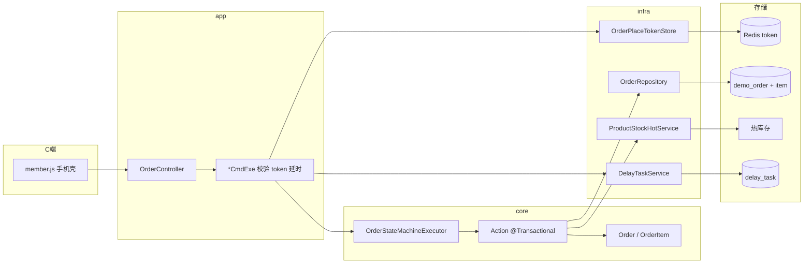
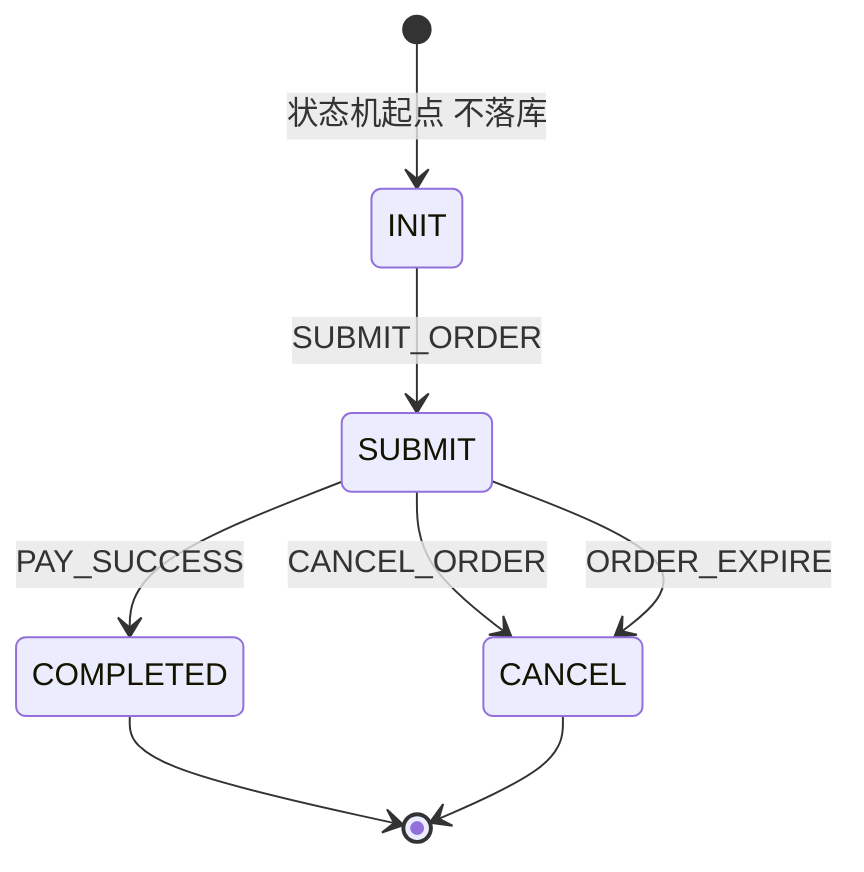
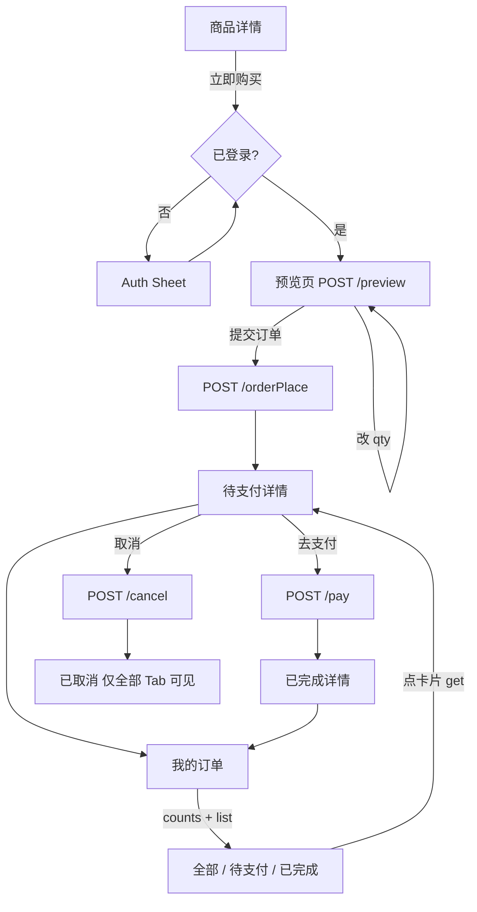
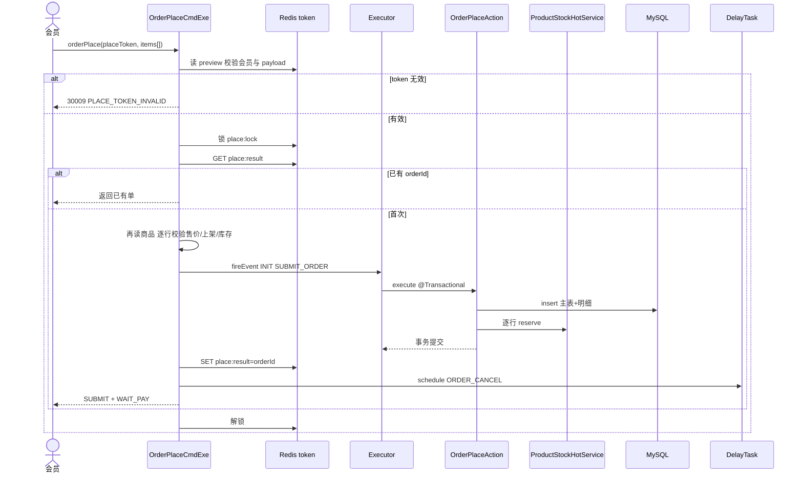

# 订单模块 COLA 状态机 · 功能归档

**归档日期**: 2026-08-29  
**项目**: spring-ai-demo / demo2  
**状态**: 已实现  

**设计规范**: [2026-08-28-order-module-statemachine-design.md](../specs/2026-08-28-order-module-statemachine-design.md)  
**实施计划**: [2026-08-28-order-module-statemachine.md](../plans/2026-08-28-order-module-statemachine.md)  
**前置**: [2026-08-23-order-ddd-package-refactor.md](./2026-08-23-order-ddd-package-refactor.md)、[2026-08-26-product-module.md](./2026-08-26-product-module.md)、[2026-08-27-redis-stock-consistency.md](./2026-08-27-redis-stock-consistency.md)  
**参考代码**: `com.jason.demo.demo2.order`

---

## 1. 做了什么

把延时取消 Demo 订单改成 **COLA 状态机 + 商品快照 + 热库存**：

- 只引入 `cola-component-statemachine` **5.0.0**；`machineId = orderStateMachine`
- 状态 `INIT`（不落库）→ `SUBMIT` → `COMPLETED` / `CANCEL`；`pay_status` 是伴随字段
- C 端：商品详情立即购买（先登录）→ 预览 → 下单预占 → 模拟支付 / 取消 → 我的订单
- `demo_order` 演进（`order_status` / `pay_status` / 时间戳）+ 新建 `demo_order_item`
- 报文按 `items[]` 设计，本版 `@Size(max=1)`；库存只调 `ProductStockHotService`
- 预览签发 Redis `placeToken`（默认 TTL 30 分钟）；同一 token 只生成一单
- 调试面板去掉「创建待支付订单」；支付/取消/查询用 C 端产生的 `orderId`

**本版未做**：真支付、购物车、一单多商品（去掉 max=1 即可）。

---

## 2. 架构

调用链：`CmdExe`（登录、token、幂等、商品再校验、延时）→ `OrderStateMachineExecutor.fireEvent` → Spring Bean Action（`@Transactional`：改状态、insert/CAS、逐行热库存）。

CmdExe **不加** `@Transactional`。延时在 `fireEvent` 成功之后由 CmdExe 注册/撤销，避免订单回滚后留下关单任务。



依赖方向：`app → service.core → service.infrastructure`。Action 注入 Repository 与 `ProductStockHotService`。

---

## 3. 状态流转



| 事件 | 订单状态 | 支付伴随 |
|------|----------|----------|
| `SUBMIT_ORDER` | `SUBMIT` | `WAIT_PAY` |
| `PAY_SUCCESS` | `COMPLETED` | `PAY_SUCCESS` |
| `CANCEL_ORDER` / `ORDER_EXPIRE` | `CANCEL` | `CLOSE` |

非法转移（如已完成再支付）走 COLA FailCallback → `30002`，不进 Action。

---

## 4. C 端主路径



未登录点「立即购买」先登录。预览/下单/列表/详情均 `@LoginRequired`。

---

## 5. 下单时序（实现）

与 spec 时序图的差异：**先 `saveResult` 再 `schedule`**，避免 schedule 失败后同一 token 再下一单。



Action 内：**先写 MySQL，再 reserve**。`reserve` 失败则抛错，本地事务回滚。热库存不在 JDBC 事务里：已 reserve 而随后回滚时，按 `orderId` 补偿 `release`。

支付 / 手动取消：Action 内 CAS + `confirm`/`release`，CmdExe 再 `cancelByBizKey`。超时：非 `SUBMIT` 不 `fireEvent`；CAS 0 行静默。

---

## 6. 数据与 Redis

已有库执行 `src/main/resources/db/order-module-schema.sql`。新库仍以 `delay-order-schema.sql` 建 `demo_order`，再跑本脚本 ALTER。

| 表 | 说明 |
|----|------|
| `demo_order` | 主表；`order_status` + `pay_status` + `pay_time`/`cancel_time` |
| `demo_order_item` | 商品快照；`member_id` 预留分片 |

索引：`idx_demo_order_member_status_time (member_id, order_status, created_at)`。

下单同事务写主表+明细，列表/counts **不再** `EXISTS` 明细（有主表即有明细）。

| Redis Key | 含义 |
|-----------|------|
| `demo:order:preview:{token}` | 预览 payload（memberId + items） |
| `demo:order:place:lock:{token}` | 下单互斥 |
| `demo:order:place:result:{token}` | 已生成 orderId（TTL 24h） |

SET+TTL 必须 Lua（与登录态相同，避免 Boot4 `Expiration` StackOverflow）。

---

## 7. HTTP

全部 **POST** `/demo/orders/*` + JSON + `@LoginRequired`。HTTP 始终 200。

| 路径 | CmdExe | 说明 |
|------|--------|------|
| `/preview` | `OrderPreviewCmdExe` | 不落库，签发 placeToken |
| `/orderPlace` | `OrderPlaceCmdExe` | 校验 token，预占并创建 SUBMIT |
| `/pay` | `OrderPaySuccessCmdExe` | 模拟支付 |
| `/cancel` | `OrderCancelCmdExe` | 手动取消 |
| `/get` | `OrderGetCmdExe` | 详情含明细 |
| `/list` | `OrderListCmdExe` | tab=`ALL`/`SUBMIT`/`COMPLETED` |
| `/counts` | `OrderCountsCmdExe` | 一条 `GROUP BY` 待支付/已完成 |

错误码 `3xxxx`：`30001` 不存在、`30002` 状态冲突、`30008` 售价变动、`30009` token 无效、`30010` 商品行非法。库存失败直接抛商品码（`40002`/`40003`/`40010` 等）。

配置：`app.order.place-token-ttl=30m`。

---

## 8. 包结构

```
com.jason.demo.demo2.order
├── app
│   ├── controller/OrderController
│   ├── executor/*CmdExe
│   ├── listener/OrderCancelHandler
│   ├── vo/req, vo/res, convert, support
└── service
    ├── common（状态/事件/错误码/OrderItemsRules）
    ├── core
    │   ├── domain/Order, OrderItem
    │   ├── OrderDomainService
    │   └── statemachine（Executor + Configuration + action/*）
    └── infrastructure（DO, Mapper XML, Repository, redis token）
```

---

## 9. 测试

`mvn "-Dtest=com.jason.demo.demo2.order.*Test" test`（PowerShell 须给 `-Dtest` 加引号）。覆盖状态机、token、preview/place/pay/cancel/expire、list/counts、Mapper XML、Controller 映射。

---

## 10. C 端要点

- `member.js`：立即购买先登录；预览改 qty 重新 preview；订单 Tab 调 counts + list
- 雪花 ID 用 `memberSnowflakeId()`，不要 `Number()`
- 调试面板只保留支付/取消/查询 + 延时台账

---

## 11. 与 spec 的有意偏离

| 点 | spec | 实现 |
|----|------|------|
| 下单 result / 延时顺序 | schedule 再 saveResult | **先 saveResult 再 schedule** |
| list/counts 滤无明细 | `EXISTS demo_order_item` | 已去掉（有主表必有明细） |
| Domain 写路径 | 曾有 `Order.pay()` 等 | 已删，只走状态机 Action |

---

## 12. 变更记录

| 日期 | 说明 |
|------|------|
| 2026-08-29 | 初版归档：COLA 状态机 + placeToken + 热库存 + C 端购买流 |
