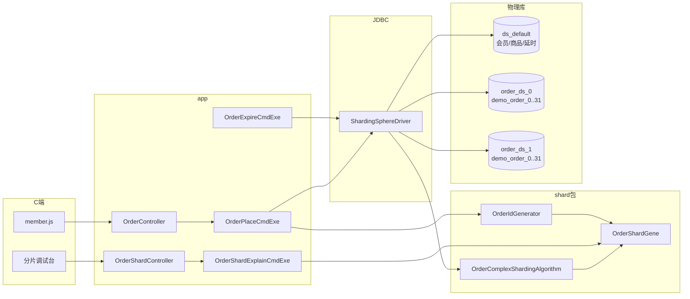
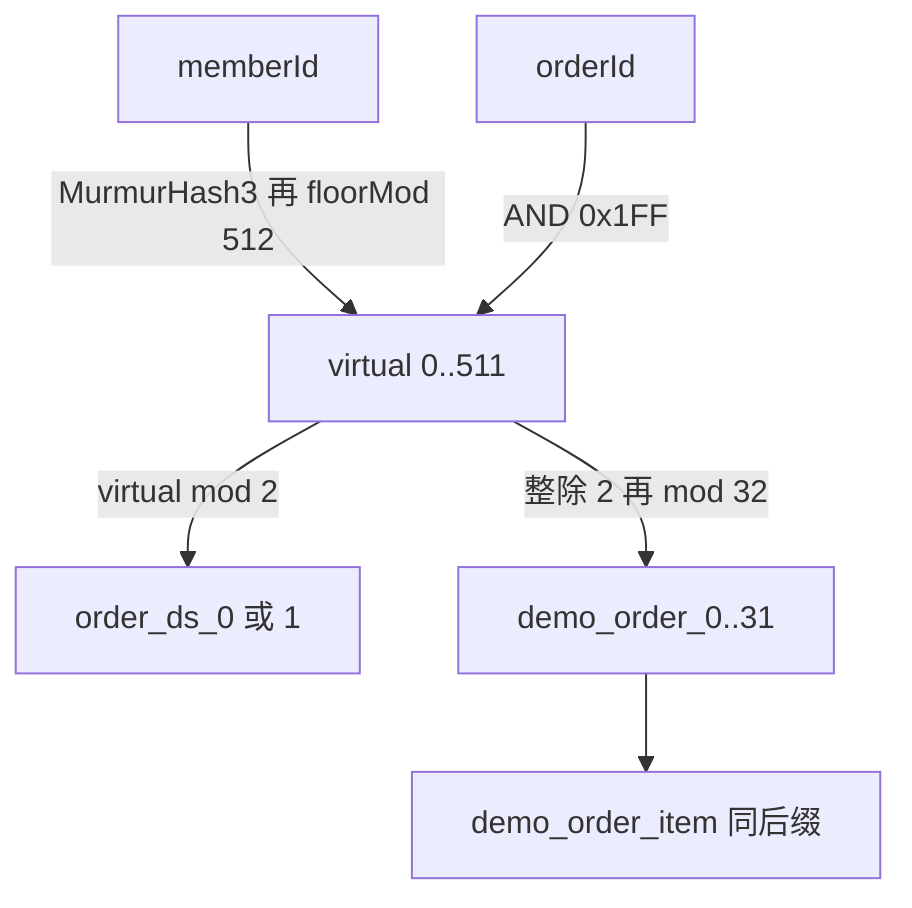
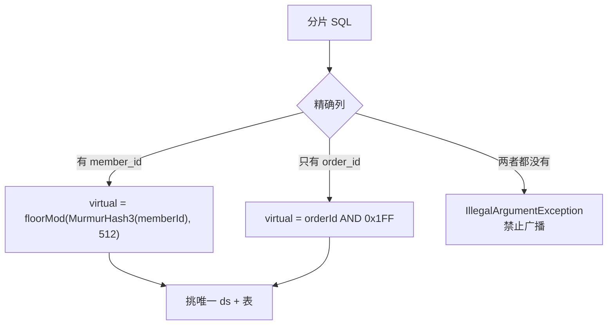
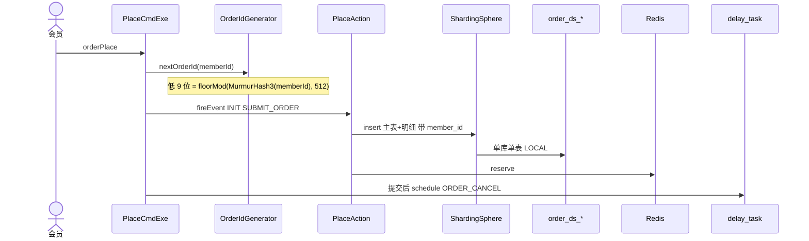

# 订单分库分表与订单号基因法 · 功能归档

**归档日期**: 2026-08-30（2026-09-23 并入槽位算法）  
**项目**: spring-ai-demo / demo2  
**状态**: 已实现  

**设计规范**: [2026-08-30-order-sharding-gene-design.md](../specs/2026-08-30-order-sharding-gene-design.md)、[2026-09-23-order-shard-murmur-virtual-design.md](../specs/2026-09-23-order-shard-murmur-virtual-design.md)、[2026-08-31-order-id-bit-layout-design.md](../specs/2026-08-31-order-id-bit-layout-design.md)  
**实施计划**: [2026-08-30-order-sharding-gene.md](../plans/2026-08-30-order-sharding-gene.md)、[2026-09-23-order-shard-murmur-virtual.md](../plans/2026-09-23-order-shard-murmur-virtual.md)  
**前置**: [2026-08-28-order-module-statemachine.md](./2026-08-28-order-module-statemachine.md)  
**参考代码**: `com.jason.demo.demo2.order.service.infrastructure.shard`

---

## 1. 做了什么

按 **用户 ID（`memberId`）** 对订单主表、明细做分库分表；订单号用**基因法**（低 9 bit 嵌入虚拟分片），超时关单、`selectById`、按单查明细只带 `orderId` 也能直达库表。

- 拓扑：**2 库 × 32 表**（逻辑分片 64）；天花板 **2 库 × 256 表**（基因仍 9 bit，扩表要搬行、不用改订单号）
- 接入：ShardingSphere-JDBC **5.5.2**，官方 `ShardingSphereDriver` + `shardingsphere.yaml`（5.3+ 已去掉 Spring Starter）
- 算法：`CLASS_BASED` 复合；有 `member_id` 用会员槽位，只有 `order_id` 拆基因，都没有则**禁止广播**
- 槽位：对整个会员号做 Guava `Hashing.murmur3_32_fixed().hashLong`（种子 0，小端 8 字节），再 `Math.floorMod(hash, 512)`。`512 = 2^9`，与 `hash & 0x1FF` 是同一个余数。依赖 `com.google.guava:guava:33.7.1-jre`（Spring Boot 4.1 BOM 不管 Guava）
- 主表与明细 **binding table**；`itemId` 仍普通雪花
- 绿场：新建 `order_ds_0` / `order_ds_1` 共 128 张表；不迁、不 DROP `spring_ai_agent2.demo_order*`
- 事务 **LOCAL**，不上 XA；热库存必须保持开启
- 调试：`POST /demo/orders/shardExplain`（不登录、不查库）+ 会员 Tab 右侧「分片调试」

初版槽位是 `memberId % 512`。Hutool 雪花最低 12 位是序号，会员逐个注册时序号恒为 0，余数恒为 0，订单全进 `order_ds_0.demo_order_0`。2026-09-23 改为哈希整段会员号；库表拆法、订单号位图、只拿订单号时的拆法不变。

**未做**：跨分片扫全表、旧雪花迁移、历史订单改号、`itemId` 基因、会员/商品/延时任务分片、XA、冷库存与分片同事务、2 库改 3 库、把 `VIRTUAL_COUNT` 做成配置。

---

## 2. 架构

应用只认一个 JDBC URL。逻辑表 `demo_order` / `demo_order_item` 进分片；会员、商品、延时任务走 `ds_default`。算法由 ShardingSphere 反射创建，**无 Spring 注入**，只调 `OrderShardGene`。



| 逻辑名 | 物理库 | 用途 |
|--------|--------|------|
| `ds_default` | `spring_ai_agent2` | 未配置逻辑表：会员、商品、延时任务 |
| `order_ds_0` / `order_ds_1` | 同名 schema | 订单主表 + 明细 |

`application.properties` 只改驱动与 URL，账密写在 yaml（SS **不解析** `${DB_PASSWORD}`）。

---

## 3. 基因与路由

基因是 64 位订单号最低 **9 bit**（`0x1FF`），外观仍是雪花长整型。

```text
hash    = MurmurHash3_x86_32(会员号小端 8 字节, seed = 0)
virtual = floorMod(hash, 512)     // 有 memberId；0..511
        = orderId & 0x1FF          // 只拿订单号时，不再哈希
ds      = virtual % 2
table   = (virtual / 2) % 32
```

不用已废弃的 `Hashing.murmur3_32()`，那份和参考实现不一致。哈希 `int` 可能为负，Java `%` 会得到负数，所以用 `floorMod`。

**禁止** `table = virtual % 32`：2 与 32 不互质，会出现一库只落偶数表。



例：`memberId=612` → 槽位 `61` → `order_ds_1.demo_order_30`。按初版 `% 512` 会是槽位 `100`、`order_ds_0.demo_order_18`。

页面验收：会员 `2102741891974955008` → 槽位 `153` → `order_ds_1.demo_order_12`，支付后 `COMPLETED` / `PAY_SUCCESS`。这个会员号按旧公式会进 `order_ds_0.demo_order_0`。

发号（2026-08-31 起）：位图 `[41 时间][5 机器][8 序号][9 基因]`，见
[2026-08-31-order-id-bit-layout-design.md](../specs/2026-08-31-order-id-bit-layout-design.md)。
低 9 位仍为基因；`itemId` 仍普通雪花。旧 embed 单只读仍可按基因路由。

扩到 2×256：只改 `TABLE_COUNT` 并搬行，库取模不变，**不用改订单号**。超出天花板（2×512 或 2 库改 3 库）不在本版。

---

## 4. 明确不用

| 做法 | 原因 |
|------|------|
| `memberId % 512` | 只用到雪花序号的低 9 位，逐个注册时槽位恒为 0 |
| Java `%` | 负哈希会得到负余数 |
| ShardingSphere `HASH_MOD` | 单列算法接不上「有会员用会员、只有订单号拆基因」；库 `% 2`、表 `% 32` 分开取还会让一个库只落偶数表 |
| `Long.hashCode` | 序号为 0 时，加 1 毫秒槽位不变 |
| `table = virtual % 32` | 2 与 32 不互质 |
| 已废弃的 `Hashing.murmur3_32()` | 与 `murmur3_32_fixed` 结果不一致，槽位会对不上 |

---

## 5. 路由决策

库策略和表策略共用同一个 CLASS_BASED 算法；`availableTargetNames` 分别是 `order_ds_*` 或 `demo_order_*` / `demo_order_item_*`。



| SQL 分片列 | 行为 |
|------------|------|
| 有 `member_id` | 用会员槽位；与订单号基因不一致则本分片无行 → 业务 404 |
| 只有 `order_id` | 拆基因（超时关单 / `findById`），不再哈希 |
| 两个都没有 | 抛错，禁止 64 表广播 |
| `IN` 多个 ID | 各值分别路由后去重；同基因则单节点 |

---

## 6. 下单时序（分片视角）

Action `@Transactional` 只保证**一个** `order_ds_*` 上的主表+明细。热库存改 Redis，不在 JDBC 事务。延时任务在提交之后写 `ds_default`。



超时关单仍只拿 `orderId`：`OrderExpireCmdExe` → `findById` → 算法拆基因 → 单库单表。

---

## 7. 数据与接入

绿场脚本：`src/main/resources/db/order-shard-schema.sql`。PowerShell 管道会坏 `DELIMITER`，用：

```bat
cmd /c "mysql -uroot -p123456 < demo2/src/main/resources/db/order-shard-schema.sql"
```

| 资源 | 说明 |
|------|------|
| `order_ds_0` / `order_ds_1` | 每库 `demo_order_0..31` + `demo_order_item_0..31` |
| `spring_ai_agent2.demo_order*` | 旧单表，应用不再读写，不 DROP |
| `shardingsphere.yaml` | 三数据源、binding、`!SINGLE ds_default.*`、`sql-show: true` |
| `application.properties` | `ShardingSphereDriver` + `jdbc:shardingsphere:classpath:shardingsphere.yaml` |

槽位改哈希后，分片库中此前按 `memberId % 512` 落下的 7 笔已删除，不迁移。

---

## 8. HTTP 与调试

业务接口形态不变（仍 `/demo/orders/preview|orderPlace|pay|…`）。另增：

| 路径 | 说明 |
|------|------|
| `POST /demo/orders/shardExplain` | 不登录、不查库；`orderId` 与 `memberId` 至少一个；都空 → `10002` |

会员 Tab 右侧「分片调试」：只填一个即可；下单成功回填最近 `orderId`。orderId 用**字符串**传，避免 JS 精度丢失。

算法日志：`order shard route, logic=…, virtual=…, ds=…, table=…, source=member_id|order_id`。

---

## 9. 包结构

```
order
├── app
│   ├── controller/OrderShardController
│   ├── executor/OrderShardExplainCmdExe、OrderPlaceCmdExe（改发号）
│   └── vo/req|res OrderShardExplain*
└── service
    ├── common/OrderShardSourceEnum
    └── infrastructure
        ├── shard/OrderShardGene、OrderIdGenerator、OrderComplexShardingAlgorithm
        └── repository/OrderRepository.findById 靠基因直达
```

槽位只改 `OrderShardGene.virtualOfMember`。`OrderIdGenerator` 已调用它，发号位图不用改。`shardingsphere.yaml` 不动。

---

## 10. 测试

`mvn "-Dtest=OrderShardGeneTest,OrderIdGeneratorTest,OrderComplexShardingAlgorithmTest,OrderShardExplainCmdExeTest,OrderPlaceCmdExeTest" test`（PowerShell 须给 `-Dtest` 加引号）。覆盖公式、禁止错误取模、位图发号（基因/机器/序号/回拨）、仅 member / 仅 order / 禁广播、调试三种输入。槽位改哈希后上述前四组共 19 条通过。

单测不启 128 张真实表。手工：会员 C 端注册登录 → 立即购买 → 提交订单 → 去支付；调试台只填 orderId / 只填 memberId → 日志单库单表、无 64 表广播。

---

## 11. 与 spec 的有意偏离

| 点 | spec | 实现 |
|----|------|------|
| 发号（初版） | 直接 `embed(nextId())` | 曾用 **synchronized + 撞号再取雪花** |
| 发号（2026-08-31） | — | **位图 `[时间][机器][序号][基因]`**，见 [order-id-bit-layout](../specs/2026-08-31-order-id-bit-layout-design.md) |
| 未分片表 | spec 写在 `!SHARDING.defaultDataSourceName` | **5.5.2 无此字段**；改 `!SINGLE` `tables: ds_default.*` |
| 槽位 plan | 写「不新增依赖」、手写 Murmur | 实现用 **Guava `murmur3_32_fixed` + `floorMod`** |

---

## 12. 变更记录

| 日期 | 说明 |
|------|------|
| 2026-08-30 | 启动验收：`!SHARDING.defaultDataSourceName` 在 5.5.2 非法，改为 `!SINGLE` |
| 2026-08-31 | 订单号改为机器+序号+基因位图，去掉 embed 撞号重试 |
| 2026-09-23 | 会员槽位改为 Guava MurmurHash3 + `floorMod(hash, 512)`；分片库中此前按旧公式落下的 7 笔已删除，不迁移。本归档并入原 `2026-09-23-order-shard-murmur-virtual.md` |
