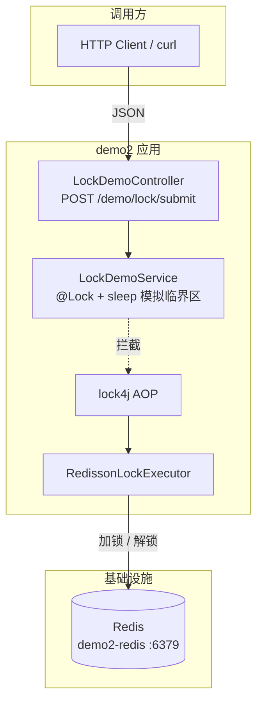
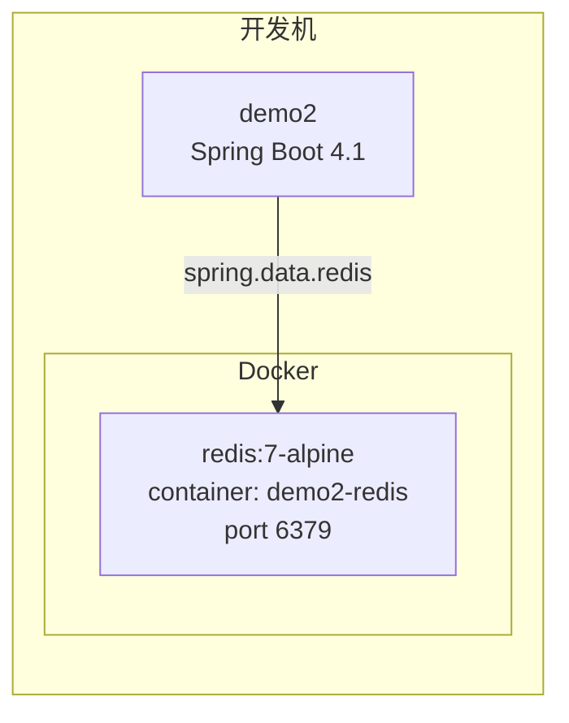
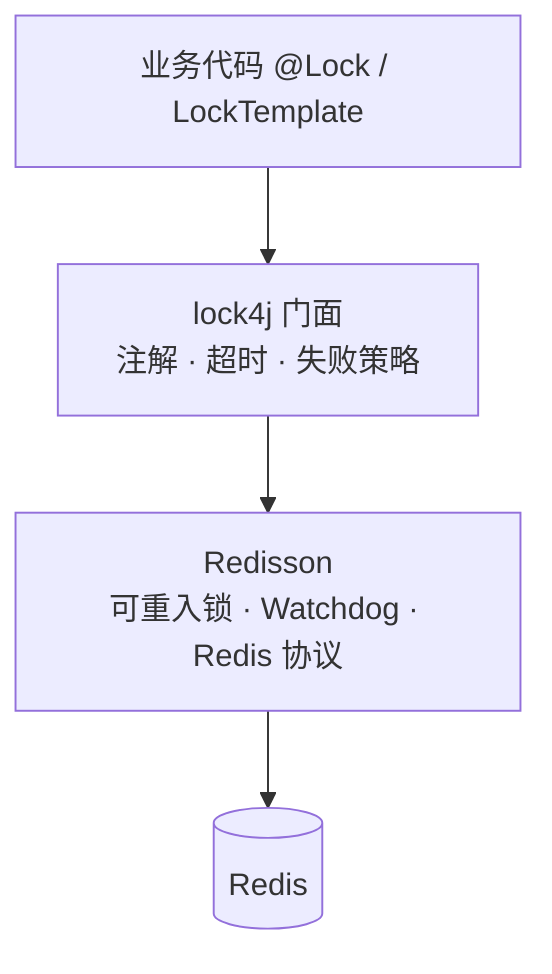
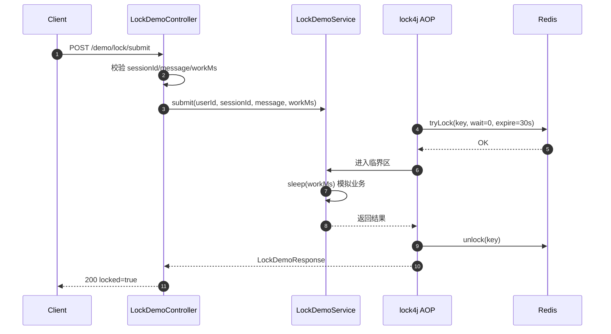
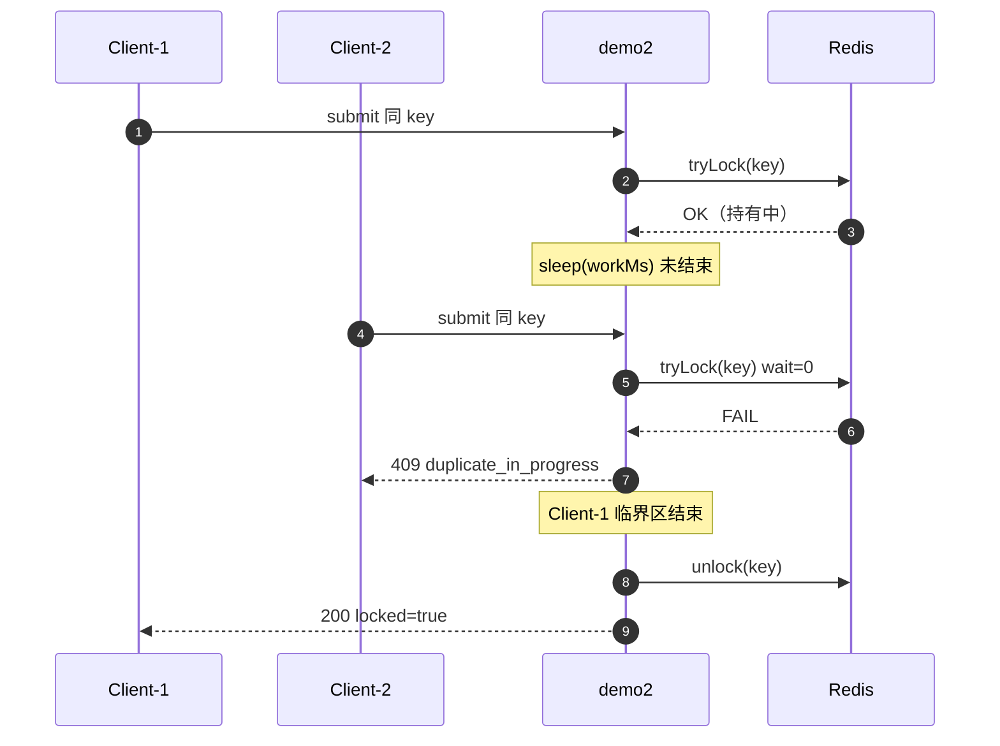
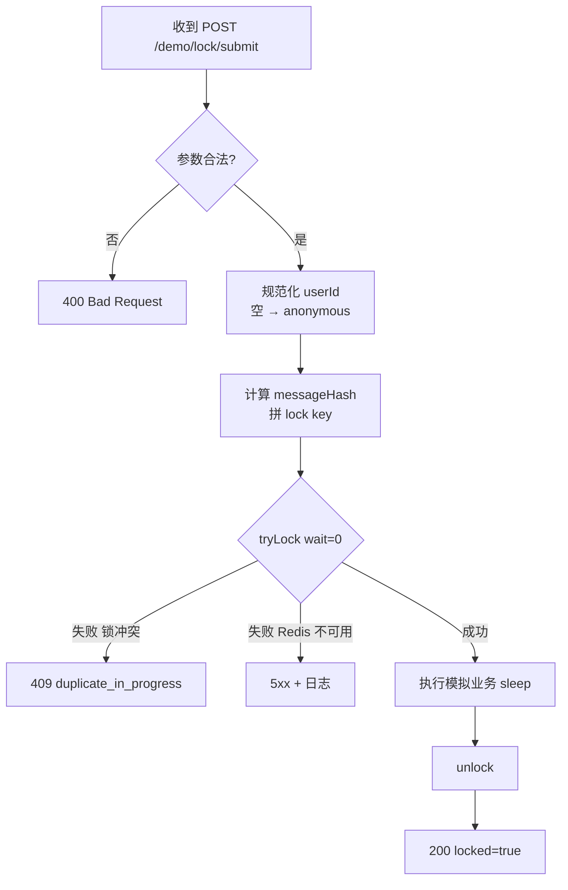
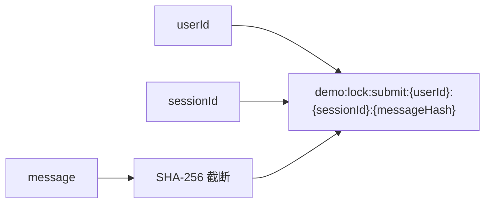
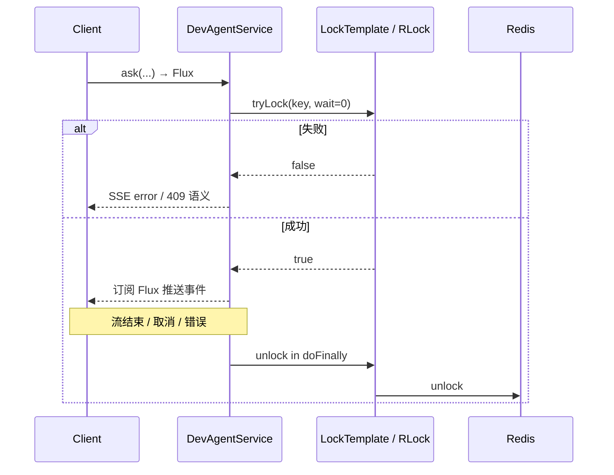

# demo2 分布式锁（lock4j + Redisson）设计规范

**日期**: 2026-08-05  
**项目**: spring-ai-demo / demo2  
**状态**: 已确认，待实现  

---

## 1. 背景与目标

### 1.1 问题

demo2 需要可复用的分布式锁能力，用于防并发、防重复提交。仓库内尚无 Redis / Redisson / lock4j；后续业务（如 Agent ask）可能接入，但本版先用独立 demo 验证栈是否可用。

选型对比结论（已确认）：

| 方案 | 结论 |
|------|------|
| 纯 Redisson | 适合 SSE 长临界区；本版暂不选 |
| **lock4j + Redisson** | **本版采用**；注解适合同步 demo；后续 SSE 场景改用 `LockTemplate` / 编程式 |
| Spring Data Redis 自写 SET NX | 续期成本高，不选 |

说明：lock4j 是锁门面；Redisson 是执行后端。二者不是同一层级。

### 1.2 目标

1. 在 demo2 引入 Redis（Docker）与 **lock4j + Redisson**。
2. 新增独立 demo 控制器，演示「同 key 互斥、冲突立即失败」。
3. 锁 key 维度对齐业务约定：`userId + sessionId + message`。
4. 不改现有 `/agentscope/dev-agent/ask`。

### 1.3 已确认决策

| 维度 | 选择 |
|------|------|
| 模块 | demo2（Spring Boot 4.1 / Java 21） |
| 技术栈 | lock4j + Redisson 后端 |
| 首版接入点 | 新建 demo 控制器，非 DevAgent |
| 互斥维度 | `userId + sessionId + message` |
| 冲突行为 | 拿不到锁立即失败（不排队、不等待） |
| 锁持有 | 同步方法执行期间持有；方法结束释放（demo 用 `sleep` 模拟耗时） |
| Redis | 本地 Docker 引入；本版无密码、非集群 |

### 1.4 非目标（本版不做）

- 改造 `/agentscope/dev-agent/ask` 或任意 AgentScope SSE 接口
- 幂等落库 / 去重表 / 客户端 `requestId` 协议
- ZooKeeper 或其它 lock4j 后端
- Redis 密码、Sentinel、Cluster
- 通用业务封装推广到全项目（本版止于 demo + 基础设施）

---

## 2. 架构

### 2.1 逻辑架构



### 2.2 部署关系（本版）



### 2.3 组件职责

| 单元 | 职责 | 依赖 |
|------|------|------|
| Docker Redis | 提供单机 Redis | 无 |
| lock4j + Redisson starter | 自动配置锁执行器 | Redis 可达 |
| `LockDemoService` | 声明锁 key、模拟临界区 | lock4j |
| `LockDemoController` | HTTP 入参校验、冲突 → 409 | Service |

### 2.4 技术分层（lock4j vs Redisson）



本版业务只依赖 lock4j 注解；Redisson 作为 executor，不在 demo 代码里直接调 `RLock`（除非排查问题）。

---

## 3. API 与锁行为

### 3.1 接口

- **Method / Path**: `POST /demo/lock/submit`
- **Content-Type**: `application/json`

**Request**

| 字段 | 类型 | 必填 | 说明 |
|------|------|------|------|
| `userId` | string | 否 | 空则按 `anonymous` |
| `sessionId` | string | 是 | 会话标识 |
| `message` | string | 是 | 业务内容；参与锁 key |
| `workMs` | int | 否 | 临界区模拟耗时，默认 `3000`，上限 `20000` |

**Response 成功（200）**

```json
{
  "locked": true,
  "key": "demo:lock:submit:{userId}:{sessionId}:{messageHash}",
  "elapsedMs": 3001,
  "echo": "原始 message"
}
```

**Response 冲突（409）**

```json
{
  "locked": false,
  "reason": "duplicate_in_progress"
}
```

### 3.2 锁约定

- **key 模板**: `demo:lock:submit:{userId}:{sessionId}:{messageHash}`
- **messageHash**: 对 `message` 做稳定短哈希（如 SHA-256 截断），避免超长 key / 特殊字符；响应中 `echo` 仍回显原文
- **acquireTimeout**: `0`（立即失败）
- **expire**: 建议 `30s`（覆盖默认 `workMs` 并留余量；异常路径靠过期兜底）
- **实现方式**: Service 方法上 `@Lock`；Controller 捕获 lock4j 锁失败异常并映射 409（或小型 `@RestControllerAdvice` 仅处理该异常）

### 3.3 验收场景

1. 同 `userId + sessionId + message` 并发两次：第一次进入 sleep，第二次立刻 409。
2. 不同 `message` 或不同 `sessionId`：可同时成功。
3. 第一次结束后再提交相同 key：应成功。

### 3.4 成功路径时序



### 3.5 重复提交冲突时序



### 3.6 请求处理流程图



### 3.7 锁 Key 构成



---

## 4. 基础设施与配置

### 4.1 Docker

新增 `demo2/docker/redis/docker-compose.yml`：

- 镜像：`redis:7-alpine`
- 容器名：`demo2-redis`
- 端口：`6379:6379`
- 风格对齐 `demo2/docker/agentscope-postgres/docker-compose.yml`（注释写明 up/down 命令）
- 本版无 volume 持久化要求（可选挂载；不做也不阻塞）

启动：

```bash
docker compose -f demo2/docker/redis/docker-compose.yml up -d
```

### 4.2 应用配置

在 `application.properties` 增加（名称以实现时 starter 文档为准，语义固定）：

- `spring.data.redis.host=127.0.0.1`
- `spring.data.redis.port=6379`
- lock4j：`acquire-timeout=0`、合理默认 `expire`
- Redisson 地址与 Spring Redis 对齐，避免两套 host/port

依赖选型原则：优先 `lock4j-redisson-spring-boot-starter`（或官方推荐的 Boot 3/4 兼容坐标）；**实现时核验与 Spring Boot 4.1 的兼容版本**，不兼容则固定经验证的 lock4j + redisson 版本组合。

### 4.3 代码落点（建议包路径）

- `com.jason.demo.demo2.controller.LockDemoController`
- `com.jason.demo.demo2.service.LockDemoService`
- `com.jason.demo.demo2.model.LockDemoRequest` / `LockDemoResponse`

---

## 5. 错误与边界

| 情况 | 行为 |
|------|------|
| 锁冲突 | HTTP 409 + `duplicate_in_progress` |
| Redis 不可用 | 加锁失败 → 5xx + 清晰日志；**不**静默跳过锁 |
| `workMs` 超上限 | 校验拒绝（400）或钳制到上限；实现时二选一，推荐 **400** |
| `userId` 为空 | 使用 `anonymous` |
| `sessionId` / `message` 空白 | Bean Validation 400 |

---

## 6. 测试与手工验证

- 最低：README 或控制器旁注释给出两条并发 curl 示例。
- 自动化：若引入成本低，可用 Testcontainers Redis 做「并发第二请求 409」集成测试；否则 Service 层在可 mock 的锁门面下做行为测试。不强制本版上 Testcontainers。
- 手工：先起 Redis，再起 demo2，按 §3.3 验收。

---

## 7. 后续（明确不在本版）

将同一套锁接到 SSE `/agentscope/dev-agent/ask` 时：

- **不要**直接把 `@Lock` 打在返回 `Flux` 的方法上（方法返回即可能解锁）。
- 应改为 `LockTemplate` / Redisson 编程式，`tryLock` 失败立即拒，在 Flux `doFinally` 释放。



本版 demo 只证明「基础设施 + 注解同步路径」可用。
