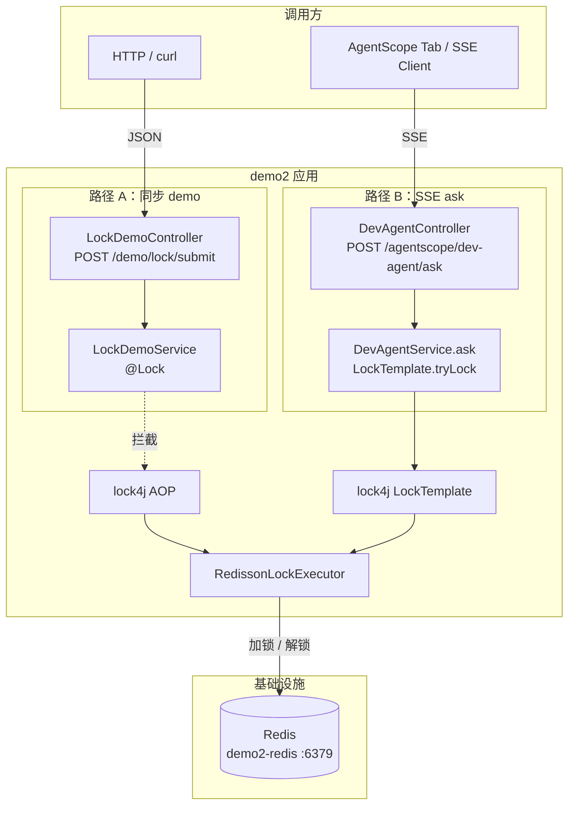
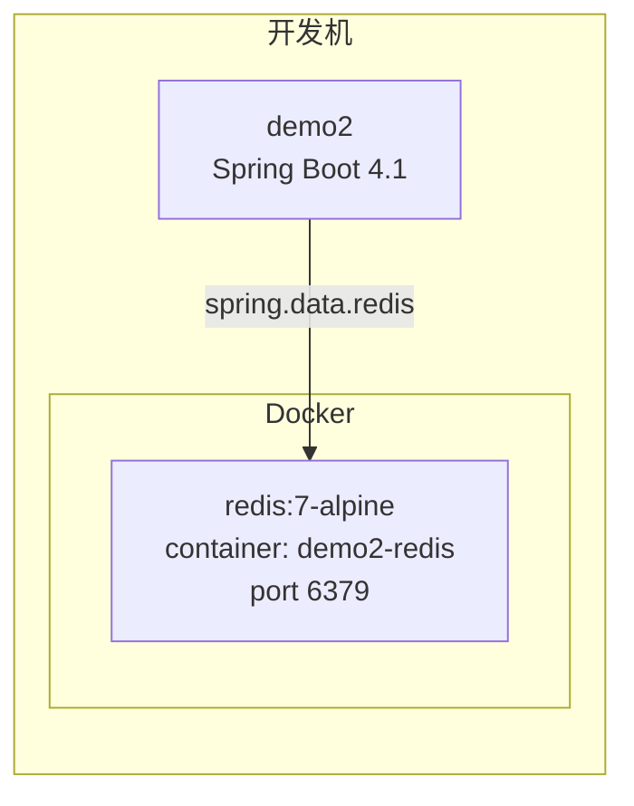
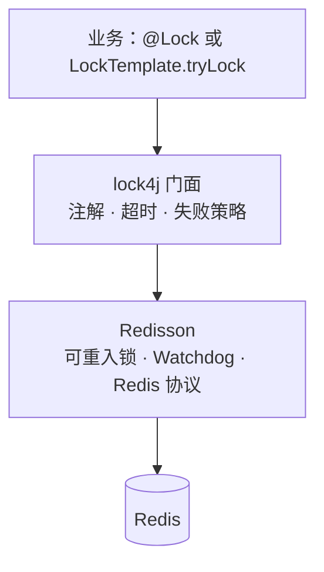
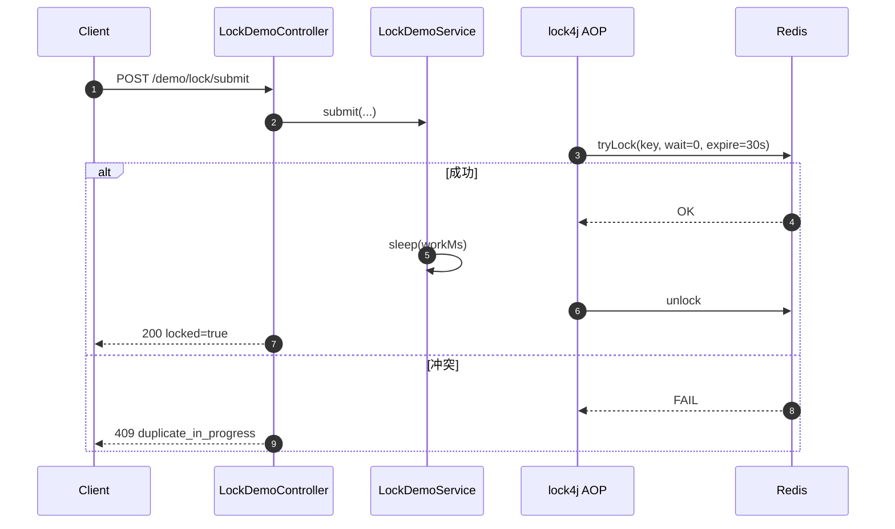
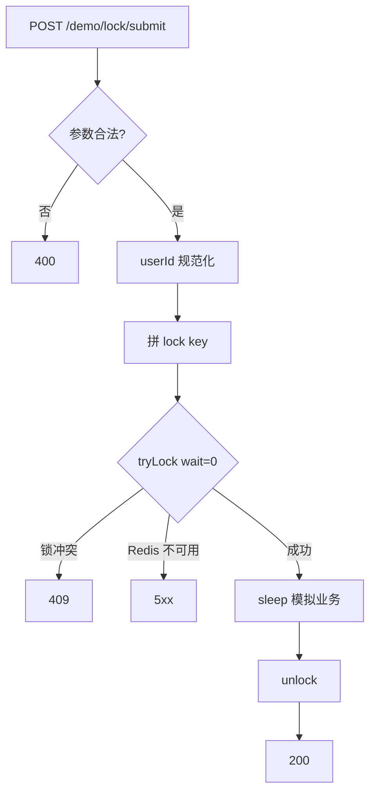
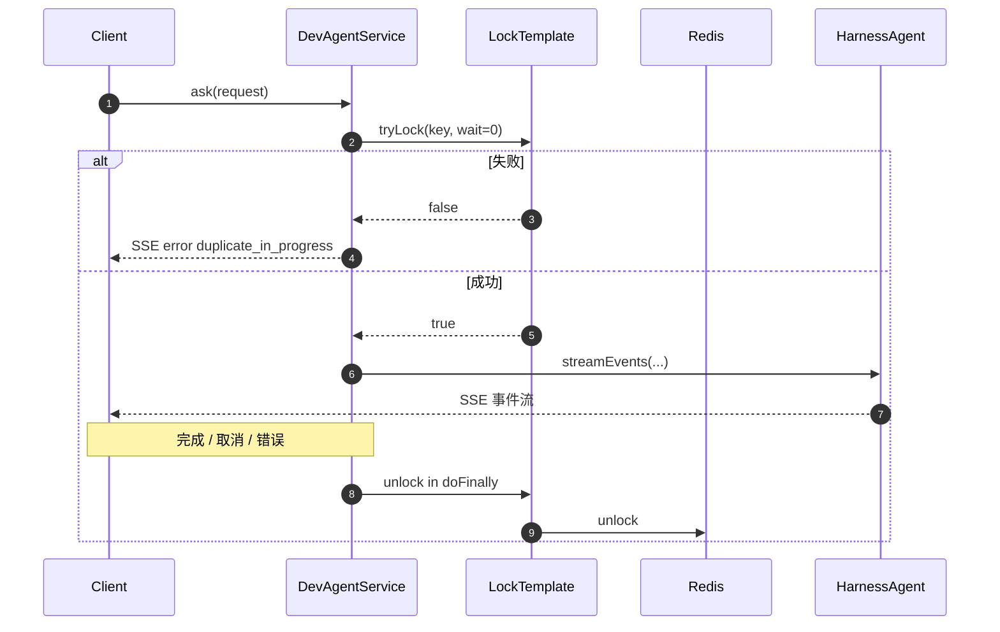

# demo2 分布式锁（lock4j + Redisson）设计规范

**日期**: 2026-08-05  
**项目**: spring-ai-demo / demo2  
**状态**: 已确认，待实现  

---

## 1. 背景与目标

### 1.1 问题

demo2 需要可复用的分布式锁能力，用于防并发、防重复提交。仓库内尚无 Redis / Redisson / lock4j。

选型对比结论（已确认）：

| 方案 | 结论 |
|------|------|
| 纯 Redisson | 可行，但本版希望统一走 lock4j 门面 |
| **lock4j + Redisson** | **本版采用**：同步场景用 `@Lock`；SSE 场景用编程式 `tryLock` |
| Spring Data Redis 自写 SET NX | 续期成本高，不选 |

说明：lock4j 是锁门面；Redisson 是执行后端。二者不是同一层级。

### 1.2 目标

1. 在 demo2 引入 Redis（Docker）与 **lock4j + Redisson**。
2. **路径 A**：新增 `POST /demo/lock/submit`，用 `@Lock` 演示同步防重复。
3. **路径 B**：改造 `POST /agentscope/dev-agent/ask`，用编程式 `tryLock` + Flux `doFinally` 解锁，防同内容重复提交。
4. 锁 key 维度：`userId + sessionId + message`（message 做短哈希）。

### 1.3 已确认决策

| 维度 | 选择 |
|------|------|
| 模块 | demo2（Spring Boot 4.1 / Java 21） |
| 技术栈 | lock4j + Redisson 后端 |
| 接入点 | demo 控制器（注解）+ `DevAgentService.ask`（编程式） |
| 互斥维度 | `userId + sessionId + message` |
| 冲突行为 | 拿不到锁立即失败（不排队、不等待） |
| demo 锁持有 | 同步方法执行期间；`sleep` 模拟耗时 |
| ask 锁持有 | 整轮 SSE Flux 生命周期；`doFinally` 释放 |
| ask 冲突响应 | SSE `DevAgentEvent.error(..., "duplicate_in_progress")`（保持现有 error 事件风格） |
| Redis | 本地 Docker；本版无密码、非集群 |
| 与进程内 Semaphore | 保留 `sandboxRequestLock`；职责不同，可并存 |

### 1.4 非目标（本版不做）

- 给 `/confirm`、`/apply-diff` 或其它 AgentScope SSE 加分布式锁
- 幂等落库 / 去重表 / 客户端 `requestId` 协议
- ZooKeeper 或其它 lock4j 后端
- Redis 密码、Sentinel、Cluster
- 把 `@Lock` 打在返回 `Flux` 的方法上
- 通用业务封装推广到全项目所有接口

---

## 2. 架构

### 2.1 双路径逻辑架构



### 2.2 部署关系（本版）



### 2.3 组件职责

| 单元 | 职责 | 依赖 |
|------|------|------|
| Docker Redis | 提供单机 Redis | 无 |
| lock4j + Redisson starter | 自动配置锁执行器 | Redis 可达 |
| `LockDemoService` | `@Lock` + 模拟临界区 | lock4j 注解 |
| `LockDemoController` | HTTP 校验、冲突 → 409 | Service |
| `DevAgentService.ask` | 编程式 tryLock；Flux.doFinally 解锁 | lock4j `LockTemplate`（或等价 API） |
| `sandboxRequestLock` | 进程内限制沙箱并发 | 与分布式锁无关，保留 |

### 2.4 技术分层（lock4j vs Redisson）



业务优先只依赖 lock4j API；不直接调 Redisson `RLock`（除非排查或 lock4j 无法表达续期需求）。

---

## 3. 路径 A：Demo API（注解）

### 3.1 接口

- **Method / Path**: `POST /demo/lock/submit`
- **Content-Type**: `application/json`

**Request**

| 字段 | 类型 | 必填 | 说明 |
|------|------|------|------|
| `userId` | string | 否 | 空则按 `anonymous` |
| `sessionId` | string | 是 | 会话标识 |
| `message` | string | 是 | 业务内容；参与锁 key |
| `workMs` | int | 否 | 临界区模拟耗时，默认 `3000`，上限 `20000` |

**Response 成功（200）**

```json
{
  "locked": true,
  "key": "demo:lock:submit:{userId}:{sessionId}:{messageHash}",
  "elapsedMs": 3001,
  "echo": "原始 message"
}
```

**Response 冲突（409）**

```json
{
  "locked": false,
  "reason": "duplicate_in_progress"
}
```

### 3.2 锁约定

- **key**: `demo:lock:submit:{userId}:{sessionId}:{messageHash}`
- **messageHash**: SHA-256 截断等稳定短哈希
- **acquireTimeout**: `0`
- **expire**: 建议 `30s`
- **实现**: Service `@Lock`；锁失败异常 → 409

### 3.3 验收场景

1. 同 key 并发两次：第一次 sleep 中，第二次立刻 409。
2. 不同 `message` / `sessionId`：可同时成功。
3. 第一次结束后再提交相同 key：应成功。

### 3.4 成功 / 冲突时序



### 3.5 请求处理流程



---

## 4. 路径 B：DevAgent `/ask`（编程式）

### 4.1 接入点

- 改造 `DevAgentService.ask(DevAgentRequest)`（Controller 签名不变）。
- **禁止**在返回 `Flux` 的方法上使用 `@Lock`（方法返回即可能提前解锁）。
- 使用 lock4j `LockTemplate`（或项目内薄封装）编程式：
  1. 计算 key → `tryLock(wait=0, expire=…)`
  2. 失败 → `Flux.just(DevAgentEvent.error(sessionId, "duplicate_in_progress"))`（经现有 `withRequestContext` 包装，与现有 error 风格一致）
  3. 成功 → 返回原 ask Flux，并 `doFinally(signal -> unlock)`

### 4.2 锁约定

| 项 | 值 |
|----|-----|
| key | `agentscope:dev-agent:ask:{userId}:{sessionId}:{messageHash}` |
| acquireTimeout | `0` |
| expire | 建议 `10m` 量级，或启用可续期（Watchdog / lock4j 等价能力）；须覆盖一轮长 SSE |
| userId | 复用现有 `normalizeUserId`（空 → 与现逻辑一致） |

### 4.3 时序



### 4.4 与进程内 Semaphore

现有 `sandboxRequestLock` 解决「同一 HarnessAgent 沙箱不可并发」。分布式锁解决「跨实例 / 同内容重复提交」。二者并存，互不替代。

### 4.5 验收场景

1. 同 `userId + sessionId + message` 在 ask 进行中再 ask：第二次收到 error `duplicate_in_progress`。
2. 不同 message：可并行（仍可能受 `sandboxRequestLock` 串行沙箱影响，属既有行为）。
3. 第一轮 SSE 结束后再同内容 ask：应成功。
4. 客户端中断 SSE：锁须释放（`doFinally`），允许立即重试。

---

## 5. 基础设施与配置

### 5.1 Docker

新增 `demo2/docker/redis/docker-compose.yml`：

- 镜像：`redis:7-alpine`
- 容器名：`demo2-redis`
- 端口：`6379:6379`
- 风格对齐 `demo2/docker/agentscope-postgres/docker-compose.yml`

```bash
docker compose -f demo2/docker/redis/docker-compose.yml up -d
```

### 5.2 应用配置

- `spring.data.redis.host=127.0.0.1`
- `spring.data.redis.port=6379`
- lock4j 全局默认 `acquire-timeout=0`；路径级 expire 可覆盖
- Redisson 地址与 Spring Redis 对齐

依赖：优先 `lock4j-redisson-spring-boot-starter`；**实现时核验 Spring Boot 4.1 兼容版本**。

### 5.3 代码落点

**路径 A**

- `com.jason.demo.demo2.controller.LockDemoController`
- `com.jason.demo.demo2.service.LockDemoService`
- `com.jason.demo.demo2.model.LockDemoRequest` / `LockDemoResponse`

**路径 B**

- `DevAgentService.ask` 内编程式加锁
- 可选：`com.jason.demo.demo2.lock.LockKeys`（或 agentscope 包内工具）统一 messageHash / key 拼接，供两条路径复用哈希逻辑

---

## 6. 错误与边界

| 情况 | 路径 A（demo） | 路径 B（ask） |
|------|----------------|---------------|
| 锁冲突 | HTTP 409 + JSON | SSE `DevAgentEvent.error` + `duplicate_in_progress` |
| Redis 不可用 | 5xx + 日志；不静默跳过锁 | 同样不静默跳过；返回 error 事件或 Flux.error，并打日志 |
| `workMs` 超上限 | 400 | N/A |
| `userId` 空 | `anonymous` | 现有 `normalizeUserId` |
| `sessionId` / `message` 空白 | Bean Validation 400 | 现有校验 / 行为 |

---

## 7. 测试与手工验证

- **路径 A**：并发 curl；可选 Testcontainers（不强制）。
- **路径 B**：手工双开同内容 ask；中断流后确认可重试；单测可 mock `LockTemplate` 验证失败分支返回 error 事件。
- 先起 Redis，再起 demo2。

---

## 8. 明确不在本版

- `/confirm`、`/apply-diff` 分布式锁
- AG-UI 通道单独加锁（若与 ask 共用 Service，则随 `ask` 自然覆盖；否则另开需求）
- 将分布式锁替换 `sandboxRequestLock`
