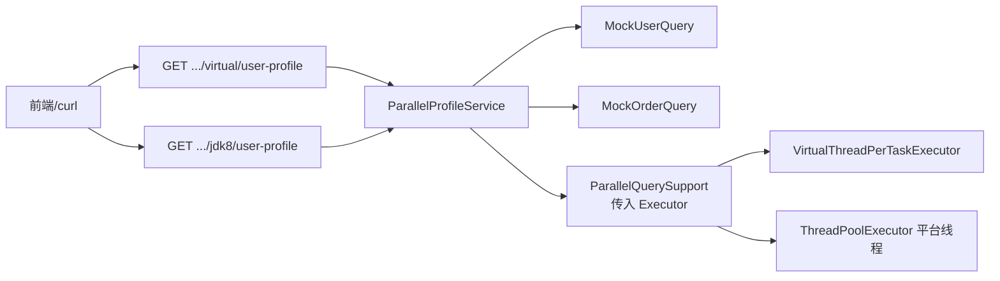

# demo2 并行查询聚合设计规范

**日期**: 2026-08-05  
**项目**: spring-ai-demo / demo2  
**状态**: 已确认，待实现  

---

## 1. 背景与目标

### 1.1 问题

业务接口常需同时拉取多路**互不影响**的数据（例如用户信息 + 用户订单），串行查询会放大延迟。需要：

1. 多路并行执行，再融合返回前端。
2. 某一路失败或超时时，**不影响其它路**（部分成功）。
3. 可复用的并行聚合能力，并用 Demo 对照两种线程模型。

仓库内已有相近先例：`MultiAgentService` 使用虚拟线程 + `CompletableFuture`；`spring.threads.virtual.enabled=true`。本版将其沉淀为可复用工具，并增加 JDK8 经典线程池对照 Demo。

### 1.2 目标

1. 提供通用 `ParallelQuerySupport`：多路 `Supplier` + 墙钟总超时 + 按路结果/`null`。
2. Demo 业务：Mock 用户信息与订单并行聚合，扁平响应返回前端。
3. **两个 Demo 入口**，业务与超时语义相同，仅线程模型不同：
   - 虚拟线程（`newVirtualThreadPerTaskExecutor()`）
   - JDK8 风格平台线程池（手写 `ThreadPoolExecutor`：按 CPU 定核心/最大线程、队列、拒绝策略等；**不用** `Executors.newFixedThreadPool`）

### 1.3 已确认决策

| 维度 | 选择 |
|------|------|
| 模块 | demo2（Spring Boot / Java 21） |
| 失败策略 | 部分成功：失败路 `null`，成功路照常返回 |
| 超时策略 | 墙钟总预算默认 **3s**；未完成路视为失败 → `null` |
| 超时对外 | 只打日志，不把超时/异常细节返回前端 |
| 响应形态 | 扁平字段：`{ "user": ...\|null, "orders": ...\|null }` |
| HTTP | Demo 约定始终 **200**（含部分成功） |
| 数据源 | Mock（可 sleep / 抛异常，便于演示） |
| 范围 | 通用工具 + 双 Demo 接口 |
| 虚拟线程 Demo | `CompletableFuture.supplyAsync(..., vtExecutor)` |
| JDK8 Demo | 手写 `ThreadPoolExecutor`（CPU 动态 sizing + 队列 + 拒绝策略）+ `CompletableFuture`；**不使用虚拟线程**；**不用** `newFixedThreadPool` |

### 1.4 非目标（本版不做）

- 真实 DB / 外部 HTTP 接入
- 带 `success` / `errorCode` 的每路包装响应
- 全有或全无、主从关键路径降级
- 将现有 `MultiAgentService` 迁移到新工具（可后续再做）
- 响应式 `Mono.zip` / WebClient 编排作为本版主路径
- JDK8 Demo 使用 `Executors.newFixedThreadPool` / `newCachedThreadPool` 等便捷工厂（改用手写 `ThreadPoolExecutor`）

---

## 2. 架构

### 2.1 逻辑架构



### 2.2 组件职责

| 组件 | 职责 | 依赖 |
|------|------|------|
| `ParallelQuerySupport` | 提交多路任务、墙钟等待、按路收集结果/`null`；异常与超时只记日志 | 调用方传入的 `Executor` |
| `ParallelProfileService` | Demo：并行查用户 + 订单，拼扁平响应 | Support + Mock 查询 |
| `MockUserQuery` / `MockOrderQuery` | 可配置 delay / fail，模拟成功、失败、超时 | 无 |
| Controller | 暴露两个路径，分别绑定 VT / JDK8 线程池 | Service + 对应 `Executor` Bean |

**边界**：Support 不关心业务字段名；Service 负责把各路结果映射到 `user` / `orders`。

---

## 3. 超时与错误处理

### 3.1 墙钟总预算

- 默认 **3 秒**（可配置，如 `demo.parallel.timeout=3s`）。
- 从发起并行提交起算。
- 等待条件：「全部完成」与「到达总预算」二者先到者结束收集。

### 3.2 单路结果判定

| 状态 | 该路返回值 | 日志 |
|------|------------|------|
| 完成且无异常 | 业务数据 | 可选 debug |
| 完成但抛异常 | `null` | error/warn：任务名 + 异常 |
| 超时仍未完成 | `null` | warn：任务名 + 超时；尽量 `cancel(true)` |

`cancel(true)`：Mock 的 `Thread.sleep` 应响应中断；真实 I/O 是否立刻停止视实现而定，本版以「结果按 null、日志已记」为准。

### 3.3 示例

- 用户查询耗时 2s 成功，订单查询需 4s → 约在 3s 返回：
  - `user`：有数据
  - `orders`：`null`
  - 订单超时仅写日志，不向前端暴露超时异常信息。

### 3.4 接口层约定

- HTTP **200**（含双路 null、单路 null）。
- 不因部分失败改为 5xx（本 Demo 约定；生产可另议）。

---

## 4. API 与 Mock

### 4.1 接口

| 方法 | 路径 | 线程模型 |
|------|------|----------|
| GET | `/demo/parallel/virtual/user-profile?userId=` | 虚拟线程池 |
| GET | `/demo/parallel/jdk8/user-profile?userId=` | JDK8 `ThreadPoolExecutor` 平台线程池 |

可选 query（演示用，名称实现时可微调）：

| 参数 | 含义 |
|------|------|
| `userId` | 用户 ID（必填或默认演示值） |
| `orderDelayMs` | 订单 Mock 延迟毫秒 |
| `userDelayMs` | 用户 Mock 延迟毫秒 |
| `orderFail` | `true` 时订单 Mock 抛异常 |
| `userFail` | `true` 时用户 Mock 抛异常 |

### 4.2 响应示例

全部成功：

```json
{
  "user": { "userId": "u1", "name": "Alice" },
  "orders": [{ "orderId": "o1", "amount": 99.0 }]
}
```

订单超时或失败：

```json
{
  "user": { "userId": "u1", "name": "Alice" },
  "orders": null
}
```

### 4.3 线程模型对照

| Demo | Executor | 风格要点 |
|------|----------|----------|
| virtual | `Executors.newVirtualThreadPerTaskExecutor()` | Java 21 虚拟线程 |
| jdk8 | 手写 `new ThreadPoolExecutor(...)` 多参数构造；进程内单例 Bean，应用关闭时 `shutdown` | JDK8 经典平台线程池；编排用 Java 8 起的 `CompletableFuture`；**禁止**虚拟线程；**禁止** `Executors.newFixedThreadPool` / `newCachedThreadPool` 等便捷工厂（便于演示完整参数） |

**JDK8 `ThreadPoolExecutor` 默认参数（可配置覆盖）**

设 `N = Runtime.getRuntime().availableProcessors()`：

| 参数 | 默认 | 说明 |
|------|------|------|
| `corePoolSize` | `N` | 按 CPU 核数 |
| `maximumPoolSize` | `N * 2` | I/O 型并行查询略放大 |
| `keepAliveTime` | `60s` | 非核心线程空闲回收 |
| `unit` | `TimeUnit.SECONDS` | `keepAliveTime` 的时间单位 |
| `workQueue` | `ArrayBlockingQueue(200)` | 有界队列，避免无界堆积 |
| `threadFactory` | 命名前缀 `parallel-jdk8-` | 便于日志排查 |
| `handler` | `CallerRunsPolicy` | 队列满时由调用线程执行，背压且不直接丢弃（Demo 默认；可改为 `AbortPolicy` 等） |

### 4.4 `ThreadPoolExecutor` 参数说明与用法

构造方法（本 Demo 使用的完整形态）：

```java
new ThreadPoolExecutor(
    corePoolSize,
    maximumPoolSize,
    keepAliveTime,
    unit,
    workQueue,
    threadFactory,
    handler
);
```

**任务提交时的大致顺序**（理解参数怎么配合）：

1. 若当前线程数 `< corePoolSize` → **新建线程**执行任务（即使有空闲线程，默认也会先凑满核心数；可用 `prestartAllCoreThreads` 预热）。
2. 若已达核心数 → 任务进入 **`workQueue`** 排队。
3. 若队列已满且线程数 `< maximumPoolSize` → **再建线程**（到最大为止）执行。
4. 若队列满且已达最大线程数 → 触发 **`handler` 拒绝策略**。

因此：不是「先扩到 max 再排队」，而是 **先核心 → 再入队 → 队列满才扩到 max → 再满才拒绝**。

#### `corePoolSize`（核心线程数）

- **含义**：池中常驻（默认不超时回收）的线程数量下限目标。
- **怎么用**：CPU 密集可取 `N` 或 `N+1`；本 Demo 查询偏 I/O/sleep，取 `N` 作起点即可。
- **注意**：核心线程默认不会因 `keepAliveTime` 退出；若希望核心也回收，需 `allowCoreThreadTimeOut(true)`（本版默认不开启）。

#### `maximumPoolSize`（最大线程数）

- **含义**：池允许的线程数上限（含核心）。
- **怎么用**：只有队列满时才会从 `core` 扩到 `max`。I/O 等待多时可设 `N*2`；若队列很大而 max 只比 core 大一点，扩容几乎用不上。
- **约束**：必须 `maximumPoolSize >= corePoolSize`，否则构造/运行会出问题。

#### `keepAliveTime` + `unit`

- **含义**：超出核心数的那些线程，空闲超过该时间后被回收。
- **怎么用**：本 Demo 默认 `60s` + `TimeUnit.SECONDS`。流量脉冲过后可把临时线程收回，避免长期占着多余平台线程。
- **和核心的关系**：默认只作用于「非核心」线程；核心是否回收看 `allowCoreThreadTimeOut`。

#### `workQueue`（工作队列）

- **含义**：核心线程忙时，新任务先放这里等。
- **本 Demo 选择**：`new ArrayBlockingQueue<>(queueCapacity)`（有界、数组实现、公平性默认非公平）。
- **怎么用**：
  - **有界队列**（推荐 Demo/生产默认思路）：容量满了才扩容/拒绝，能形成背压，避免任务无限堆积占内存。
  - **无界 `LinkedBlockingQueue`**：`newFixedThreadPool` 内部就是这种 → 队列几乎永不满 → **`maximumPoolSize` 形同虚设**，拒绝策略也很难触发；这也是本版不用它的原因之一。
  - **`SynchronousQueue`**：不存储任务，来一个尝试交给线程；常配合较大 `max`（类似 cached 风格），本 Demo 不采用。
- **容量建议**：按「可接受排队延迟 × 预计 QPS」粗估；本 Demo 默认 `200`，可用配置改。

#### `threadFactory`（线程工厂）

- **含义**：创建池内线程的工厂，可设名称、是否 daemon、优先级、UncaughtExceptionHandler。
- **怎么用**：本 Demo 用自定义工厂，线程名形如 `parallel-jdk8-1`、`parallel-jdk8-2`，方便日志、jstack 对照。
- **建议**：业务池不要用默默无名字的工厂；daemon 一般 `false`，避免进程退出时任务被粗暴掐断（关闭靠 `shutdown`）。

#### `handler`（拒绝策略 `RejectedExecutionHandler`）

- **含义**：队列满且线程数已到 `maximumPoolSize`（或池已 shutdown）时，如何处理新任务。
- **JDK 内置四种，怎么用**：

| 策略 | 行为 | 适用 |
|------|------|------|
| `CallerRunsPolicy`（本 Demo 默认） | 由**提交任务的线程**自己跑这个任务 | 温和背压：拖慢提交方，尽量不丢任务 |
| `AbortPolicy`（ThreadPoolExecutor 默认） | 抛 `RejectedExecutionException` | 希望快速失败、由上层重试/降级 |
| `DiscardPolicy` | 默默丢弃新任务 | 可丢的旁路任务；主链路慎用 |
| `DiscardOldestPolicy` | 丢掉队列里最老的一个，再试一次入队 | 只要最新数据、可丢旧任务的场景 |

- **本 Demo 映射配置**：`caller_runs` / `abort` / `discard` / `discard_oldest` → 上表四种。
- **与并行聚合的关系**：拒绝发生在「提交到线程池」阶段，早于业务墙钟 3s 超时。若选 `AbortPolicy`，Support 应把该路记为失败 → `null` + 日志，与其它路互不影响。

#### 关闭（不是构造参数，但必须一起用）

- `shutdown()`：不再接新任务，已提交的继续做完。
- `shutdownNow()`：尝试中断在执行的任务并返回未执行列表。
- 本 Demo：Spring Bean `@PreDestroy` 中 `shutdown()`，必要时 `awaitTermination`；避免池泄漏。

两路径共用同一 `ParallelProfileService` 逻辑（或薄封装仅注入不同 Executor），避免复制业务代码。

---

## 5. 配置

| 配置项 | 默认 | 说明 |
|--------|------|------|
| `demo.parallel.timeout` | `3s` | 墙钟总预算 |
| `demo.parallel.jdk8.core-pool-size` | `0`（表示用 `N`） | `≤0` 时取 `availableProcessors()` |
| `demo.parallel.jdk8.max-pool-size` | `0`（表示用 `N*2`） | `≤0` 时取 `core * 2` |
| `demo.parallel.jdk8.keep-alive` | `60s` | 非核心线程保活（对应 `keepAliveTime` + `unit`） |
| `demo.parallel.jdk8.queue-capacity` | `200` | 有界队列容量 |
| `demo.parallel.jdk8.rejected-policy` | `caller_runs` | `caller_runs` / `abort` / `discard` / `discard_oldest` |

虚拟线程 Executor 无需池大小配置。

---

## 6. 测试

| 用例 | 期望 |
|------|------|
| Support：双路快速成功 | 两路均非 null |
| Support：一路抛异常 | 该路 null，另一路有数据；不向调用方抛出 |
| Support：一路 sleep 超过总预算 | 该路 null，另一路有数据；有超时日志 |
| （可选）Controller/MockMvc | 两个路径均可 200 且 JSON 形状正确 |

---

## 7. 实现提示（非强制细节）

- Support API 形态建议：按命名任务提交 `Map<String, Supplier<?>>` 或类型安全的小 DSL，返回 `Map<String, Optional<T>>` / 分路结果对象；Service 再取 `user` / `orders`。
- 等待实现可用 `CompletableFuture.allOf(...).orTimeout(timeout)`，再逐路 `getNow(null)` / 检查 `isDone`+`isCompletedExceptionally`；超时后对其余 future `cancel(true)`。
- JDK8 Demo 使用 `ThreadPoolExecutor` 多参数构造创建 Bean，必须在 Spring `@PreDestroy` / `DisposableBean` 中 `shutdown`（可先 `shutdown` 再按需 `awaitTermination`），避免泄漏。
- 不要用 `Executors.newFixedThreadPool`：其内部是无界 `LinkedBlockingQueue` + 固定大小，拒绝策略与扩容行为都不透明，不利于本 Demo 对照。

---

## 8. 成功标准

1. 调用 virtual 与 jdk8 两个接口，正常 Mock 下均可得到融合后的用户+订单 JSON。
2. 人为制造订单 4s 延迟时，约 3s 内返回且 `orders == null`、`user` 有值。
3. 人为制造订单异常时，`orders == null`、`user` 有值，HTTP 200。
4. `ParallelQuerySupport` 单测覆盖成功 / 异常 / 超时三类。
5. JDK8 Demo 路径未使用虚拟线程 Executor，且使用手写 `ThreadPoolExecutor`（非 `newFixedThreadPool`）。
