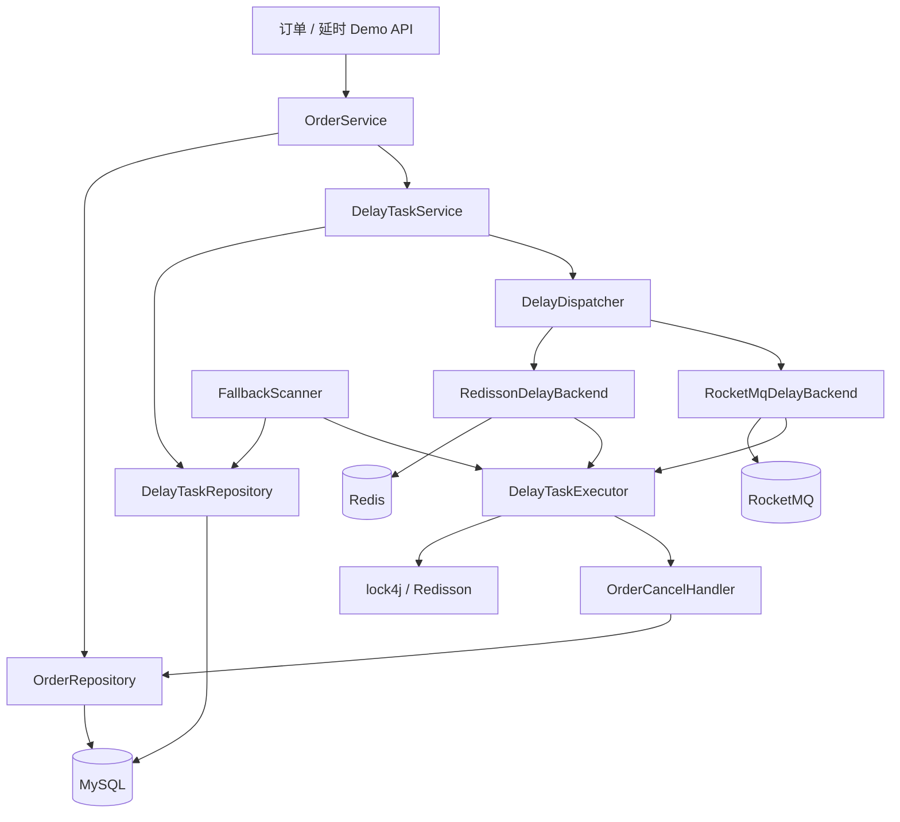

# demo2 通用延时任务 + 订单定时取消设计规范

**日期**: 2026-08-06  
**项目**: spring-ai-demo / demo2  
**状态**: 已确认，待实现  

---

## 1. 背景与目标

### 1.1 问题

业务需要「到期执行」能力（典型场景：下单后未支付则自动取消）。demo2 已具备 Redis / lock4j / Redisson、RocketMQ（含固定 18 档延时）与 MySQL，但缺少可复用的延时任务组件：可注册、可取消、多实例防重、失败有限重试，并以定时扫描兜底防主路径丢失。

### 1.2 目标

1. 在 `com.jason.demo.demo2.framework.delay` 提供**通用延时任务**能力。
2. 主投递可配置为 **Redisson 延时队列** 或 **RocketMQ 延时消息**（单主，非双写）。
3. **定时扫描 MySQL 台账**作为兜底（不是主时钟精度来源）。
4. 首个用例：简单 **订单表** + 超时未支付自动取消；`order_id` / `task_id` 均为 `Long`，统一用 **Hutool 雪花**生成。
5. 持久化：MySQL + **MyBatis-Plus** + **Repository 层**（台账与订单均有 Repository）。

### 1.3 已确认决策

| 维度 | 选择 |
|------|------|
| 模块 | demo2（Spring Boot 4.x / Java 21） |
| 能力形态 | 通用延时组件；订单取消为首用例 |
| 主投递 | `app.delay.backend=redisson\|rocketmq` 可配置单主 |
| 兜底 | `@Scheduled` 扫描台账到期 `PENDING` 任务 |
| 台账 | 独立表 `delay_task`（与订单表并存，方案 A）；`task_id` 为 `Long`；Hutool 雪花 |
| 订单 | 表 `demo_order`；`order_id` 为 `Long`；Hutool 雪花 |
| ID 生成 | `SnowflakeIdGenerator`（Hutool）统一生成订单与任务主键 |
| 持久化 | MyBatis-Plus + Repository |
| 生命周期 | 注册 + 取消（无单独改期 API；改期=取消后重注册） |
| 失败 | 最多 3 次重试，简单退避推迟 `execute_at` |
| 执行校验 | 仅订单仍为 `PENDING_PAY` 才取消；已支付/已取消则跳过 |
| 多实例 | 执行前按 `taskId` 分布式锁（复用 lock4j / Redisson） |
| 公共代码位置 | `com.jason.demo.demo2.framework.*` |
| 业务 Demo 位置 | `com.jason.demo.demo2.order.*` |
| RocketMQ 延时 | 复用现有 `DelayTimeLevel` / `sendDelay`；映射为「≥ 目标时长的最小档」 |

### 1.4 非目标（本版不做）

- Redisson 与 RocketMQ **双写**同一任务
- 完整死信管理 / 人工重放控制台（失败终态落库即可）
- 改期专用 API
- 接入瑞幸 MCP 真实下单（本版 Mock 订单表）
- 以纯 Redis ZSET 轮询作为主投递路径（精度不足，已否决）
- 仅订单表、无台账的专用实现（已否决，保留通用组件）

### 1.5 选型说明（为何保留台账）

| 方案 | 结论 |
|------|------|
| 仅 `demo_order` + `pay_deadline` | 可做订单超时，但无法干净承载通用 `task_type` / 重试 / 任务取消态 |
| **台账 `delay_task` + 订单表** | **采用**：调度事实与业务事实分离；扫描、MQ 无法撤回、多任务类型均依赖台账 |
| Redis 台账 | 可审计性弱于 DB；本版明确选 MySQL |

主投递不用「纯 ZSET 扫描当主路径」：时效依赖扫描间隔。本版主路径为 Redisson/MQ 延时投递；ZSET 式扫描只作为**兜底**读 MySQL。

---

## 2. 架构

### 2.1 逻辑架构



### 2.2 组件职责

| 组件 | 包 | 职责 | 依赖 |
|------|-----|------|------|
| `DelayTaskService` | `framework.delay` | 注册 / 取消；写台账；触发主投递 | Repository、Dispatcher |
| `DelayTaskRepository` | `framework.delay.repository` | 台账 CRUD、捞到期、改状态/重试 | MyBatis-Plus Mapper |
| `DelayDispatcher` | `framework.delay` | 按配置选择 Backend | `app.delay.backend` |
| `RedissonDelayBackend` | `framework.delay` | 投入 Redisson 延时队列；取消时尽量撤队 | Redisson |
| `RocketMqDelayBackend` | `framework.delay` | `sendDelay`；payload 含 `taskId` | 现有 RocketMQ 封装 |
| `FallbackScanner` | `framework.delay` | 定时捞到期 `PENDING`，交 Executor | Repository、Executor |
| `DelayTaskExecutor` | `framework.delay` | 加锁 → 校验台账 → Handler → 更新终态/重试 | Lock、Handler SPI |
| `DelayTaskHandler` | `framework.delay` | SPI：按 `task_type` 执行业务 | 业务侧实现 |
| `OrderCancelHandler` | `order` | 待支付才取消订单 | OrderRepository |
| `OrderService` / Controller | `order` | 下单、支付、查询；编排注册/取消任务 | Delay + Order |
| `SnowflakeIdGenerator` | `framework.id` | Hutool 雪花封装 | Hutool |

### 2.3 包结构

```
com.jason.demo.demo2.framework.delay
  ├── DelayTaskService
  ├── DelayDispatcher
  ├── backend/          # Redisson / RocketMQ
  ├── DelayTaskExecutor
  ├── FallbackScanner
  ├── DelayTaskHandler  # SPI
  └── repository/       # entity, mapper, DelayTaskRepository

com.jason.demo.demo2.framework.id
  └── SnowflakeIdGenerator   # Hutool

com.jason.demo.demo2.order
  ├── entity / repository
  ├── OrderService
  ├── OrderController
  └── OrderCancelHandler
```

复用：`framework.rocketmq`（延时发送）、既有 lock4j / Redisson、`spring.datasource` MySQL。

---

## 3. 数据模型

### 3.1 订单表 `demo_order`

| 字段 | 类型 | 说明 |
|------|------|------|
| `order_id` | BIGINT PK | Hutool 雪花 |
| `status` | VARCHAR | `PENDING_PAY` / `PAID` / `CANCELLED` |
| `amount` | DECIMAL | 演示金额 |
| `created_at` | DATETIME | |
| `updated_at` | DATETIME | |

### 3.2 台账表 `delay_task`

| 字段 | 类型 | 说明 |
|------|------|------|
| `task_id` | BIGINT PK | Hutool 雪花（与 `order_id` 同一生成器） |
| `task_type` | VARCHAR | 如 `ORDER_CANCEL` |
| `biz_key` | VARCHAR | 业务键，订单场景为 `String.valueOf(orderId)` |
| `payload` | TEXT / JSON | 可选扩展 |
| `execute_at` | DATETIME | 计划到期时间 |
| `status` | VARCHAR | 见状态机 |
| `retry_count` | INT | 默认 0 |
| `max_retry` | INT | 默认 3 |
| `backend` | VARCHAR | 注册时主后端快照 `redisson` / `rocketmq` |
| `created_at` / `updated_at` | DATETIME | |

应用层保证：同一 `(task_type, biz_key)` 在非终态下至多一条未完成任务（支付取消或成功后不再 PENDING）。

### 3.3 任务状态机

```
PENDING → RUNNING → SUCCESS
                 → 回 PENDING（retry_count < max_retry，并推迟 execute_at）
                 → FAILED（重试用尽）
PENDING → CANCELLED（业务主动取消，如已支付）
```

扫描与 MQ/Redisson 触发执行前均以台账为准：非可执行 `PENDING`（且已到期）则跳过。

---

## 4. 流程

### 4.1 注册（下单）

1. 雪花生成 `order_id`，插入 `demo_order`（`PENDING_PAY`）。
2. `DelayTaskService.schedule`：雪花生成 `task_id`，插入 `delay_task`（`PENDING`，`execute_at=now+delay`，`task_type=ORDER_CANCEL`）。
3. `DelayDispatcher` 按配置投递：
   - **redisson**：DelayedQueue，到期进入 Executor。
   - **rocketmq**：`sendDelay`，level = 不小于目标时长的最小 `DelayTimeLevel`（例：20s → `S_30`）。
4. 主投递失败：打 warn；台账已存在则依赖扫描兜底。下单 API 仍可返回成功（订单 + 台账优先）。

### 4.2 取消任务（支付成功）

1. 订单 `PENDING_PAY` → `PAID`。
2. 按 `task_type + biz_key` 将台账 `PENDING` → `CANCELLED`。
3. Redisson：尽量从延时队列移除；失败仍以台账为准。
4. RocketMQ：**无法撤回**已发延时消息；消费时读台账，非 `PENDING` 则跳过。

### 4.3 到期执行

1. `tryLock(taskId)`；失败则本轮跳过。
2. 再读台账：须为 `PENDING` 且 `execute_at <= now`。
3. 更新为 `RUNNING`。
4. `OrderCancelHandler`：仅 `PENDING_PAY` → `CANCELLED`；否则业务跳过。
5. 调度成功（含业务跳过）→ 任务 `SUCCESS`；异常 → 重试或 `FAILED`。
6. 解锁。

### 4.4 扫描兜底

- 固定间隔（可配，默认 5s）。
- `status=PENDING AND execute_at <= now`，限量 batch，交同一 `DelayTaskExecutor`。
- 职责：主路径丢失、消费者宕机、进程重启后的补执行；**不**作为主路径的高精度时钟。

---

## 5. API（Demo）

| 方法 | 路径 | 说明 |
|------|------|------|
| POST | `/demo/orders` | 创建待支付订单并注册取消任务；可选 delay |
| POST | `/demo/orders/{id}/pay` | 支付并取消对应延时任务 |
| GET | `/demo/orders/{id}` | 查询订单 |
| POST | `/demo/delay-tasks/{taskId}/cancel` | 通用取消任务（可选，便于测组件） |
| GET | `/demo/delay-tasks` | 按 `bizKey` / `taskId` 查台账 |

`orderId` / `taskId` 路径与响应均为 **Long**（JSON 数字；注意前端 JS 大整数精度，Demo 可用字符串展示或接受 Long 范围说明）。锁 key、MQ payload 中的 `taskId` 以字符串形式携带雪花值即可。

---

## 6. 配置

```properties
app.delay.backend=redisson
app.delay.default-delay=30s
app.delay.scan-interval-ms=5000
app.delay.max-retry=3
app.delay.lock-timeout=10s
```

新增依赖（本版，**对齐 Spring Boot 4.x**）：

| 依赖 | 坐标 / 版本约束 |
|------|-----------------|
| MyBatis-Plus | `mybatis-plus-spring-boot4-starter`（**禁止** `boot3-starter`）；≥3.5.13，建议 `3.5.17` + `mybatis-plus-bom` |
| jsqlparser 模块 | `mybatis-plus-jsqlparser`（与 MP 同版本；JDK 21） |
| Hutool | `hutool-core`（无 Boot starter，版本与 Boot 无强绑定） |

Redis / RocketMQ / MySQL / lock4j-Redisson 复用现有（Redisson 已用 `4.1.0` 适配 Boot4）。

建表：提供 SQL 脚本（或启动迁移）创建 `demo_order`、`delay_task`。

---

## 7. 错误处理

| 场景 | 行为 |
|------|------|
| 主投递失败 | warn + 扫描兜底 |
| Handler 异常 | `retry_count++`；未超限则回 `PENDING` 并推迟 `execute_at`（建议 +5s / +15s / +30s）；否则 `FAILED` |
| 抢锁失败 | 跳过 |
| 订单已支付/已取消 | Handler 跳过；任务 `SUCCESS` |
| 主动取消 | 台账 `CANCELLED`；MQ 靠消费校验 |

---

## 8. 测试要点

1. **单测**：状态迁移；delay → `DelayTimeLevel` 映射；Handler 仅取消 `PENDING_PAY`。
2. **手工 / 集成**：下单后到期自动取消；先支付再到期订单保持 `PAID`；切换 `backend` 两条主路径均可；停主消费时扫描仍能处理逾期单。

---

## 9. 成功标准

- 可通过配置在 Redisson / RocketMQ 间切换主投递，行为对外一致（取消语义对 MQ 为逻辑取消）。
- 扫描兜底在主路径缺失时仍能取消逾期未支付订单。
- 多实例下同一 `taskId` 不重复生效（锁 + 台账状态）。
- 公共能力在 `framework`，订单 Demo 在 `order`，职责清晰。
