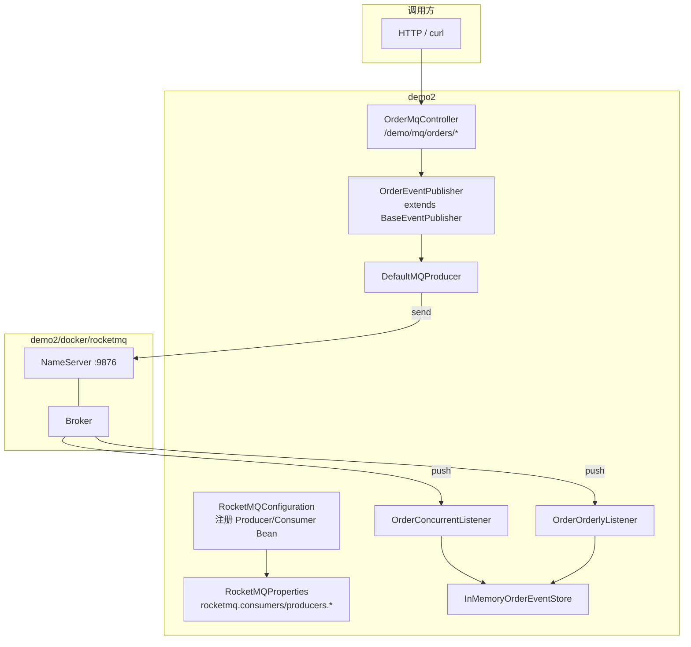

# demo2 RocketMQ 精简 Starter 设计规范

**日期**: 2026-08-06  
**项目**: spring-ai-demo / demo2  
**状态**: 已确认，待实现  
**参考**: [digital-food-framework-rocketmq-starter 项目分析文档](https://my.feishu.cn/wiki/XmNRw4gYIiB7gqkBB0Xc1mfXnRf)

---

## 1. 背景与目标

### 1.1 问题

demo2 需要可演示、可复用的 RocketMQ 集成能力，对齐飞书文档中 `digital-food-framework-rocketmq-starter` 的核心模式（自动配置、多 Producer/Consumer、并发/顺序消费抽象、统一发送基类），但不引入公司内部依赖（Heracles、Trace、灰度、`RequestContext`）。

仓库内尚无 RocketMQ 相关代码。通用框架代码统一放在 `framework` 包下，便于后续拆成独立 starter。

### 1.2 目标

1. 在 demo2 内精简复刻文章核心结构：`RocketMQProperties` + `RocketMQConfiguration` + Listener 继承链 + `BaseEventPublisher`。
2. 依赖 `org.apache.rocketmq:rocketmq-client:5.5.0`（Remoting API，与文章一致；非 gRPC 的 `rocketmq-client-java`）。
3. Docker Compose 提供 NameServer + Broker（风格对齐 `demo2/docker/redis`）。
4. 业务 Demo：订单事件；同步/异步/顺序/延迟发送；并发消费 + 顺序消费；内存 Store + HTTP 查询。
5. 发送走 `TransactionUtils.afterCommitSyncExecute`（有事务则 afterCommit，否则立即执行）。

### 1.3 已确认决策

| 维度 | 选择 |
|------|------|
| 模块 | demo2（Spring Boot 4.1 / Java 21） |
| 落地形态 | 方案 1：demo2 内精简复刻文章结构 |
| 能力范围 | 同步/异步/顺序/延迟发送 + 并发与顺序消费 |
| 客户端 | `rocketmq-client` **5.5.0** |
| 基础设施 | Docker Compose（NameServer + Broker） |
| 启动/启用行为 | **对齐文章原文**（见 §5） |
| Demo 场景 | 订单事件 + 并发 Listener + 顺序 Listener（同 `orderId` 保序） |
| 事务后发送 | 使用提供的 `TransactionUtils` |
| 框架包名 | `com.jason.demo.demo2.framework.rocketmq.*` |
| Demo 包名 | `com.jason.demo.demo2.mq.*`（不放进 framework） |
| JSON | Jackson（Spring 已有） |
| topic/tag 配置 | 生产/消费统一从 Spring Environment 读取（采纳文章优化建议，不用 Heracles） |

### 1.4 非目标（本版不做）

- Heracles 动态配置、公司 Trace、灰度路由、`RequestContext` 传播
- 发送失败补偿表 / 死信 / 告警
- `consumeQps` 限流实现
- RocketMQ 5.x gRPC 客户端（`rocketmq-client-java`）
- 把 MQ 接到 AgentScope / 真实订单库
- 修正文章「listenerBeanName 缺失应启动失败」等优化建议（**保持原文 warn+skip 行为**，文档注明已知风险）
- 本版不单独拆 `demo2-rocketmq-starter` 模块（包名预留 `framework`，后续可迁）

---

## 2. 架构

### 2.1 逻辑架构



### 2.2 分层

| 层 | 包 | 说明 |
|----|-----|------|
| 框架 | `com.jason.demo.demo2.framework.rocketmq` | 可迁独立 starter 的通用能力 |
| 业务 Demo | `com.jason.demo.demo2.mq` | 订单事件演示，依赖框架层 |
| 基础设施 | `demo2/docker/rocketmq/` | NameServer + Broker Compose |

---

## 3. 组件职责与包结构

### 3.1 包结构

```
com.jason.demo.demo2.framework.rocketmq
├── configuration
│   ├── RocketMQProperties
│   └── RocketMQConfiguration
├── producer
│   └── BaseEventPublisher
├── AbstractConcurrentlyRocketListener
├── AbstractOrderlyRocketListener
├── RocketMessageConcurrentlyListener<T>
├── RocketMessageOrderlyListener<T>
├── DelayTimeLevel
└── util
    └── TransactionUtils

com.jason.demo.demo2.mq
├── OrderEvent
├── OrderEventPublisher
├── OrderConcurrentListener
├── OrderOrderlyListener
├── InMemoryOrderEventStore
└── OrderMqController
```

`OrderMqController` 放在 `com.jason.demo.demo2.controller`（对齐 `LockDemoController`）；事件、Publisher、Listener、Store 放在 `com.jason.demo.demo2.mq`。

### 3.2 组件表

| 组件 | 职责 | 依赖 |
|------|------|------|
| `RocketMQProperties` | 绑定 `rocketmq.*`；`Map` 多消费者/多生产者；字段对齐文章（`enabled`、`namesrvAddr`、`topic`、`tags`、`consumerGroup`/`producerGroup`、`listenerBeanName`、`props`、`consumeQps` 字段保留但不实现限流） | Spring Boot |
| `RocketMQConfiguration` | `BeanDefinitionRegistryPostProcessor`：注册 `DefaultMQPushConsumer` / `DefaultMQProducer`（`initMethod=start`，`destroyMethod=shutdown`） | Properties |
| `AbstractConcurrentlyRocketListener` | 并发消费模板方法；异常 → `RECONSUME_LATER` | rocketmq-client |
| `AbstractOrderlyRocketListener` | 顺序消费模板方法；异常 → `SUSPEND_CURRENT_QUEUE_A_MOMENT` | rocketmq-client |
| `RocketMessageConcurrentlyListener<T>` | Jackson 反序列化；失败则消费成功 | Jackson |
| `RocketMessageOrderlyListener<T>` | 同上，顺序版 | Jackson |
| `BaseEventPublisher` | `send` / `sendAsync` / `sendOrderly` / `sendDelay`；重试；经 `TransactionUtils` | Producer Bean |
| `DelayTimeLevel` | RocketMQ 18 档延迟级别枚举 | 无 |
| `TransactionUtils` | 有同步事务则 afterCommit，否则立即执行（另提供 async 变体） | Spring TX |
| Demo 组件 | 发订单事件、双 Listener 写入内存 Store、HTTP 查询/清空 | 框架层 |

### 3.3 配置约定

```yaml
rocketmq:
  consumers:
    orderConcurrent:
      enabled: true
      namesrvAddr: 127.0.0.1:9876
      topic: DEMO_ORDER_TOPIC
      tags: CONCURRENT
      consumerGroup: demo-order-concurrent-group
      listenerBeanName: orderConcurrentListener
    orderOrderly:
      enabled: true
      namesrvAddr: 127.0.0.1:9876
      topic: DEMO_ORDER_TOPIC
      tags: ORDERLY
      consumerGroup: demo-order-orderly-group
      listenerBeanName: orderOrderlyListener
  producers:
    orderProducer:
      enabled: true
      namesrvAddr: 127.0.0.1:9876
      producerGroup: demo-order-producer-group
      topic: DEMO_ORDER_TOPIC
```

- Producer 的 `topic` / 默认 `tag` 从同一套 Spring 配置读取（可在 `ProducerConfig` 增加 `topic`/`tag`，或 Demo Publisher 显式指定 tag：`CONCURRENT` / `ORDERLY`）。
- 自动配置入口：Boot 3+/4 使用 `META-INF/spring/org.springframework.boot.autoconfigure.AutoConfiguration.imports`（或 demo2 内 `@Configuration` 直接扫描）；不使用已废弃的仅 `spring.factories` 路径作为唯一入口。若仅在 demo2 内使用，可用 `@Configuration` + 组件扫描，效果等价。

---

## 4. 数据流与 HTTP API

### 4.1 生产

```
HTTP → OrderMqController → OrderEventPublisher
  → BaseEventPublisher.buildMessage (Jackson)
  → TransactionUtils.afterCommitSyncExecute
  → producer.send / send(callback) / sendOrderly / setDelayTimeLevel
  → NameServer / Broker
```

### 4.2 消费

```
Broker push → Abstract*Listener
  → RocketMessage*Listener 反序列化 OrderEvent
  → handleMessage → InMemoryOrderEventStore.append
  → ACK / RECONSUME_LATER / SUSPEND_CURRENT_QUEUE_A_MOMENT
```

### 4.3 HTTP

| 方法 | 路径 | 说明 |
|------|------|------|
| `POST` | `/demo/mq/orders/sync` | 同步发送（tag=`CONCURRENT`） |
| `POST` | `/demo/mq/orders/async` | 异步发送（tag=`CONCURRENT`） |
| `POST` | `/demo/mq/orders/orderly` | 顺序发送（tag=`ORDERLY`，`shardingKey=orderId`） |
| `POST` | `/demo/mq/orders/delay?level=S_5` | 延迟发送（tag=`CONCURRENT`） |
| `GET` | `/demo/mq/orders/events` | 查内存消费结果（可选 `orderId` 过滤） |
| `DELETE` | `/demo/mq/orders/events` | 清空 store |

请求体示例：

```json
{"orderId":"o-1","type":"CREATED","payload":"demo"}
```

Topic：`DEMO_ORDER_TOPIC`；并发 tag `CONCURRENT`，顺序 tag `ORDERLY`。

---

## 5. 错误处理与启动校验

### 5.1 启动（对齐文章原文）

| 情况 | 行为 |
|------|------|
| `consumers` 为空 | `warn` 后跳过注册 |
| 某 consumer `enabled=false` | `warn` 并跳过 |
| `consumerGroup` / `namesrvAddr` / `topic` 为空 | `IllegalArgumentException`，启动失败 |
| `listenerBeanName` 不在 BeanDefinition 注册表 | `warn` 并跳过（**已知风险**：拼写错误时静默无消费者） |
| Producer/Consumer `start()` 连不上 NameServer | 启动失败 |

### 5.2 运行时

| 情况 | 行为 |
|------|------|
| 发送失败 | 重试至 `maxTryTimes`（默认 2）；仍失败只打 error 日志 |
| 消费业务异常 | 并发 `RECONSUME_LATER`；顺序 `SUSPEND_CURRENT_QUEUE_A_MOMENT` |
| JSON 反序列化失败 | 记 error，返回消费成功（避免毒消息死循环） |
| 无活跃事务 | `TransactionUtils` 立即执行发送 |

---

## 6. 基础设施

新增 `demo2/docker/rocketmq/docker-compose.yml`：

- NameServer 映射宿主 `9876`
- Broker 连接同一 Compose 网络内的 NameServer
- 镜像选用与 `rocketmq-client` 5.5.0 Remoting 协议兼容的官方/社区常用 RocketMQ 镜像（实现计划锁定具体 tag）
- 启动命令风格对齐 `demo2/docker/redis/docker-compose.yml`

```bash
docker compose -f demo2/docker/rocketmq/docker-compose.yml up -d
```

---

## 7. 测试与验收

| 类型 | 内容 |
|------|------|
| 单测 | `TransactionUtils`（有/无事务）；`DelayTimeLevel`；反序列化失败返回成功；Properties 绑定 |
| 单测 | `BaseEventPublisher` mock `DefaultMQProducer`：重试与 afterCommit |
| 手工/集成 | Docker 起 MQ → 四条 `POST` → `GET /events` 可见对应消费记录 |
| 验收 | orderly 路径下同 `orderId` 多条消息由顺序 Listener 消费；concurrent 路径由并发 Listener 消费 |

应用配置默认 NameServer：`127.0.0.1:9876`。未起 Docker 时，带启用消费者/生产者的启动会因 `start()` 失败而无法起来（与文章「连不上就起不来」一致）。

---

## 8. 与原文差异（刻意为之）

| 原文 | 本版 |
|------|------|
| Heracles / Trace / 灰度 / RequestContext | 删除 |
| `rocketmq-client` 4.x（文章年代） | **5.5.0**（同 Remoting API 线最新） |
| Producer topic/tag 走 Heracles | 统一 Spring 配置 |
| `spring.factories` | Boot 4 兼容的自动配置或 `@Configuration` |
| Fastjson | Jackson |
| 公司包名 | `com.jason.demo.demo2.framework.rocketmq` |

---

## 9. 实现顺序建议

1. Docker Compose + 依赖引入  
2. framework：Properties / Configuration / Listener 链 / Publisher / TransactionUtils / DelayTimeLevel  
3. mq Demo：事件、双 Listener、Store、Controller、application 配置  
4. 单测 + 手工验收  

详细步骤在实现计划中展开（`docs/superpowers/plans/`）。
