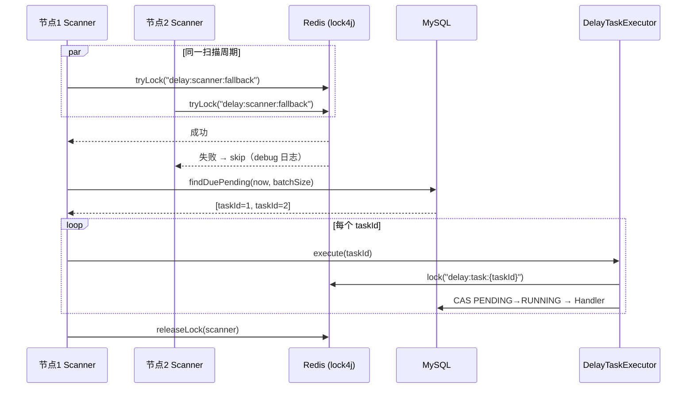

# FallbackScanner 扫描级分布式锁设计规范

**日期**: 2026-08-23  
**项目**: spring-ai-demo / demo2  
**状态**: 已确认，待实现  

---

## 1. 背景与目标

### 1.1 问题

`FallbackScanner#scan` 使用 `@Scheduled` 定时扫描 MySQL 台账中到期的 `PENDING` 任务。多节点部署时，**每个节点都会独立触发扫描**，导致：

1. **重复 DB 查询**：N 个节点每周期各执行一次 `findDuePending`；
2. **重复抢锁**：同一批 `taskId` 被 N 个节点调用 `DelayTaskExecutor#execute`，仅一个成功，其余在 Redis 抢锁失败后 return；
3. **日志噪音**：多节点 debug/info 日志重复。

当前 **正确性已有保障**：`DelayTaskExecutor` 在 per-`taskId` 层使用 lock4j 分布式锁（`delay:task:{taskId}`）+ CAS（`PENDING → RUNNING`），不会重复执行业务逻辑。问题是 **资源浪费**，而非数据错误。

### 1.2 目标

1. 在多节点部署下，**同一扫描周期仅一个节点**执行 `findDuePending` + 批量 `execute`；
2. **不改变** Executor 层 per-taskId 锁 + CAS（双层防护）；
3. 复用现有 lock4j / Redisson，**不引入新依赖**（如 ShedLock）；
4. 支持单节点 / 本地 debug 时关闭扫描锁。

### 1.3 已确认决策

| 维度 | 选择 |
|------|------|
| 方案 | **方案 B：Scanner 层全局锁**（非 DB Claim 模式） |
| 锁实现 | 现有 `LockTemplate`（lock4j + Redisson） |
| 锁 Key | `delay:scanner:fallback`（常量，放 `LockKeys`） |
| 默认行为 | 扫描锁**默认开启**（`scan-lock-enabled=true`） |
| 锁 TTL | 默认 `10s`，可配 `app.delay.scan-lock-timeout` |
| Executor 层 | **不变**，保留 `delay:task:{taskId}` 锁 + CAS |
| 改动范围 | `FallbackScanner`、`DelayProperties`、`LockKeys`、测试、配置注释 |

### 1.4 非目标（本版不做）

- DB Claim 模式（新增 `SCANNING` 中间态、批量抢占分片）—— 留作高吞吐演进
- ShedLock / 选主框架等新依赖
- 修改 `DelayTaskExecutor` 锁逻辑
- 修改 `findDuePending` 查询语义

---

## 2. 架构

### 2.1 多节点扫描时序



### 2.2 双层锁职责

| 层级 | 锁 Key | 粒度 | 目的 |
|------|--------|------|------|
| Scanner 层 | `delay:scanner:fallback` | 全局（每应用一个） | 避免多节点重复扫 DB / 重复 dispatch |
| Executor 层 | `delay:task:{taskId}` | 单任务 | 防止主路径（Redisson/MQ）与兜底路径并发执行同一任务 |

Scanner 锁是**性能优化**；Executor 锁是**正确性保障**。二者互补，不互相替代。

### 2.3 与主路径的关系

- **Redisson / RocketMQ 到期触发**：不经 Scanner，直接调 `DelayTaskExecutor#execute`；
- **Scanner 兜底**：仅在主路径丢消息或投递失败时生效；
- Executor 层锁确保主路径与 Scanner 路径不会重复执行同一 `taskId`。

---

## 3. 实现细节

### 3.1 FallbackScanner 改动

注入 `LockTemplate`；在 `scan()` 入口：

1. 若 `scanLockEnabled=false`，走现有逻辑（向后兼容单节点）；
2. 否则 `lockTemplate.lock(lockKey, scanLockTimeoutMs, 0L)`；
3. 返回 `null` → debug 日志 + return（其他节点正在扫）；
4. 持锁 → 执行现有 `findDuePending` + `execute` 循环；
5. `finally` 中 `releaseLock`，捕获释放异常并 warn。

```java
// 伪代码（非最终实现）
public void scan() {
    if (properties.isScanLockEnabled()) {
        LockInfo lock = lockTemplate.lock(LockKeys.delayScannerFallbackKey(),
                properties.getScanLockTimeout().toMillis(), 0L);
        if (lock == null) {
            log.debug("skip fallback scan, scanner lock not acquired");
            return;
        }
        try {
            doScan();
        } finally {
            releaseQuietly(lock);
        }
    } else {
        doScan();
    }
}
```

将现有 scan 主体提取为私有方法 `doScan()`，避免重复。

### 3.2 LockKeys

新增常量方法：

```java
public static String delayScannerFallbackKey() {
    return "delay:scanner:fallback";
}
```

与 Executor 层 `delay:task:{taskId}` 保持同一命名空间前缀 `delay:`。

### 3.3 DelayProperties 新增字段

| 属性 | Java 字段 | 类型 | 默认值 | 说明 |
|------|-----------|------|--------|------|
| `app.delay.scan-lock-enabled` | `scanLockEnabled` | `boolean` | `true` | 是否启用扫描级分布式锁 |
| `app.delay.scan-lock-timeout` | `scanLockTimeout` | `Duration` | `10s` | 扫描锁 TTL |

**TTL 约束**：`scanLockTimeout` 应 ≥ 单次扫描最大耗时。估算：`scanBatchSize(50) × 单任务 execute 耗时`。默认 10s 对 demo 规模足够；生产可按监控调整。

**与 scan-interval 关系**：当前 `scan-interval-ms=60000`（60s），锁 TTL 10s 远小于扫描间隔，不会跨周期持锁。

### 3.4 application.properties

```properties
# FallbackScanner 多节点扫描互斥（lock4j）；单节点/debug 可设 false
app.delay.scan-lock-enabled=true
app.delay.scan-lock-timeout=10s
```

### 3.5 错误处理

| 场景 | 行为 |
|------|------|
| 抢扫描锁失败 | debug 日志，本轮 skip，下轮重试 |
| 持锁节点扫描中异常 | `finally` 释放锁；下轮任意节点可接管 |
| 持锁节点宕机 | 锁 TTL 到期自动释放（Redisson watchdog 或固定 TTL） |
| 释放锁失败 | warn 日志，不抛异常（与 Executor 层一致） |
| Redis 不可用 | `lock()` 抛异常或返回 null；`@Scheduled` 下轮重试；不影响主路径 Redisson/MQ |

### 3.6 日志

| 事件 | 级别 |
|------|------|
| 扫描锁未获取 | `debug` |
| 扫描锁获取成功，开始扫描 | `debug`（可选，避免 info 刷屏） |
| 扫描到 N 条到期任务 | 保持现有 `info`（`calling DelayTaskExecutor#execute`） |
| 释放扫描锁失败 | `warn` |

---

## 4. 测试

### 4.1 FallbackScannerTest 补充

| 用例 | 验证 |
|------|------|
| `scanLockEnabled=false` | 不调用 `lockTemplate`，直接 `findDuePending` + `execute` |
| 持扫描锁 | mock `lock()` 返回 `LockInfo` → 正常扫描 + `releaseLock` |
| 未持扫描锁 | mock `lock()` 返回 `null` → 不调用 `findDuePending` |
| 扫描异常 | mock `findDuePending` 抛异常 → 仍 `releaseLock` |

### 4.2 不变测试

- `DelayTaskExecutorTest`：per-taskId 锁 + CAS 逻辑不变，无需修改断言；
- 集成冒烟：双节点部署时，同一周期仅一个节点出现 `findDuePending` 相关日志（手工或后续集成测试）。

---

## 5. 配置参考

| 场景 | `scan-lock-enabled` | 说明 |
|------|---------------------|------|
| 生产多节点 | `true`（默认） | 减少重复扫描 |
| 本地单节点 debug | `false` | 省去 Redis 依赖（若 Redis 未起） |
| 集成测试 | `false` | 测试类 mock `LockTemplate` 或关闭 |

---

## 6. 演进路径（本版不做）

| 阶段 | 触发条件 | 方案 |
|------|----------|------|
| 当前 | 到期任务 < 数百/分钟 | Scanner 全局锁（本 spec） |
| 未来 | 到期任务量大、需并行扫描吞吐 | DB Claim 模式（`SCANNING` 中间态 + 超时回收） |

---

## 7. 验收标准

1. 多节点部署时，同一扫描周期仅一个节点执行 `findDuePending`；
2. 单节点 / `scan-lock-enabled=false` 时行为与改动前一致；
3. Executor 层 per-taskId 锁 + CAS 不变，主路径与 Scanner 路径仍互斥；
4. `FallbackScannerTest` 覆盖持锁/不持锁/关闭锁三条路径；
5. 现有 `DelayTaskExecutorTest` 全部通过。

---

## 8. 方案选型记录

| 方案 | 结论 |
|------|------|
| A. 维持现状（仅 Executor 锁） | 正确但多节点浪费 DB/Redis；否决作为终态 |
| **B. Scanner 层全局锁** | **采用**：改动小、复用 lock4j、满足 C（正确性+性能） |
| C. DB Claim 批量抢占 | 吞吐高但改动大；YAGNI，留演进 |
