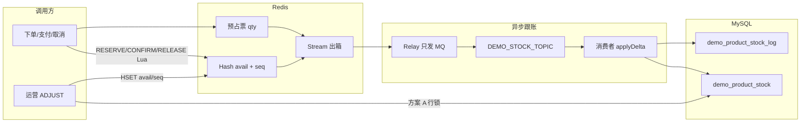
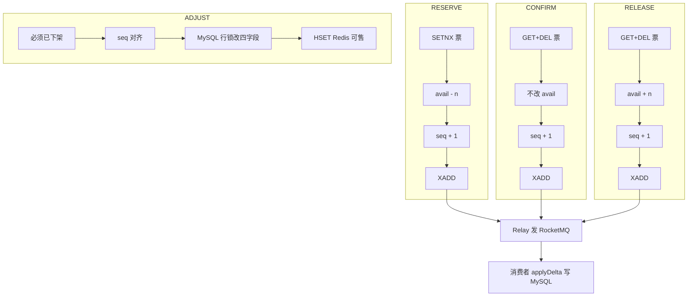
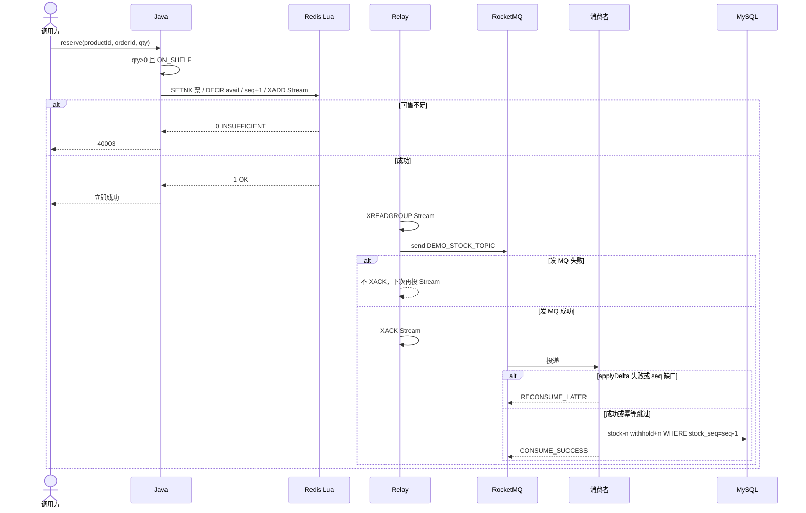
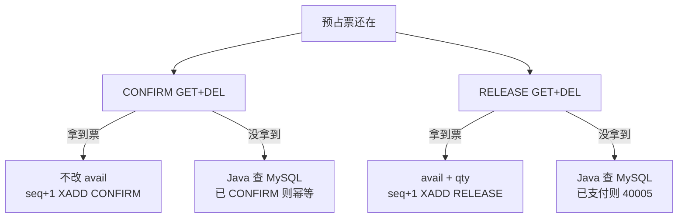
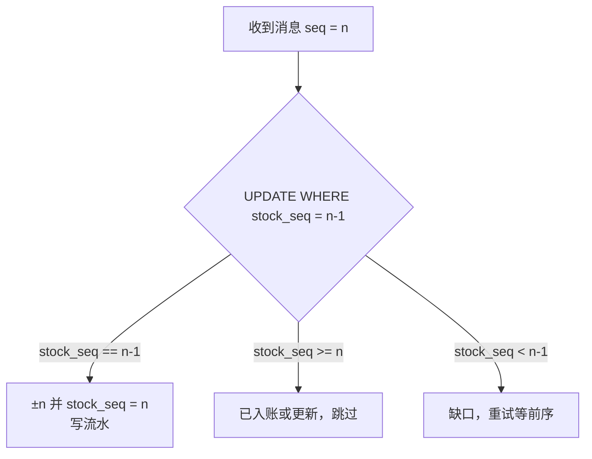
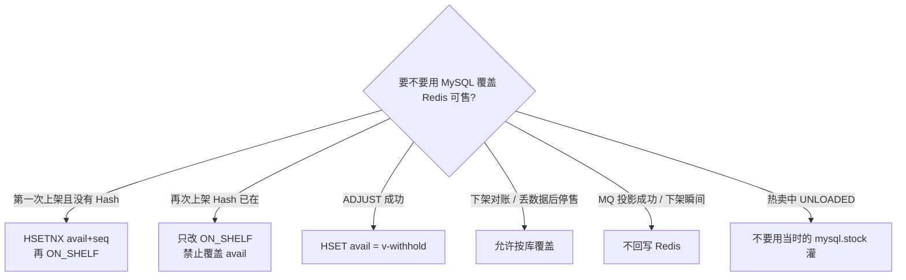
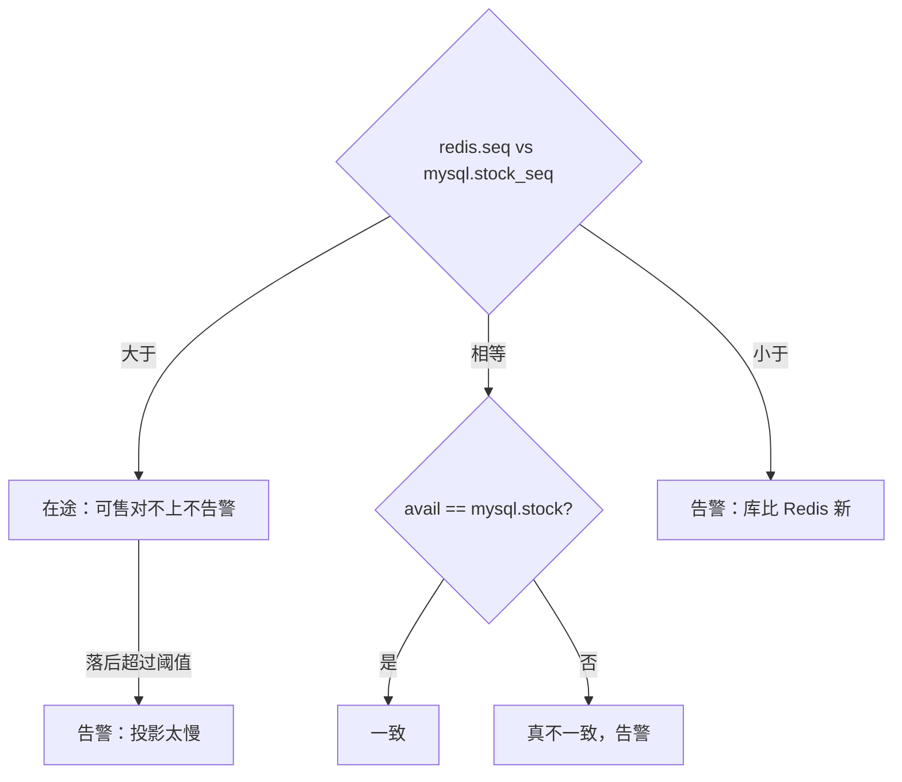

# demo2 Redis 热库存与 MySQL 最终一致设计规范

**日期**: 2026-08-27  
**项目**: spring-ai-demo / demo2  
**状态**: 已实现  
**前置**: [2026-08-26-product-module-design.md](./2026-08-26-product-module-design.md)

---

## 1. 背景与目标

现有 `ProductStockDomainService` 无锁双查，流水 before 会脏；`confirm` 未幂等；`ADJUST` 未实现。秒杀闸门放 Redis；`actual` / `withhold` / `sell` 只在 MySQL。

Redis：**可售 `avail` + 单调 `seq` + 每单预占票（qty）**。不放 sale、不放 ticket 状态机。`seq` 不是库存，只给投影和对账用。

### 1.1 已确认决策

| 维度 | 选择 |
|------|------|
| Redis | Hash `{avail, seq}`；`reserve:{orderId}:{productId}` = qty |
| 下架 | Java 看 `OFF_SHELF` 再调 Lua |
| 乱序 | 消息带 `seq`；MySQL `stock_seq = seq-1` 才应用，缺口重试 |
| 对账 | **先比 seq**。序号未齐 = 在途，可售对不上不告警；序号齐了才比 `avail ≟ mysql.stock` |
| 投影 | **无 `SELECT FOR UPDATE`**。`UPDATE … WHERE stock_seq = seq-1`（乐观后继） |
| 上架 | 只改 `status`；已有 Hash **不得**用 `mysql.stock` 覆盖 `avail` |
| 开关 | `app.product.stock.redis-hot-enabled` 默认 true |

### 1.2 非目标

Redis 镜像四字段；Lua 内发 MQ；Cluster / 分片 / TCC / lock4j；本阶段不改订单表。

---

## 2. 架构与关键流程

热卖：Lua 先改 Redis，出箱 → MQ → MySQL **用 seq 跟账，不用行锁**。运营 ADJUST / 关掉 Redis 直写：仍用方案 A 行锁。每次成功写出箱的 Lua 都 `seq+1`（含 CONFIRM）。

### 2.1 总架构



### 2.2 四条写路径



### 2.3 RESERVE 时序



### 2.4 支付与取消抢同一张票



### 2.5 MySQL 按 seq 投影



### 2.6 MySQL 何时灌 Redis



---

## 3. MySQL

### 3.1 DDL

```sql
ALTER TABLE demo_product_stock
    ADD COLUMN stock_seq BIGINT NOT NULL DEFAULT 0 COMMENT '已投影的 Redis seq' AFTER sell_stock;

ALTER TABLE demo_product_stock_log
    ADD COLUMN idempotent_key VARCHAR(64) NULL COMMENT '幂等键' AFTER opt_type;
UPDATE demo_product_stock_log
    SET idempotent_key = CONCAT(IFNULL(order_id,'0'), ':', product_id, ':', opt_type)
    WHERE idempotent_key IS NULL;
ALTER TABLE demo_product_stock_log
    MODIFY idempotent_key VARCHAR(64) NOT NULL,
    ADD UNIQUE KEY uk_stock_log_idempotent (idempotent_key);
```

幂等键：`{orderId}:{productId}:{optType}`；ADJUST：`ADJUST:{adjustId}`。

### 3.2 `applyDelta`（热路径投影，无行锁）

消息含 `seq`。**不要** `SELECT FOR UPDATE`。用序号当乐观锁：

```sql
UPDATE demo_product_stock
SET ... ±n ...,
    stock_seq = #{seq},
    updated_at = NOW(3)
WHERE product_id = #{productId}
  AND stock_seq = #{seq} - 1
```

| 结果 | 动作 |
|------|------|
| 影响 1 行 | 同事务 `SELECT` 当前行 = after，`before = reverse(after, op, n)`，写流水 |
| 影响 0 行且 `stock_seq >= seq` | 已入账或更新，成功跳过（幂等键避免重复流水） |
| 影响 0 行且 `stock_seq < seq - 1` | 缺口，可重试（等前序，例如 CONFIRM 比 RESERVE 先到） |

InnoDB 执行这条 `UPDATE` 时仍会短时间锁行，那是引擎行为，应用层不再主动 `FOR UPDATE`。

±n 公式：RESERVE `stock-=n, withhold+=n`；CONFIRM `actual-=n, withhold-=n, sell+=n`；RELEASE `stock+=n, withhold-=n`。

幂等键已存在 → 成功。CONFIRM 已有 RELEASE → `40005`。RELEASE 已有 CONFIRM → `40005`。无 RESERVE 的 RELEASE 且无流水 → 幂等跳过。

直写方案 A 每次成功也 `stock_seq += 1`，避免以后打开热路径序号对不齐。

---

## 4. Redis Key 与回灌

| Key | 含义 |
|-----|------|
| `demo2:stock:{productId}` | Hash：`avail`（可售）、`seq`（已成功 Lua 次数，与即将入账条数对齐） |
| `demo2:stock:reserve:{orderId}:{productId}` | String，qty |
| `demo2:stock:outbox` | Stream，字段含 `seq` |

### 4.1 何时 MySQL → Redis（回灌可售）

热卖时主方向是 **Redis → MySQL**（Lua 先扣，MQ 再跟账）。**不会**在每次投影成功后再把库写回 Redis。

MySQL 往 Redis 灌，主要就这几次：

| 时机 | 是不是「一上架就灌」 | 做什么 |
|------|----------------------|--------|
| **第一次上架，Redis 还没有这个 Hash** | **是，这是主灌入点** | `HSETNX avail=mysql.stock, seq=mysql.stock_seq`，再改 `ON_SHELF` |
| **再次上架，Hash 已存在** | **不是。禁止用库覆盖** | 只改 `ON_SHELF`。若用 `mysql.stock` 去 `SET`，会把尚未投影的预占加回去，超卖 |
| **ADJUST 成功之后** | 否（先下架、seq 对齐、改库） | `HSET avail=v-withhold, seq=新 stock_seq` |
| **下架后的对账修复 / Redis 丢数据后停售回灌** | 否 | 允许按 MySQL 覆盖 `avail+seq` |
| **`offShelf`** | 否 | 只改 `OFF_SHELF`，不动 Redis 可售 |
| **MQ 投影成功** | 否 | 只改 MySQL，不回写 Redis |

热卖中 Lua 返回 `UNLOADED`（没有 Hash）：**不要**用当时的 `mysql.stock` 去灌（库可能还没跟上）。告警，或先停售再灌。

---

## 5. Lua（逐行注释）

```text
KEYS[1]  demo2:stock:{productId}                       Hash：avail=可售，seq=序号
KEYS[2]  demo2:stock:reserve:{orderId}:{productId}     预占票，值=qty
KEYS[3]  demo2:stock:outbox                            出箱 Stream
返回：-1 未加载；1 成功；2 幂等；0 失败
```

Java 调 RESERVE 前：`qty > 0`，且商品已 `ON_SHELF`。

### 5.1 RESERVE（下单：扣可售）

```lua
-- ARGV[1]=qty  ARGV[2]=orderId  ARGV[3]=productId  ARGV[4]=idempotentKey
local stock  = KEYS[1]                               -- 这件商品的可售 + seq
local ticket = KEYS[2]                               -- 这一单有没有预占过
local outbox = KEYS[3]                               -- 稍后同步 MySQL
local qty    = tonumber(ARGV[1])                     -- 要预占几件

if redis.call('EXISTS', stock) == 0 then             -- 还没从 MySQL 灌过（从未上架成功）
  return {-1, 'UNLOADED'}                            -- 热卖中不要用库里的 stock 去灌
end

-- SETNX：没有票才写入 qty；已有票说明这单已经预占过
if redis.call('SETNX', ticket, qty) == 0 then
  if tonumber(redis.call('GET', ticket)) == qty then
    return {2, 'IDEMPOTENT'}                         -- 同样数量，重复提交，不扣第二次
  end
  return {0, 'CONFLICT'}                             -- 已有票但数量不同
end

local left = redis.call('HINCRBY', stock, 'avail', -qty) -- 只减可售
if left < 0 then                                     -- 减成负数 = 超卖
  redis.call('HINCRBY', stock, 'avail', qty)         -- 加回去
  redis.call('DEL', ticket)                          -- 撕掉刚写的票
  return {0, 'INSUFFICIENT'}
end

local seq = redis.call('HINCRBY', stock, 'seq', 1)   -- 序号+1，给 MySQL 排队/对账，不是库存
redis.call('XADD', outbox, '*',                      -- 告诉 MySQL：stock-n, withhold+n
  'productId', ARGV[3], 'orderId', ARGV[2], 'optType', 'RESERVE',
  'qty', qty, 'idempotentKey', ARGV[4], 'seq', seq)
return {1, 'OK'}                                     -- 调用方立刻成功
```

### 5.2 CONFIRM（支付：不改可售，拿走票）

```lua
-- ARGV[1]=orderId  ARGV[2]=productId  ARGV[3]=idempotentKey
local stock  = KEYS[1]                               -- 还要给 seq+1，所以要有这个 Hash
local ticket = KEYS[2]
local outbox = KEYS[3]

if redis.call('EXISTS', stock) == 0 then
  return {-1, 'UNLOADED'}
end

local qty = redis.call('GET', ticket)                -- 读取预占数量
if not qty then
  return {0, 'NOT_FOUND'}                            -- 没票：可能已支付、已取消，或消息还在路上（Java 见表）
end
redis.call('DEL', ticket)                            -- 删票；和 RELEASE 谁先 DEL 谁赢
-- 注意：这里不改 avail。可售在 RESERVE 时已经扣过了

local seq = redis.call('HINCRBY', stock, 'seq', 1)   -- 仍要 +1，否则对账会认为少记了一笔
redis.call('XADD', outbox, '*',                      -- MySQL：actual-n, withhold-n, sell+n
  'productId', ARGV[2], 'orderId', ARGV[1], 'optType', 'CONFIRM',
  'qty', qty, 'idempotentKey', ARGV[3], 'seq', seq)
return {1, 'OK'}
```

Java 在 `NOT_FOUND` 时不能一律 40004：

| MySQL | 处理 |
|-------|------|
| 已有 CONFIRM | 成功（幂等） |
| 已有 RELEASE | `40005` |
| 仅有 RESERVE | 重试（票已删、CONFIRM 还在 Stream） |
| 都没有 | `40004` |

### 5.3 RELEASE（取消：加回可售）

```lua
-- ARGV[1]=orderId  ARGV[2]=productId  ARGV[3]=idempotentKey
local stock  = KEYS[1]
local ticket = KEYS[2]
local outbox = KEYS[3]

if redis.call('EXISTS', stock) == 0 then
  return {-1, 'UNLOADED'}
end

local qty = redis.call('GET', ticket)
if not qty then
  return {2, 'NO_TICKET'}                            -- 没票：不是直接当业务成功，Java 见表
end
redis.call('DEL', ticket)                            -- 和 CONFIRM 抢同一张票
redis.call('HINCRBY', stock, 'avail', tonumber(qty)) -- 把可售加回去

local seq = redis.call('HINCRBY', stock, 'seq', 1)
redis.call('XADD', outbox, '*',                      -- MySQL：stock+n, withhold-n
  'productId', ARGV[2], 'orderId', ARGV[1], 'optType', 'RELEASE',
  'qty', qty, 'idempotentKey', ARGV[3], 'seq', seq)
return {1, 'OK'}
```

Java 在 `NO_TICKET` 时：

| MySQL | 处理 |
|-------|------|
| 已有 RELEASE | 成功 |
| 已有 CONFIRM | `40005`（已支付不能加回） |
| 仅有 RESERVE | 重试（可能刚被 CONFIRM 拿走票） |
| 都没有 | 成功（从未预占） |

### 5.4 ADJUST（运营改现货：Java 已写完 MySQL，这里只灌 Redis）

无 ticket、无 XADD。Java 已校验下架、`redis.seq == mysql.stock_seq`、`v >= withhold`。

```lua
-- KEYS[1]=库存 Hash
-- ARGV[1]=新可售（Java 算好：v - withhold）
-- ARGV[2]=新 seq（= MySQL 行锁更新后的 stock_seq）
redis.call('HSET', KEYS[1],
  'avail', ARGV[1],                                  -- 覆盖可售，不是 ±n
  'seq', ARGV[2])                                    -- 与库对齐，后面热路径从这里继续 +1
return {1, 'OK'}
```

---

## 6. 出箱与对账

职责拆开，**Relay 不写 MySQL**：

```text
Lua XADD Stream
    → RedisStockOutboxRelay XREADGROUP（product.app.listener）
    → StockSyncEventPublisher.sendNow（product.service.infrastructure.publisher）
    → send RocketMQ DEMO_STOCK_TOPIC
    → 发送成功才 XACK Stream     ← 失败不 ACK，消息留在 PEL，下次再发
    → StockSyncMqListener（product.app.listener，沿用 AbstractConcurrentlyRocketListener）
    → applyDelta 写 MySQL
```

消息体 `StockSyncEvent` 与 Publisher 同包：`com.jason.demo.demo2.product.service.infrastructure.publisher`。不要放到全局 `com.jason.demo.demo2.mq`。

- 发 MQ 失败：不 `XACK`，Stream 可重投；`XAUTOCLAIM` 收回挂死的 pending。
- 消费失败（含 seq 缺口）：返回 `ConsumeConcurrentlyStatus.RECONSUME_LATER`，Broker 稍后重投。幂等键保证重复消息只落一次账。
- 业务成功或「已投影跳过」：`CONSUME_SUCCESS`。

对账（默认 1 分钟）：



```text
redis.seq  > mysql.stock_seq  → 在途。不因 avail 对不上告警；落后超过阈值（如 5 分钟）再告警
redis.seq == mysql.stock_seq  → 必须 avail == mysql.stock，否则真不一致
redis.seq  < mysql.stock_seq  → 告警（库比 Redis 新）
```

补发以 Stream pending 为准。

---

## 7. Demo HTTP 与错误码

| 路径 | 行为 |
|------|------|
| `POST /demo/products/offShelf` | `{productId}` |
| `POST /demo/products/onShelf` | 无 Hash 则 `HSETNX avail+seq`，再上架 |
| `POST /demo/products/adjustStock` | `{productId, targetActual}` |

| 码 | 含义 |
|----|------|
| 40008 | 未下架不允许 ADJUST |
| 40009 | 目标现货非法 |
| 40010 | `redis.seq != mysql.stock_seq`（未追上） |

---

## 8. 后续订单

下单 / 支付 / 取消 → §5.1–5.3；开关关闭 → 方案 A（同样 `stock_seq+=1`）。

---

## 9. 测试

- 超卖回滚票与 avail；SETNX 幂等；支付/取消抢票
- CONFIRM 不改 avail，但 seq+1
- 先投 CONFIRM 再 RESERVE：CONFIRM 因 seq 缺口重试，两条都入账
- 对账：seq 未齐时 avail 故意对不上，不得当故障
- seq 已齐但 avail 不同，必须告警
- 上架不覆盖已有 avail；ADJUST 未追上 40010

---

## 10. 交付清单

- [x] `stock_seq` + `idempotent_key`
- [x] Hash `{avail,seq}` + §5 Lua + Relay + `applyDelta`
- [x] 方案 A / ADJUST / Demo 上下架
- [x] 对账按 seq 分流
- [x] 单测

---

## 11. 仍接受的限制

- 下架与 RESERVE 对打可能多成功一次。
- Redis 丢数据须停售再按 MySQL 回灌 `avail+seq`。
- seq 未齐时两边可售可以暂时不同——这是在途，不是事故。
