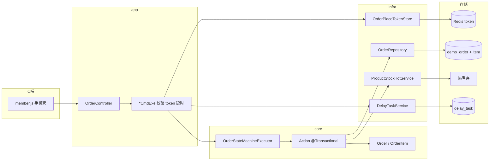
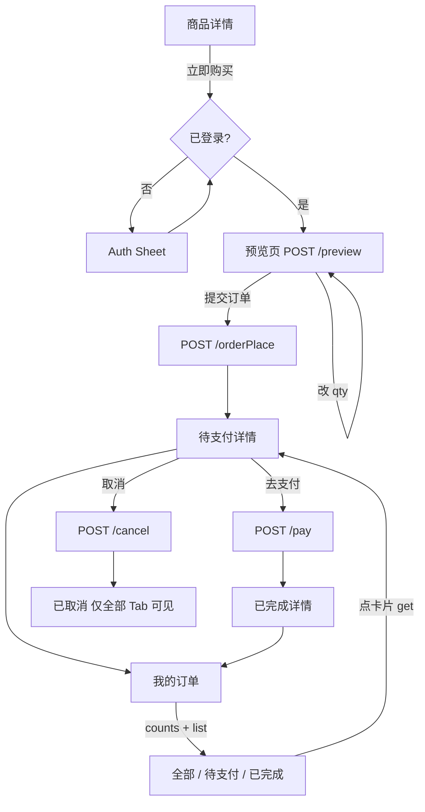
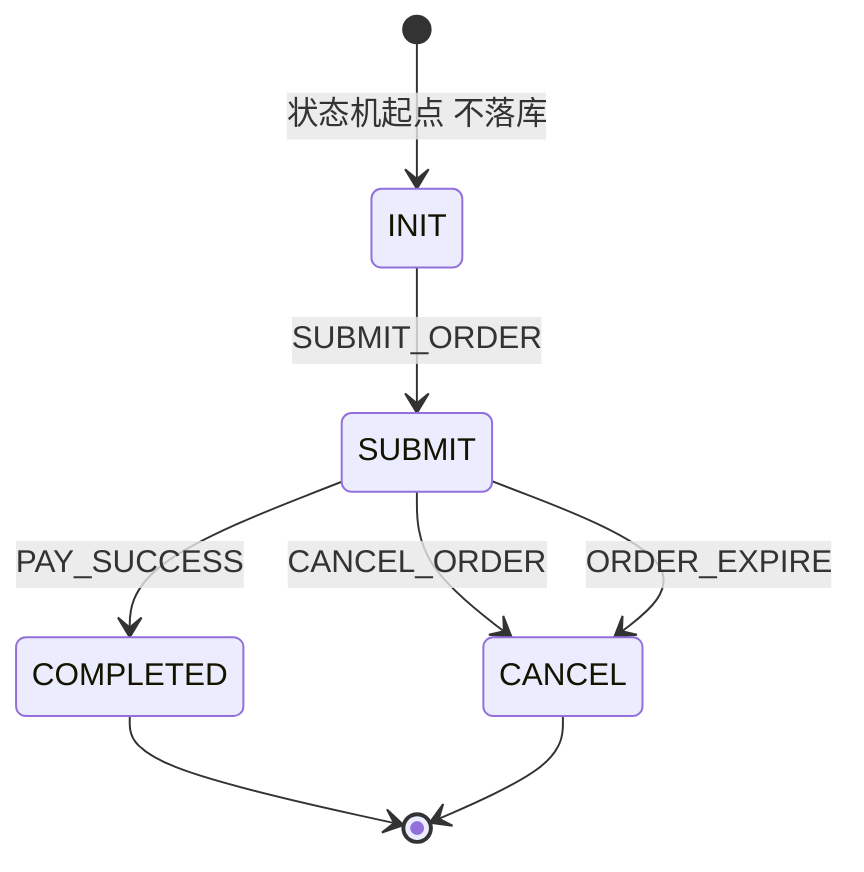
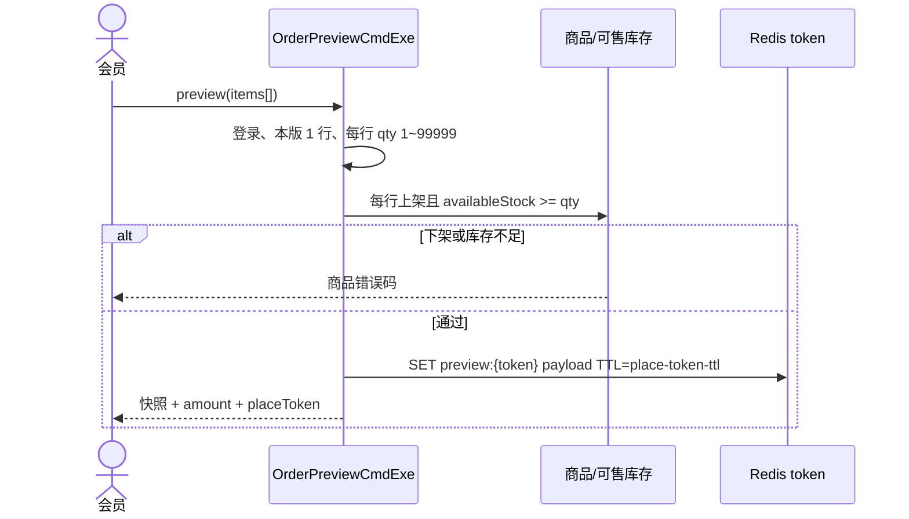
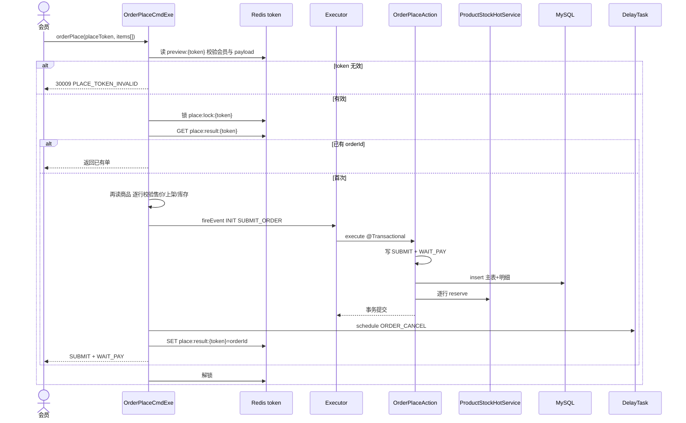
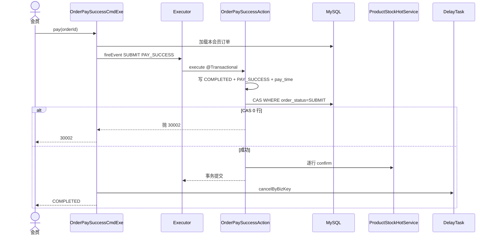
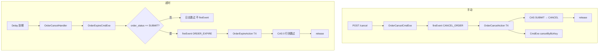
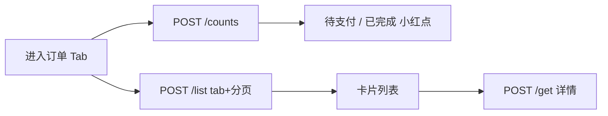

# demo2 订单模块重构（COLA 状态机）设计规范

**日期**: 2026-08-28  
**项目**: spring-ai-demo / demo2  
**状态**: 已实现（见 [archive/2026-08-28-order-module-statemachine.md](../archive/2026-08-28-order-module-statemachine.md)）  
**前置**: [2026-08-23-order-ddd-package-refactor-design.md](./2026-08-23-order-ddd-package-refactor-design.md)、[2026-08-26-product-module-design.md](./2026-08-26-product-module-design.md)、[2026-08-27-redis-stock-consistency-design.md](./2026-08-27-redis-stock-consistency-design.md)  
**参考**: [digital-food-market-center 订单状态机深度分析](https://my.feishu.cn/wiki/Ui0iwV6GsijkqZkPSZXc0eonnCh)（COLA 状态机装配与流转）

---

## 1. 背景与目标

### 1.1 背景

- 现有 `order` 模块是延时取消 Demo：手填 `amount` 下单，状态 `PENDING_PAY / PAID / CANCELLED`，不关联商品与库存。
- 商品模块已交付列表/详情与 `ProductStockHotService.reserve/confirm/release`；C 端「立即购买」仍 disabled；订单列表为静态占位。
- 商品 spec 明确把「订单主表 + 明细表改造」留给本 spec。

### 1.2 目标

1. 用阿里 COLA 状态机管理**订单状态**流转；支付状态只作伴随字段，不单独做状态机。
2. C 端打通：商品详情 → 预览（不落库）→ 下单（预占库存）→ 模拟支付完成 → 我的订单（全部 / 待支付 / 已完成）。
3. 订单主表演进 + 新建 `demo_order_item`（下单商品快照）。报文与领域方法按 **一单多商品（`items[]`）** 设计；本版校验 **仅允许 1 行**，下版去掉条数上限即可。每行 qty∈[1,99999]。
4. 废弃手填金额下单；库存写路径只调 `ProductStockHotService`。

### 1.3 已确认决策

| 维度 | 选择 |
|------|------|
| 预下单 | 不落库、不占库存；`INIT` 仅作状态机起点 |
| 状态机职责 | CmdExe 做校验/token/幂等/延时；**Action（Spring Bean，`@Transactional`）内改状态 + 订单落库 + 调 `ProductStockHotService`** |
| 依赖 | 只引入 `cola-component-statemachine` **5.0.0**（COLA 5.x 当前正式版，面向 JDK 17+ / Boot 3+ 血统；组件本身无 Spring 依赖，可直接用于本仓库 Spring Boot 4.1）。不引入完整 COLA 分层 |
| 状态机包 | `com.jason.demo.demo2.order.service.core.statemachine` |
| 下单幂等 | 预览签发 `placeToken`（Redis）；下单校验 token；同一 token 多次提交只生成一单。TTL 可配置，**默认 30 分钟** |
| 列表 Tab | 全部 / 待支付（`SUBMIT`）/ 已完成（`COMPLETED`）；已取消只出现在「全部」 |
| 冒泡 | 待支付、已完成各有数量；「全部」无冒泡；**独立** `counts` 接口 |
| 购买形态 | 立即购买走 `items[]`；**本版 `@Size(min=1, max=1)`**，Action/库存按列表循环；下版放宽 max 即支持一单多商品。每行 qty∈[1,99999]，同一 `productId` 不允许重复 |
| 价格 | 下单再校验：下架/库存不足失败；售价与预览不一致 → `PRICE_CHANGED` |
| 登录 | 点「立即购买」先登录，再进预览；预览/下单/列表/详情均 `@LoginRequired` |
| 调试面板 | **去掉创建订单**；支付/取消/查询 + 延时台账保留（用 C 端产生的 orderId） |
| 库存 | 只接 `ProductStockHotService`（开关开走 Redis Lua，关走行锁） |
| 超时 | 沿用现有 delay：`OrderCancelHandler` → `OrderExpireCmdExe` → `ORDER_EXPIRE` |
| 支付 | 仍为模拟成功，无真实渠道 |

### 1.4 非目标

- 真支付 / 预支付单 / 购物车页（本版仍从商品详情立即购买，只传 1 条 `items`）
- 完整 COLA 多模块、Dubbo、分库分表落地（明细带 `member_id` 仅为后续分片预留）
- 兼容旧 `orderPlace({ amount })` 与旧状态名 `PENDING_PAY / PAID / CANCELLED`

---

## 2. 架构与关键流程

C 端走「预览签发 token → 下单校验 token → `fireEvent` → Action 事务内落库并预占库存 → 支付实扣 / 取消释放」。

调用链：

```text
app.CmdExe
  → service.core.statemachine.OrderStateMachineExecutor.fireEvent
    → service.core.statemachine.action.*Action   # @Transactional：改状态、订单表、库存
      → service.infrastructure（Repository / ProductStockHotService）
```

CmdExe 仍负责：登录、`placeToken`、幂等锁、商品再校验、**延时任务**（事务提交之后）。延时不放进 Action，避免订单回滚后留下关单任务。

### 2.1 总架构



依赖方向：`app → service.core → service.infrastructure`。Action 注入 Repository 与 `ProductStockHotService`（订单 core 依赖商品 core，单体可接受）。

### 2.2 C 端主路径



未登录点「立即购买」先登录，成功后再进预览。预览、下单、列表、详情均需登录。

### 2.3 订单状态流转



`pay_status` 不是第二条状态机，随事件写入：`SUBMIT`→`WAIT_PAY`，`COMPLETED`→`PAY_SUCCESS`，`CANCEL`→`CLOSE`。

### 2.4 预览时序



不落订单、不 reserve。改任一商品 qty 必须重新 preview，换新 token。

### 2.5 下单时序（token + 幂等）



Action 内顺序：**先写 MySQL，再 `reserve`**。`reserve` 失败则抛错，本地事务回滚订单行。Redis 热库存不在 JDBC 事务里：若 `reserve` 已成功而随后提交失败，按 `orderId` 调 `release`（HotService 幂等）。**不写** `place:result`，token 仍可重试。同一 token 连点只生成一单。

### 2.6 支付时序



### 2.7 取消与超时



手动取消非 `SUBMIT` → `ORDER_STATUS_CONFLICT`。超时已支付不抛错、不 release。

### 2.8 列表与冒泡



`counts` 与 `list` 分开。`ALL` 含 `CANCEL`；`SUBMIT` / `COMPLETED` 不含取消。「全部」无冒泡。

---

## 3. 状态机

### 3.1 流转

```text
INIT --SUBMIT_ORDER--> SUBMIT --PAY_SUCCESS--> COMPLETED
                       SUBMIT --CANCEL_ORDER--> CANCEL
                       SUBMIT --ORDER_EXPIRE--> CANCEL
```

`INIT` 不落库。终态：`COMPLETED`、`CANCEL`（`OrderStatusEnum.isFinalStatus`）。

### 3.2 枚举

**`OrderStatusEnum`**：`INIT`（仅状态机）、`SUBMIT`、`COMPLETED`、`CANCEL`。

**`OrderEventEnum`**：`SUBMIT_ORDER`、`PAY_SUCCESS`、`CANCEL_ORDER`、`ORDER_EXPIRE`。

**`PayStatusEnum`**（伴随字段，非状态机）：`WAIT_PAY`、`PAY_SUCCESS`、`CLOSE`。

订单事件成功后顺手写支付状态与时间：

| 事件 | `order_status` | `pay_status` | 时间字段 |
|------|----------------|--------------|----------|
| `SUBMIT_ORDER` | `SUBMIT` | `WAIT_PAY` | — |
| `PAY_SUCCESS` | `COMPLETED` | `PAY_SUCCESS` | `pay_time = now` |
| `CANCEL_ORDER` / `ORDER_EXPIRE` | `CANCEL` | `CLOSE` | `cancel_time = now` |

列表 Tab、能否支付/取消，**只看 `order_status`**。

### 3.3 组件与职责

只加 COLA 组件，包仍是现有 DDD：`app → service.core → service.infrastructure`。

| 类 | 层 | 职责 |
|----|----|------|
| `OrderStateMachineConfiguration` | `order.service.core.statemachine` | `@Configuration`；Builder 声明 4 条 `externalTransition`；`machineId = orderStateMachine` |
| `OrderStateMachineExecutor` | `order.service.core.statemachine` | 统一 `fireEvent(source, event, context)`；FailCallback → `ORDER_STATUS_CONFLICT`（HTTP 的 pay/cancel 使用；超时路径见 2.7 / 3.4，**先判断状态再 fire**） |
| `OrderContext` | `order.service.core.statemachine` | 承载 `Order` 聚合（下单时内存中新建） |
| `OrderPlaceAction` / `OrderPaySuccessAction` / `OrderCancelAction` / `OrderExpireAction` | 同包 `…statemachine.action`；**Spring Bean + `@Transactional`**（禁止匿名 Action） | 改聚合字段；**订单 insert/CAS + 全部明细行**；**对每行 `reserve/confirm/release`** |
| `*CmdExe` | `order.app.executor` | 校验、token、幂等锁、商品再读、`fireEvent`、**事务成功后**注册/撤销延时 |

app 调 Executor；Action 调 infrastructure。延时任务留在 CmdExe，不进 Action 事务。

### 3.4 调用链（文字版，与第 2 节图对应）

**预览**（不进状态机，签发下单 token）：

```text
POST /preview → OrderPreviewCmdExe
  → 校验登录、items 非空、本版仅 1 行、每行 qty、上架、可售
  → 生成 placeToken（UUID），写入 Redis
  → 返回 items[] 快照 + amount（sum 行金额）+ placeToken
```

预览 Redis：`demo:order:preview:{placeToken}` = `{ memberId, items: [{ productId, qty, sellPrice }] }`，TTL 由 `app.order.place-token-ttl` 配置，**默认 30 分钟**。改 qty 或行内容必须重新 preview，换新 token。

**下单**（校验 token + 幂等）：

```text
POST /orderPlace → OrderPlaceCmdExe
  → 校验 placeToken：存在、未过期、memberId=当前登录、payload.items 与请求 items（productId/qty/sellPrice）一致
  → 分布式锁 demo:order:place:lock:{token}
      → 若 demo:order:place:result:{token} 已有 orderId：直接返回该单（不再 reserve）
      → 再读商品：逐行校验下架 / 库存不足 / 当前售价与 token 行售价不一致
      → 组装内存 Order → fireEvent(INIT, SUBMIT_ORDER)
          → OrderPlaceAction @Transactional
              → 写 SUBMIT/WAIT_PAY → insert 主表 + 全部明细行 → 逐行 reserve
      → schedule 延时（事务成功之后）
      → SET demo:order:place:result:{token} = orderId（TTL ≥ preview 剩余或 24h）
  → 解锁
```

同一 token 连点多次：只生成一单，后续请求返回同一 `orderId`。下单失败（价格变动、库存不足等）**不写** result key，token 仍可重试；价格已变则客户端应重新 preview。

若 Action 内 `reserve` 已成功而本地事务随后失败：按 `orderId` `release`，且不写 result key。

**支付**：

```text
CmdExe 加载订单 → fireEvent(SUBMIT, PAY_SUCCESS)
  → OrderPaySuccessAction：CAS COMPLETED + 逐行 confirm
→ CmdExe cancelByBizKey
```

**手动取消**：`OrderCancelAction` 内 CAS `CANCEL` + 逐行 `release`；CmdExe 再 `cancelByBizKey`。非 `SUBMIT` → `ORDER_STATUS_CONFLICT`。

**超时**：`OrderExpireCmdExe` 无登录态，按 `orderId` 加载。若订单不存在或 `order_status != SUBMIT`，打日志跳过且**不** `fireEvent`。仅 `SUBMIT` 时 `fireEvent` → `OrderExpireAction`：CAS + 逐行 `release`。CAS 0 行跳过。

---

## 4. 数据模型

### 4.1 ER

```text
demo_order (1) ── (N) demo_order_item     -- 表即一对多；本版下单只写 1 行
     │
     └── 库存流水按 (order_id, product_id) 关联 demo_product_stock_log
```

### 4.2 `demo_order`（演进现表）

将 `status` **重命名**为 `order_status`，避免与新列并存。新增 `pay_status`、`pay_time`、`cancel_time`。

```sql
ALTER TABLE demo_order
    CHANGE COLUMN status order_status VARCHAR(32) NOT NULL
        COMMENT '订单状态: SUBMIT=已提交, COMPLETED=已完成, CANCEL=已取消',
    ADD COLUMN pay_status VARCHAR(32) NOT NULL DEFAULT 'WAIT_PAY'
        COMMENT '支付状态(伴随): WAIT_PAY/PAY_SUCCESS/CLOSE' AFTER order_status,
    ADD COLUMN pay_time DATETIME(3) NULL COMMENT '支付完成时间' AFTER pay_status,
    ADD COLUMN cancel_time DATETIME(3) NULL COMMENT '取消/超时时间' AFTER pay_time;

ALTER TABLE demo_order
    DROP INDEX idx_demo_order_status,
    ADD INDEX idx_demo_order_member_status_time (member_id, order_status, created_at);
```

完整建表形态（新环境以模块 DDL 为准）：

```sql
CREATE TABLE IF NOT EXISTS demo_order (
    order_id     BIGINT        NOT NULL COMMENT '订单ID（雪花）',
    member_id    BIGINT        NOT NULL COMMENT '下单会员ID',
    order_status VARCHAR(32)   NOT NULL COMMENT 'SUBMIT/COMPLETED/CANCEL',
    pay_status   VARCHAR(32)   NOT NULL COMMENT 'WAIT_PAY/PAY_SUCCESS/CLOSE',
    amount       DECIMAL(12,2) NOT NULL COMMENT '应付金额 = sum(sell_price * qty)',
    pay_time     DATETIME(3)   NULL COMMENT '支付完成时间',
    cancel_time  DATETIME(3)   NULL COMMENT '取消/超时时间',
    created_at   DATETIME(3)   NOT NULL,
    updated_at   DATETIME(3)   NOT NULL,
    PRIMARY KEY (order_id),
    INDEX idx_demo_order_member_status_time (member_id, order_status, created_at)
) ENGINE=InnoDB DEFAULT CHARSET=utf8mb4 COMMENT='演示订单主表';
```

已有 Demo 数据映射（一次性）：`PENDING_PAY`→`SUBMIT`+`WAIT_PAY`；`PAID`→`COMPLETED`+`PAY_SUCCESS`（`pay_time=updated_at`）；`CANCELLED`→`CANCEL`+`CLOSE`（`cancel_time=updated_at`）。无明细的历史单不进入 C 端列表（`list` 只返回有明细的订单），调试 `get` 若无明细则 `items` 为空数组。

### 4.3 `demo_order_item`（新建）

```sql
CREATE TABLE IF NOT EXISTS demo_order_item (
    id            BIGINT         NOT NULL AUTO_INCREMENT COMMENT '数据库自增主键',
    item_id       BIGINT         NOT NULL COMMENT '明细业务ID（雪花）',
    order_id      BIGINT         NOT NULL COMMENT '订单ID',
    member_id     BIGINT         NOT NULL COMMENT '会员ID（后续分片键预留）',
    product_id    BIGINT         NOT NULL COMMENT '商品ID',
    product_name  VARCHAR(128)   NOT NULL COMMENT '商品名称快照',
    subtitle      VARCHAR(255)   NOT NULL DEFAULT '' COMMENT '副标题快照',
    cover_url     VARCHAR(512)   NULL COMMENT '封面快照',
    sell_price    DECIMAL(10,2)  NOT NULL COMMENT '售价快照',
    market_price  DECIMAL(10,2)  NULL COMMENT '划线价快照',
    qty           INT UNSIGNED   NOT NULL DEFAULT 1 COMMENT '购买数量，1~99999',
    created_at    DATETIME(3)    NOT NULL,
    PRIMARY KEY (id),
    UNIQUE KEY uk_demo_order_item_item_id (item_id),
    INDEX idx_demo_order_item_order (order_id),
    UNIQUE KEY uk_demo_order_item_order_product (order_id, product_id),
    INDEX idx_demo_order_item_member_order (member_id, order_id)
) ENGINE=InnoDB DEFAULT CHARSET=utf8mb4 COMMENT='演示订单明细（商品快照）';
```

快照以下单当时各商品为准；之后改价/改名/下架不影响已下单。表已是一对多；本版 `items` 只允许 1 行，下版放开条数不必改表。同一订单内 `productId` 不重复。

`OrderDO` 仍以 `order_id` 为 `@TableId(INPUT)`。`OrderItemDO` 以自增 `id` 为 `@TableId(AUTO)`，对外用 `item_id`。

---

## 5. 包与类清单

在现有 `com.jason.demo.demo2.order` 上增量，不恢复扁平包。

```text
order
├── app
│   ├── controller / OrderController
│   ├── executor
│   │   ├── OrderPreviewCmdExe
│   │   ├── OrderPlaceCmdExe          # 入参改为商品，不再收 amount
│   │   ├── OrderPaySuccessCmdExe
│   │   ├── OrderCancelCmdExe
│   │   ├── OrderExpireCmdExe
│   │   ├── OrderGetCmdExe
│   │   ├── OrderListCmdExe
│   │   └── OrderCountsCmdExe
│   ├── listener / OrderCancelHandler
│   ├── vo/req|res …
│   └── convert / OrderVoConvert
└── service
    ├── common
    │   ├── OrderStatusEnum
    │   ├── OrderEventEnum
    │   ├── PayStatusEnum
    │   └── OrderErrorCodeEnum
    ├── core
    │   ├── domain / Order, OrderItem
    │   ├── statemachine
    │   │   ├── OrderStateMachineConfiguration
    │   │   ├── OrderStateMachineExecutor
    │   │   ├── OrderContext
    │   │   └── action / OrderPlaceAction, OrderPaySuccessAction,
    │   │                 OrderCancelAction, OrderExpireAction
    │   └── OrderDomainService
    └── infrastructure
        ├── dao/entity / OrderDO, OrderItemDO
        ├── dao/mapper / OrderMapper, OrderItemMapper
        ├── redis / OrderPlaceTokenStore
        └── repository / OrderRepository, OrderItemRepository
                         + convert
```

自定义 SQL 仍写 `src/main/resources/mapper/order/*.xml`。`pom.xml` 增加 `cola-component-statemachine` **5.0.0**。

---

## 6. HTTP

全部 **POST** + JSON Body + **`@LoginRequired`**。无路径变量。

| 路径 | CmdExe | ReqVO | ResVO |
|------|--------|-------|-------|
| `/demo/orders/preview` | `OrderPreviewCmdExe` | `OrderPreviewReqVO` | `OrderPreviewResVO` |
| `/demo/orders/orderPlace` | `OrderPlaceCmdExe` | `OrderPlaceReqVO` | `OrderPlaceResVO` |
| `/demo/orders/pay` | `OrderPaySuccessCmdExe` | `PayOrderReqVO` | `PayOrderResVO` |
| `/demo/orders/cancel` | `OrderCancelCmdExe` | `CancelOrderReqVO` | `CancelOrderResVO` |
| `/demo/orders/get` | `OrderGetCmdExe` | `GetOrderReqVO` | `GetOrderResVO` |
| `/demo/orders/list` | `OrderListCmdExe` | `OrderListReqVO` | `OrderListResVO` |
| `/demo/orders/counts` | `OrderCountsCmdExe` | 无请求体 | `OrderCountsResVO` |

`counts` 的 `@Operation` 注明「无请求体」，签名与 `listProducts` 相同：`@RequestBody(required = false) Object ignored`。

### 6.1 字段约定

预览 / 下单共用行对象 **`OrderLineReqVO`**（`items[]` 元素）：

| 字段 | 校验 |
|------|------|
| `productId` | `@NotNull` |
| `qty` | `@NotNull` `@Min(1)` `@Max(99999)` |
| `sellPrice` | 仅下单必填：`@NotNull` `@DecimalMin("0.01")` `@Digits`；须等于 token 对应行售价，且与当前商品售价 `compareTo == 0`。预览请求不传，由服务端填回 |

**`OrderPreviewReqVO` / `OrderPlaceReqVO`**

| 字段 | 校验 |
|------|------|
| `items` | `@NotEmpty` `@Valid`；**本版 `@Size(min=1, max=1)`**，下版只改 max；`productId` 去重 |
| `placeToken` | 仅下单：`@NotBlank`；命中 Redis 预览缓存，payload.items 与请求 items 一致，且 `memberId` 为当前登录 |
| `delay` | 仅下单可选 `@DelayFormat`；空则用 `DelayProperties.defaultDelay`（现 30s）。C 端不传 |

`amount` = `sum(sellPrice * qty)`，`RoundingMode.UNNECESSARY` 两位小数。

**`OrderListReqVO`**

| 字段 | 说明 |
|------|------|
| `tab` | `@NotNull`：`ALL` / `SUBMIT` / `COMPLETED`（用枚举 `OrderListTabEnum`） |
| `pageNo` | 默认 1，`@Min(1)` |
| `pageSize` | 默认 20，`@Min(1)` `@Max(50)` |

列表按 `created_at DESC`。`ALL` 含 `CANCEL`；`SUBMIT`/`COMPLETED` 不含取消。只返回当前登录会员、且至少有一行明细的订单。

**`OrderCountsResVO`**：`pendingCount`（`SUBMIT`）、`completedCount`（`COMPLETED`）。C 端进订单 Tab / 下拉刷新时调一次，与 `list` 解耦。

**`GetOrderResVO` / 列表项**：`orderId`、`orderStatus`、`payStatus`、`amount`、`payTime`、`cancelTime`、`createdAt`、`items[]`（明细快照 + `qty`）。列表项可只带封面/名称/qty/金额以减小 payload，详情带全量快照。废弃响应字段名 `status`，统一 `orderStatus`。

### 6.2 报文示例

**preview**

```json
// Req
{ "items": [ { "productId": "2085550503315509001", "qty": 2 } ] }
// Res.data
{
  "placeToken": "7c9e6679-7425-40de-944b-e07fc1f90ae7",
  "amount": 36.00,
  "items": [
    {
      "productId": "2085550503315509001",
      "productName": "拿铁",
      "subtitle": "经典浓郁，口感顺滑",
      "coverUrl": null,
      "sellPrice": 18.00,
      "marketPrice": null,
      "qty": 2,
      "lineAmount": 36.00,
      "availableStock": 100
    }
  ]
}
```

**orderPlace**

```json
// Req
{
  "placeToken": "7c9e6679-7425-40de-944b-e07fc1f90ae7",
  "items": [ { "productId": "2085550503315509001", "qty": 2, "sellPrice": 18.00 } ]
}
// Res.data
{ "orderId": "…", "orderStatus": "SUBMIT", "payStatus": "WAIT_PAY", "amount": 36.00, "taskId": "…", "delay": "PT30S" }
```

下版请求只是 `items` 多几行，字段不再改。本版第二行会因 `@Size(max=1)` 失败。

**counts**（无 Body）

```json
{ "pendingCount": 3, "completedCount": 11 }
```

**list**

```json
// Req
{ "tab": "SUBMIT", "pageNo": 1, "pageSize": 20 }
// Res.data
{ "pageNo": 1, "pageSize": 20, "total": 3, "items": [ { "orderId": "…", "orderStatus": "SUBMIT", "amount": 36.00, "items": [ { "productName": "拿铁", "qty": 2, "sellPrice": 18.00, "coverUrl": null } ] } ] }
```

---

## 7. 领域与仓储

### 7.1 行为

| 行为 | 规则 |
|------|------|
| 预览 | `items` 本版仅 1 行；每行 qty∈[1,99999]；上架；`availableStock >= qty`；`productId` 不重复；签发 `placeToken` |
| 下单 | 校验 `placeToken` 与 `items[]`；逐行再读商品与售价；`amount = sum(sellPrice * qty)`；同一 token 幂等返回已有单；Action 逐行 insert 明细并 reserve |
| 支付 | 仅 `SUBMIT`；写 `pay_time` |
| 取消 | 仅 `SUBMIT`；写 `cancel_time`；HTTP 路径失败抛冲突 |
| 超时 | 仅 `SUBMIT` 成功；否则 skip |

`Order.create` 不再接收手填 `amount`。状态字段由对应 Action 写入；Repository CAS 与状态机目标态一致。

### 7.2 Repository

- `insert` 主表 + 明细（同一本地事务）。
- `markCompleted`：`WHERE order_status = SUBMIT`，set `COMPLETED` / `PAY_SUCCESS` / `pay_time`。
- `markCancelled`：`WHERE order_status = SUBMIT`，set `CANCEL` / `CLOSE` / `cancel_time`。超时版不带 `member_id` 条件。
- `countByMemberAndStatus(memberId, SUBMIT|COMPLETED)` 供 `counts`。
- `pageByMemberAndTab`：XML 分页；`ALL` 不滤状态。
- 明细按 `order_id`（或 `order_id IN`）批量加载，避免 N+1。

---

## 8. 异常码 `OrderErrorCodeEnum`

| 码 | 枚举 | 说明 |
|----|------|------|
| 30001 | `ORDER_NOT_FOUND` | 订单不存在或不属于当前会员 |
| 30002 | `ORDER_STATUS_CONFLICT` | 非法流转、CAS 0 行、COLA FailCallback |
| 30007 | `QTY_INVALID` | qty 非 1~99999（Bean Validation 已拦一层；领域再拦则用此码） |
| 30008 | `PRICE_CHANGED` | 下单售价与当前商品售价不一致 |
| 30009 | `PLACE_TOKEN_INVALID` | token 缺失、过期、不属于当前会员，或与 `items[]` 不一致 |
| 30010 | `ORDER_ITEMS_INVALID` | `items` 为空、本版超过 1 行、或 `productId` 重复 |

复用商品码（预览与下单）：`PRODUCT_NOT_FOUND`、`PRODUCT_OFF_SHELF`、`STOCK_INSUFFICIENT`、`STOCK_SYNC_LAG` 等。

废弃不再使用：`AMOUNT_REQUIRED`（30005）。`AMOUNT_INVALID`（30003）仅当计算出的应付 ≤ 0 时保留。`ORDER_ID_REQUIRED` / `INVALID_DELAY` 仍由 Validation + 全局处理器覆盖。

超时路径不向 HTTP 返回；已终态只打日志。

---

## 9. 并发、幂等与库存

- 支付/取消/超时更新必须带 `WHERE order_status = SUBMIT`。
- **下单幂等**：以 `placeToken` 为键。锁内先读 `place:result`；已有 orderId 则直接查单返回。禁止「先插单再补 token」。
- 库存：由 **Action** 对 **每一行明细** 调 `ProductStockHotService.reserve/confirm/release`（`orderId + productId + qty`），不直接碰 Mapper/Lua。
- 预览**只读**可售（与商品详情同一数据源：热库存开启则 overlay Redis `avail`），不 reserve。
- Action 内：**先 MySQL insert/CAS 全部行，再逐行 HotService**。任一行库存失败回滚整单；已成功的行按 `orderId` 补偿 `release`（HotService 按票幂等）。

延时：`schedule` / `cancelByBizKey` 仅在 `fireEvent` 正常返回后由 CmdExe 执行。

---

## 10. C 端（`member.js`）

### 10.1 购买流

1. 商品详情「立即购买」启用。未登录 → 现有 Auth Sheet；登录成功后进入预览（记住 `productId`）。
2. 预览页：`preview({ items: [{ productId, qty }] })`；可改 qty（1~99999，且 ≤ 该行 `availableStock`），**改 qty 后必须重新 preview** 拿到新 `placeToken`；展示各行快照与应付合计。
3. 「提交订单」带 `placeToken` + 预览返回的 `items`（含 `sellPrice`）调 `orderPlace`；按钮提交后禁用至返回。`PRICE_CHANGED` / `PLACE_TOKEN_INVALID` 提示刷新并重新 `preview`。
4. 成功进入待支付详情：去支付 / 取消。
5. 支付走现有模拟 `pay`。

### 10.2 订单 Tab

- 三个 Tab：全部 / 待支付 / 已完成。
- 进入 Tab 或支付/取消成功后：并行 `counts` + `list`。
- 待支付、已完成 Tab 上显示 `pendingCount` / `completedCount`（为 0 不显示冒泡）。
- 点卡片 → `get` 详情；`SUBMIT` 显示支付与取消。

### 10.3 右侧调试面板

去掉「创建待支付订单」及金额输入。保留 orderId 输入、支付、取消、刷新订单+台账，便于测超时。C 端下单后可把 `orderId` 填进去。

---

## 11. 测试

| 项 | 场景 |
|----|------|
| 状态机 | INIT→SUBMIT→COMPLETED；SUBMIT→CANCEL（手动与超时）；终态再 pay/cancel → 30002 |
| 预览 | items 空/2 行（本版）→ 30010；qty 0/100000；下架；库存不足；成功返回 `placeToken` 与 `items[]` |
| 下单 | 无/过期/他人 token → 30009；价格变动；同一 token 连点两次只一单；Action 内 insert 后某行 reserve 失败则整单回滚；成功明细 `member_id` 一致 |
| 支付/取消 | Action 对每行 confirm/release；CmdExe 撤销延时 |
| 超时 | 已支付 skip 且不 release；未支付 CANCEL + release |
| `counts` / `list` | ALL 含取消；SUBMIT/COMPLETED 不含；分页 `total` |
| 鉴权 | 未登录 预览/列表失败；不能 get 别人的单 |

现有 `OrderCmdExeTest` 按新入参改写，不再测手填 `amount`。

---

## 12. 实现顺序建议

1. DDL + DO/枚举 + COLA 配置与 Executor 单测（纯流转、无 Spring 事务）。
2. Repository CAS / 分页 / counts。
3. CmdExe：preview（签发 token）→ place（校验 token + 幂等 + fireEvent）；Action 内落库与库存。
4. HTTP + OpenAPI。
5. C 端购买流与订单 Tab；清理调试面板下单。
6. 回归 delay 超时（C 端下单 + 短 delay）。

---

## 13. 范围外（再次收口）

- 一单多商品的购物车 UI（报文已是 `items[]`，下版只放宽条数）
- 真实支付回调（本阶段 `pay` 即 `PAY_SUCCESS`）
- 修改 delay 框架本身
