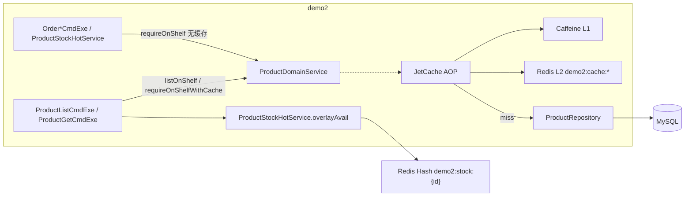

# demo2 JetCache 两级缓存（Caffeine + Redis）设计规范

**日期**: 2026-08-29  
**项目**: spring-ai-demo / demo2  
**状态**: 已确认，待实现  

---

## 1. 背景与目标

### 1.1 问题

商品列表、详情每次请求都打 MySQL（主数据 + 库存投影），再 overlay Redis Hash 可售。商品主数据变更少、读多，适合缓存；仓库内尚无 Spring Cache / Caffeine / JetCache。

已有 Redis（`StringRedisTemplate` + `RedissonClient`）承担热库存闸门、分布式锁、会话、雪花租约，**不能**把目录缓存和 `demo2:stock:{productId}` 混用。

### 1.2 目标

1. 在 `com.jason.demo.demo2.framework.cache` 提供可复用的 **JetCache 两级缓存**：注解 + **Caffeine L1** + **Redis L2**。
2. 商品作为第一个接入点：列表 `listOnShelf`、详情 `requireOnShelfWithCache` 走缓存；**下单/预览/热库存闸门仍走无缓存的 `requireOnShelf`**。上/下架主动失效。
3. 可售库存仍走现有 Redis Hash overlay，**不进目录缓存**。

### 1.3 已确认决策

| 维度 | 选择 |
|------|------|
| 范围 | framework 能力 + 商品接入；会员/门店本版不接 |
| 框架 | JetCache（不是手写两级 Cache，也不是 Redisson `RLocalCachedMap`） |
| L1 | Caffeine |
| L2 | 复用已有 `RedissonClient`（`jetcache-starter-redisson`），不引 Jedis |
| 版本 | 首选 JetCache **2.8.0.RC**（Boot 4.1 + `keyConvertor=jackson3`）；若 RC 无法落地再退 **2.7.9**，key 改用 `jackson`（Jackson 2），方案其余不变 |
| 序列化 | **不主动引入、不使用 fastjson2**。Key：`jackson3`；Value：`kryo5`。不用 JSON 编 value，也不复用 HTTP 的 `JsonMapper`（Long 会写成字符串，缓存反序列化会坏） |
| 注解位置 | `ProductDomainService`（由 **其它 Bean** 调用带 `@Cached` 的方法，AOP 才生效） |
| 详情拆方法 | `requireOnShelf` 无缓存（实时）；新建 `requireOnShelfWithCache` 仅给商品详情接口 |
| 缓存内容 | `ProductWithStock` / `List<ProductWithStock>`（MySQL 投影） |
| 可售 | 列表/详情 CmdExe 每次 `overlayAvail`；订单路径 `requireOnShelf` 每次打 MySQL，overlay miss 时回退的是实时 `stock` |
| 已售 `sellStock` | 仅列表/详情缓存路径会陈旧，直到上下架失效或 TTL；订单读的是实时 MySQL |
| 失效 | 上/下架主动清列表 + 该 `productId` 详情；TTL 仅兜底（L1 **1 分钟**，L2 **5 分钟**） |
| 多实例 L1 | 本版不做 pub/sub / `syncLocal` |
| 值序列化 | Kryo5（领域对象未实现 `Serializable`） |
| key 转换 | jackson3（2.8）；不使用 fastjson2 |
| Redis 前缀 | `demo2:cache:`，与 `demo2:stock:` 隔离 |
| 订单 | **不改订单代码**，继续调 `requireOnShelf`，不走详情缓存 |

### 1.4 非目标（本版不做）

- 会员、门店等其它模块接入
- 为订单模块单独改代码或加注解
- 多实例 Caffeine 同步（`syncLocal` / broadcast 清 L1）
- 缓存 `availableStock`、`JsonResult`、ResVO、Controller 返回值
- JetCache 自动刷新、缓存穿透保护、布隆过滤器
- Jedis 客户端、Spring Cache `@Cacheable` 双栈
- 运营改商品文案/价格的 HTTP（当前无此接口，因而无对应失效）
- 前端改动

---

## 2. 架构

### 2.1 逻辑架构

```text
商品列表          ProductListCmdExe  → listOnShelf()              @Cached
商品详情          ProductGetCmdExe   → requireOnShelfWithCache()  @Cached
订单预览/下单     Order*CmdExe       → requireOnShelf()           无缓存
热库存 reserve    ProductStockHotService → requireOnShelf()       无缓存

requireOnShelfWithCache 内部允许 this.requireOnShelf()（加载逻辑复用）。
@Cached 打在被外部 Bean 调用的方法上，因此 AOP 有效。
```



### 2.2 为何缓存在 DomainService

| 层 | 为何不在这里缓存 |
|----|------------------|
| Controller | 只包 `JsonResult`；缓存会把整段响应（含可售）冻住 |
| CmdExe | 负责 VO 转换 + overlay；缓存应发生在 overlay **之前** |
| Repository | 基础设施查询；失效语义（上/下架）在领域方法上更直观 |

`ProductGetCmdExe` 改为调用 `requireOnShelfWithCache`；订单与 `ProductStockHotService` 仍调用 `requireOnShelf`。不要把 `@Cached` 打在 `requireOnShelf` 上，否则所有调用者都会吃到缓存。

`requireOnShelfWithCache` 的方法体委托 `this.requireOnShelf(...)` 复用校验与查库。这不是「带缓存方法的自调用」：AOP 包的是 **外部进来的** `requireOnShelfWithCache`。禁止反过来在 `requireOnShelf` 上加 `@Cached` 再让详情去调它——同类 `this.requireOnShelf()` 会绕过代理，缓存永远不生效。

### 2.3 读路径（列表 / 详情）

1. 列表：`ProductListCmdExe` → `listOnShelf`（缓存）。详情：`ProductGetCmdExe` → `requireOnShelfWithCache`（缓存，内部再调 `requireOnShelf`）。
2. 缓存命中则跳过 MySQL；miss 则 L2 → MySQL，回填两级。
3. 两个 CmdExe 转 VO 后 `overlayAvail` 覆盖 `availableStock`。
4. 未上架时 `requireOnShelf` 抛 `BusinessException`（不存在 / 已下架）。**异常不缓存**。空列表是合法结果，**可以缓存**。
5. 订单预览/下单 / `reserve` **每次**走 `requireOnShelf` → MySQL，与详情缓存互不影响。

### 2.4 写路径（上/下架）

`onShelf` / `offShelf` 先改 MySQL status，再由 `@CacheInvalidate` 删除：

- 整个 `product:list:`（无参列表只有一把 key）
- `product:detail:` + 该 `productId`

`adjustStock` **不再**单独失效：接口要求已下架，下架时已清缓存；再次上架走 `onShelf` 再清一次。

### 2.5 与热库存的边界

| Redis key | 用途 | 本版 |
|-----------|------|------|
| `demo2:stock:{productId}` | 闸门 Hash：仅 `avail` + `seq` | 不改 |
| `demo2:cache:product:list:` / `demo2:cache:product:detail:{id}` | 商品目录投影 | 新增 |

禁止把目录 value 写入热库存 Hash，也禁止用库存 Hash 当商品详情缓存。

---

## 3. 组件与配置

### 3.1 包与类

对齐 `framework.id.configuration` / `framework.delay.config`。

| 单元 | 职责 | 依赖 |
|------|------|------|
| `framework.cache.configuration.JetCacheConfiguration` | `@EnableMethodCache(basePackages = "com.jason.demo.demo2")` | JetCache starter |
| `application.properties` 中 `jetcache.*` | L1/L2 类型、TTL 默认、keyPrefix、Redisson bean 名 | 已有 Redis |
| `product.service.infrastructure.cache.ProductCacheNames` | 缓存 name 常量（对齐 `RedisStockKeys`） | 无 |
| `ProductDomainService` | `listOnShelf` / `requireOnShelfWithCache` 加 `@Cached`；`requireOnShelf` 无注解 | ProductCacheNames |
| `ProductGetCmdExe` | 改调 `requireOnShelfWithCache` | DomainService |
| `ProductWithStock` | 增加无参构造，供 Kryo5 | 无新依赖 |

不引入手写 `CacheManager` 包装类；业务只打 JetCache 注解。不需要 `@EnableCreateCacheAnnotation`（本版不用 `@CreateCache`）。

Redisson Spring Bean 名以启动时实际为准（当前 starter 一般为方法名 `redisson`）。配置项：

```text
jetcache.remote.default.redissonClient=redisson
```

若运行期 Bean 名不同，只改这一项，不改方案。

### 3.2 Maven

- `com.alicp.jetcache:jetcache-starter-redisson:2.8.0.RC`
- Caffeine：若 starter 未传递引入，显式加 `com.github.ben-manes.caffeine:caffeine`（版本走 Boot BOM）
- **不要**显式加 `fastjson2`。JetCache 可能仍传递该依赖（默认 keyConvertor 实现），配置里写 `jackson3` 即不走它；不要为了「干净」强行 exclusion，以免 starter 启动期 classload 失败。

### 3.3 `application.properties`（约定）

```properties
jetcache.statIntervalMinutes=0
jetcache.areaInCacheName=false
jetcache.decodeFilterEnabled=true
jetcache.decodeFilterAllowPatterns=com.jason.demo.demo2.product.
jetcache.local.default.type=caffeine
jetcache.local.default.limit=1000
jetcache.local.default.keyConvertor=jackson3
jetcache.local.default.expireAfterWriteInMillis=60000
jetcache.remote.default.type=redisson
jetcache.remote.default.redissonClient=redisson
jetcache.remote.default.keyConvertor=jackson3
jetcache.remote.default.valueEncoder=kryo5
jetcache.remote.default.valueDecoder=kryo5
jetcache.remote.default.keyPrefix=demo2:cache:
jetcache.remote.default.expireAfterWriteInMillis=300000
```

不启用 `syncLocal`，不配 `broadcastChannel`（本版不做多实例 L1 失效广播）。

方法上的 `expire` / `localExpire` 与上表一致，单位为 **秒**（JetCache 注解约定，不是毫秒）：

| 注解属性 | 值 | 含义 |
|----------|-----|------|
| `cacheType` | `CacheType.BOTH` | L1 + L2 |
| `localExpire` | `60` | Caffeine 1 分钟 |
| `expire` | `300` | Redis 5 分钟 |

### 3.4 缓存 name 与 key

`ProductCacheNames`：

| 常量 | name 字符串 | 方法 key |
|------|-------------|----------|
| `LIST` | `product:list:` | 不写 `key`（无参，整表一份） |
| `DETAIL` | `product:detail:` | `#productId` |

落 Redis 后形态：`demo2:cache:product:list:`、`demo2:cache:product:detail:{productId}`（具体拼接以 JetCache `areaInCacheName=false` + `keyPrefix` 为准；实现后用一次真实 key 核对文档，若多一段分隔符只改常量/前缀，不改两级语义）。

`requireProduct`、`requireOnShelf` **不缓存**。只有 `requireOnShelfWithCache` 使用 `DETAIL`。

### 3.5 注解清单（`ProductDomainService`）

```text
listOnShelf()
  @Cached(name = LIST, cacheType = BOTH, expire = 300, localExpire = 60)

requireOnShelf(long productId)
  无注解；查库 + 上架校验。订单 / 热库存 / WithCache 内部复用。

requireOnShelfWithCache(long productId)
  @Cached(name = DETAIL, key = "#productId", cacheType = BOTH, expire = 300, localExpire = 60)
  方法体：return requireOnShelf(productId);
  仅 ProductGetCmdExe 调用。

onShelf(long productId) / offShelf(long productId)
  @CacheInvalidate(name = LIST)
  @CacheInvalidate(name = DETAIL, key = "#productId")
```

同一方法两条 `@CacheInvalidate` 使用 JetCache 的 `@Repeatable`（`CacheInvalidateContainer`），不要自写切面。

### 3.6 序列化（key vs value）

两件不同的事，不要混：

| | 作用 | 本版 |
|--|------|------|
| `keyConvertor` | 把方法参数变成缓存 key 字符串 | **jackson3**（demo2 已是 `tools.jackson` / Jackson 3） |
| `valueEncoder` | 把返回值写入 Redis | **kryo5** |

**不用 fastjson2：** 对本 demo 没有额外好处。它只是 JetCache 的默认 key 转换器（快、无 Jackson 依赖的项目省事）。本仓库 HTTP/Redis JSON 已统一 Jackson 3，再为 key 拉一套 fastjson 语义没有收益。

**value 不用 jackson3 / fastjson2 JSON：** JetCache 官方也不默认注册 JSON value 编解码（泛型擦除、`Object` 字段会解成 `JSONObject`/`Map`，排错成本高）。`List<ProductWithStock>` 更适合 Kryo 这种 Java 对象图。即便要用 JSON value，也**禁止**复用 `JacksonJsonCustomizer` 那套 Long→字符串，否则 `productId` 反序列化会坏。

**2.8 反序列化过滤器：** Kryo 路径同样生效。必须 `decodeFilterAllowPatterns=com.jason.demo.demo2.product.`，否则自定义领域类会被拒。

`Product` / `ProductStock` 已有无参构造；`ProductWithStock` **必须补无参构造**。不缓存 `Optional`；`requireOnShelfWithCache` 只缓存成功返回值。

---

## 4. 异常与降级

| 情况 | 行为 |
|------|------|
| L2 Redis 读失败 | 视为 miss，回源 MySQL；HTTP 仍成功。L1 仍可用 |
| L2 写入 / invalidate 失败 | 不阻断主路径；依赖 TTL 与下次成功失效 |
| Kryo 编解码失败 | 当次当 miss，打错误日志（`@Slf4j`，Throwable 放最后一参），不把坏数据当命中 |
| `BusinessException` | 不缓存 |
| 空列表 | 可缓存 |
| 热库存 overlay 失败 | 保持现有逻辑，与目录缓存无关 |
| 同类方法自调用 | `@Cached` 打在 `this.xxx()` 上不生效。允许 `requireOnShelfWithCache` 内部调 `requireOnShelf`；禁止在 `requireOnShelf` / `listOnShelf` 上加注解后再被同类其它方法 `this.` 调用 |

不做穿透保护。demo 商品量小。

---

## 5. 测试

现有 `ProductCmdExeTest` 等 mock `ProductDomainService` 的单测 **保持断言**，缓存不在该链上。

新增：

1. **`ProductWithStockKryoTest`（必测，无 Redis）**  
   用 JetCache Kryo5 编解码器对含 `BigDecimal` / `LocalDateTime` 的 `ProductWithStock` 往返，断言字段一致。
2. **`ProductDomainServiceCacheTest`（Spring 代理 + 真实 L1/L2）**  
   注解写死 `cacheType=BOTH`，测试无法在不配 L2 的情况下假装只有 Caffeine。对 `ProductRepository` mock，启动 JetCache 连开发机已有 Redis（`127.0.0.1:6379`，与 `application.properties` 一致）。连不上则 **skip**（JUnit assume / `@EnabledIf`），不在 CI 无 Redis 时红灯。  
   用例：
   - `listOnShelf` 连调两次 → Repository 只进一次
   - `offShelf` 后再 `listOnShelf` → Repository 再进一次
   - `requireOnShelfWithCache(A)` 连调两次 → Repository 只进一次；`requireOnShelfWithCache(B)` 仍打 Repository
   - `requireOnShelf(A)` 连调两次 → Repository **进两次**（订单路径无缓存）
   每例使用独立 cache name 后缀或先 `invalidate`，避免脏 key。

`ProductGetCmdExe` 单测改为 mock `requireOnShelfWithCache`（不再 mock 详情路径上的 `requireOnShelf`）。订单相关单测仍 mock `requireOnShelf`，无需改断言语义。

不强制写「Redis 宕机回源」自动化；降级语义按第 4 节实现与代码审阅即可。

---

## 6. HTTP 与前端

无新接口。`POST /demo/products/listProducts`、`getProduct`、`onShelf`、`offShelf` 契约不变。C 端 `member.js` 不改。

验收（手动或现有页面）：

1. 连续两次列表：第二次不应再打商品列表 SQL（日志或测试计数）。
2. 下架后列表立即不再包含该商品；再上架立即出现。
3. 详情可售仍随下单/预占变化（overlay），不随目录缓存冻死。

---

## 7. 实现时注意

- `@EnableMethodCache` 的 `basePackages` 必须覆盖 `com.jason.demo.demo2.product`；放宽到 `com.jason.demo.demo2` 以便后续模块直接打注解。
- 首选 2.8.0.RC 以使用 `jackson3` keyConvertor；退回 2.7.9 时改为 `keyConvertor=jackson`，并确认 2.7 无 decode filter 或按该版本文档处理。
- 禁止把 `JacksonJsonCustomizer` 的 `JsonMapper` 交给 JetCache 当 value 编解码。
- 禁止在 Controller 或返回 `JsonResult` 的方法上加 `@Cached`。
- 禁止 `@Cached` 包住 `overlayAvail` 的结果。
- 禁止订单 / `ProductStockHotService` 改调 `requireOnShelfWithCache`。
- `ProductGetCmdExe` 必须调 `requireOnShelfWithCache`，不能调 `requireOnShelf`。
- 生产与缓存单测都用 `BOTH`，不要为测试把注解改成 `LOCAL`（profile 改不了方法上的 `cacheType`）。无 Redis 时跳过第 5 节第 2 项，而不是换一套缓存类型。
