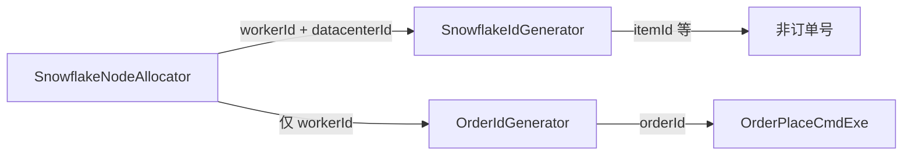

# demo2 订单号位图发号（机器 + 序号 + 基因）设计规范

**日期**: 2026-08-31  
**项目**: spring-ai-demo / demo2  
**状态**: 已实现  
**实施计划**: [2026-08-31-order-id-bit-layout.md](../plans/2026-08-31-order-id-bit-layout.md)  
**前置**: [2026-08-30-order-sharding-gene-design.md](./2026-08-30-order-sharding-gene-design.md)、[2026-08-07-snowflake-service-isolation-design.md](./2026-08-07-snowflake-service-isolation-design.md)  
**范围**: 仅改订单号发号（`OrderIdGenerator` 及相关测试/文档）。分片路由、库表拓扑、`OrderShardGene` 拆基因公式、HTTP/C 端不变。

---

## 1. 背景与目标

### 1.1 背景

分库分表已落地：订单号低 **9 bit** 为基因（`memberId % 512`），天花板 **2 库 × 256 表**。

当前实现是 **Hutool 标准雪花再 `embed` 覆盖低 9 位**：

```text
标准雪花: [1 符号][41 时间][5 数据中心][5 机器][12 序号]
embed 后: 低 9 位被基因盖掉 → 序号有效约剩 3 bit（同毫秒同会员约 8 单）
```

同一毫秒连续发号常只差序号低位，盖基因后易撞号，于是 `OrderIdGenerator` 用 `synchronized` + `while (id == lastId)` 再取雪花。这是补丁，不是结构解。

若去掉机器位只留「时间 + 12 序号 + 9 基因」，单机够用，但订单模块部署 **10～20 台**（乃至 ≤32）时，多机各自从 `seq=0` 起号，同毫秒同基因极易全局撞号。

### 1.2 目标

1. 保留基因 **9 bit** 与天花板 **2×256**；拆法仍是 `orderId & 0x1FF`。
2. **不再**对标准雪花做低位覆盖；改为自管位图，基因与序号分槽。
3. 保留 **5 bit 机器号**，支持约 **32** 个订单实例（覆盖 10～20 台及余量）。
4. 去掉发号路径上的「撞号再取雪花」循环；序号满了等下一毫秒（标准雪花同款语义）。
5. `itemId`、会员/商品等其它 ID 仍走 `SnowflakeIdGenerator`（含数据中心 + 机器的 Hutool 雪花），本 spec 不动。

### 1.3 已确认决策

| 维度 | 选择 |
|------|------|
| 位图 | `[1 符号][41 时间][5 机器][8 序号][9 基因]` |
| 基因 | 仍 9 bit；`virtual = memberId % 512`；低位嵌入 |
| 机器 | 5 bit（0～31）；来自现有 `SnowflakeNodeAllocator` 分配的 **`workerId`** |
| 数据中心 | **不进入订单号**（原雪花 5 bit 腾给序号侧） |
| 序号 | 8 bit（0～255）；**每机每毫秒共用一个序号**（不是每基因一个）；跨机靠机器位保证唯一 |
| 拼法 | 干净拼接，禁止「先生成再 cover 低 9 位」 |
| 时钟 epoch | 与 Hutool 默认雪花一致（Twitter epoch `1288834974657`），便于 ID 量级接近现网 |
| 旧订单号 | Demo 绿场：已发出的「雪花+embed」单仍可按低 9 位路由；**新单**一律新位图；不做双写/迁移 |
| 并发 | 发号方法进程内串行（或等价原子状态机）；跨进程靠 `workerId` 隔离 |

### 1.4 非目标

- 改分片公式 / `TABLE_COUNT` / YAML / 建表脚本
- 改 `shardExplain` 报文与调试台交互（结果仍读低 9 位基因）
- 给 `itemId` 加基因
- 订单实例数 **>32**（5 bit 不够时另开 spec 切位）
- 把 `datacenterId` 编进订单号
- 回拨时钟的复杂 NTP 补偿（仅定义失败策略，见下）

---

## 2. 位图与公式

### 2.1 对比

```text
原标准雪花:
[1 符号][41 时间][5 数据中心][5 机器][12 序号]

当前（雪花 + embed）:
同上，再把低 9 位改成基因 → 踩序号

本方案（订单号专用）:
[1 符号][41 时间][5 机器][8 序号][9 基因]
```

| 段 | bit | 含义 |
|----|-----|------|
| 符号 | 1 | 恒 0 |
| 时间 | 41 | `nowMs - epoch`，epoch = `1288834974657L` |
| 机器 | 5 | `workerId` ∈ [0, 31] |
| 序号 | 8 | 同一毫秒内自增，∈ [0, 255] |
| 基因 | 9 | `memberId % 512` |

右移让位：机器+序号+基因 = 5+8+9 = **22** bit（与原雪花「数据中心+机器+序号」总宽相同）。

```text
orderId = ((ts - epoch) << 22)
        | (workerId << 17)
        | (seq << 9)
        | (memberId % 512)
```

拆基因（**不变**）：

```text
virtual = orderId & 0x1FF
ds      = virtual % 2
table   = (virtual / 2) % 32    // 现网 TABLE_COUNT；天花板改 256 时只改表侧
```

### 2.2 容量

| 项 | 值 |
|----|-----|
| 虚拟分片 / 天花板 | 512 → **2×256** |
| 机器实例 | ≤ **32**（10～20 台无差别，同一套位图） |
| 单机单毫秒 | **合计**最多 256 单（所有会员/基因共享同一序号计数器） |
| 集群同毫秒 | ≤32 机 × 256 ≈ **8192 单/毫秒** 吞吐上限；基因不另乘容量 |

10 台与 20 台：**设计无差别**，只是占用的 `workerId` 个数不同。

### 2.3 为何不用「17 位序号再 cover 9 位」

位预算可写成 `[41][5 机器][17 序号]` 再盖低 9 位，有效序号仍约 8 bit，但同一毫秒序号低位变化时仍可能撞，还要保留重试。本 spec **直接 `[8 序号][9 基因]` 分槽**，语义更干净。

### 2.4 多机安全性

- **有机器位**：实例 A/B 即使同一毫秒、同一基因、同一本地 `seq`，因 `workerId` 不同，`orderId` 不同。
- **无机器位（已否决的「方案一」）**：多机从 `seq=0` 起号，同毫秒同基因易全局冲突；订单 10～20 台部署不可接受。

---

## 3. 组件设计

### 3.1 `OrderIdGenerator`

职责：按上式发 `orderId`。

依赖：

| 依赖 | 用途 |
|------|------|
| `workerId` | 启动时从 `SnowflakeNodeAllocator.current().workerId()` 注入（或构造传入，便于单测） |
| **不**再调用 `SnowflakeIdGenerator.nextId()` 发订单号 | 避免 embed；`SnowflakeIdGenerator` 仍给 `itemId` 等用 |

状态（进程内）：

- `lastTimestamp`：上次发号毫秒
- `sequence`：当前毫秒内序号 0～255

算法（逻辑等价即可）：

```text
synchronized nextOrderId(memberId):
  gene = memberId % 512
  now = currentTimeMillis()
  if now < lastTimestamp:
    抛错（时钟回拨），不盲发
  if now == lastTimestamp:
    sequence = (sequence + 1) & 0xFF
    if sequence == 0:
      now = waitUntilNextMillis(lastTimestamp)
  else:
    sequence = 0
  lastTimestamp = now
  return ((now - EPOCH) << 22) | (workerId << 17) | (sequence << 9) | gene
```

`waitUntilNextMillis`：自旋读时钟直到 `> lastTimestamp`。

单测构造：`new OrderIdGenerator(workerId)`，不强制 Redis。

### 3.2 `OrderShardGene`

| 方法 | 本阶段 |
|------|--------|
| `virtualOfMember` / `virtualOfOrderId` / `dsIndex` / `tableIndex` / 命名辅助 | **保留**，路由与 `shardExplain` 继续用 |
| `embed(raw, memberId)` | **发号路径停用**；可删除或标 `@Deprecated`，避免再被下单调用 |
| 常量 `GENE_BITS=9` 等 | **保留**；可增补 `WORKER_BITS=5`、`SEQ_BITS=8`、`EPOCH` 若希望公式集中（允许放在 `OrderIdGenerator`） |

分片算法、YAML、binding **零改动**（仍只认低 9 位基因）。

### 3.3 与雪花节点分配的关系



- `datacenterId`：仍服务隔离，给 **Hutool 雪花**用；**不写入**订单号。
- `workerId`：订单号机器段与雪花机器段共用同一分配结果，避免两套租约。

### 3.4 调用方

`OrderPlaceCmdExe` 仍只调 `orderIdGenerator.nextOrderId(memberId)`；`itemId` 仍 `idGenerator.nextId()`。无新 HTTP。

---

## 4. 兼容与数据

| 场景 | 行为 |
|------|------|
| 新下单 | 新位图；低 9 位基因；路由与现网一致 |
| 已存在的 embed 订单 | 低 9 位仍是基因，**只读路径可继续路由**；不保证与新号同一高位结构 |
| 超时关单 / `findById` | 仍只靠基因，与发号算法无关 |
| 十进制位数 | 仍为 `long`，**最多 19 位**，不会变成 20/21 位 |

---

## 5. 测试

| 对象 | 断言 |
|------|------|
| 基因 | 连续 `nextOrderId(612)` 低 9 位恒为 100 |
| 唯一性 | 同 `workerId` 连续数千次（含跨毫秒）两两不同 |
| 序号 | 同一毫秒内（可 mock 时钟）发满 256 个后进入下一毫秒，序号回到 0 |
| 机器 | `workerId=1` 与 `workerId=2` 同毫秒同 `seq` 同基因时，`orderId` 不同（差在机器段） |
| 回拨 | `now < lastTimestamp` 抛受检/非受检业务异常或 `IllegalStateException`（实现时统一一种） |
| 回归 | `OrderShardGene` 路由单测不变；`OrderPlaceCmdExeTest` 继续 mock `OrderIdGenerator` |
| 删除 | 去掉「依赖 snowflake embed 后 `id != lastId` 重试」相关断言 |

不强制集成测多 JVM；机器位用不同 `workerId` 构造器覆盖即可。

---

## 6. 文档与归档

实施完成后：

- 本 spec 状态改为「已实现」
- 更新 [2026-08-30-order-sharding-gene](../archive/2026-08-30-order-sharding-gene.md) 发号小节（或本主题单独 archive）
- README「订单分库分表」发号小节改为本位图；去掉「撞号再取雪花」描述

---

## 7. 文件清单（实施时）

```
修改: order/service/infrastructure/shard/OrderIdGenerator.java
修改: order/service/infrastructure/shard/OrderShardGene.java   # 可选：弃用 embed
修改: order/service/infrastructure/shard/package-info.java
修改: src/test/.../order/OrderIdGeneratorTest.java
文档: 本 spec；archive / README 发号段落
```

不改：`OrderComplexShardingAlgorithm`、`shardingsphere.yaml`、建表 SQL、前端调试台（除非文案提到 embed）。

---

## 8. 开放问题（无则按默认）

| 项 | 默认 |
|----|------|
| 时钟回拨 | 直接失败，不 sleep 等待墙钟追平 |
| `embed` 方法 | 删除并改单测，避免误用 |
| epoch | Hutool/Twitter `1288834974657L`，写死常量 |
