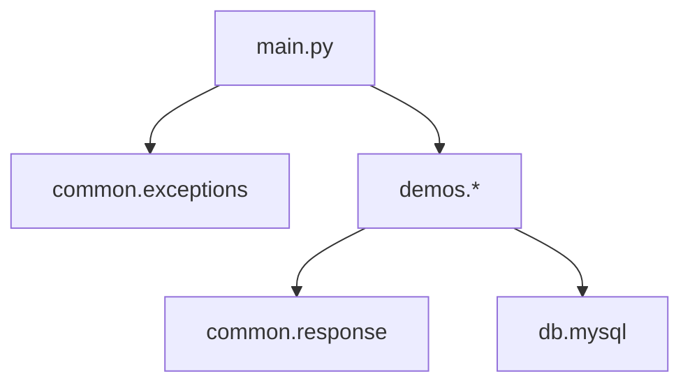

# FastAPI Demo

基于 **FastAPI + Uvicorn** 的综合入门示例。按主题拆分为独立 demo 模块，通过 `main.py` 统一挂载，**一条命令启动全部接口**。

覆盖：路由、参数校验、请求体、依赖注入、同步/异步、统一响应、全局异常、HTTP 中间件、MySQL 异步 CRUD。

---

## 技术栈

| 组件 | 说明 |
|------|------|
| [FastAPI](https://fastapi.tiangolo.com/) | Web 框架 |
| [Uvicorn](https://www.uvicorn.org/) | ASGI 服务器 |
| [Pydantic](https://docs.pydantic.dev/) | 数据校验与序列化 |
| [SQLAlchemy](https://www.sqlalchemy.org/) | 异步 ORM |
| [aiomysql](https://github.com/aio-libs/aiomysql) | MySQL 异步驱动 |
| Python 3.11+ | 推荐版本 |

---

## 快速开始

### 1. 创建并激活虚拟环境

**Windows (PowerShell)：**

```powershell
python -m venv venv
.\venv\Scripts\Activate.ps1
```

**macOS / Linux：**

```bash
python -m venv venv
source venv/bin/activate
```

### 2. 安装依赖

```bash
pip install -r requirements.txt
```

### 3. 初始化 MySQL 表（可选，使用 MySQL demo 时需要）

确保本地 MySQL 已启动，并存在数据库 `spring_ai_agent2`，然后执行：

```bash
mysql -u root -p spring_ai_agent2 < schema/users.sql
```

默认连接参数（见 `db/mysql.py`）：

| 参数 | 值 |
|------|-----|
| Host | `127.0.0.1:3306` |
| User | `root` |
| Database | `spring_ai_agent2` |

### 4. 启动服务

```bash
uvicorn main:app --reload --host 0.0.0.0 --port 8000
```

Windows 若未激活虚拟环境：

```powershell
.\venv\Scripts\uvicorn.exe main:app --reload --host 0.0.0.0 --port 8000
```

| 地址 | 说明 |
|------|------|
| http://127.0.0.1:8000/ | 根路径 |
| http://127.0.0.1:8000/docs | Swagger 交互文档 |
| http://127.0.0.1:8000/redoc | ReDoc 文档 |

---

## 项目架构

```text
fastapi-demo/
├── main.py                 # 薄入口：创建 app、注册异常、挂载 router
├── common/
│   ├── response.py         # ApiResponse[T] 统一响应模型
│   └── exceptions.py       # 全局异常处理注册
├── db/
│   └── mysql.py            # MySQL 引擎、会话、User 模型
├── demos/
│   ├── basic.py            # 基础路由
│   ├── params.py           # 路径 / 查询参数
│   ├── request_body.py     # 请求体校验
│   ├── auth.py             # 依赖注入 / Token
│   ├── async_io.py         # 同步 / 异步
│   ├── response_format.py  # 统一响应格式
│   ├── errors.py           # 异常处理验证
│   ├── middleware.py       # HTTP 中间件（请求耗时）
│   └── mysql_users.py      # MySQL 异步 CRUD
├── schema/
│   └── users.sql
├── requirements.txt
├── README.md
└── .gitignore
```



### 如何新增 demo

1. 在 `demos/` 新建文件，定义 `router = APIRouter(prefix="/demo/xxx", tags=["主题"])`
2. 在 `main.py` 中 `app.include_router(xxx.router)`
3. 重启（或依赖 `--reload`）后，接口会出现在 `/docs` 对应分组

---

## API 接口

### 基础路由 · `demos/basic.py`

| 方法 | 路径 | 说明 |
|------|------|------|
| GET | `/` | 欢迎页 / 探活 |
| GET | `/demo/basic/hello/{name}` | 路径参数问候 |

### 路径与查询参数 · `demos/params.py`

| 方法 | 路径 | 说明 |
|------|------|------|
| GET | `/demo/params/users/{user_id}` | 路径参数 + 类型校验 |
| GET | `/demo/params/items` | 查询参数 skip / limit / category |

### 请求体校验 · `demos/request_body.py`

| 方法 | 路径 | 说明 |
|------|------|------|
| POST | `/demo/body/users` | Pydantic 请求体 / 响应体 |

### 依赖注入 · `demos/auth.py`

| 方法 | 路径 | 说明 |
|------|------|------|
| GET | `/demo/auth/protected` | 需请求头 `Authorization: Bearer valid-token` |

### 同步与异步 · `demos/async_io.py`

| 方法 | 路径 | 说明 |
|------|------|------|
| GET | `/demo/async/sync` | 同步端点 |
| GET | `/demo/async/async` | 异步 I/O（`asyncio.sleep`） |
| GET | `/demo/async/mixed` | 异步中调用同步（`asyncio.to_thread`） |

### 统一响应 · `demos/response_format.py`

| 方法 | 路径 | 说明 |
|------|------|------|
| GET | `/demo/response/users/{user_id}` | 返回 `{code, msg, data}`；`user_id<=0` 时 `code=400` |

### 异常处理 · `demos/errors.py`

| 方法 | 路径 | 说明 |
|------|------|------|
| GET | `/demo/errors/http` | 触发 HTTPException → 统一错误体 |
| GET | `/demo/errors/internal` | 触发 500 → 统一错误体 |

### HTTP 中间件 · `demos/middleware.py`

在 `main.py` 中通过 `middleware.register_middleware(app)` 注册，对所有请求生效：

- 控制台打印请求方法、路径与耗时
- 响应头写入 `X-Process-Time`

### MySQL 用户 CRUD · `demos/mysql_users.py`

| 方法 | 路径 | 说明 |
|------|------|------|
| GET | `/demo/mysql/users` | 查询用户列表 |
| GET | `/demo/mysql/users/{user_id}` | 按 id 查询；不存在 → 404 |
| POST | `/demo/mysql/users` | 创建用户；username 冲突 → 400 |
| PUT | `/demo/mysql/users/{user_id}` | 全量更新；不存在 → 404 |
| DELETE | `/demo/mysql/users/{user_id}` | 物理删除；不存在 → 404 |

**示例：**

```bash
curl http://127.0.0.1:8000/
curl http://127.0.0.1:8000/demo/basic/hello/Jason
curl "http://127.0.0.1:8000/demo/params/items?skip=0&limit=5"
curl http://127.0.0.1:8000/demo/response/users/1
curl http://127.0.0.1:8000/demo/mysql/users
curl -X POST http://127.0.0.1:8000/demo/mysql/users -H "Content-Type: application/json" -d "{\"username\":\"alice\",\"email\":\"alice@example.com\"}"
curl -X DELETE http://127.0.0.1:8000/demo/mysql/users/4
curl -H "Authorization: Bearer valid-token" http://127.0.0.1:8000/demo/auth/protected
```
---

## 新旧路径对照

| 旧路径 | 新路径 |
|--------|--------|
| `GET /hello/{name}` | `GET /demo/basic/hello/{name}` |
| `GET /users/{user_id}` | `GET /demo/params/users/{user_id}` |
| `GET /items` | `GET /demo/params/items` |
| `POST /users` | `POST /demo/body/users` |
| `GET /protected` | `GET /demo/auth/protected` |
| `GET /sync` | `GET /demo/async/sync` |
| `GET /async` | `GET /demo/async/async` |
| `GET /mixed` | `GET /demo/async/mixed` |
| `GET /users`（MySQL） | `GET /demo/mysql/users` |

`GET /` 保持不变。

---

## 开发说明

- `--reload` 适合本地开发；生产环境建议去掉并配合进程管理器部署
- 全局异常处理已注册：`HTTPException` 与未捕获异常均返回 `{code, msg, data}`
- 密码等敏感信息建议后续改为环境变量，勿提交到版本库

---

## 常见问题

**Q: `/docs` 里看不到某个接口？**

确认通过 `uvicorn main:app` 启动，且 `main.py` 已 `include_router` 对应模块。

**Q: `GET /demo/mysql/users` 报数据库错误？**

检查 MySQL 是否启动、`db/mysql.py` 连接参数，以及 `schema/users.sql` 是否已执行。

**Q: 提示缺少模块？**

```bash
pip install -r requirements.txt
```

**Q: 端口 8000 已被占用？**

使用 `--port 8001`，或停止占用该端口的进程。
